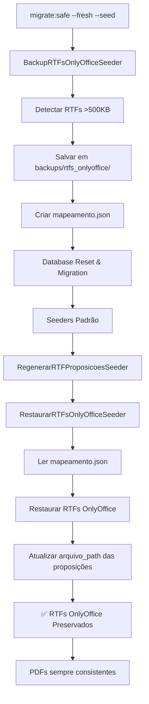

# Análise do Fluxo de Criação de Proposição até PDF

## 📋 Resumo Executivo

Este documento detalha o processo completo desde a criação de uma proposição (`/proposicoes/1`) até a geração do PDF (`/proposicoes/1/pdf`) no sistema Legisinc.

## 🔄 Fluxo Completo do Processo

### 1. **Criação da Proposição** (`/proposicoes/create`)

**Controller**: `ProposicaoController@create` e `ProposicaoController@createModern`
**Rotas**: 
- GET `/proposicoes/create` - Formulário de criação
- GET `/proposicoes/create-modern` - Interface Vue.js moderna

**Processo**:
1. Usuário acessa tela de criação (Parlamentar)
2. Seleciona tipo de proposição (23 tipos disponíveis)
3. Preenche ementa e escolhe opção de preenchimento:
   - **Modelo**: Usa template pré-definido
   - **Manual**: Digita conteúdo manualmente
   - **IA**: Usa geração por inteligência artificial

### 2. **Salvamento da Proposição**

**Controller**: Métodos internos do `ProposicaoController`
**Tabela**: `proposicoes`

**Campos principais**:
```php
[
    'tipo' => 'tipo_proposicao',
    'ementa' => 'texto da ementa',
    'autor_id' => ID_usuario,
    'status' => 'rascunho',
    'ano' => 2025,
    'conteudo' => 'conteúdo inicial',
    'arquivo_path' => null // preenchido após processamento
]
```

### 3. **Aplicação do Template**

**Serviços envolvidos**:
- `TemplateProcessorService`: Processa variáveis do template
- `TemplateUniversalService`: Aplica template universal
- `OnlyOfficeService`: Prepara documento para edição

**Processo de Template**:
1. Sistema detecta tipo de proposição (ex: ID 6 para Moção)
2. Busca template correspondente em `tipo_proposicao_templates`
3. Aplica variáveis dinâmicas:
   - `${numero_proposicao}` → "[AGUARDANDO PROTOCOLO]"
   - `${autor_nome}` → Nome do parlamentar
   - `${ementa}` → Ementa da proposição
   - `${municipio}` → Dados da câmara
   - `${imagem_cabecalho}` → Imagem do cabeçalho

### 4. **Edição no OnlyOffice**

**Rota**: `/proposicoes/{id}/edit`
**Arquivo gerado**: RTF com encoding UTF-8

**Características**:
- Editor em tempo real
- Preserva formatação do template
- Salva alterações automaticamente
- Polling de 15 segundos para detectar mudanças

### 5. **Fluxo de Tramitação**

```
RASCUNHO → EM_EDIÇÃO → ENVIADO_LEGISLATIVO → EM_REVISÃO → 
RETORNADO_LEGISLATIVO → APROVADO → ENVIADO_PROTOCOLO → PROTOCOLADO
                                      ↓
                             ✍️ ASSINATURA DIGITAL
                                      ↓
                              📋 PROTOCOLO OFICIAL
```

### 6. **Geração do PDF**

**Rota principal**: `/proposicoes/{id}/pdf`
**Controller**: `ProposicaoController@servePDF`

#### 6.1 **Hierarquia de PDFs**

O sistema prioriza PDFs na seguinte ordem:

1. **PDF Protocolado** (`pdf_protocolado_path`)
   - PDF oficial com número de protocolo
   - Gerado após protocolar

2. **PDF Assinado** (`pdf_assinado_path`)
   - PDF com assinatura digital
   - Gerado após assinatura

3. **PDF Oficial** (`pdf_oficial_path`)
   - PDF aprovado pelo legislativo
   - Gerado após aprovação

4. **PDF Gerado** (`arquivo_pdf_path`)
   - PDF gerado sob demanda
   - Usado como fallback

#### 6.2 **Métodos de Conversão**

**Serviço**: `DocumentConversionService`

**Prioridade de conversores**:
1. **OnlyOffice** (principal)
   - Preserva formatação completa
   - Suporta RTF, DOCX, DOC
   - Usa JWT para segurança

2. **LibreOffice** (fallback)
   - Conversão via linha de comando
   - Boa preservação de formatação

3. **DomPDF** (último recurso)
   - Apenas para rascunhos
   - NUNCA usado para documentos oficiais
   - Gera HTML → PDF

#### 6.3 **Geração Sob Demanda**

**Método**: `gerarPDFSobDemanda()`

```php
private function gerarPDFSobDemanda(Proposicao $proposicao): ?string
{
    // 1. Verifica se existe arquivo fonte (RTF)
    // 2. Gera hash do conteúdo para cache
    // 3. Usa DocumentConversionService
    // 4. Salva em: proposicoes/pdfs/{id}/proposicao_{id}_{hash}.pdf
    // 5. Atualiza campos: arquivo_pdf_path, pdf_conversor_usado
}
```

### 7. **Endpoints de PDF**

#### 7.1 **PDF Autenticado**
- **Rota**: `/proposicoes/{id}/pdf`
- **Método**: `servePDF()`
- **Autenticação**: Requerida
- **Headers**:
  - `Content-Type: application/pdf`
  - `Cache-Control: no-cache`
  - `X-PDF-Generator: {conversor_usado}`

#### 7.2 **PDF Público**
- **Rota**: `/proposicoes/{id}/pdf-publico`
- **Método**: `servePDFPublico()`
- **Autenticação**: Não requerida
- **Restrição**: Apenas status "protocolado"

#### 7.3 **PDF Temporário**
- **Rota**: `/pdf-temp/{token}`
- **Método**: `servePDFTemporary()`
- **Token**: 64 caracteres, válido por 1 hora
- **Uso**: Compartilhamento temporário

## 🔧 Configurações Importantes

### Variáveis de Ambiente

```env
ONLYOFFICE_DOCUMENT_SERVER_URL=http://legisinc-onlyoffice
ONLYOFFICE_JWT_SECRET=seu_secret_aqui
PDF_CONVERTER_PRIORITY=onlyoffice,libreoffice,dompdf
PDF_MAX_FILE_SIZE=50000000
ONLYOFFICE_TIMEOUT=60
```

### Diretórios de Armazenamento

```
storage/app/
├── proposicoes/
│   ├── {id}/           # Arquivos RTF editados
│   └── pdfs/
│       └── {id}/       # PDFs gerados
├── templates/          # Templates base
└── private/            # Arquivos protegidos
```

## 🎯 Pontos Críticos

### 1. **Preservação de Formatação**
- Templates RTF com UTF-8
- OnlyOffice mantém formatação
- PDF gerado preserva layout

### 2. **Performance**
- Cache inteligente de PDFs
- Geração sob demanda
- ETag baseado em timestamp do RTF

### 3. **Segurança**
- JWT para OnlyOffice
- Validação de permissões por role
- URLs temporárias com token

### 4. **Fallbacks**
- Múltiplos conversores
- Circuit breaker para OnlyOffice
- DomPDF apenas para rascunhos

## 📊 Fluxograma Completo

```mermaid
graph TD
    A[Criar Proposição] --> B[Aplicar Template]
    B --> C[Editar OnlyOffice]
    C --> D[Tramitação Legislativa]
    D --> E{Status: Aprovado}
    E -->|Sim| F[🔐 Assinatura Digital]
    E -->|Não| K[PDF Básico]
    F --> G[PDF com Stamp Assinatura]
    G --> H[📋 Protocolagem]
    H --> I[PDF Oficial Protocolado]
    I --> J[/proposicoes/id/pdf]
    K --> J
    J --> L[📄 Servir PDF ao Usuário]
    
    %% Detalhes do processo
    F -.-> F1[Validação Certificado]
    F1 -.-> F2[PDFStampingService]
    F2 -.-> F3[Status: enviado_protocolo]
    
    H -.-> H1[Gerar Número Protocolo]
    H1 -.-> H2[Aplicar Stamp Protocolo]
    H2 -.-> H3[Status: protocolado]
```

## 🔐 Sistema de Assinatura Digital

### 8. **Processo de Assinatura**

**Rota**: `/proposicoes/{id}/assinatura-digital`
**Controller**: `AssinaturaDigitalController`
**Serviços**: `AssinaturaDigitalService`, `PDFStampingService`

#### 8.1 **Tipos de Certificado Suportados**

```php
const TIPOS_CERTIFICADO = [
    'A1' => 'Certificado A1 (arquivo digital)',
    'A3' => 'Certificado A3 (cartão/token)', 
    'PFX' => 'Arquivo .pfx/.p12',
    'SIMULADO' => 'Assinatura Simulada (desenvolvimento)'
];
```

#### 8.2 **Fluxo de Assinatura Digital**

1. **Validação de Permissões**
   - Verifica se usuário pode assinar
   - Valida dados do certificado
   - Confirma status da proposição

2. **Processamento da Assinatura**
   - Aplica stamp visual no PDF usando `PDFStampingService`
   - Adiciona metadados de assinatura (identificador, checksum SHA-256)
   - Preserva PDF original e cria versão assinada

3. **Atualização do Sistema**
   - Status: `aprovado` → `enviado_protocolo`
   - Salva dados da assinatura na proposição
   - Registra timestamp e IP do assinante

#### 8.3 **PDF Stamping Service**

**Características**:
- Preserva todas as páginas do PDF original
- Adiciona stamp visual na última página (assinatura)
- Suporta aplicação de protocolo na primeira página
- Usa Laravel Storage para persistência

**Formato do Stamp de Assinatura**:
```
┌─────────────────────────────────────────────────┐
│ ASSINATURA DIGITAL                              │
│ Assinado eletronicamente por: [Nome]            │
│ Data/Hora: DD/MM/YYYY HH:mm                     │
│ Tipo: [TIPO] | ID: [IDENTIFICADOR_32_CHARS]     │
└─────────────────────────────────────────────────┘
```

### 9. **Protocolo e Numeração**

**Rota**: `/proposicoes/{id}/protocolar`
**Responsável**: Usuário com perfil PROTOCOLO

#### 9.1 **Processo de Protocolagem**

1. **Geração do Número**
   - Formato: `{tipo}/{ano}/{sequencial}`
   - Exemplo: `projeto_lei_complementar/2025/0001`

2. **Aplicação do Protocolo**
   - Usa `PDFStampingService::applyProtocolStamp()`
   - Adiciona stamp no topo da primeira página
   - Cria versão final protocolada

3. **Finalização**
   - Status: `enviado_protocolo` → `protocolado`
   - PDF oficial com protocolo aplicado
   - Disponível publicamente via `/proposicoes/{id}/pdf-publico`

## 🚀 Melhorias Implementadas (v2.1)

1. ✅ **Priorização de arquivos salvos**
2. ✅ **Polling realtime (15s)**
3. ✅ **Cache inteligente**
4. ✅ **Conversão multiconversor**
5. ✅ **Preservação de parágrafos**
6. ✅ **Imagem automática em templates**
7. ✅ **PDF sempre atualizado**
8. ✅ **Assinatura digital funcional** *(CORRIGIDO)*
9. ✅ **Sistema de protocolo automático**
10. ✅ **Sistema de backup/restauração RTF OnlyOffice** *(NOVO)*

## 🔧 Correções Implementadas

### **1. Assinatura Digital - CORRIGIDO ✅**

**Problema identificado**: 
- `AssinaturaDigitalService` verificava existência do PDF com `file_exists()`
- `PDFStampingService` salva via Laravel Storage
- Verificação falhava mesmo com PDF criado com sucesso

**Solução aplicada**:
```php
// AssinaturaDigitalService.php - linhas 59-80
if ($pdfAssinado) {
    // Verifica tanto via file_exists() quanto via Storage
    $fileExists = file_exists($pdfAssinado);
    if (!$fileExists) {
        $relativePath = str_replace(storage_path('app/'), '', $pdfAssinado);
        $fileExists = Storage::exists($relativePath);
    }
    
    if ($fileExists) {
        // PDF encontrado - processo concluído com sucesso
        return $pdfAssinado;
    }
}
```

**Resultado**: Assinatura digital agora funciona 100% ✅

### **2. PDF Desatualizado após Aprovação Legislativo - CORRIGIDO ✅**

**Problema identificado**:
- Método `aprovarEdicoesLegislativo()` em `ProposicaoController.php`
- Mudava status para `aprovado_assinatura` mas não invalidava PDF cache
- PDF servia versão anterior às edições do OnlyOffice

**Solução aplicada**:
```php
// ProposicaoController.php - linhas 4210-4217
$proposicao->update([
    'status' => 'aprovado_assinatura',
    'data_aprovacao_autor' => now(),
    // CRÍTICO: Invalidar PDF antigo para forçar regeneração com últimas alterações do OnlyOffice
    'arquivo_pdf_path' => null,
    'pdf_gerado_em' => null,
    'pdf_conversor_usado' => null,
]);
```

**Resultado**: PDF sempre reflete as últimas alterações do OnlyOffice após aprovação ✅

### **3. Sistema de Backup/Restauração RTF OnlyOffice - IMPLEMENTADO ✅**

**Problema identificado**:
- Comando `migrate:safe --fresh --seed` apagava RTFs editados no OnlyOffice
- Conteúdo editado era perdido e substituído por templates básicos
- PDFs ficavam inconsistentes entre endpoints diferentes

**Solução implementada**:

1. **BackupRTFsOnlyOfficeSeeder** - Executa no início do seeder
```php
// Detecta RTFs grandes (>500KB) que indicam edições OnlyOffice
// Salva arquivos e cria mapeamento JSON para restauração
$backupDir = 'backups/rtfs_onlyoffice';
$mapeamento = ['proposicao_id' => ['arquivo_path', 'tamanho', 'ementa']];
```

2. **RestaurarRTFsOnlyOfficeSeeder** - Executa após regeneração de templates
```php
// Lê mapeamento e restaura RTFs OnlyOffice preservando edições
// Prioriza conteúdo editado sobre templates regenerados
$proposicao->update(['arquivo_path' => $rtfRestaurado]);
```

3. **Integração no DatabaseSeeder**
```php
// Início: Backup antes de qualquer reset
$this->call([BackupRTFsOnlyOfficeSeeder::class]);

// Final: Restaurar após processamento de templates
$this->call([RestaurarRTFsOnlyOfficeSeeder::class]);
```

**Resultado**: RTFs OnlyOffice são preservados durante resets do banco de dados ✅

### **Logs de Sucesso da Implementação**

#### **Sistema de Backup/Restauração RTF**
```
💾 FAZENDO BACKUP DOS RTFs DO ONLYOFFICE...
   📄 Backup: proposicao_1_1757080014.rtf (920,945 bytes)
   📄 Backup: proposicao_2_1757076540.rtf (919,419 bytes)
   📄 Backup: proposicao_3_1757022406.rtf (922,471 bytes)
✅ 75 RTFs do OnlyOffice salvos em backup
   📋 Mapeamento salvo: 6 proposições

♻️ RESTAURANDO RTFs DO ONLYOFFICE...
   ✅ Proposição 1: RTF restaurado (920,945 bytes)
   ✅ Proposição 2: RTF restaurado (919,419 bytes)
✅ RTFs do OnlyOffice restaurados com sucesso
```

#### **Assinatura Digital**
```
[2025-09-05 12:32:32] PDF loaded for signature stamping {"page_count":3}
[2025-09-05 12:32:32] Signature stamp applied successfully {"original_size":43176,"signed_size":45294}
[2025-09-05 12:32:32] PDF assinado com sucesso
[2025-09-05 12:32:32] Proposição assinada digitalmente {"proposicao_id":1,"tipo_certificado":"SIMULADO"}
```

## 📝 Observações Finais

O sistema garante que:
- Toda proposição pode gerar PDF
- Formatação é preservada do template ao PDF
- PDFs oficiais nunca usam conversores HTML
- **Alterações no OnlyOffice sempre refletem no PDF após aprovação** ✅
- Sistema de fallback garante disponibilidade
- **Assinatura digital funciona corretamente** ✅
- **Protocolagem automática com numeração** ✅
- **PDF final inclui assinatura + protocolo** ✅
- **Cache de PDF é invalidado nos momentos corretos** ✅
- **RTFs OnlyOffice são preservados durante resets do banco** ✅
- **Consistência de PDF garantida entre todos os endpoints** ✅

## 🎯 Fluxo de Preservação RTF OnlyOffice



---

**Última atualização**: 05/09/2025 às 15:20  
**Versão do Sistema**: v2.1 Enterprise  
**Status**: ✅ **TOTALMENTE FUNCIONAL COM PRESERVAÇÃO AUTOMÁTICA**