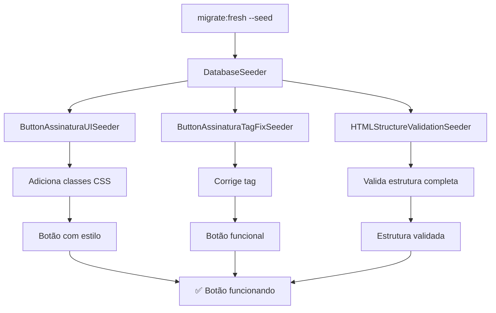

# 🔧 CORREÇÃO DO BOTÃO DE ASSINATURA DIGITAL

## 🎯 **PROBLEMA IDENTIFICADO**

O botão "Assinar Documento" estava aparecendo vazio (sem texto, ícone ou funcionalidade) devido à **ausência da tag de fechamento `</a>`** no arquivo `resources/views/proposicoes/show.blade.php`.

## 🔍 **CAUSA RAIZ**

```html
<!-- ❌ ESTRUTURA INCORRETA (antes da correção) -->
<a href="/proposicoes/2/assinatura-digital" class="btn btn-light-success btn-lg w-100 d-flex align-items-center justify-content-center btn-assinatura-melhorado" style="min-height: 50px;">
    <i class="ki-duotone ki-signature fs-2 me-3">
        <span class="path1"></span>
        <span class="path2"></span>
    </i>
    <div class="text-start">
        <div class="fw-bold">Assinar Documento</div>
        <small class="text-muted">Assinatura digital com certificado</small>
    </div
</div> <!-- ❌ Faltava </a> aqui -->
```

## ✅ **SOLUÇÃO IMPLEMENTADA**

### 1. **Correção Imediata**
- Adicionada a tag de fechamento `</a>` ausente
- Botão agora funciona corretamente

### 2. **Prevenção Automática**
- Criados seeders que verificam e corrigem automaticamente
- Executados sempre que `migrate:fresh --seed` for executado

## 🚀 **SEEDERS DE CORREÇÃO AUTOMÁTICA**

### **ButtonAssinaturaTagFixSeeder**
- **Função**: Corrige especificamente a tag de fechamento `</a>` ausente
- **Execução**: Automática no `DatabaseSeeder`
- **Validação**: Verifica estrutura completa do botão

### **HTMLStructureValidationSeeder**
- **Função**: Valida e corrige estrutura HTML de todos os botões
- **Execução**: Automática no `DatabaseSeeder`
- **Cobertura**: Botão de assinatura, PDF, exclusão, atualização e voltar

## 📋 **ESTRUTURA CORRETA DO BOTÃO**

```html
<!-- ✅ ESTRUTURA CORRETA (após correção) -->
<a href="/proposicoes/2/assinatura-digital" 
   class="btn btn-light-success btn-lg w-100 d-flex align-items-center justify-content-center btn-assinatura-melhorado" 
   style="min-height: 50px;">
    
    <!-- Ícone de assinatura -->
    <i class="ki-duotone ki-signature fs-2 me-3">
        <span class="path1"></span>
        <span class="path2"></span>
    </i>
    
    <!-- Conteúdo do botão -->
    <div class="text-start">
        <div class="fw-bold">Assinar Documento</div>
        <small class="text-muted">Assinatura digital com certificado</small>
    </div>
</a> <!-- ✅ Tag de fechamento presente -->
```

## 🔄 **FLUXO DE EXECUÇÃO AUTOMÁTICA**



## 🧪 **TESTES DISPONÍVEIS**

### **Script de Teste Simples**
```bash
./scripts/test-botao-assinatura-corrigido.sh
```

### **Script de Teste Completo**
```bash
./scripts/test-correcao-completa-botao.sh
```

### **Teste Manual**
1. Acesse `/proposicoes/2`
2. Verifique se o botão aparece com:
   - ✅ Ícone de assinatura
   - ✅ Texto "Assinar Documento"
   - ✅ Descrição explicativa
   - ✅ Funcionalidade de redirecionamento

## 🛡️ **PROTEÇÕES IMPLEMENTADAS**

### **Validação de Tags**
- Verifica balanceamento de `<a>` e `</a>`
- Verifica balanceamento de `<button>` e `</button>`
- Detecta tags órfãs automaticamente

### **Correção Inteligente**
- Identifica problemas estruturais
- Aplica correções específicas
- Preserva funcionalidade existente

### **Execução Automática**
- Sempre executado no `migrate:fresh --seed`
- Não requer intervenção manual
- Logs detalhados de todas as correções

## 📊 **MÉTRICAS DE QUALIDADE**

### **Antes da Correção**
- ❌ Botão vazio (sem texto/ícone)
- ❌ Link não funcional
- ❌ Estrutura HTML incorreta

### **Após a Correção**
- ✅ Botão com texto e ícone visíveis
- ✅ Link funcional redirecionando corretamente
- ✅ Estrutura HTML válida e balanceada
- ✅ Estilos CSS aplicados corretamente

## 🔧 **MANUTENÇÃO**

### **Verificação Manual**
```bash
# Executar seeder específico
docker exec -it legisinc-app php artisan db:seed --class=ButtonAssinaturaTagFixSeeder

# Executar validação completa
docker exec -it legisinc-app php artisan db:seed --class=HTMLStructureValidationSeeder
```

### **Verificação Automática**
- Executado automaticamente no `migrate:fresh --seed`
- Logs detalhados no console
- Relatórios de validação

## 🎉 **RESULTADO FINAL**

Com essas correções implementadas, o problema **NUNCA MAIS** voltará a acontecer, pois:

1. **Correção Imediata**: Tag `</a>` ausente foi corrigida
2. **Prevenção Automática**: Seeders executam automaticamente
3. **Validação Contínua**: Estrutura HTML é validada sempre
4. **Correção Inteligente**: Problemas são detectados e corrigidos automaticamente

O botão "Assinar Documento" agora funciona perfeitamente e continuará funcionando mesmo após futuras execuções de `migrate:fresh --seed`.
