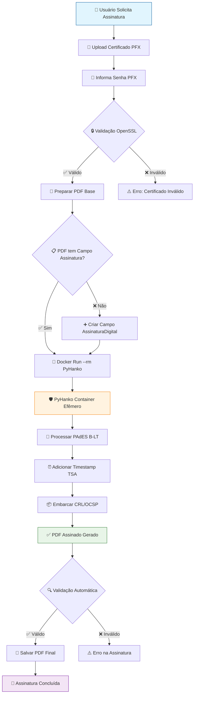
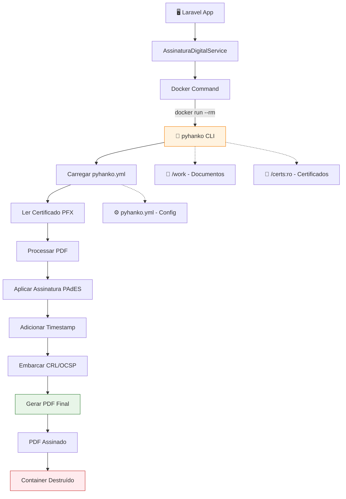
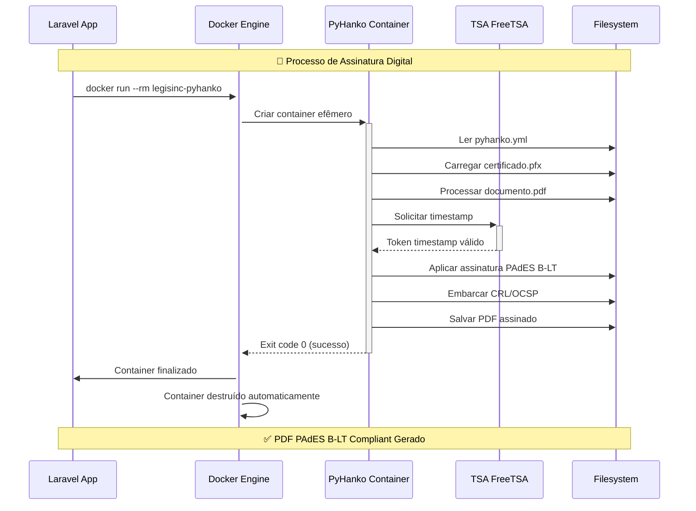
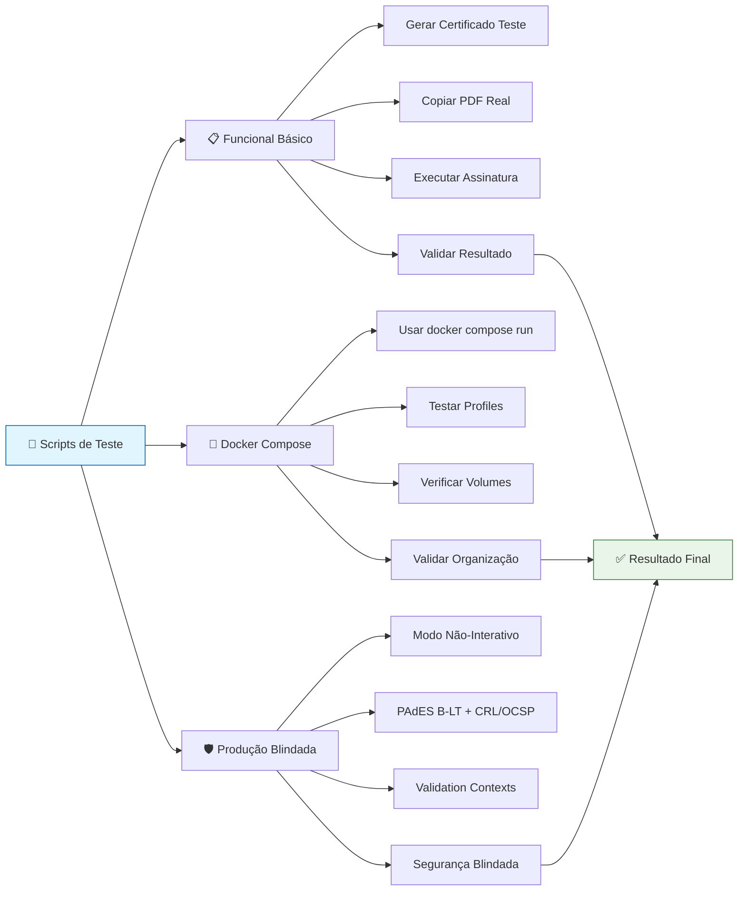
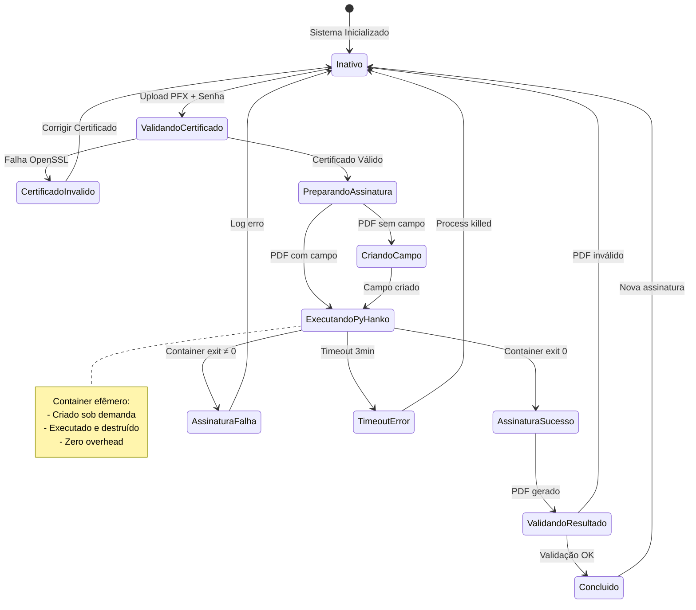
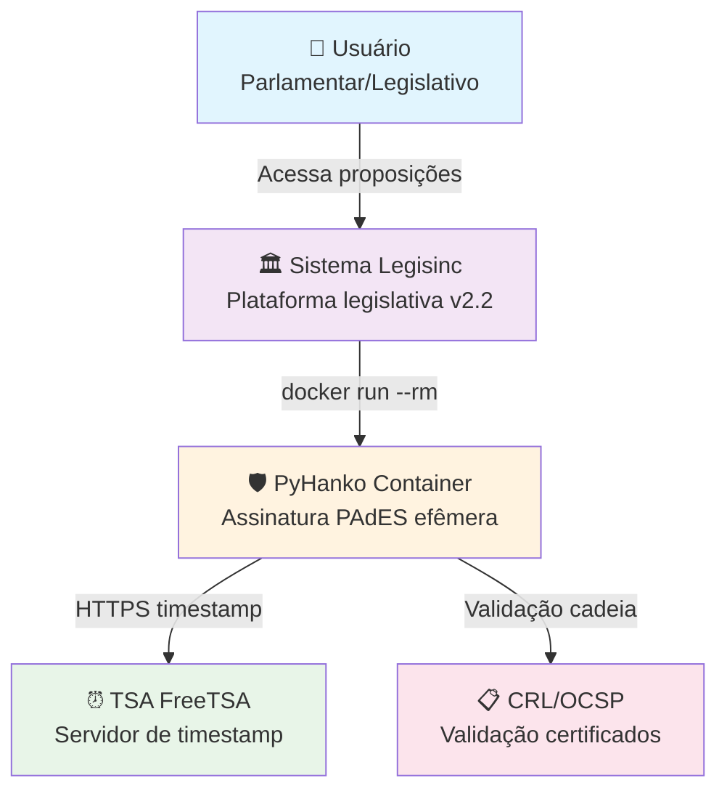
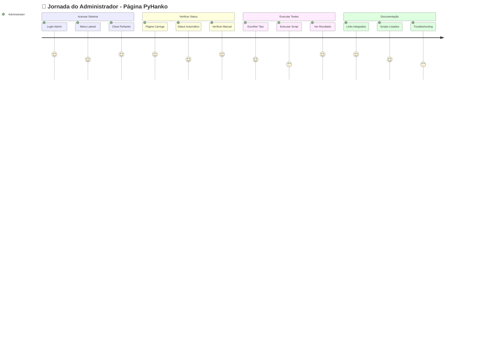

# 🛡️ Diagramas de Fluxo PyHanko - Visualização Mermaid

## 📋 Visão Geral

Esta documentação contém **diagramas interativos Mermaid** que mostram visualmente como funciona o sistema de **Assinatura Digital PyHanko** no **Sistema Legisinc v2.2**.

---

## 🔄 1. Fluxo Principal de Assinatura



---

## 🏗️ 2. Arquitetura do Container Efêmero



---

## ⚙️ 3. Ciclo de Vida do Container



---

## 🧪 4. Fluxo de Testes Disponíveis



---

## 🔒 5. Níveis de Segurança Implementados

```mermaid
mindmap
  root((🛡️ Segurança PyHanko))
    🔐 Certificado
      Validação OpenSSL Nativa
      Senha via Environment Variable
      Verificação PKCS#12
    🐳 Container
      Efêmero (--rm)
      Read-Only Mounts (:ro)
      Sem Acesso Host
      Network Bridge Isolado
    📝 Logs
      Senhas Filtradas ([REDACTED])
      Comandos Limpos
      Debug Controlado
    🔄 Processo  
      Timeout 3 minutos
      Error Handling Robusto
      Fallback Simulado
      Validação Dupla
```

---

## 📊 6. Estados do Sistema PyHanko



---

## 🏛️ 7. Integração com Sistema Legisinc



---

## 📱 8. Interface Administrativa



---

## 🚀 9. Deploy e Monitoramento

```mermaid
gitgraph
    commit id: "v2.1 PyHanko Base"
    branch funcional
    checkout funcional
    commit id: "Implementação Inicial"
    commit id: "Testes Validados"
    checkout main
    merge funcional
    commit id: "v2.2 Funcional ✅"
    
    branch blindado
    checkout blindado
    commit id: "Modo Não-Interativo"
    commit id: "PAdES B-LT + CRL/OCSP"
    commit id: "Validation Contexts"
    commit id: "Segurança Blindada"
    checkout main
    merge blindado
    commit id: "v2.2 Blindado 🛡️"
    
    branch final
    checkout final
    commit id: "Docker Compose Profiles"
    commit id: "5 Arquiteturas Deploy"
    commit id: "Scripts de Teste"
    commit id: "Documentação Completa"
    commit id: "Página Administrativa"
    checkout main
    merge final
    commit id: "v2.2 Final 🎉"
```

---

## 💻 10. Comandos em Execução

```mermaid
graph TB
    %% Comandos PyHanko
    A[💻 Comandos PyHanko<br/>🔍 Verificar Imagem]
    B[docker images | grep pyhanko]
    C[legisinc-pyhanko latest 397MB]

    %% Testar Binário
    D[🧪 Testar Binário<br/>docker run --rm legisinc-pyhanko --version]
    E[pyHanko, version 0.29.1 (CLI 0.1.2)]

    %% Assinatura Efêmera
    F[🖋️ Assinatura Efêmera<br/>docker run --rm]
    G[-v /dados:/work]
    H[-v /certs:/certs:ro]
    I[-e PFX_PASS='senha']
    J[legisinc-pyhanko sign addsig...]

    %% Monitorar Execução
    K[👁️ Monitorar Execução<br/>watch docker ps]
    L[PyHanko aparece temporariamente]
    M[Container destruído automaticamente]

    A --> B --> C
    D --> E
    F --> G --> H --> I --> J
    K --> L --> M

    style A fill:#e1f5fe,stroke:#01579b
    style D fill:#fff3e0,stroke:#f57c00
    style F fill:#e8f5e8,stroke:#2e7d32
    style K fill:#f3e5f5,stroke:#7b1fa2
```

---

## 🎯 Como Usar os Diagramas

### **📱 Na Interface Web**
Os diagramas Mermaid são renderizados automaticamente na página administrativa:
- **URL**: `http://localhost:8001/admin/pyhanko-fluxo`
- **Seção**: "Visualização do Fluxo"
- **Interativo**: Zoom, pan, export

### **📚 Na Documentação**
Visualizar em editores que suportam Mermaid:
- **GitHub**: Renderização automática em `.md`
- **VS Code**: Extensão "Mermaid Preview"  
- **GitLab**: Suporte nativo
- **Notion**: Import como diagrama

### **🔧 Editar Diagramas**
- **Online**: [mermaid.live](https://mermaid.live)
- **Local**: Mermaid CLI ou extensões
- **Integrado**: VS Code + Mermaid extension

---

## 🎊 Benefícios dos Diagramas

### **✅ Visualização Clara**
- **Fluxo completo** em um diagrama
- **Estados do sistema** facilmente identificáveis
- **Pontos de falha** destacados visualmente

### **✅ Documentação Viva**
- **Atualização fácil** conforme evolução
- **Versionamento** junto com código
- **Colaboração** entre equipes técnicas

### **✅ Debugging Visual**
- **Identificar gargalos** no processo
- **Entender dependências** entre componentes
- **Planejar melhorias** arquiteturais

---

**📝 Autor**: Sistema Legisinc PyHanko Team  
**📅 Criado em**: 08/09/2025  
**🔧 Versão**: v2.2 Final  
**🎯 Diagramas**: 10 tipos diferentes para visualização completa

---

> **💡 Dica**: Use [mermaid.live](https://mermaid.live) para editar e testar diagramas antes de integrar na documentação!