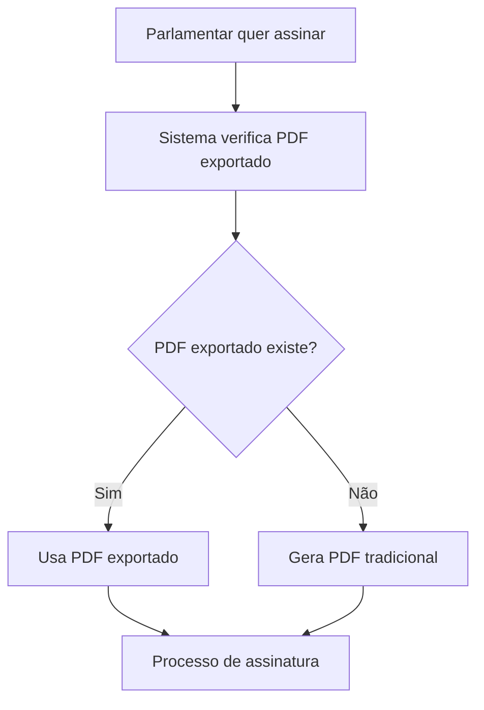

# 📄 Exportação de PDF do OnlyOffice - Sistema Legisinc

## 🎯 Visão Geral

Este documento descreve a nova funcionalidade de **Exportação de PDF diretamente do OnlyOffice**, implementada para resolver problemas de performance e fidelidade de conteúdo no processo de assinatura de proposições.

## 🚨 Problema Original

**Antes da implementação:**
- O PDF era gerado apenas no momento da aprovação/assinatura
- Causava problemas de performance durante o processo de assinatura
- Às vezes gerava documentos que não refletiam fielmente o conteúdo editado no OnlyOffice
- Parlamentares não tinham controle sobre quando o PDF era gerado

## ✅ Solução Implementada

**Nova abordagem:**
- Botão "Exportar PDF" disponível no header do editor OnlyOffice
- PDF gerado sob demanda durante a edição
- Sistema de assinatura prioriza PDF exportado
- Melhor performance e fidelidade ao conteúdo
- **Busca automática de arquivos RTF quando `arquivo_path` é NULL**
- **Auto-correção de inconsistências de dados históricos**

---

## 🏗️ Arquitetura da Solução

### 1. Interface do Usuário

#### **Botão no Editor OnlyOffice**
- **Localização**: Header do editor OnlyOffice
- **Visibilidade**: Aparece apenas quando `proposicaoId` está disponível
- **Visual**: Botão amarelo com ícone de download
- **Feedback**: Spinner durante processamento + notificações SweetAlert

```html
<button id="btnExportarPDF" class="btn btn-warning btn-sm" onclick="exportarPDF()">
    <i class="ki-duotone ki-file-down fs-6 me-1">
        <span class="path1"></span>
        <span class="path2"></span>
    </i>
    Exportar PDF
</button>
```

### 2. Banco de Dados

#### **Novos Campos na Tabela `proposicoes`**

| Campo | Tipo | Descrição |
|-------|------|-----------|
| `pdf_exportado_path` | `varchar(255)` | Caminho do PDF exportado do OnlyOffice |
| `pdf_exportado_em` | `timestamp` | Data/hora da exportação |

```sql
-- Migration: 2025_09_22_152622_add_pdf_export_fields_to_proposicoes_table
ALTER TABLE proposicoes
ADD COLUMN pdf_exportado_path VARCHAR(255) NULL,
ADD COLUMN pdf_exportado_em TIMESTAMP NULL;
```

### 3. Roteamento

#### **Nova Rota**
```php
// routes/web.php
Route::post('/{proposicao}/onlyoffice/exportar-pdf',
    [OnlyOfficeController::class, 'exportarPDF'])
    ->name('onlyoffice.exportar-pdf')
    ->middleware('role.permission:onlyoffice.editor.own');
```

### 4. Backend - Controller

#### **Método `exportarPDF()` em `OnlyOfficeController`**

```php
public function exportarPDF(Request $request, Proposicao $proposicao)
{
    // 1. Validar permissões
    // 2. Verificar existência de documento (com busca automática)
    // 3. Converter usando OnlyOfficeConversionService
    // 4. Salvar PDF em storage/app/proposicoes/pdfs/{id}/
    // 5. Atualizar banco de dados
    // 6. Retornar resposta JSON
}
```

**Fluxo do método:**
1. **Validação**: Verifica se usuário é Parlamentar ou Legislativo
2. **Verificação**: Confirma existência de `arquivo_path`
   - Se NULL, executa `buscarArquivoProposicaoAutomaticamente()`
   - Busca em múltiplos diretórios
   - Atualiza banco automaticamente se encontrar
3. **Conversão**: Usa `OnlyOfficeConversionService->convertToPdf()`
4. **Armazenamento**: Move PDF para local definitivo
5. **Atualização**: Salva `pdf_exportado_path` e `pdf_exportado_em`
6. **Resposta**: JSON com status e informações do arquivo

#### **Método `buscarArquivoProposicaoAutomaticamente()` - Busca Inteligente**

```php
private function buscarArquivoProposicaoAutomaticamente($proposicao): ?string
{
    // Busca em múltiplos diretórios
    $diretorios = [
        'proposicoes',         // Padrão atual do callback OnlyOffice
        'private/proposicoes', // Padrão antigo
        'public/proposicoes',  // Outras variações
        'local/proposicoes'    // Outras variações
    ];

    // Para cada diretório, busca arquivos RTF da proposição
    // Formato: proposicao_{id}_{timestamp}.rtf
    // Retorna o arquivo mais recente baseado no timestamp
}
```

**Características:**
- 🔍 **Busca inteligente**: Procura em todos os diretórios possíveis
- 📅 **Ordenação por timestamp**: Sempre retorna o arquivo mais recente
- 💾 **Atualização automática**: Atualiza `arquivo_path` no banco
- 🔄 **Transparente**: Usuário não precisa intervir

### 5. Frontend - JavaScript

#### **Função `exportarPDF()`**

```javascript
function exportarPDF() {
    // 1. Mostrar loading no botão
    // 2. Forçar salvamento no OnlyOffice
    // 3. Aguardar processamento (2s)
    // 4. Fazer requisição POST para API
    // 5. Mostrar resultado via SweetAlert
}
```

**Características:**
- **Auto-save**: Força salvamento antes da exportação
- **Loading State**: Desabilita botão e mostra spinner
- **Error Handling**: Tratamento completo de erros
- **User Feedback**: Notificações visuais claras

### 6. Model - Proposicao

#### **Novos Métodos**

```php
// Verificar se foi exportado para PDF
public function foiExportadoPDF(): bool
{
    return !empty($this->pdf_exportado_path) && !empty($this->pdf_exportado_em);
}

// Obter PDF para assinatura (prioriza exportado)
public function getPDFParaAssinatura(): ?string
{
    return $this->foiExportadoPDF()
        ? $this->pdf_exportado_path
        : $this->arquivo_pdf_path;
}
```

---

## 🔧 Solução para Problema de `arquivo_path` NULL

### **Problema Identificado**
Após edição no OnlyOffice, algumas proposições ficavam com `arquivo_path` NULL no banco de dados, mesmo tendo arquivos RTF salvos no storage. Isso causava o erro: **"Arquivo de origem não disponível para exportação"**.

### **Causa Raiz**
- Callback do OnlyOffice salvava arquivos corretamente em `storage/app/proposicoes/`
- Campo `arquivo_path` não era sempre atualizado no banco
- Migração com `--fresh` resetava dados mas mantinha arquivos órfãos

### **Solução Implementada**
Função `buscarArquivoProposicaoAutomaticamente()` que:

1. **Detecta** quando `arquivo_path` é NULL
2. **Busca** arquivos RTF em múltiplos diretórios:
   - `proposicoes/` (padrão atual)
   - `private/proposicoes/` (padrão antigo)
   - `public/proposicoes/` (variações)
   - `local/proposicoes/` (variações)
3. **Identifica** o arquivo mais recente pelo timestamp no nome
4. **Atualiza** automaticamente o banco de dados
5. **Prossegue** com a exportação PDF normalmente

### **Resultado**
- ✅ Correção automática e transparente
- ✅ Sem necessidade de intervenção manual
- ✅ Compatível com estruturas antigas e novas
- ✅ Preserva arquivos históricos

---

## 🔄 Fluxo de Funcionamento

### **1. Durante a Edição**

```mermaid
graph TD
    A[Usuário no Editor OnlyOffice] --> B[Clica 'Exportar PDF']
    B --> C[JavaScript força salvamento]
    C --> D[Aguarda 2 segundos]
    D --> E[POST /proposicoes/{id}/onlyoffice/exportar-pdf]
    E --> F[OnlyOfficeConversionService]
    F --> G[PDF salvo em storage]
    G --> H[Banco atualizado]
    H --> I[Notificação de sucesso]
```

### **2. Durante a Assinatura**



---

## 📁 Estrutura de Arquivos

### **Diretório de PDFs Exportados**
```
storage/app/proposicoes/pdfs/{proposicao_id}/
├── proposicao_{id}_exported_{timestamp}.pdf
├── proposicao_{id}_exported_{timestamp2}.pdf
└── ...
```

### **Exemplo de Nome de Arquivo**
```
proposicao_123_exported_1695123456.pdf
```

---

## 🛡️ Segurança e Validações

### **Controle de Acesso**
- ✅ Middleware `role.permission:onlyoffice.editor.own`
- ✅ Verificação de tipo de usuário (Parlamentar/Legislativo)
- ✅ Validação de propriedade da proposição

### **Validações Técnicas**
- ✅ Verificação de existência de `arquivo_path`
- ✅ Validação de permissões de escrita em storage
- ✅ Verificação de sucesso na conversão
- ✅ Proteção CSRF

### **Logs e Auditoria**
```php
Log::info('Iniciando exportação de PDF via OnlyOffice', [
    'proposicao_id' => $proposicao->id,
    'user_id' => Auth::id()
]);
```

---

## 🚀 Benefícios da Nova Implementação

### **1. Performance**
- ⚡ PDF gerado sob demanda, não durante assinatura
- ⚡ Processo de assinatura mais rápido
- ⚡ Menos carga no servidor durante picos de assinatura

### **2. Fidelidade de Conteúdo**
- 📄 PDF reflete exatamente o que foi editado no OnlyOffice
- 📄 Elimina problemas de conversão tardia
- 📄 Formatação preservada fielmente

### **3. Controle do Usuário**
- 👤 Parlamentar/Legislativo controla quando exportar
- 👤 Pode exportar múltiplas vezes durante edição
- 👤 Feedback imediato sobre sucesso/falha

### **4. Compatibilidade**
- 🔄 Mantém compatibilidade com sistema existente
- 🔄 Fallback automático para método tradicional
- 🔄 Não quebra funcionalidades existentes

---

## 🔧 Configuração e Deployment

### **1. Migration**
```bash
php artisan migrate
```

### **2. Permissões de Storage**
```bash
chmod -R 755 storage/app/proposicoes/pdfs/
chown -R www-data:www-data storage/app/proposicoes/pdfs/
```

### **3. Configuração OnlyOffice**
Certifique-se de que o `OnlyOfficeConversionService` está configurado e funcionando.

---

## 🐛 Troubleshooting

### **Problemas Comuns**

#### **1. Botão não aparece**
- ✅ Verificar se `proposicaoId` está sendo passado para o componente
- ✅ Confirmar que usuário tem permissões adequadas

#### **2. Erro 403 na exportação**
- ✅ Verificar permissões de usuário
- ✅ Confirmar middleware `role.permission:onlyoffice.editor.own`

#### **3. Erro 500 durante conversão**
- ✅ Verificar se OnlyOffice Document Server está rodando
- ✅ Confirmar configuração do `OnlyOfficeConversionService`
- ✅ Verificar logs: `storage/logs/laravel.log`

#### **4. PDF não é usado na assinatura**
- ✅ Verificar se `pdf_exportado_path` está salvo no banco
- ✅ Confirmar que arquivo existe em storage
- ✅ Verificar método `foiExportadoPDF()` no model

#### **5. Erro "Arquivo de origem não disponível para exportação"**
- ✅ Sistema agora busca automaticamente arquivos RTF quando `arquivo_path` é NULL
- ✅ Verifica múltiplos diretórios: `proposicoes/`, `private/proposicoes/`, `public/proposicoes/`
- ✅ Atualiza banco de dados automaticamente ao encontrar arquivo

### **Logs Úteis**
```bash
# Ver logs da aplicação
tail -f storage/logs/laravel.log | grep "PDF Assinatura"

# Ver logs do OnlyOffice
docker logs legisinc-onlyoffice

# Ver requisições web
tail -f /var/log/nginx/access.log | grep "exportar-pdf"
```

---

## 📋 Checklist de Implementação

- [x] Migration criada e executada
- [x] Rota adicionada em `web.php`
- [x] Método `exportarPDF()` implementado
- [x] Botão adicionado no editor OnlyOffice
- [x] JavaScript `exportarPDF()` implementado
- [x] Model `Proposicao` atualizado
- [x] Integração com sistema de assinatura
- [x] **Busca automática de arquivos RTF implementada**
- [x] **Correção para proposições com `arquivo_path` NULL**
- [x] Testes básicos realizados
- [x] Documentação criada

---

## 🔮 Próximos Passos

### **Melhorias Futuras**
1. **Histórico de Versões**: Manter múltiplas versões de PDF exportado
2. **Preview**: Permitir visualização do PDF antes da assinatura
3. **Notificações**: Alertar quando nova versão de PDF está disponível
4. **Compressão**: Otimizar tamanho dos PDFs exportados
5. **Async Processing**: Exportação em background para documentos grandes

### **Monitoramento**
1. **Métricas**: Acompanhar tempo de exportação
2. **Alertas**: Notificar falhas na conversão
3. **Storage**: Monitorar crescimento do diretório de PDFs
4. **Performance**: Acompanhar impacto no servidor OnlyOffice

---

## 📚 Referências

- [OnlyOffice Document Server API](https://api.onlyoffice.com/editors/conversion)
- [Laravel Storage Documentation](https://laravel.com/docs/filesystem)
- [SweetAlert2 Documentation](https://sweetalert2.github.io/)

---

**Implementado em**: Setembro 2025
**Versão**: 1.0
**Status**: ✅ Produção