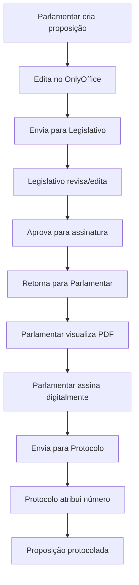

# 📋 Fluxo Completo de Tramitação de Proposições - Sistema Legisinc

## 🎯 Visão Geral

Este documento detalha o fluxo completo de tramitação de uma proposição legislativa no sistema Legisinc, desde sua criação pelo parlamentar até o protocolo final, passando pela revisão do legislativo e assinatura digital.

## 🔄 Fluxo Resumido



## 📝 Etapas Detalhadas

### 1️⃣ **Criação da Proposição (Parlamentar)**

#### Controlador: `ProposicaoController.php`
#### View: `proposicoes/create.blade.php`

**Processo:**
1. Parlamentar acessa o formulário de criação
2. Seleciona o tipo de proposição (Moção, Projeto de Lei, etc.)
3. Preenche a ementa (resumo da proposição)
4. Escolhe o método de preenchimento:
   - **Modelo com template**: Usa template pré-configurado
   - **Texto manual**: Digita o conteúdo manualmente
   - **Geração por IA**: Sistema gera texto baseado na ementa

**Status:** `rascunho`

```php
// ProposicaoController.php:74-80
$dadosProposicao = [
    'tipo' => $request->tipo,
    'ementa' => $request->ementa,
    'autor_id' => Auth::id(),
    'status' => 'rascunho',
    'ano' => date('Y'),
];
```

### 2️⃣ **Edição no OnlyOffice (Parlamentar)**

#### Controlador: `OnlyOfficeController.php`
#### Service: `OnlyOfficeService.php`

**Processo:**
1. Sistema aplica template com variáveis substituídas:
   - `${numero_proposicao}` → `[AGUARDANDO PROTOCOLO]`
   - `${autor_nome}` → Nome do parlamentar
   - `${municipio}` → Caraguatatuba
   - Outras variáveis do template

2. Parlamentar edita o documento no editor OnlyOffice
3. OnlyOffice salva automaticamente via callback
4. Arquivo salvo em: `storage/app/proposicoes/`

**Formatos:** RTF ou DOCX (dependendo da configuração)

### 3️⃣ **Envio para o Legislativo**

**Processo:**
1. Parlamentar finaliza edição
2. Clica em "Enviar para Legislativo"
3. Sistema atualiza status

**Status:** `rascunho` → `enviado_legislativo`

### 4️⃣ **Revisão Técnica (Legislativo)**

#### Controlador: `ProposicaoLegislativoController.php`
#### Views: `proposicoes/legislativo/revisar.blade.php`

**Processo:**
1. Legislativo acessa lista de proposições pendentes
2. Abre proposição no OnlyOffice
3. **Sistema carrega arquivo editado pelo parlamentar** (não template)
4. Realiza análise técnica:
   - Constitucionalidade ✅
   - Juridicidade ✅
   - Regimentalidade ✅
   - Técnica Legislativa ✅

5. Pode editar o documento se necessário
6. Adiciona parecer técnico

**Status:** `enviado_legislativo` → `em_revisao`

```php
// ProposicaoLegislativoController.php:242-249
$proposicao->update([
    'status' => 'aprovado_assinatura',
    'analise_constitucionalidade' => true,
    'analise_juridicidade' => true,
    'analise_regimentalidade' => true,
    'analise_tecnica_legislativa' => true,
    'parecer_tecnico' => $request->parecer_tecnico,
]);
```

### 5️⃣ **Aprovação e Retorno (Legislativo → Parlamentar)**

**Opções do Legislativo:**

#### A) **Aprovar para Assinatura**
- Status: `em_revisao` → `aprovado_assinatura`
- Proposição retorna ao parlamentar para assinatura

#### B) **Devolver para Correção**
- Status: `em_revisao` → `devolvido_correcao`
- Parlamentar deve fazer ajustes solicitados

### 6️⃣ **Geração de PDF para Assinatura**

#### Controlador: `ProposicaoAssinaturaController.php`
#### Método: `gerarPDFParaAssinatura()`

**Processo Inteligente de Busca:**

1. **Busca o arquivo mais recente** em múltiplos diretórios:
```php
// ProposicaoAssinaturaController.php:357
$arquivoMaisRecente = $this->encontrarArquivoMaisRecente($proposicao);
```

2. **Ordem de prioridade de busca:**
   - `/storage/app/proposicoes/` (arquivos do OnlyOffice)
   - `/storage/app/private/proposicoes/`
   - `/storage/app/` + caminho do banco
   - Fallback: conteúdo do banco de dados

3. **Extração de conteúdo:**
   - DOCX: Extrai via ZipArchive (document.xml)
   - RTF: Converte RTF para texto
   - Preserva formatação quando possível

4. **Geração do PDF:**
   - Usa DomPDF com template HTML
   - Adiciona cabeçalho institucional
   - Insere conteúdo extraído
   - Adiciona área de assinatura

**Resultado:** PDF sempre com versão mais recente do documento

### 7️⃣ **Assinatura Digital (Parlamentar)**

#### View: `proposicoes/assinatura/assinar.blade.php`

**Processo:**
1. Parlamentar visualiza PDF gerado
2. Confirma leitura do documento ✅
3. Realiza assinatura digital:
   - Captura assinatura (canvas HTML5)
   - Registra certificado digital
   - Salva IP e timestamp

**Status:** `aprovado_assinatura` → `assinado`

```php
// ProposicaoAssinaturaController.php:106-112
$proposicao->update([
    'status' => 'assinado',
    'assinatura_digital' => $request->assinatura_digital,
    'certificado_digital' => $request->certificado_digital,
    'data_assinatura' => now(),
    'ip_assinatura' => $request->ip(),
]);
```

### 8️⃣ **Envio Automático para Protocolo**

**Processo:**
1. Após assinatura, sistema envia automaticamente
2. Proposição entra na fila do protocolo

**Status:** `assinado` → `enviado_protocolo`

### 9️⃣ **Protocolação Final**

#### Controlador: `ProposicaoProtocoloController.php`
#### Service: `NumeroProcessoService.php`

**Processo:**
1. Protocolo recebe proposições assinadas
2. Realiza verificações automáticas
3. Atribui número oficial:
   - Formato: `AAAA/NNNN` (ex: 2025/0001)
   - Sequencial por ano
4. Define comissões de destino
5. Registra data e funcionário responsável

**Status:** `enviado_protocolo` → `protocolado`

```php
// ProposicaoProtocoloController.php:86-94
$proposicao->update([
    'status' => 'protocolado',
    'numero_protocolo' => $numeroProcesso,
    'data_protocolo' => now(),
    'funcionario_protocolo_id' => Auth::id(),
    'comissoes_destino' => $request->comissoes_destino,
]);
```

### 🔟 **Regeneração do PDF com Número de Protocolo**

**Processo:**
1. Sistema regenera PDF substituindo `[AGUARDANDO PROTOCOLO]`
2. Insere número oficial atribuído
3. PDF final fica disponível para download

## 🔐 Permissões por Perfil

### **Parlamentar** (`PARLAMENTAR`)
- ✅ Criar proposições
- ✅ Editar próprias proposições
- ✅ Assinar proposições aprovadas
- ✅ Visualizar histórico

### **Legislativo** (`LEGISLATIVO`)
- ✅ Revisar proposições enviadas
- ✅ Editar conteúdo técnico
- ✅ Aprovar/reprovar proposições
- ✅ Adicionar pareceres
- ❌ Criar proposições

### **Protocolo** (`PROTOCOLO`)
- ✅ Protocolar proposições assinadas
- ✅ Atribuir números oficiais
- ✅ Definir comissões
- ✅ Gerar relatórios

## 🎯 Pontos-Chave do Sistema

### ✅ **Preservação de Edições**
- OnlyOffice salva todas as alterações
- Sistema sempre busca arquivo mais recente
- Histórico de versões mantido

### ✅ **Integridade do Processo**
- Assinatura só após aprovação do Legislativo
- Protocolo só após assinatura digital
- Número oficial só no protocolo

### ✅ **Rastreabilidade**
- Todos os status são registrados
- IPs e timestamps salvos
- Funcionários responsáveis identificados

## 📊 Status da Proposição no Fluxo

```
rascunho
    ↓
enviado_legislativo
    ↓
em_revisao
    ↓
aprovado_assinatura (ou devolvido_correcao)
    ↓
assinado
    ↓
enviado_protocolo
    ↓
protocolado
```

## 🔧 Arquivos Principais do Sistema

### **Controllers:**
- `ProposicaoController.php` - Criação e edição inicial
- `ProposicaoLegislativoController.php` - Revisão técnica
- `ProposicaoAssinaturaController.php` - Assinatura digital e PDF
- `ProposicaoProtocoloController.php` - Protocolação final
- `OnlyOfficeController.php` - Integração com editor

### **Services:**
- `OnlyOfficeService.php` - Processamento de documentos
- `TemplateProcessorService.php` - Substituição de variáveis
- `NumeroProcessoService.php` - Geração de números de protocolo

### **Models:**
- `Proposicao.php` - Modelo principal
- `TipoProposicao.php` - Tipos de proposição
- `TipoProposicaoTemplate.php` - Templates por tipo

## 🚀 Otimizações Implementadas

### **Performance:**
- Cache de arquivos para reduzir I/O
- Busca inteligente de arquivos mais recentes
- Polling otimizado no OnlyOffice

### **Confiabilidade:**
- Múltiplos fallbacks para busca de arquivos
- Regeneração automática de PDFs
- Validações em cada etapa

### **Usabilidade:**
- Envio automático após assinatura
- Substituição automática de variáveis
- Interface responsiva e intuitiva

## 📝 Observações Finais

Este fluxo garante que:
1. **Parlamentares** tenham autonomia para criar e editar
2. **Legislativo** faça revisão técnica adequada
3. **Versão final** seja sempre a mais recente
4. **Assinatura** seja legalmente válida
5. **Protocolo** mantenha numeração sequencial
6. **Todo o processo** seja rastreável e auditável

O sistema foi projetado para atender às normas da LC 95/1998 e às boas práticas do processo legislativo municipal.