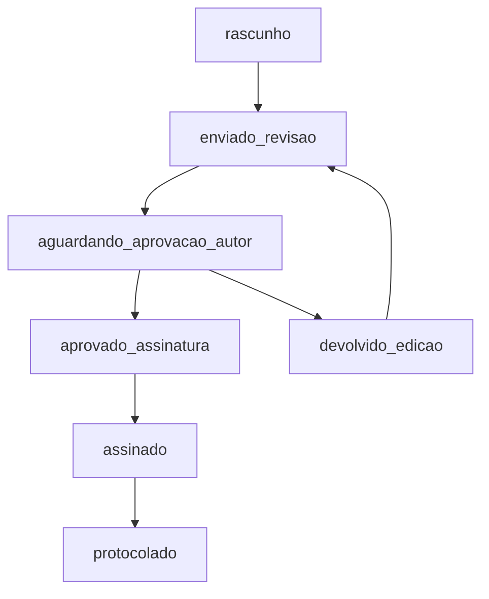

# 📋 Fluxo de Criação e Tramitação de Proposições - Sistema LegisInc

## 🚀 **1. PARLAMENTAR - Criação da Proposição**

### **1.1 Tela Inicial de Criação**
- **Rota**: `/proposicoes/criar` → `proposicoes.criar`
- **View**: `resources/views/proposicoes/criar.blade.php`
- **Descrição**: Lista os tipos de proposições disponíveis (Projeto de Lei, Moção, etc.)

### **1.2 Formulário de Criação Detalhado**
- **Rota**: `/proposicoes/create?tipo=projeto_lei_ordinaria&nome=Projeto+de+Lei+Ordinária`
- **Controller**: `ProposicaoController@createModern`
- **View**: `resources/views/proposicoes/create.blade.php`
- **Parâmetros URL**:
  - `tipo`: Código do tipo de proposição
  - `nome`: Nome do tipo de proposição

### **1.3 Salvamento dos Dados Iniciais**
- **Endpoint**: `POST /proposicoes/salvar-rascunho`
- **Controller**: `ProposicaoController@salvarRascunho`
- **Tabela Afetada**: `proposicoes`
- **Colunas Modificadas**:
  ```sql
  tipo, ementa, conteudo, autor_id, status, ano, anexos, total_anexos,
  template_id, modelo_id, arquivo_path, onlyoffice_key, ultima_modificacao
  ```
- **Status Inicial**: `'rascunho'`

---

## 📝 **2. PARLAMENTAR - Edição no OnlyOffice**

### **2.1 Acesso ao Editor**
- **Rota**: `/proposicoes/{id}/onlyoffice/editor-parlamentar`
- **Controller**: `OnlyOfficeController@editorParlamentar`
- **View**: `resources/views/onlyoffice/editor.blade.php`

### **2.2 Como o OnlyOffice Lê os Dados**
- **Arquivo RTF Gerado**: Criado em `storage/app/proposicoes/{id}/{id}_documento.rtf`
- **Template Aplicado**: Template Universal ou específico do tipo
- **Document Key**: Chave única gerada: `proposicao_{id}_{timestamp}`
- **URL de Acesso ao Arquivo**: `GET /onlyoffice/file/proposicao/{id}/{arquivo}`

### **2.3 Salvamento Automático OnlyOffice**
- **Endpoint de Callback**: `POST /proposicoes/{id}/onlyoffice/callback/{documentKey}`
- **Controller**: `OnlyOfficeController@callback`
- **Tabela Afetada**: `proposicoes`
- **Colunas Modificadas**:
  ```sql
  arquivo_path, onlyoffice_key, ultima_modificacao,
  arquivo_pdf_path = null (invalidação forçada)
  ```
- **Status**: Permanece `'rascunho'`

---

## 📤 **3. PARLAMENTAR - Envio para Legislativo**

### **3.1 Endpoint de Envio**
- **Rota**: `PUT /proposicoes/{id}/enviar-legislativo`
- **Controller**: `ProposicaoController@enviarLegislativo`
- **Tabela Afetada**: `proposicoes`
- **Colunas Modificadas**:
  ```sql
  status = 'enviado_revisao',
  enviado_revisao_em = now(),
  observacoes_edicao = null
  ```

---

## 🏛️ **4. LEGISLATIVO - Recebimento e Edição**

### **4.1 Visualização da Proposição**
- **Rota**: `/proposicoes/{id}`
- **Controller**: `ProposicaoController@show`
- **View**: `resources/views/proposicoes/show.blade.php`

### **4.2 Acesso ao Editor OnlyOffice (Legislativo)**
- **Rota**: `/proposicoes/{id}/onlyoffice/editor`
- **Controller**: `OnlyOfficeController@editorLegislativo`
- **View**: `resources/views/onlyoffice/editor.blade.php`

### **4.3 Salvamento de Edições (Legislativo)**
- **Endpoint de Callback**: `POST /proposicoes/{id}/onlyoffice/callback/{documentKey}`
- **Controller**: `OnlyOfficeController@callback`
- **Tabela Afetada**: `proposicoes`
- **Colunas Modificadas**:
  ```sql
  arquivo_path, onlyoffice_key, ultima_modificacao,
  arquivo_pdf_path = null (invalidação forçada),
  status = 'aguardando_aprovacao_autor'
  ```

### **4.4 Aprovação da Proposição (Legislativo)**
- **Função**: `ProposicaoController@aprovarEdicoesLegislativo`
- **Tabela Afetada**: `proposicoes`
- **Colunas Modificadas**:
  ```sql
  status = 'aprovado_assinatura',
  data_aprovacao_autor = now(),
  arquivo_pdf_path = null (invalidação crítica),
  pdf_gerado_em = null,
  pdf_conversor_usado = null
  ```

---

## 📄 **5. GERAÇÃO E ACESSO AO PDF**

### **5.1 Endpoint de Acesso ao PDF**
- **Rota**: `/proposicoes/{id}/pdf`
- **Controller**: `ProposicaoController@servePDF`

### **5.2 Armazenamento do PDF**
- **Localização**: `storage/app/proposicoes/{id}/{id}_final.pdf`
- **Coluna no BD**: `proposicoes.arquivo_pdf_path`

### **5.3 Fonte dos Dados para PDF**
- **Arquivo RTF Editado**: `storage/app/proposicoes/{id}/{id}_documento.rtf`
- **Dados da Proposição**: Tabela `proposicoes`
- **Template Aplicado**: Template Universal com variáveis preenchidas
- **Tipo de Geração**: **Montado com dados** (não extraído do OnlyOffice)

### **5.4 Lógica de Priorização**
```php
// PRIORIDADE: Arquivo salvo no OnlyOffice > Template original
if (arquivo_salvo_existe && arquivo_salvo_mais_recente) {
    usar_arquivo_onlyoffice();
} else {
    regenerar_com_template();
}
```

### **5.5 Verificação de Atualização**
```php
// Verificar se RTF foi modificado após PDF
if ($rtfModificado > $pdfGerado) {
    $pdfEstaDesatualizado = true;
    // Invalidar cache PDF para forçar regeneração
    $proposicao->update([
        'arquivo_pdf_path' => null,
        'pdf_gerado_em' => null,
        'pdf_convertor_usado' => null,
    ]);
}
```

---

## 📊 **TABELAS E CAMPOS PRINCIPAIS**

### **Tabela `proposicoes`**
```sql
-- Dados Básicos
id, tipo, ementa, conteudo, autor_id, status, ano

-- Arquivos
arquivo_path           -- RTF editado no OnlyOffice
arquivo_pdf_path       -- PDF final gerado
onlyoffice_key        -- Chave única do documento

-- Timestamps
created_at, updated_at, ultima_modificacao
enviado_revisao_em, data_aprovacao_autor

-- Protocolo
numero_protocolo, numero_sequencial, data_protocolo

-- Template
template_id, modelo_id

-- PDF Generation
pdf_gerado_em, pdf_conversor_usado

-- Anexos
anexos, total_anexos

-- Observações
observacoes_edicao, observacoes_retorno
```

---

## 🔄 **FLUXO DE STATUS**



### **Estados dos Status**
- **`rascunho`**: Proposição sendo criada/editada pelo Parlamentar
- **`enviado_revisao`**: Enviada para análise do Legislativo
- **`aguardando_aprovacao_autor`**: Legislativo terminou edições, aguarda aprovação do Parlamentar
- **`aprovado_assinatura`**: Parlamentar aprovou, pronta para assinatura
- **`assinado`**: Proposição assinada digitalmente
- **`protocolado`**: Proposição protocolada oficialmente

---

## 🎯 **PONTOS CRÍTICOS**

### **1. Invalidação de PDF após Aprovação**
```php
// CRÍTICO: Sempre invalidar PDF ao aprovar no Legislativo
$proposicao->update([
    'status' => 'aprovado_assinatura',
    'arquivo_pdf_path' => null,     // Força regeneração
    'pdf_gerado_em' => null,
    'pdf_conversor_usado' => null,
]);
```

### **2. Priorização de Arquivo OnlyOffice**
- Sistema sempre prioriza arquivo editado no OnlyOffice
- PDF é **montado com dados** usando o RTF mais atual
- Template é aplicado apenas se não houver RTF editado

### **3. Callback OnlyOffice**
- Status 2 = Documento salvo e pronto para download
- Arquivo RTF é baixado e salvo no storage
- Cache é limpo para forçar refresh

### **4. Permissões**
- **Parlamentar**: Pode editar apenas suas próprias proposições
- **Legislativo**: Pode editar proposições enviadas para revisão
- **PDF**: Acessível pelo autor, legislativo, assessor jurídico e protocolo

---

## 📁 **ESTRUTURA DE ARQUIVOS**

```
storage/app/proposicoes/{id}/
├── {id}_documento.rtf        # RTF editado no OnlyOffice
├── {id}_final.pdf           # PDF final gerado
├── {id}_original.rtf        # RTF original do template
└── anexos/                  # Anexos da proposição
    ├── anexo_1.pdf
    └── anexo_2.docx
```

---

**✅ Sistema v2.3 - Migração Segura com Auto-Correção**
**Última atualização**: 15/09/2025