# Fluxo Completo do Documento - Sistema Legisinc

## Visão Geral
Este documento detalha todo o fluxo de um documento desde a criação do template universal até o protocolo final, incluindo todas as interações com o banco de dados.

## Diagrama de Fluxo Completo

```mermaid
flowchart TB
    Start([Início]) --> Admin[Administrador]
    
    %% Fase 1: Criação do Template Universal
    Admin -->|Cria Template| CreateTemplate[Criar Template Universal]
    CreateTemplate --> DB1[(DB: tipo_proposicao_templates)]
    DB1 -->|INSERT| T1[nome: Template Universal<br/>tipo_proposicao_id: NULL<br/>template_conteudo: RTF<br/>ativo: true<br/>created_at: NOW]
    
    T1 --> ParamConfig[Configurar Parâmetros]
    ParamConfig --> DB2[(DB: parametros_templates)]
    DB2 -->|INSERT múltiplos| P1[tipo_proposicao_template_id<br/>codigo: variavel<br/>descricao<br/>valor_padrao<br/>obrigatorio]
    
    %% Fase 2: Criação da Proposição
    P1 --> Parlamentar[Parlamentar]
    Parlamentar -->|Login| Auth1{Autenticação}
    Auth1 --> DB3[(DB: users)]
    DB3 -->|SELECT| ValidUser[Verificar Role: parlamentar]
    
    ValidUser --> CreateProp[Criar Nova Proposição]
    CreateProp -->|Seleciona Template Universal| DB4[(DB: proposicoes)]
    DB4 -->|INSERT| Prop1[tipo_proposicao_id<br/>user_id: autor<br/>numero: NULL<br/>ano: 2025<br/>ementa<br/>texto<br/>status: rascunho<br/>arquivo_path: NULL<br/>arquivo_pdf_path: NULL<br/>created_at: NOW]
    
    Prop1 --> ApplyTemplate[Aplicar Template]
    ApplyTemplate --> TemplateService[TemplateProcessorService]
    TemplateService -->|Processa variáveis| RTF1[Gerar RTF]
    RTF1 --> DB5[(DB: proposicoes)]
    DB5 -->|UPDATE| Prop2[arquivo_path: proposicoes/2025/rtf<br/>updated_at: NOW]
    
    %% Fase 3: Edição no OnlyOffice
    Prop2 --> EditOnlyOffice[Editar no OnlyOffice]
    EditOnlyOffice --> OnlyOfficeService[OnlyOfficeService]
    OnlyOfficeService -->|Callback| DB6[(DB: proposicoes)]
    DB6 -->|UPDATE| Prop3[arquivo_path: arquivo salvo<br/>versao: versao + 1<br/>editado_por: user_id<br/>updated_at: NOW]
    
    Prop3 --> SendLegislativo[Enviar para Legislativo]
    SendLegislativo --> DB7[(DB: proposicoes)]
    DB7 -->|UPDATE| Prop4[status: em_analise_legislativo<br/>enviado_legislativo_em: NOW<br/>updated_at: NOW]
    
    %% Fase 4: Análise Legislativa
    Prop4 --> Legislativo[Setor Legislativo]
    Legislativo -->|Login| Auth2{Autenticação}
    Auth2 --> DB8[(DB: users)]
    DB8 -->|SELECT| ValidLeg[Verificar Role: legislativo]
    
    ValidLeg --> ReviewProp[Revisar Proposição]
    ReviewProp --> EditLeg[Editar no OnlyOffice]
    EditLeg --> DB9[(DB: proposicoes)]
    DB9 -->|UPDATE| Prop5[arquivo_path: versão editada<br/>versao: versao + 1<br/>revisado_por: user_id<br/>updated_at: NOW]
    
    Prop5 --> ApproveLeg[Aprovar Edições]
    ApproveLeg --> DB10[(DB: proposicoes)]
    DB10 -->|UPDATE| Prop6[status: aprovado_assinatura<br/>data_aprovacao_autor: NOW<br/>arquivo_pdf_path: NULL<br/>pdf_gerado_em: NULL<br/>pdf_conversor_usado: NULL<br/>updated_at: NOW]
    
    %% Fase 5: Geração de PDF
    Prop6 --> GeneratePDF[Gerar PDF para Assinatura]
    GeneratePDF --> PDFService[PDFConversionService]
    PDFService -->|Converte RTF| PDF1[Criar PDF]
    PDF1 --> DB11[(DB: proposicoes)]
    DB11 -->|UPDATE| Prop7[arquivo_pdf_path: proposicoes/2025/pdf<br/>pdf_gerado_em: NOW<br/>pdf_conversor_usado: unoconv<br/>updated_at: NOW]
    
    %% Fase 6: Assinatura Digital
    Prop7 --> SignPDF[Parlamentar Assina PDF]
    SignPDF --> AssinaturaService[AssinaturaDigitalService]
    AssinaturaService --> DB12[(DB: assinaturas_digitais)]
    DB12 -->|INSERT| Sign1[proposicao_id<br/>user_id: assinante<br/>tipo_assinatura: autor<br/>hash_documento<br/>certificado_info<br/>assinado_em: NOW]
    
    Sign1 --> DB13[(DB: proposicoes)]
    DB13 -->|UPDATE| Prop8[status: assinado<br/>arquivo_pdf_assinado: path<br/>data_assinatura: NOW<br/>updated_at: NOW]
    
    %% Fase 7: Protocolo
    Prop8 --> Protocolo[Setor de Protocolo]
    Protocolo -->|Login| Auth3{Autenticação}
    Auth3 --> DB14[(DB: users)]
    DB14 -->|SELECT| ValidProt[Verificar Role: protocolo]
    
    ValidProt --> ProtocolProp[Protocolar Documento]
    ProtocolProp --> DB15[(DB: proposicoes)]
    DB15 -->|UPDATE| Prop9[numero: 0001<br/>status: protocolado<br/>protocolado_em: NOW<br/>protocolado_por: user_id<br/>updated_at: NOW]
    
    Prop9 --> DB16[(DB: protocolo_registro)]
    DB16 -->|INSERT| Protocol1[proposicao_id<br/>numero_protocolo: 0001/2025<br/>data_protocolo: NOW<br/>responsavel_id: user_id]
    
    Protocol1 --> End([Documento Protocolado])
    
    %% Styling
    classDef dbStyle fill:#e1f5fe,stroke:#01579b,stroke-width:2px
    classDef serviceStyle fill:#fff3e0,stroke:#e65100,stroke-width:2px
    classDef userStyle fill:#f3e5f5,stroke:#4a148c,stroke-width:2px
    classDef processStyle fill:#e8f5e9,stroke:#1b5e20,stroke-width:2px
    
    class DB1,DB2,DB3,DB4,DB5,DB6,DB7,DB8,DB9,DB10,DB11,DB12,DB13,DB14,DB15,DB16 dbStyle
    class TemplateService,OnlyOfficeService,PDFService,AssinaturaService serviceStyle
    class Admin,Parlamentar,Legislativo,Protocolo userStyle
    class CreateTemplate,CreateProp,ApplyTemplate,EditOnlyOffice,ReviewProp,GeneratePDF,SignPDF,ProtocolProp processStyle
```



## Detalhamento das Fases

### 🎯 Fase 1: Criação do Template Universal
**Ator**: Administrador  
**Tabelas Afetadas**: 
- `tipo_proposicao_templates`
- `parametros_templates`

**Processo**:
1. Admin acessa sistema e cria novo template
2. Sistema insere registro em `tipo_proposicao_templates` com:
   - `tipo_proposicao_id = NULL` (indica template universal)
   - `template_conteudo` com RTF contendo variáveis
3. Para cada variável, insere em `parametros_templates`:
   - Código da variável (ex: `${numero_proposicao}`)
   - Descrição e valor padrão

---

### 📝 Fase 2: Criação da Proposição
**Ator**: Parlamentar  
**Tabelas Afetadas**: 
- `users` (verificação)
- `proposicoes` (criação)

**Processo**:
1. Parlamentar faz login (verifica role em `users`)
2. Cria nova proposição selecionando template universal
3. Sistema insere em `proposicoes`:
   - `status = 'rascunho'`
   - `numero = NULL` (aguardando protocolo)
   - `user_id` do autor
4. TemplateProcessorService aplica template:
   - Substitui variáveis pelos valores
   - Gera RTF processado
   - Salva em `storage/app/proposicoes/2025/rtf/`
5. Atualiza `arquivo_path` em `proposicoes`

---

### ✏️ Fase 3: Edição no OnlyOffice
**Ator**: Parlamentar  
**Tabelas Afetadas**: 
- `proposicoes`

**Processo**:
1. Parlamentar abre documento no OnlyOffice
2. Realiza edições no documento
3. OnlyOffice envia callback ao salvar
4. Sistema atualiza em `proposicoes`:
   - `arquivo_path` com novo arquivo
   - `versao` incrementada
   - `editado_por` com ID do usuário
5. Envia para Legislativo alterando `status = 'em_analise_legislativo'`

---

### 🔍 Fase 4: Análise Legislativa
**Ator**: Setor Legislativo  
**Tabelas Afetadas**: 
- `users` (verificação)
- `proposicoes`

**Processo**:
1. Legislativo acessa proposições pendentes
2. Revisa e edita no OnlyOffice
3. Sistema atualiza versão e arquivo
4. Ao aprovar, sistema:
   - Define `status = 'aprovado_assinatura'`
   - **CRÍTICO**: Invalida PDF antigo setando:
     - `arquivo_pdf_path = NULL`
     - `pdf_gerado_em = NULL`
     - `pdf_conversor_usado = NULL`

---

### 📄 Fase 5: Geração de PDF
**Ator**: Sistema (automático)  
**Tabelas Afetadas**: 
- `proposicoes`

**Processo**:
1. Sistema detecta necessidade de PDF (arquivo NULL ou RTF mais recente)
2. PDFConversionService converte RTF para PDF usando:
   - LibreOffice/unoconv (principal)
   - PHPRtfLib (fallback)
3. Salva PDF em `storage/app/proposicoes/2025/pdf/`
4. Atualiza em `proposicoes`:
   - `arquivo_pdf_path` com caminho do PDF
   - `pdf_gerado_em` com timestamp
   - `pdf_conversor_usado` com método usado

---

### ✍️ Fase 6: Assinatura Digital
**Ator**: Parlamentar  
**Tabelas Afetadas**: 
- `assinaturas_digitais`
- `proposicoes`

**Processo**:
1. Parlamentar visualiza PDF gerado
2. Aplica assinatura digital
3. AssinaturaDigitalService:
   - Gera hash do documento
   - Aplica certificado digital
   - Insere registro em `assinaturas_digitais`
4. Atualiza `proposicoes`:
   - `status = 'assinado'`
   - `arquivo_pdf_assinado` com PDF assinado
   - `data_assinatura`

---

### 📋 Fase 7: Protocolo
**Ator**: Setor de Protocolo  
**Tabelas Afetadas**: 
- `users` (verificação)
- `proposicoes`
- `protocolo_registro`

**Processo**:
1. Protocolo acessa proposições assinadas
2. Atribui número oficial (ex: 0001/2025)
3. Atualiza em `proposicoes`:
   - `numero = '0001'`
   - `status = 'protocolado'`
   - `protocolado_em` com timestamp
4. Insere em `protocolo_registro`:
   - Número completo do protocolo
   - Data e responsável

---

## 🔄 Estados da Proposição

| Status | Descrição | Próxima Ação |
|--------|-----------|--------------|
| `rascunho` | Criada pelo parlamentar | Editar/Enviar Legislativo |
| `em_analise_legislativo` | Em revisão pelo Legislativo | Aprovar/Rejeitar |
| `aprovado_assinatura` | Aprovada, aguardando assinatura | Gerar PDF e Assinar |
| `assinado` | Assinada digitalmente | Protocolar |
| `protocolado` | Protocolada oficialmente | Tramitação |

## 🔐 Validações Críticas

### 1. **Invalidação de PDF após Aprovação**
Sempre que o Legislativo aprovar, o PDF anterior deve ser invalidado para forçar regeneração com a versão mais recente do RTF.

### 2. **Verificação de Timestamp RTF vs PDF**
Antes de servir um PDF, verificar se o RTF foi modificado após a geração do PDF. Se sim, regenerar.

### 3. **Priorização de Arquivo Salvo**
OnlyOffice sempre tem prioridade sobre template quando houver edições salvas.

### 4. **Template Universal**
Garantir que `tipo_proposicao_id = NULL` para templates universais que se aplicam a todos os tipos.

## 📊 Queries SQL Importantes

### Buscar proposições pendentes de análise legislativa:
```sql
SELECT * FROM proposicoes 
WHERE status = 'em_analise_legislativo' 
AND deleted_at IS NULL
ORDER BY created_at ASC;
```

### Verificar proposições com PDF desatualizado:
```sql
SELECT p.* FROM proposicoes p
WHERE p.pdf_gerado_em < p.updated_at
OR p.arquivo_pdf_path IS NULL
AND p.status IN ('aprovado_assinatura', 'assinado');
```

### Listar proposições aguardando protocolo:
```sql
SELECT * FROM proposicoes 
WHERE status = 'assinado' 
AND numero IS NULL
AND deleted_at IS NULL;
```

## 🚀 Performance e Otimizações

1. **Cache de Templates**: Templates são cacheados por 24h
2. **Polling Realtime**: Verificação a cada 15s para mudanças
3. **Conversão PDF Assíncrona**: Para documentos grandes
4. **Índices no BD**: 
   - `status` + `deleted_at`
   - `user_id` + `created_at`
   - `numero` + `ano`

## 📝 Logs e Auditoria

Todas as ações são registradas em:
- `storage/logs/laravel.log` - Log geral
- `storage/logs/onlyoffice.log` - Edições OnlyOffice
- `storage/logs/pdf-conversion.log` - Conversões PDF
- `activity_log` table - Auditoria no BD

---

**Última atualização**: 06/09/2025  
**Versão do Sistema**: v2.1 Enterprise