# Diagrama de Fluxo de Proposições - Sistema Legisinc

## 📅 Última Atualização: 30/08/2025
## ✅ Status: Produção com Melhores Práticas Implementadas

## 📝 Template Universal - Fluxo Completo

### Visão Geral do Template Universal

O **Template Universal** é um sistema inovador que elimina a necessidade de manter 23 templates separados para cada tipo de proposição. Ele se adapta automaticamente ao tipo selecionado, aplicando variáveis dinâmicas e estrutura específica conforme a legislação brasileira (LC 95/1998).

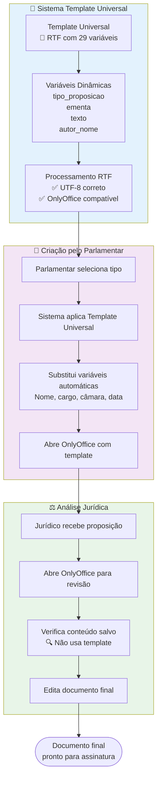

### Detalhamento do Template Universal

```mermaid
flowchart LR
    subgraph Admin["🔧 Administrador"]
        A1[Configura Template Universal<br/>em /admin/templates/universal]
        A2[29 variáveis disponíveis]
        A3[Estrutura RTF válida]
        A4[Imagem cabeçalho processada]
        
        A1 --> A2 --> A3 --> A4
    end
    
    subgraph Variables["📊 Variáveis do Sistema"]
        V1[Proposição: tipo, número, ementa]
        V2[Autor: nome, cargo, partido]
        V3[Instituição: câmara, endereço, CNPJ]
        V4[Datas: atual, criação, protocolo]
        V5[Dinâmicas: preâmbulo adaptável]
        
        V1 --> V2 --> V3 --> V4 --> V5
    end
    
    subgraph Process["⚙️ Processamento"]
        P1[Template base RTF]
        P2["Substitui imagem_cabecalho"]
        P3[Mantém outras como placeholder]
        P4[Encoding UTF-8 correto]
        P5[OnlyOffice compatível]
        
        P1 --> P2 --> P3 --> P4 --> P5
    end
    
    A4 --> V1
    V5 --> P1
    P5 --> Output([Template pronto para<br/>uso pelo Parlamentar])
    
    style Admin fill:#fff3e0
    style Variables fill:#e8f5e8
    style Process fill:#f3e5f5
```

## Fluxo Principal Completo

```mermaid
flowchart TB
    Start([Início]) --> CreateProposal[Parlamentar cria proposição]
    
    CreateProposal --> ChooseType{Escolhe tipo de<br/>preenchimento}
    ChooseType -->|Template| UseTemplate[Aplica template<br/>com variáveis]
    ChooseType -->|Manual| ManualText[Digita texto<br/>manualmente]
    ChooseType -->|IA| AIGenerate[Gera conteúdo<br/>com IA]
    
    UseTemplate --> SaveDraft
    ManualText --> SaveDraft
    AIGenerate --> SaveDraft
    
    SaveDraft[Salva como rascunho<br/>Status: 'rascunho'] --> EditOnlyOffice[Edita no OnlyOffice<br/>Status: 'em_edicao']
    
    EditOnlyOffice --> ValidateContent[Validação de<br/>conteúdo RTF]
    ValidateContent --> AddAttachments{Adicionar<br/>anexos?}
    AddAttachments -->|Sim| UploadFiles[Upload de arquivos<br/>PDF, DOC, imagens]
    AddAttachments -->|Não| SendToLegislative
    UploadFiles --> SendToLegislative
    
    SendToLegislative[Envia para Legislativo<br/>Status: 'enviado_legislativo'] --> LegislativeReceives[Legislativo recebe<br/>proposição]
    
    LegislativeReceives --> StartReview[Inicia revisão<br/>Status: 'em_revisao']
    
    StartReview --> TechnicalAnalysis[Análise técnica:<br/>- Constitucionalidade<br/>- Juridicidade<br/>- Regimentalidade<br/>- Técnica legislativa]
    
    TechnicalAnalysis --> EditContent{Precisa<br/>editar?}
    EditContent -->|Sim| LegislativeEdit[Legislativo edita<br/>no OnlyOffice]
    EditContent -->|Não| MakeDecision
    LegislativeEdit --> MakeDecision
    
    MakeDecision{Decisão do<br/>Legislativo}
    MakeDecision -->|Aprovar| ApproveForSignature[Aprova para assinatura<br/>Status: 'aprovado_assinatura']
    MakeDecision -->|Devolver| ReturnForCorrection[Devolve para correção<br/>Status: 'devolvido_correcao']
    
    ReturnForCorrection --> ParliamentaryCorrects[Parlamentar faz<br/>correções solicitadas]
    ParliamentaryCorrects --> SendToLegislative
    
    ApproveForSignature --> ParliamentaryViews[Parlamentar visualiza<br/>versão final]
    ParliamentaryViews --> ConfirmReading[Confirma leitura<br/>confirmacao_leitura = true]
    
    ConfirmReading --> DigitalSignature[Assina digitalmente<br/>Status: 'assinado']
    
    DigitalSignature --> GeneratePDFSigned[Gera PDF otimizado<br/>com assinatura QR]
    
    GeneratePDFSigned --> CleanOldPDFs[Limpa PDFs antigos<br/>mantém 3 últimos]
    CleanOldPDFs --> SendToProtocol[Envia para protocolo<br/>Status: 'enviado_protocolo']
    
    SendToProtocol --> ProtocolQueue[Fila do protocolo]
    
    ProtocolQueue --> ProtocolVerifications[Verificações do protocolo:<br/>- Documento assinado<br/>- Conteúdo completo<br/>- Anexos presentes]
    
    ProtocolVerifications --> AssignNumber[Atribui número de protocolo<br/>Ex: 2025/0001]
    
    AssignNumber --> DefineCommissions[Define comissões<br/>de destino]
    
    DefineCommissions --> Protocolize[Protocoliza oficialmente<br/>Status: 'protocolado']
    
    Protocolize --> GenerateFinalPDF[Gera PDF final otimizado<br/>com número de protocolo<br/>e QR Code]
    
    GenerateFinalPDF --> End([Fim - Proposição<br/>Protocolada])
    
    style Start fill:#e1f5fe
    style End fill:#c8e6c9
    style CreateProposal fill:#fff3e0
    style SaveDraft fill:#fce4ec
    style SendToLegislative fill:#f3e5f5
    style ApproveForSignature fill:#e8f5e9
    style ReturnForCorrection fill:#ffebee
    style DigitalSignature fill:#e0f2f1
    style Protocolize fill:#f1f8e9
```

## 👥 Fluxo Parlamentar → Jurídico (Detalhado)

### Sequência Completa de Interação

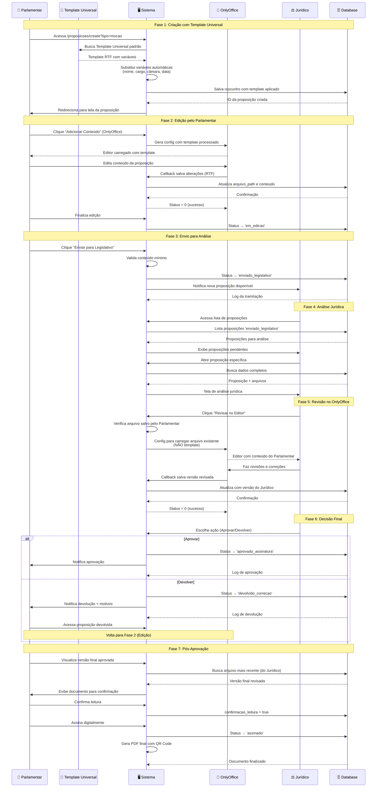

### Estados e Transições Template Universal

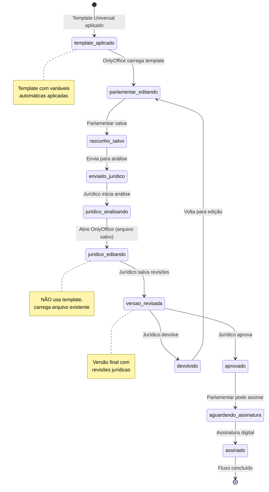

### Comparação: Template vs Arquivo Salvo

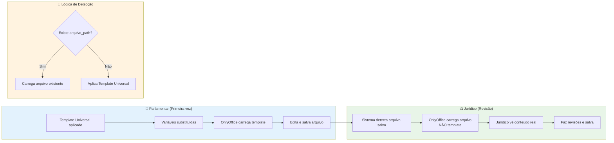

## Fluxo por Perfil de Usuário

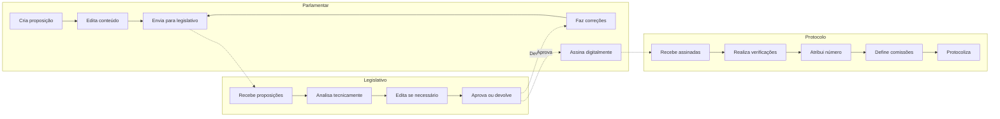

## Estados (Status) da Proposição

### Fluxo com Validações e Otimizações

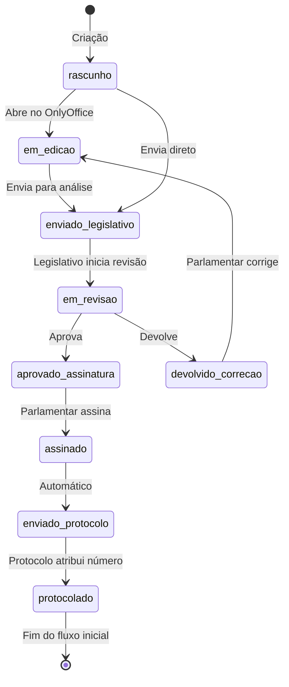

## Fluxo de Dados entre Tabelas

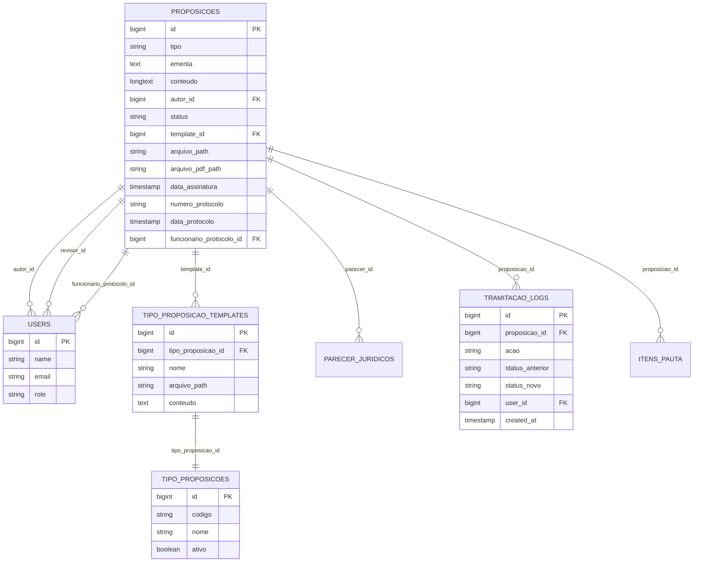

## Timeline do Processo

```mermaid
gantt
    title Timeline de uma Proposição
    dateFormat HH:mm
    axisFormat %H:%M
    
    section Parlamentar
    Cria proposição           :done, create, 09:00, 15m
    Edita no OnlyOffice       :done, edit, 09:15, 30m
    Envia para Legislativo    :done, send, 09:45, 5m
    
    section Legislativo
    Recebe proposição         :done, receive, 10:00, 5m
    Análise técnica          :done, analyze, 10:05, 45m
    Edita conteúdo           :active, legedit, 10:50, 30m
    Aprova proposição        :crit, approve, 11:20, 10m
    
    section Parlamentar
    Visualiza versão final    :view, 11:30, 10m
    Assina digitalmente      :crit, sign, 11:40, 10m
    
    section Protocolo
    Recebe para protocolo    :protreceive, 11:50, 5m
    Verifica documentos      :verify, 11:55, 15m
    Atribui número          :number, 12:10, 5m
    Protocoliza             :milestone, protocol, 12:15, 5m
```

## Fluxo de Decisões Detalhado

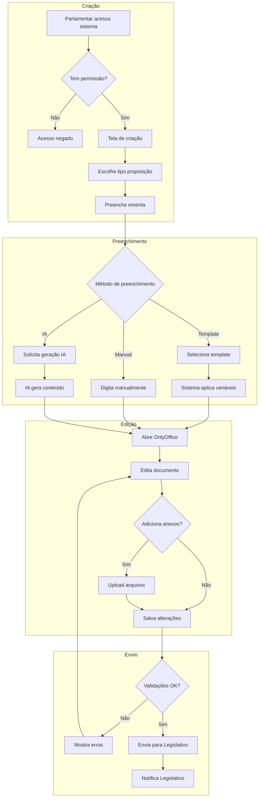

## Validações por Etapa

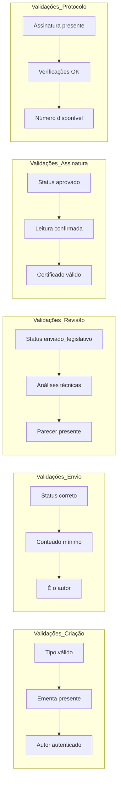

## Integração com OnlyOffice

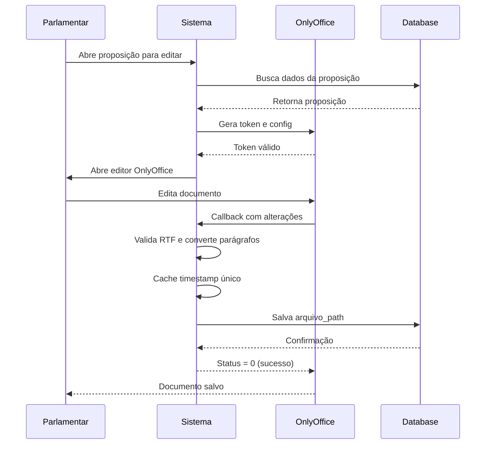

## Fluxo de Assinatura Digital

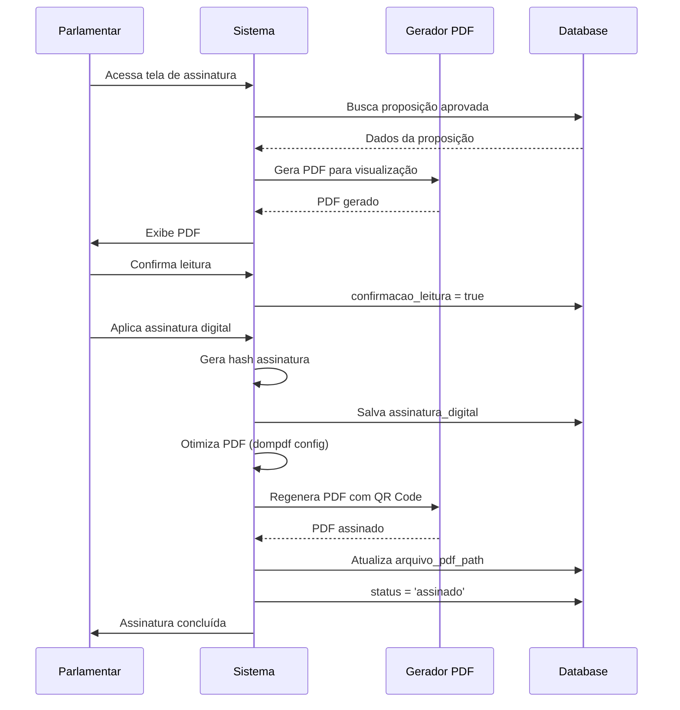

---

## Legenda

- 🟦 **Azul**: Ações do Parlamentar
- 🟩 **Verde**: Aprovações/Sucesso
- 🟥 **Vermelho**: Devoluções/Correções
- 🟨 **Amarelo**: Processamento/Espera
- 🟪 **Roxo**: Ações do Legislativo
- 🟧 **Laranja**: Ações do Protocolo

---

## 🔧 Template Universal - Especificações Técnicas

### Arquitetura do Sistema

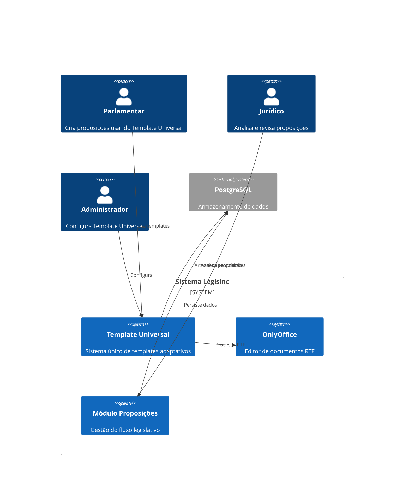

### Variáveis do Template Universal

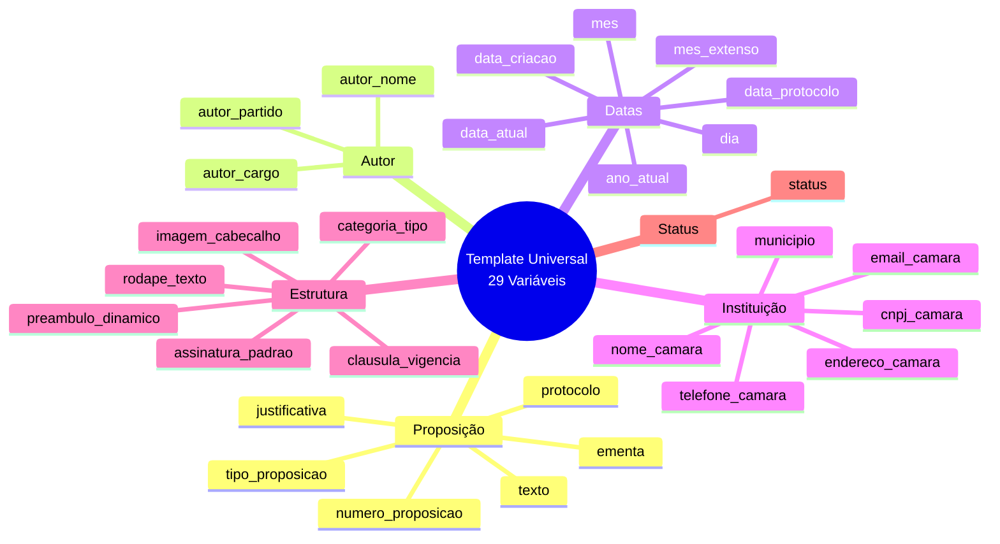

### Fluxo Técnico de Processamento RTF

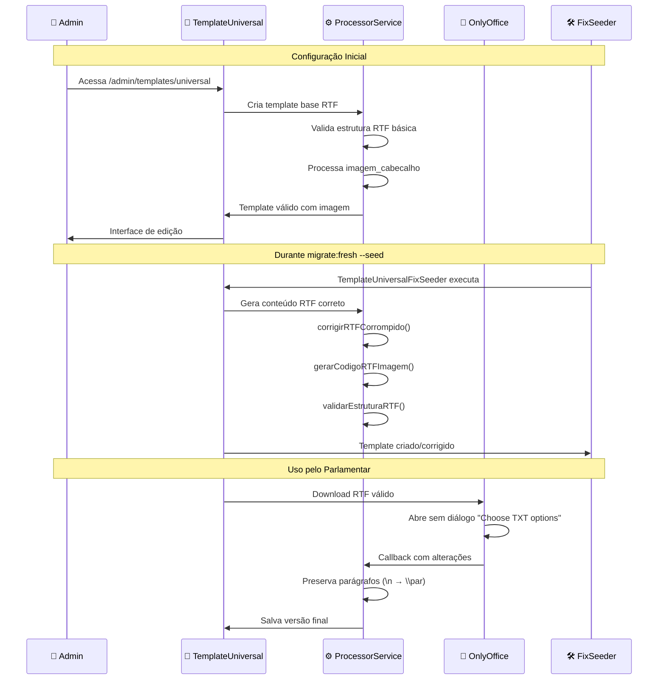

### Resolução de Problemas Técnicos

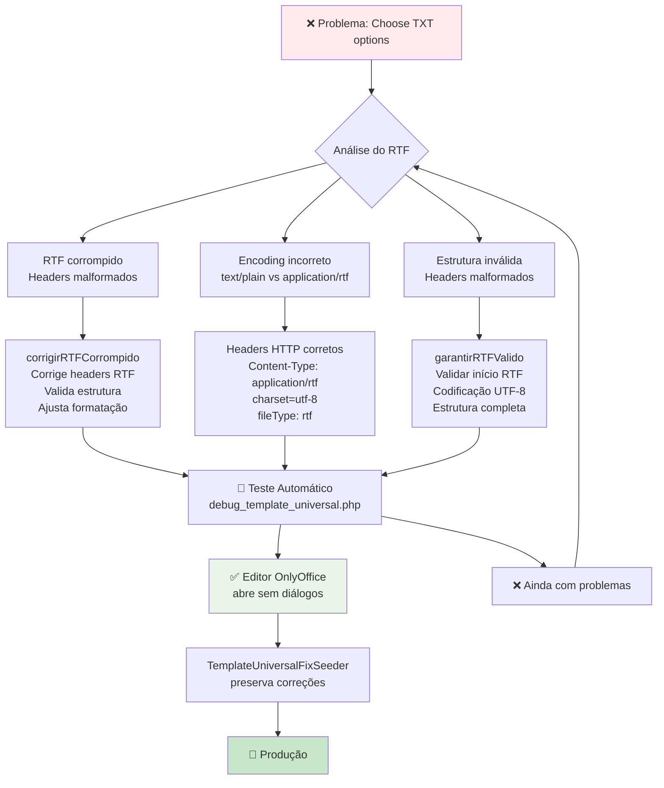

### Benefícios do Template Universal

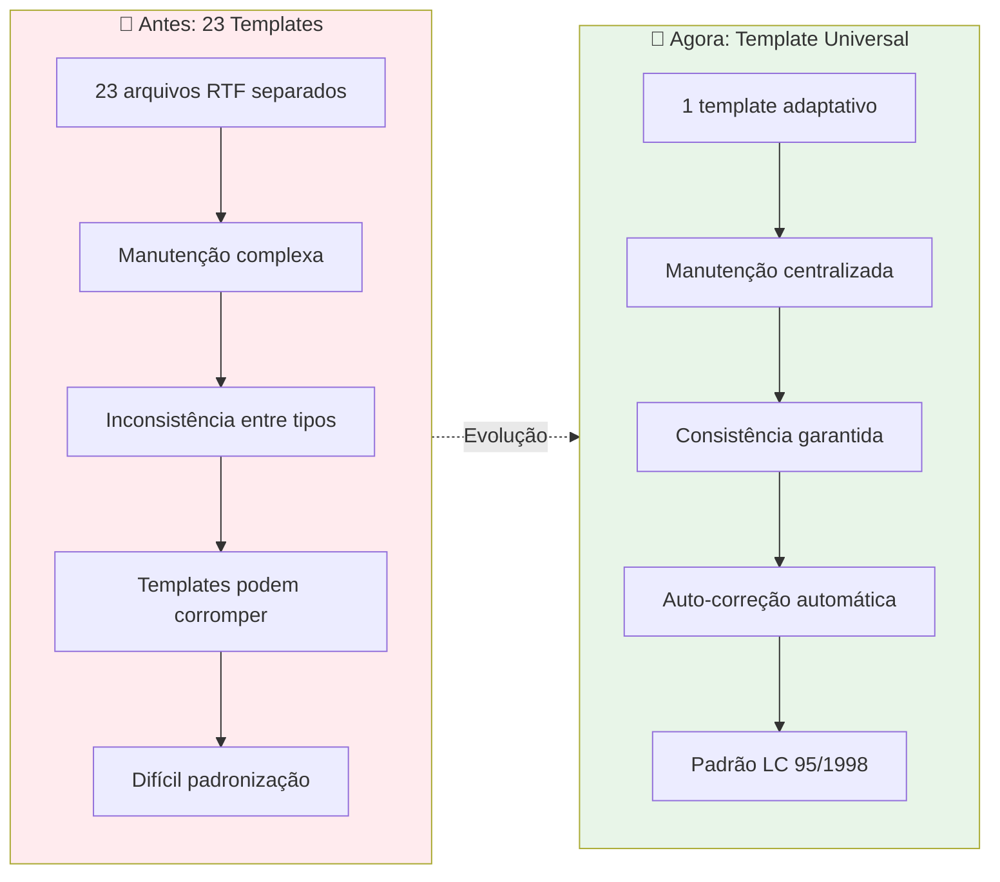

## 🚀 Melhorias Implementadas

### Performance
- ✅ **Cache inteligente** com timestamps únicos
- ✅ **PDF otimizado** com configurações dompdf
- ✅ **Limpeza automática** de arquivos antigos
- ✅ **Polling adaptativo** no OnlyOffice

### Qualidade
- ✅ **Validação RTF** com codificação UTF-8
- ✅ **Conversão de parágrafos** preservada
- ✅ **QR Code** nas assinaturas digitais
- ✅ **Backup automático** de dados críticos

### Segurança
- ✅ **Middleware de permissões** por role
- ✅ **Validação contextual** de acesso
- ✅ **Assinatura digital** com certificado
- ✅ **Logs detalhados** de todas as ações

---

*Diagramas gerados para o Sistema Legisinc v2.0*  
*Data: 30/08/2025*  
*Status: Produção com Melhores Práticas*