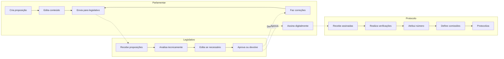
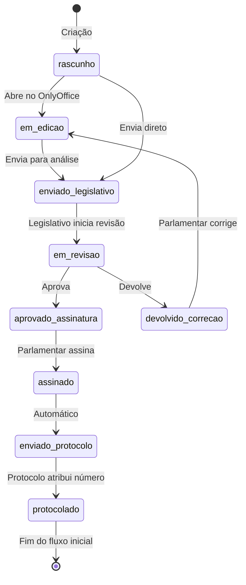
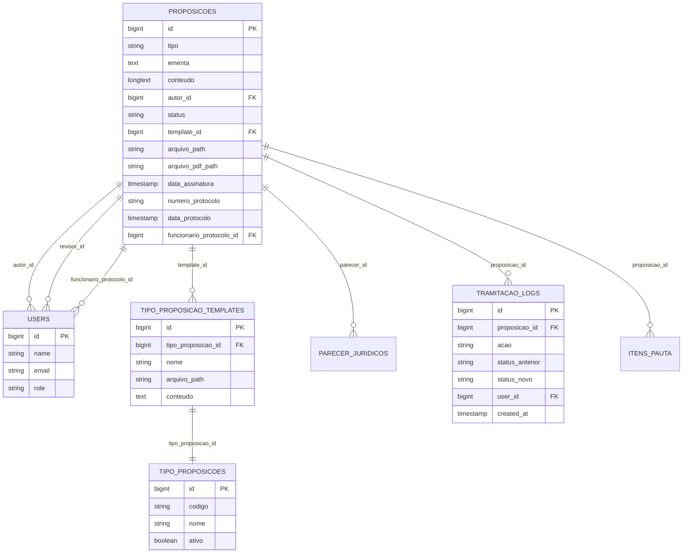
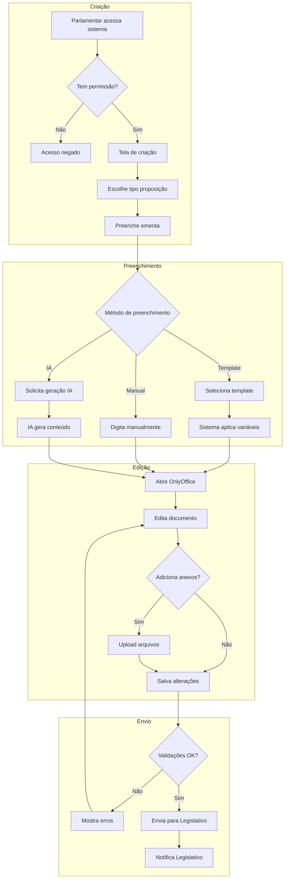
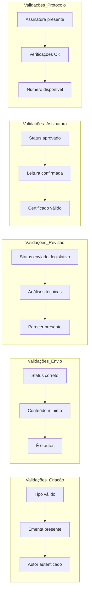
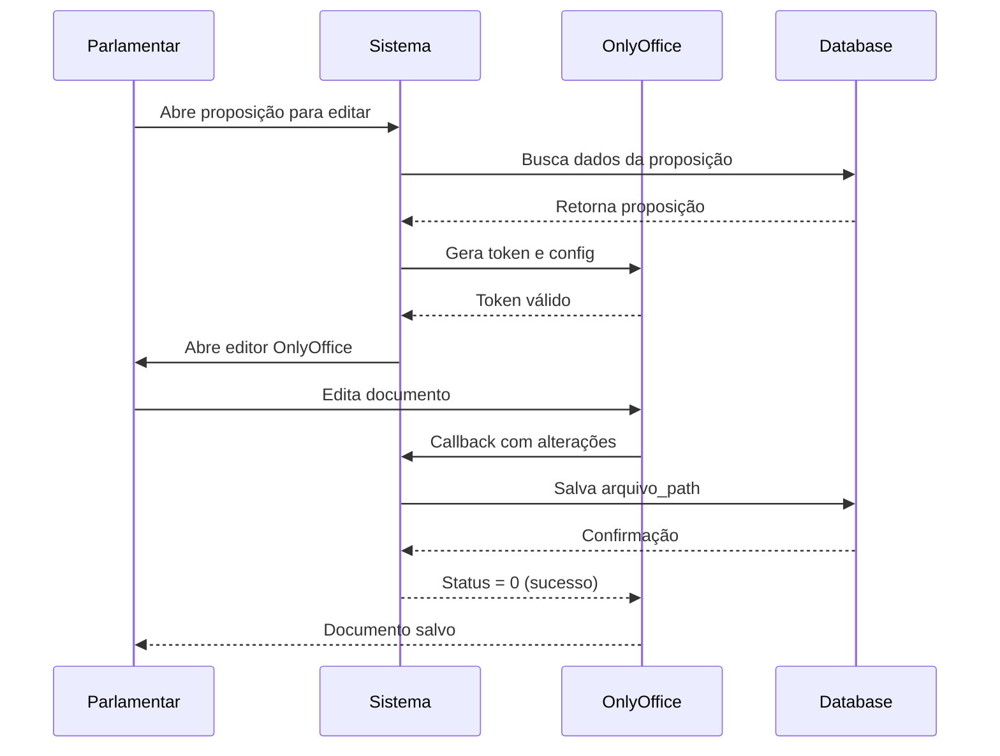
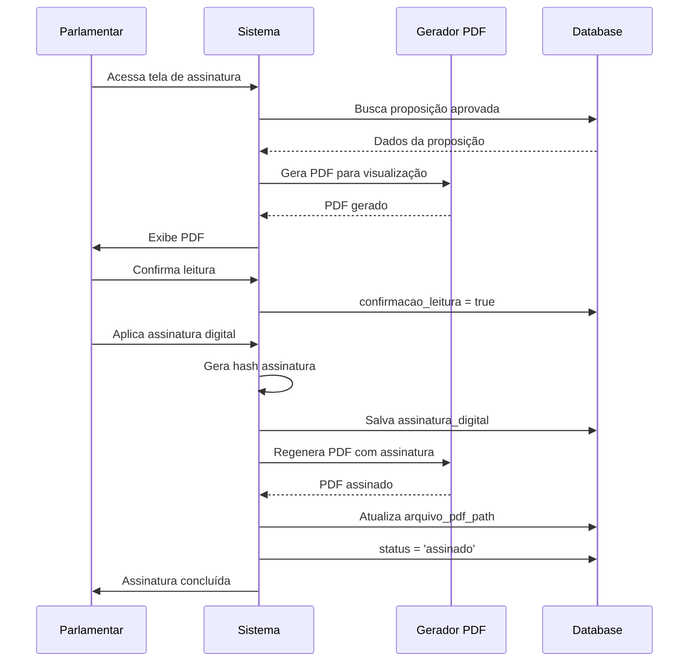

# Diagrama de Fluxo de Proposições - Sistema Legisinc

## Fluxo Principal Completo

```mermaid
flowchart TB
    Start([Início]) --> CreateProposal[Parlamentar cria proposição]
    
    CreateProposal --> ChooseType{Escolhe tipo de<br/>preenchimento}
    ChooseType -->|Template| UseTemplate[Aplica template<br/>com variáveis]
    ChooseType -->|Manual| ManualText[Digita texto<br/>manualmente]
    ChooseType -->|IA| AIGenerate[Gera conteúdo<br/>com IA]
    
    UseTemplate --> SaveDraft
    ManualText --> SaveDraft
    AIGenerate --> SaveDraft
    
    SaveDraft[Salva como rascunho<br/>Status: 'rascunho'] --> EditOnlyOffice[Edita no OnlyOffice<br/>Status: 'em_edicao']
    
    EditOnlyOffice --> AddAttachments{Adicionar<br/>anexos?}
    AddAttachments -->|Sim| UploadFiles[Upload de arquivos<br/>PDF, DOC, imagens]
    AddAttachments -->|Não| SendToLegislative
    UploadFiles --> SendToLegislative
    
    SendToLegislative[Envia para Legislativo<br/>Status: 'enviado_legislativo'] --> LegislativeReceives[Legislativo recebe<br/>proposição]
    
    LegislativeReceives --> StartReview[Inicia revisão<br/>Status: 'em_revisao']
    
    StartReview --> TechnicalAnalysis[Análise técnica:<br/>- Constitucionalidade<br/>- Juridicidade<br/>- Regimentalidade<br/>- Técnica legislativa]
    
    TechnicalAnalysis --> EditContent{Precisa<br/>editar?}
    EditContent -->|Sim| LegislativeEdit[Legislativo edita<br/>no OnlyOffice]
    EditContent -->|Não| MakeDecision
    LegislativeEdit --> MakeDecision
    
    MakeDecision{Decisão do<br/>Legislativo}
    MakeDecision -->|Aprovar| ApproveForSignature[Aprova para assinatura<br/>Status: 'aprovado_assinatura']
    MakeDecision -->|Devolver| ReturnForCorrection[Devolve para correção<br/>Status: 'devolvido_correcao']
    
    ReturnForCorrection --> ParliamentaryCorrects[Parlamentar faz<br/>correções solicitadas]
    ParliamentaryCorrects --> SendToLegislative
    
    ApproveForSignature --> ParliamentaryViews[Parlamentar visualiza<br/>versão final]
    ParliamentaryViews --> ConfirmReading[Confirma leitura<br/>confirmacao_leitura = true]
    
    ConfirmReading --> DigitalSignature[Assina digitalmente<br/>Status: 'assinado']
    
    DigitalSignature --> GeneratePDFSigned[Gera PDF com<br/>assinatura digital]
    
    GeneratePDFSigned --> SendToProtocol[Envia para protocolo<br/>Status: 'enviado_protocolo']
    
    SendToProtocol --> ProtocolQueue[Fila do protocolo]
    
    ProtocolQueue --> ProtocolVerifications[Verificações do protocolo:<br/>- Documento assinado<br/>- Conteúdo completo<br/>- Anexos presentes]
    
    ProtocolVerifications --> AssignNumber[Atribui número de protocolo<br/>Ex: 2025/0001]
    
    AssignNumber --> DefineCommissions[Define comissões<br/>de destino]
    
    DefineCommissions --> Protocolize[Protocoliza oficialmente<br/>Status: 'protocolado']
    
    Protocolize --> GenerateFinalPDF[Gera PDF final com<br/>número de protocolo]
    
    GenerateFinalPDF --> End([Fim - Proposição<br/>Protocolada])
    
    style Start fill:#e1f5fe
    style End fill:#c8e6c9
    style CreateProposal fill:#fff3e0
    style SaveDraft fill:#fce4ec
    style SendToLegislative fill:#f3e5f5
    style ApproveForSignature fill:#e8f5e9
    style ReturnForCorrection fill:#ffebee
    style DigitalSignature fill:#e0f2f1
    style Protocolize fill:#f1f8e9
```

## Fluxo por Perfil de Usuário

## Estados (Status) da Proposição

## Fluxo de Dados entre Tabelas

## Timeline do Processo

```mermaid
gantt
    title Timeline de uma Proposição
    dateFormat HH:mm
    axisFormat %H:%M
    
    section Parlamentar
    Cria proposição           :done, create, 09:00, 15m
    Edita no OnlyOffice       :done, edit, 09:15, 30m
    Envia para Legislativo    :done, send, 09:45, 5m
    
    section Legislativo
    Recebe proposição         :done, receive, 10:00, 5m
    Análise técnica          :done, analyze, 10:05, 45m
    Edita conteúdo           :active, legedit, 10:50, 30m
    Aprova proposição        :crit, approve, 11:20, 10m
    
    section Parlamentar
    Visualiza versão final    :view, 11:30, 10m
    Assina digitalmente      :crit, sign, 11:40, 10m
    
    section Protocolo
    Recebe para protocolo    :protreceive, 11:50, 5m
    Verifica documentos      :verify, 11:55, 15m
    Atribui número          :number, 12:10, 5m
    Protocoliza             :milestone, protocol, 12:15, 5m
```

## Fluxo de Decisões Detalhado

## Validações por Etapa

## Integração com OnlyOffice

## Fluxo de Assinatura Digital

---

## Legenda

- 🟦 **Azul**: Ações do Parlamentar
- 🟩 **Verde**: Aprovações/Sucesso
- 🟥 **Vermelho**: Devoluções/Correções
- 🟨 **Amarelo**: Processamento/Espera
- 🟪 **Roxo**: Ações do Legislativo
- 🟧 **Laranja**: Ações do Protocolo

---

*Diagramas gerados para o Sistema Legisinc v1.8*  
*Data: 30/08/2025*