# Diagrama de Fluxo de Proposições - Sistema Legisinc

## 📅 Última Atualização: 30/08/2025
## ✅ Status: Produção com Melhores Práticas Implementadas

## Fluxo Principal Completo


## Fluxo por Perfil de Usuário

```mermaid
flowchart LR
    subgraph Parlamentar
        P1[Cria proposição]
        P2[Edita conteúdo]
        P3[Envia para legislativo]
        P4[Faz correções]
        P5[Assina digitalmente]
        P1 --> P2 --> P3
        P4 --> P3
        P5
    end
    
    subgraph Legislativo
        L1[Recebe proposições]
        L2[Analisa tecnicamente]
        L3[Edita se necessário]
        L4[Aprova ou devolve]
        L1 --> L2 --> L3 --> L4
    end
    
    subgraph Protocolo
        PR1[Recebe assinadas]
        PR2[Realiza verificações]
        PR3[Atribui número]
        PR4[Define comissões]
        PR5[Protocoliza]
        PR1 --> PR2 --> PR3 --> PR4 --> PR5
    end
    
    P3 -.-> L1
    L4 -.->|Devolve| P4
    L4 -.->|Aprova| P5
    P5 -.-> PR1
```



## Estados (Status) da Proposição

### Fluxo com Validações e Otimizações

```mermaid
stateDiagram-v2
    [*] --> rascunho: Criação
    rascunho --> em_edicao: Abre no OnlyOffice
    em_edicao --> enviado_legislativo: Envia para análise
    rascunho --> enviado_legislativo: Envia direto
    
    enviado_legislativo --> em_revisao: Legislativo inicia revisão
    em_revisao --> aprovado_assinatura: Aprova
    em_revisao --> devolvido_correcao: Devolve
    
    devolvido_correcao --> em_edicao: Parlamentar corrige
    
    aprovado_assinatura --> assinado: Parlamentar assina
    
    assinado --> enviado_protocolo: Automático
    
    enviado_protocolo --> protocolado: Protocolo atribui número
    
    protocolado --> [*]: Fim do fluxo inicial
```



## Fluxo de Dados entre Tabelas


## Timeline do Processo


## Fluxo de Decisões Detalhado

```mermaid
flowchart TD
    subgraph Criação
        A1[Parlamentar acessa sistema]
        A2{Tem permissão?}
        A3[Acesso negado]
        A4[Tela de criação]
        A5[Escolhe tipo proposição]
        A6[Preenche ementa]
        
        A1 --> A2
        A2 -->|Não| A3
        A2 -->|Sim| A4
        A4 --> A5
        A5 --> A6
    end
    
    subgraph Preenchimento
        B1{Método de preenchimento}
        B2[Seleciona template]
        B3[Sistema aplica variáveis]
        B4[Digita manualmente]
        B5[Solicita geração IA]
        B6[IA gera conteúdo]
        
        A6 --> B1
        B1 -->|Template| B2
        B2 --> B3
        B1 -->|Manual| B4
        B1 -->|IA| B5
        B5 --> B6
    end
    
    subgraph Edição
        C1[Abre OnlyOffice]
        C2[Edita documento]
        C3{Adiciona anexos?}
        C4[Upload arquivos]
        C5[Salva alterações]
        
        B3 --> C1
        B4 --> C1
        B6 --> C1
        C1 --> C2
        C2 --> C3
        C3 -->|Sim| C4
        C3 -->|Não| C5
        C4 --> C5
    end
    
    subgraph Envio
        D1{Validações OK?}
        D2[Mostra erros]
        D3[Envia para Legislativo]
        D4[Notifica Legislativo]
        
        C5 --> D1
        D1 -->|Não| D2
        D2 --> C2
        D1 -->|Sim| D3
        D3 --> D4
    end
```

## Validações por Etapa

```mermaid
flowchart LR
    subgraph Validações_Criação
        VC1[Tipo válido]
        VC2[Ementa presente]
        VC3[Autor autenticado]
        VC1 --> VC2 --> VC3
    end
    
    subgraph Validações_Envio
        VE1[Status correto]
        VE2[Conteúdo mínimo]
        VE3[É o autor]
        VE1 --> VE2 --> VE3
    end
    
    subgraph Validações_Revisão
        VR1[Status enviado_legislativo]
        VR2[Análises técnicas]
        VR3[Parecer presente]
        VR1 --> VR2 --> VR3
    end
    
    subgraph Validações_Assinatura
        VA1[Status aprovado]
        VA2[Leitura confirmada]
        VA3[Certificado válido]
        VA1 --> VA2 --> VA3
    end
    
    subgraph Validações_Protocolo
        VP1[Assinatura presente]
        VP2[Verificações OK]
        VP3[Número disponível]
        VP1 --> VP2 --> VP3
    end
```

## Integração com OnlyOffice

```mermaid
sequenceDiagram
    participant P as Parlamentar
    participant S as Sistema
    participant O as OnlyOffice
    participant DB as Database
    
    P->>S: Abre proposição para editar
    S->>DB: Busca dados da proposição
    DB-->>S: Retorna proposição
    S->>O: Gera token e config
    O-->>S: Token válido
    S->>P: Abre editor OnlyOffice
    P->>O: Edita documento
    O->>S: Callback com alterações
    S->>S: Valida RTF e converte parágrafos
    S->>S: Cache timestamp único
    S->>DB: Salva arquivo_path
    DB-->>S: Confirmação
    S-->>O: Status = 0 (sucesso)
    O-->>P: Documento salvo
```



## Fluxo de Assinatura Digital

```mermaid
sequenceDiagram
    participant P as Parlamentar
    participant S as Sistema
    participant PDF as Gerador PDF
    participant DB as Database
    
    P->>S: Acessa tela de assinatura
    S->>DB: Busca proposição aprovada
    DB-->>S: Dados da proposição
    S->>PDF: Gera PDF para visualização
    PDF-->>S: PDF gerado
    S->>P: Exibe PDF
    P->>S: Confirma leitura
    S->>DB: confirmacao_leitura = true
    P->>S: Aplica assinatura digital
    S->>S: Gera hash assinatura
    S->>DB: Salva assinatura_digital
    S->>S: Otimiza PDF (dompdf config)
    S->>PDF: Regenera PDF com QR Code
    PDF-->>S: PDF assinado
    S->>DB: Atualiza arquivo_pdf_path
    S->>DB: status = 'assinado'
    S->>P: Assinatura concluída
```



---

## Legenda

- 🟦 **Azul**: Ações do Parlamentar
- 🟩 **Verde**: Aprovações/Sucesso
- 🟥 **Vermelho**: Devoluções/Correções
- 🟨 **Amarelo**: Processamento/Espera
- 🟪 **Roxo**: Ações do Legislativo
- 🟧 **Laranja**: Ações do Protocolo

---

## 🚀 Melhorias Implementadas

### Performance
- ✅ **Cache inteligente** com timestamps únicos
- ✅ **PDF otimizado** com configurações dompdf
- ✅ **Limpeza automática** de arquivos antigos
- ✅ **Polling adaptativo** no OnlyOffice

### Qualidade
- ✅ **Validação RTF** com codificação UTF-8
- ✅ **Conversão de parágrafos** preservada
- ✅ **QR Code** nas assinaturas digitais
- ✅ **Backup automático** de dados críticos

### Segurança
- ✅ **Middleware de permissões** por role
- ✅ **Validação contextual** de acesso
- ✅ **Assinatura digital** com certificado
- ✅ **Logs detalhados** de todas as ações

---

*Diagramas gerados para o Sistema Legisinc v2.0*  
*Data: 30/08/2025*  
*Status: Produção com Melhores Práticas*