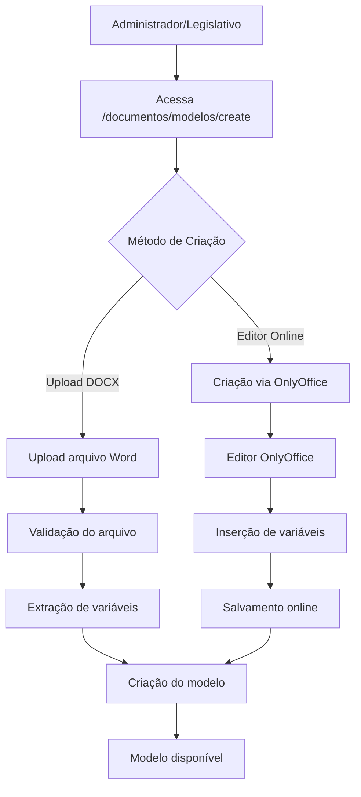
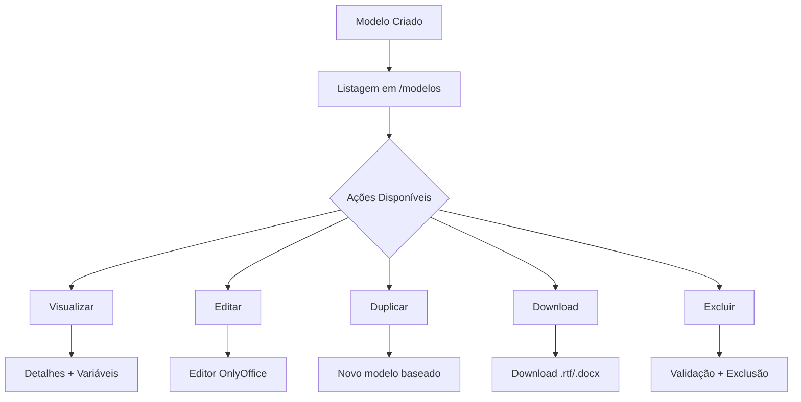
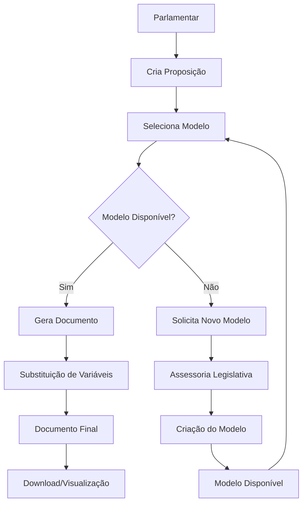

# Fluxo de Modelos de Documentos - Sistema LegisInc

## Visão Geral

Este documento detalha o funcionamento completo do sistema de modelos de documentos no LegisInc, incluindo a criação, gerenciamento e uso por diferentes perfis de usuário. O sistema permite a criação de templates profissionais que automatizam a geração de documentos parlamentares.

---

## 🎯 Objetivo do Sistema

O sistema de modelos de documentos visa:
- ✅ **Automatizar** a criação de documentos parlamentares
- ✅ **Padronizar** formatos e estruturas
- ✅ **Reduzir erros** de digitação e formatação
- ✅ **Acelerar** o processo legislativo
- ✅ **Manter consistência** na documentação oficial

---

## 👥 Perfis e Responsabilidades

### 🔴 **ADMINISTRADOR** (Nível 100)
**Responsabilidades:**
- ✅ Criação e gestão completa de modelos
- ✅ Configuração de variáveis e templates
- ✅ Manutenção do sistema de documentos
- ✅ Definição de políticas e permissões
- ✅ Monitoramento e auditoria

**Permissões:**
- Acesso total a `/documentos/modelos/*`
- Criação, edição, exclusão de modelos
- Configuração avançada do sistema
- Gestão de tipos de proposição
- Acesso ao editor OnlyOffice

### 🔵 **LEGISLATIVO** (Nível 80) 
**Responsabilidades:**
- ✅ Criação de modelos especializados
- ✅ Revisão e aprovação de templates
- ✅ Manutenção de modelos existentes
- ✅ Suporte técnico aos parlamentares
- ✅ Validação de documentos gerados

**Permissões:**
- Criação e edição de modelos (`modelos.*`)
- Acesso ao editor OnlyOffice
- Visualização de relatórios de uso
- Gestão de variáveis do sistema
- Suporte aos parlamentares

### 🟣 **PARLAMENTAR** (Nível 70)
**Responsabilidades:**
- ✅ Uso de modelos para criar documentos
- ✅ Solicitação de novos modelos
- ✅ Feedback sobre templates existentes
- ✅ Criação de proposições usando modelos

**Permissões:**
- Visualização de modelos (`modelos.view`)
- Geração de documentos a partir de modelos
- Download de documentos gerados
- Solicitação de novos templates
- Acesso limitado ao editor

---

## 🔄 Fluxo Completo do Sistema

### 1️⃣ **Fase de Criação de Modelos**



#### **1.1 Criação via Upload (Método Tradicional)**

**Passo a passo:**
1. **Acesso:** Administrador/Legislativo acessa `/documentos/modelos/create`
2. **Formulário:** Preenchimento de dados básicos
   - Nome do modelo
   - Descrição
   - Tipo de proposição (opcional)
3. **Upload:** Envio de arquivo .docx
4. **Validação:** Sistema valida formato e estrutura
5. **Extração:** Identificação automática de variáveis `${variavel}`
6. **Criação:** Modelo salvo e disponibilizado

**Validações Aplicadas:**
- ✅ Formato: Apenas arquivos .docx
- ✅ Tamanho: Máximo 10MB
- ✅ Estrutura: Documento válido do Word
- ✅ Variáveis: Sintaxe correta `${nome_variavel}`

#### **1.2 Criação via Editor Online (OnlyOffice)**

**Passo a passo:**
1. **Acesso:** Administrador/Legislativo acessa criação online
2. **Formulário:** Dados básicos via AJAX
3. **Editor:** Abertura automática do OnlyOffice
4. **Edição:** Criação em tempo real
5. **Variáveis:** Inserção manual de `${variavel}`
6. **Salvamento:** Automático com callbacks

**Funcionalidades Avançadas:**
- ✅ Edição colaborativa em tempo real
- ✅ Salvamento automático
- ✅ Controle de versões
- ✅ Preview instantâneo
- ✅ Inserção assistida de variáveis

### 2️⃣ **Fase de Gerenciamento**



#### **2.1 Visualização e Detalhes**
- **Informações:** Nome, descrição, tipo, versão
- **Variáveis:** Lista formatada de todas as variáveis
- **Estatísticas:** Uso, downloads, instâncias criadas
- **Histórico:** Log de modificações e acessos

#### **2.2 Edição e Versionamento**
- **Editor Online:** OnlyOffice integrado
- **Controle de Versões:** Automático (1.0 → 1.1 → 1.2)
- **Salvamento:** Auto-save + manual
- **Colaboração:** Múltiplos editores simultâneos

#### **2.3 Duplicação e Reutilização**
- **Base:** Cópia de modelo existente
- **Personalização:** Novos dados e variáveis
- **Independence:** Modelo independente do original

### 3️⃣ **Fase de Uso pelos Parlamentares**



#### **3.1 Seleção de Modelos**
**Critérios de Filtro:**
- ✅ **Tipo de Proposição:** Modelos específicos ou genéricos
- ✅ **Disponibilidade:** Apenas modelos ativos
- ✅ **Permissões:** Conforme perfil do usuário
- ✅ **Compatibilidade:** Variáveis disponíveis

#### **3.2 Geração de Documentos**
**Processo Automático:**
1. **Seleção:** Parlamentar escolhe modelo
2. **Instância:** Sistema cria DocumentoInstancia
3. **Mapeamento:** Busca dados da proposição
4. **Substituição:** Replace de todas as `${variáveis}`
5. **Geração:** Criação do documento final
6. **Disponibilização:** Download ou visualização

---

## 🔧 Arquitetura Técnica

### **Controllers Especializados**

#### **DocumentoModeloController**
```php
// Responsabilidades principais
- index()           // Listagem de modelos
- create()          // Formulário de criação
- store()           // Salvamento de novos modelos
- show()            // Detalhes e variáveis
- edit()            // Edição de modelos
- update()          // Atualização com versionamento
- destroy()         // Exclusão com validações
- download()        // Download de templates
- createOnlyOffice() // Criação via editor online
- storeOnlyOffice()  // Salvamento AJAX
```

#### **DocumentoInstanciaController**
```php
// Responsabilidades principais
- create()          // Criação de instâncias
- store()           // Geração de documentos
- show()            // Visualização de documentos
- download()        // Download de documentos gerados
- edit()            // Edição de instâncias
```

### **Services Especializados**

#### **DocumentoModeloService**
```php
// Funcionalidades principais
- criarModelo()                    // Criação completa
- duplicarModelo()                 // Duplicação com validações
- obterModelosDisponiveis()        // Filtros por tipo/permissão
- atualizarVersao()               // Controle de versões
- validarExclusao()               // Verificar dependências
```

#### **VariavelService**
```php
// Funcionalidades principais
- extrairVariaveisDeUpload()       // Parser de documentos
- validarFormatoDocumento()        // Validações de estrutura
- formatarVariaveisParaExibicao()  // UI formatting
- mapearDadosProposicao()         // Data mapping
- substituirVariaveis()           // Template processing
```

#### **DocumentoService**
```php
// Funcionalidades principais
- criarInstanciaDocumento()        // Criação de instâncias
- gerarDocumentoComVariaveis()     // Processamento final
- obterDadosProposicao()          // Data retrieval
- processarTemplate()             // Template engine
```

### **Models e Relacionamentos**

#### **DocumentoModelo**
```php
// Relacionamentos
- belongsTo(TipoProposicao)       // Tipo específico
- belongsTo(User, 'created_by')   // Criador
- hasMany(DocumentoInstancia)     // Instâncias geradas

// Campos principais
- nome, descricao, tipo_proposicao_id
- arquivo_path, arquivo_nome, arquivo_size
- variaveis (JSON), versao, ativo
- document_key (OnlyOffice), created_by
```

#### **DocumentoInstancia**
```php
// Relacionamentos
- belongsTo(DocumentoModelo)      // Modelo base
- belongsTo(Proposicao)           // Proposição origem
- belongsTo(User, 'created_by')   // Criador
- hasMany(DocumentoVersao)        // Versões da instância

// Campos principais
- modelo_id, proposicao_id, created_by
- arquivo_path, arquivo_nome, dados_gerados
- status, versao_instancia
```

---

## 🎨 Interface e Experiência do Usuário

### **Dashboard de Modelos** (`/documentos/modelos`)

#### **Para Administradores/Legislativo:**
```
┌─────────────────────────────────────────────────────────┐
│ 📄 Modelos de Documentos                    [+ Novo]    │
├─────────────────────────────────────────────────────────┤
│ 🔍 [Buscar modelos...]  📊 [Filtros]  📥 [Import/Export]│
├─────────────────────────────────────────────────────────┤
│ 📋 Projeto de Lei Ordinária            v2.1    ✅      │
│    📅 20/07/2025  👤 João Silva        🔗 15 usos      │
│    [👁️ Ver] [✏️ Editar] [📄 Duplicar] [⬇️ Download]      │
├─────────────────────────────────────────────────────────┤
│ 📝 Requerimento Padrão                 v1.3    ✅      │
│    📅 18/07/2025  👤 Maria Santos      🔗 8 usos       │
│    [👁️ Ver] [✏️ Editar] [📄 Duplicar] [⬇️ Download]      │
└─────────────────────────────────────────────────────────┘
```

#### **Para Parlamentares:**
```
┌─────────────────────────────────────────────────────────┐
│ 📄 Modelos Disponíveis                                 │
├─────────────────────────────────────────────────────────┤
│ 🔍 [Buscar...]  📊 [Tipo: Todos ▼]                    │
├─────────────────────────────────────────────────────────┤
│ 📋 Projeto de Lei Ordinária                            │
│    📝 Template completo para projetos de lei           │
│    🏷️ Projeto de Lei  📊 15 variáveis                  │
│    [👁️ Visualizar] [📥 Usar nesta Proposição]          │
├─────────────────────────────────────────────────────────┤
│ 📝 Requerimento Padrão                                 │
│    📝 Modelo padrão para requerimentos                 │
│    🏷️ Requerimento  📊 8 variáveis                     │
│    [👁️ Visualizar] [📥 Usar nesta Proposição]          │
└─────────────────────────────────────────────────────────┘
```

### **Editor OnlyOffice Integrado**

#### **Funcionalidades Principais:**
- ✅ **Edição em Tempo Real:** Auto-save a cada 2 segundos
- ✅ **Inserção de Variáveis:** Menu contextual com lista
- ✅ **Preview:** Visualização com dados fictícios
- ✅ **Colaboração:** Múltiplos editores simultâneos
- ✅ **Controle de Versões:** Histórico automático
- ✅ **Validação:** Verificação de variáveis em tempo real

#### **Interface do Editor:**
```
┌─────────────────────────────────────────────────────────┐
│ 📄 Editando: Projeto de Lei Ordinária v2.1             │
│ 💾 Salvando automaticamente... ✅ Salvo às 14:32       │
├─────────────────────────────────────────────────────────┤
│ [B] [I] [U] | [📋] [🔗] | [${var}] [👁️] [📤]           │
├─────────────────────────────────────────────────────────┤
│                                                         │
│ PROJETO DE LEI N° ${numero_proposicao}                  │
│                                                         │
│ Autor: ${autor_nome} - ${autor_cargo}                   │
│ Data: ${data_criacao}                                   │
│                                                         │
│ EMENTA: ${ementa}                                       │
│                                                         │
│ A Câmara Municipal de ${municipio}...                   │
│                                                         │
└─────────────────────────────────────────────────────────┘
```

---

## 📊 Sistema de Variáveis

### **Variáveis Disponíveis por Categoria**

#### **🆔 Identificação**
```json
{
  "numero_proposicao": "001/2025",
  "tipo_proposicao": "Projeto de Lei Ordinária", 
  "ementa": "Dispõe sobre...",
  "justificativa": "A presente proposição visa...",
  "artigos": "Art. 1° - ...",
  "vigencia": "01/01/2026"
}
```

#### **👤 Dados do Autor**
```json
{
  "autor_nome": "João Silva Santos",
  "autor_cargo": "Vereador",
  "gabinete": "15",
  "municipio": "São Paulo",
  "estado": "SP",
  "partido": "PARTIDO",
  "legislatura": "2025-2029"
}
```

#### **📅 Datas e Temporais**
```json
{
  "data_criacao": "23/07/2025",
  "data_atual": "23/07/2025",
  "legislatura": "2025",
  "sessao_legislativa": "2025",
  "ano_atual": "2025",
  "mes_atual": "Julho"
}
```

#### **🏛️ Institucional**
```json
{
  "nome_camara": "Câmara Municipal de São Paulo",
  "endereco_camara": "Viaduto Jacareí, 100",
  "telefone_camara": "(11) 3396-4000",
  "site_camara": "www.saopaulo.sp.leg.br",
  "presidente_camara": "Maria Silva"
}
```

### **Mapeamento de Dados**

O sistema automaticamente mapeia dados da proposição para as variáveis:

```php
// VariavelService::mapearDadosProposicao()
$mapeamento = [
    'numero_proposicao' => $proposicao->numero,
    'tipo_proposicao' => $proposicao->tipoProposicao->nome,
    'ementa' => $proposicao->ementa,
    'autor_nome' => $proposicao->autor->nome_completo,
    'autor_cargo' => $proposicao->autor->cargo,
    'data_criacao' => $proposicao->created_at->format('d/m/Y'),
    // ... mais mapeamentos
];
```

---

## 🔐 Segurança e Permissões

### **Controle de Acesso por Perfil**

#### **Política de Documentos** (`DocumentoModeloPolicy`)
```php
// Administrador - Acesso Total
- viewAny(): ✅ Todos os modelos
- view(): ✅ Qualquer modelo  
- create(): ✅ Criar modelos
- update(): ✅ Editar qualquer modelo
- delete(): ✅ Excluir (com validações)

// Legislativo - Acesso Avançado  
- viewAny(): ✅ Todos os modelos
- view(): ✅ Qualquer modelo
- create(): ✅ Criar modelos
- update(): ✅ Editar próprios modelos
- delete(): ✅ Excluir próprios modelos

// Parlamentar - Acesso Limitado
- viewAny(): ✅ Apenas modelos ativos
- view(): ✅ Modelos disponíveis
- create(): ❌ Não pode criar
- update(): ❌ Não pode editar
- delete(): ❌ Não pode excluir
```

### **Middleware de Segurança**
- ✅ **Autenticação:** Middleware `auth`
- ✅ **Autorização:** Policy-based permissions
- ✅ **Validação:** Request validation em todas as entradas
- ✅ **Upload:** Validação rigorosa de arquivos
- ✅ **SQL Injection:** Proteção via Eloquent ORM
- ✅ **XSS:** Escape automático nas views

---

## 📈 Monitoramento e Auditoria

### **Logs do Sistema**
```php
// Criação de modelos
\Log::info('Modelo criado:', [
    'modelo_id' => $modelo->id,
    'user_id' => auth()->id(),
    'nome' => $modelo->nome
]);

// Uso de modelos
\Log::info('Documento gerado:', [
    'modelo_id' => $modelo->id,
    'proposicao_id' => $proposicao->id,
    'user_id' => auth()->id()
]);

// Erros e problemas
\Log::error('Erro na geração:', [
    'modelo_id' => $modelo->id,
    'error' => $e->getMessage(),
    'trace' => $e->getTraceAsString()
]);
```

### **Métricas de Uso**
- 📊 **Modelos mais usados** por período
- 📊 **Usuários mais ativos** na criação
- 📊 **Tipos de proposição** mais comuns
- 📊 **Erros e problemas** identificados
- 📊 **Performance** de geração de documentos

---

## 🚀 Fluxo de Trabalho Típico

### **Cenário 1: Administrador Criando Modelo**
```
1. 🔑 Login como ADMIN
2. 📄 Acessa /documentos/modelos/create
3. 📝 Preenche: "Projeto de Lei Ambiental"
4. 🎯 Seleciona: "Projeto de Lei"
5. 📤 Upload: projeto-lei-ambiental.docx
6. ✅ Sistema valida e extrai 12 variáveis
7. 💾 Modelo salvo e ativo
8. 📧 Notificação para equipe legislativa
```

### **Cenário 2: Legislativo Editando Online**
```
1. 🔑 Login como LEGISLATIVO  
2. 📄 Acessa modelo "Requerimento Padrão"
3. ✏️ Clica "Editar" → OnlyOffice abre
4. 📝 Adiciona nova seção com ${nova_variavel}
5. 💾 Auto-save atualiza v1.2 → v1.3
6. ✅ Fecha editor → Modelo atualizado
7. 📊 Sistema atualiza lista de variáveis
```

### **Cenário 3: Parlamentar Usando Modelo**
```
1. 🔑 Login como PARLAMENTAR
2. 📋 Cria nova proposição
3. 📄 Seleciona "Projeto de Lei Ambiental"
4. 🎯 Sistema mapeia dados automaticamente
5. 📝 Gera documento com todas as variáveis
6. 👁️ Preview mostra resultado final
7. ⬇️ Download do documento .docx/.pdf
8. 📧 Documento pronto para tramitação
```

---

## 🔧 Configurações e Personalizações

### **Variáveis Personalizadas**
Administradores podem adicionar novas variáveis:
```php
// config/documento-variaveis.php
'variaveis_personalizadas' => [
    'comarca' => 'Nome da Comarca',
    'distrito' => 'Distrito Eleitoral', 
    'mandato_inicio' => 'Data Início Mandato',
    'mandato_fim' => 'Data Fim Mandato'
]
```

### **Templates de Sistema**
Templates base para novos modelos:
```
storage/app/templates/
├── projeto-lei-base.docx
├── requerimento-base.docx  
├── indicacao-base.docx
└── mocao-base.docx
```

### **Configurações de Upload**
```php
// config/filesystems.php
'documento_modelos' => [
    'max_size' => 10 * 1024, // 10MB
    'allowed_types' => ['docx'],
    'scan_viruses' => true,
    'backup_enabled' => true
]
```

---

## 📚 Documentação Técnica

### **APIs Disponíveis**
```php
// Lista modelos disponíveis
GET /api/documentos/modelos?tipo_proposicao_id=1

// Dados de um modelo específico  
GET /api/documentos/modelos/{id}

// Gerar documento a partir de modelo
POST /api/documentos/instancias
{
  "modelo_id": 1,
  "proposicao_id": 123,
  "dados_customizados": {...}
}
```

### **Webhooks e Integrações**
```php
// Callback OnlyOffice
POST /api/onlyoffice/callback
{
  "status": 2,
  "url": "https://...",
  "key": "modelo_123_v2",
  "users": ["user123"]
}
```

### **Estrutura de Arquivos**
```
app/
├── Http/Controllers/Documento/
│   ├── DocumentoModeloController.php
│   └── DocumentoInstanciaController.php
├── Models/Documento/
│   ├── DocumentoModelo.php
│   ├── DocumentoInstancia.php
│   └── DocumentoVersao.php
├── Services/Documento/
│   ├── DocumentoService.php
│   ├── VariavelService.php
│   └── DocumentoModeloService.php
└── Policies/
    ├── DocumentoModeloPolicy.php
    └── DocumentoInstanciaPolicy.php
```

---

## ✅ Status Atual e Próximos Passos

### **Funcionalidades Implementadas** ✅
- ✅ Sistema completo de modelos CRUD
- ✅ Upload e validação de documentos
- ✅ Extração automática de variáveis  
- ✅ Editor OnlyOffice integrado
- ✅ Controle de versões automático
- ✅ Sistema de permissões granular
- ✅ Geração de documentos com substituição
- ✅ Download e visualização
- ✅ Duplicação de modelos
- ✅ Interface responsiva Metronic

### **Próximas Melhorias** 🔄
- 🔄 **Templates AI:** Sugestão inteligente de variáveis
- 🔄 **Colaboração Avançada:** Comments e suggestions
- 🔄 **Workflow Approval:** Aprovação antes de ativar modelos
- 🔄 **Analytics Avançado:** Dashboard de uso e performance
- 🔄 **Mobile App:** Visualização e uso via mobile
- 🔄 **Integração Externa:** APIs para sistemas terceiros

---

## 🎉 Conclusão

O sistema de modelos de documentos do LegisInc representa uma solução completa e robusta para automatização da criação de documentos parlamentares. Com interfaces intuitivas para diferentes perfis de usuário, editor online integrado e sistema de variáveis flexível, oferece:

- ⚡ **Eficiência:** Redução significativa no tempo de criação
- 🎯 **Precisão:** Eliminação de erros de digitação
- 📏 **Padronização:** Consistência em todos os documentos
- 🔒 **Segurança:** Controle granular de acesso
- 🚀 **Escalabilidade:** Suporte a crescimento do sistema

O fluxo entre Administradores, Assessoria Legislativa e Parlamentares está bem definido, permitindo colaboração eficiente e manutenção organizada do sistema de templates.

---

**Última atualização:** 2025-07-23  
**Versão do documento:** 1.0  
**Status:** Documentação completa do sistema implementado