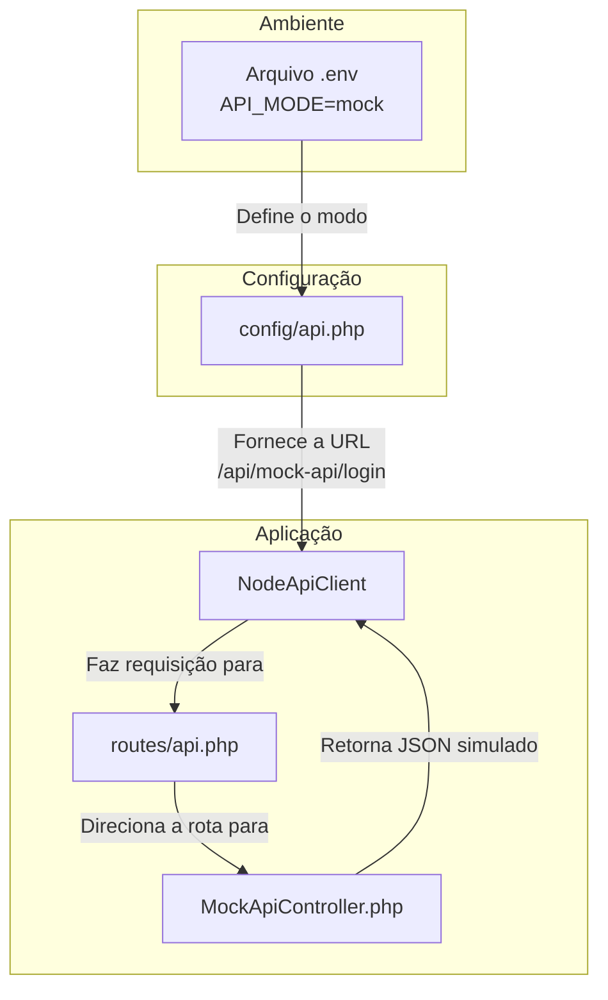

# Arquitetura de Mocks e Testes no NodeApiClient

Este documento detalha a estratégia de comunicação com APIs e o uso de mocks para testes no `NodeApiClient`, destacando a flexibilidade da arquitetura adotada.

## 1. Arquitetura de API Configurável

O projeto utiliza um sistema de configuração centralizado em `config/api.php` para gerenciar a comunicação com APIs. A chave dessa arquitetura é a variável de ambiente `API_MODE`.

```php
// config/api.php
'mode' => env('API_MODE', 'mock'),
```

Essa configuração permite que a aplicação opere em dois modos distintos:

-   **`mock` (Padrão)**: A aplicação se comunica com um `MockApiController` interno do próprio Laravel. A `base_url` é dinamicamente definida para a URL da própria aplicação (`http://localhost:8000/api/mock-api`). Este modo é ideal para desenvolvimento e testes de integração, pois não depende de um serviço externo.
-   **`external`**: A aplicação aponta para uma API externa real (neste caso, uma aplicação Node.js em `http://localhost:3000`). Este é o modo utilizado em produção.

## 2. NodeApiClient: Um Cliente Dinâmico

O `NodeApiClient` foi projetado para se adaptar a essa configuração dinâmica. Em seu construtor, ele verifica o `API_MODE` e carrega as configurações apropriadas (URL base, timeouts, etc.).

```php
// app/Services/ApiClient/Providers/NodeApiClient.php

public function __construct(array $config)
{
    // Usar configuração dinâmica baseada no modo da API
    $apiMode = config('api.mode', 'mock');
    $dynamicConfig = $this->buildDynamicConfig($apiMode, $config);
    
    parent::__construct($dynamicConfig);
    // ...
}
```

Isso significa que, dependendo do `.env`, os métodos `login` e `register` farão requisições para URLs diferentes sem que nenhuma linha de código precise ser alterada.

## 3. Estrutura do Modo `mock`

Quando a aplicação opera com `API_MODE=mock`, o `NodeApiClient` faz requisições para a própria aplicação Laravel. Essa simulação é sustentada por três componentes principais:

1.  **Configuração (`config/api.php`)**: Define a `base_url` para um endpoint interno, como `http://localhost:8000/api/mock-api`.
2.  **Rotas (`routes/api.php`)**: Captura as requisições enviadas para o endpoint do mock e as direciona para o `MockApiController`.
3.  **Controller (`MockApiController.php`)**: Atua como a API externa, recebendo as requisições, processando-as e retornando respostas JSON simuladas. Para simular um banco de dados, ele utiliza o Cache do Laravel para persistir dados temporariamente.

### Fluxo de uma Requisição em Modo Mock

O diagrama abaixo ilustra como os componentes interagem quando o `NodeApiClient` faz uma chamada para `login()`:



Essa arquitetura desacoplada é poderosa porque permite que a aplicação seja desenvolvida e testada de forma completa sem qualquer dependência da API externa real.

## 4. O Papel do `Http::fake()` nos Testes Unitários

Embora o modo `mock` seja útil para desenvolvimento, os testes unitários exigem um isolamento ainda maior. Não queremos que o teste dependa nem mesmo do `MockApiController` interno, pois isso testaria o framework de roteamento e o controller, e não apenas a classe `NodeApiClient`.

**Vantagens desta abordagem:**

-   **Isolamento Total**: O teste foca exclusivamente na lógica interna do `NodeApiClient` (como ele constrói a requisição e processa a resposta).
-   **Velocidade**: Nenhuma requisição de rede ou processamento de rota do Laravel ocorre, tornando os testes extremamente rápidos.
-   **Previsibilidade**: A resposta é 100% controlada pelo teste, eliminando qualquer instabilidade.

## 5. Análise dos Testes de Autenticação

Com o contexto acima, a função dos testes de `login` e `register` fica mais clara. Eles garantem que a classe `NodeApiClient` funciona corretamente, independentemente do modo (`mock` ou `external`) em que a aplicação está rodando.

### Teste de Registro (`it_can_register_user`)

```php
// tests/Unit/NodeApiClientTest.php

public function it_can_register_user()
{
    // 1. Http::fake() intercepta a chamada que seria feita por $this->post()
    Http::fake([
        'localhost:3000/register' => Http::response([...], 201)
    ]);

    // 2. O método é executado
    $response = $this->client->register('Test User', 'test@test.com', 'senha123');
    
    // 3. A lógica de processamento da resposta é validada
    $this->assertTrue($response->isSuccess());
    $this->assertEquals(201, $response->statusCode);
}
```

### Teste de Login (`it_can_login_and_store_token`)

```php
// tests/Unit/NodeApiClientTest.php

public function it_can_login_and_store_token()
{
    $mockToken = 'mock-jwt-token-12345';
    
    // 1. A resposta simulada inclui o token
    Http::fake([
        'localhost:3000/login' => Http::response(['token' => $mockToken, ...], 200)
    ]);

    // 2. O método é executado
    $response = $this->client->login('bruno@test.com', 'senha123');
    
    // 3. A lógica de armazenamento do token em cache é validada, um efeito
    // colateral importante do método.
    $this->assertTrue($response->isSuccess());
    $this->assertEquals($mockToken, $response->data['token']);
    $this->assertTrue($this->client->isAuthenticated());
    $this->assertTrue(Cache::has('node_api_jwt_token'));
}
```

## Conclusão

A arquitetura do projeto combina inteligentemente:
1.  **Configuração por Ambiente (`.env`)** para alternar entre um mock de desenvolvimento e a API de produção.
2.  **Mocking de Teste (`Http::fake()`)** para isolar completamente as classes em testes unitários.

Essa abordagem em camadas oferece grande flexibilidade para desenvolvimento, testes e produção. 