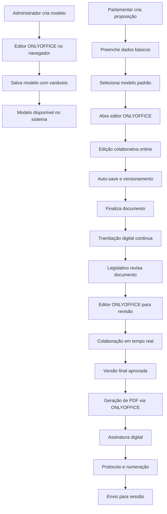

# Sistema de Modelos de Documentos com ONLYOFFICE - LegisInc

## Visão Geral da Solução

O sistema de modelos de documentos do LegisInc utiliza **ONLYOFFICE Document Server** via Docker para proporcionar uma experiência de edição profissional diretamente no navegador, mantendo a **qualidade e recursos avançados** equivalentes ao Microsoft Office, com **edição colaborativa** e **integração total** com o fluxo de tramitação digital.

### Vantagens do ONLYOFFICE
- **Editor completo no navegador**: Formatação avançada sem sair do sistema
- **Compatibilidade total**: Suporte nativo a .docx, .xlsx, .pptx
- **Edição colaborativa**: Múltiplos usuários editando simultaneamente
- **API robusta**: Integração completa com sistemas externos
- **Controle de versões**: Sistema nativo de versionamento
- **Segurança**: Controle total sobre os dados e documentos

## Arquitetura da Solução

### Componentes Docker

#### 1. ONLYOFFICE Document Server
```yaml
# docker-compose.yml - Adicionar ao compose existente
services:
  onlyoffice-documentserver:
    image: onlyoffice/documentserver:8.0
    container_name: legisinc-onlyoffice
    restart: unless-stopped
    environment:
      - JWT_ENABLED=true
      - JWT_SECRET=${ONLYOFFICE_JWT_SECRET}
      - JWT_HEADER=Authorization
      - JWT_IN_BODY=true
      - WOPI_ENABLED=false
      - USE_UNAUTHORIZED_STORAGE=false
    ports:
      - "8080:80"
    volumes:
      - onlyoffice_data:/var/www/onlyoffice/Data
      - onlyoffice_logs:/var/log/onlyoffice
      - onlyoffice_cache:/var/lib/onlyoffice/documentserver/App_Data/cache/files
      - onlyoffice_forgotten:/var/lib/onlyoffice/documentserver/App_Data/cache/forgotten
    networks:
      - legisinc-network

volumes:
  onlyoffice_data:
  onlyoffice_logs:
  onlyoffice_cache:
  onlyoffice_forgotten:
```

#### 2. Configuração de Rede
```yaml
networks:
  legisinc-network:
    driver: bridge
```

### Fluxo Principal com ONLYOFFICE



## Implementação Técnica

### 1. Configurações Laravel

#### Environment Variables
```env
# .env - Adicionar configurações ONLYOFFICE
ONLYOFFICE_SERVER_URL=http://localhost:8080
ONLYOFFICE_JWT_SECRET=your-secret-key-here
ONLYOFFICE_STORAGE_PATH=/storage/onlyoffice
ONLYOFFICE_CALLBACK_URL=http://localhost:8000/api/onlyoffice/callback
```

#### Configuration File
```php
// config/onlyoffice.php
<?php

return [
    'server_url' => env('ONLYOFFICE_SERVER_URL', 'http://localhost:8080'),
    'jwt_secret' => env('ONLYOFFICE_JWT_SECRET'),
    'storage_path' => env('ONLYOFFICE_STORAGE_PATH', '/storage/onlyoffice'),
    'callback_url' => env('ONLYOFFICE_CALLBACK_URL'),
    
    'document_types' => [
        'text' => ['docx', 'doc', 'odt', 'rtf', 'txt'],
        'spreadsheet' => ['xlsx', 'xls', 'ods', 'csv'],
        'presentation' => ['pptx', 'ppt', 'odp']
    ],
    
    'permissions' => [
        'comment' => true,
        'copy' => true,
        'download' => true,
        'edit' => true,
        'fillForms' => true,
        'modifyFilter' => true,
        'modifyContentControl' => true,
        'review' => true,
        'reviewGroups' => ["group1", "group2"],
        'chat' => true,
        'commentGroups' => ["group1"]
    ]
];
```

### 2. Services para ONLYOFFICE

#### OnlyOfficeService
```php
// app/Services/OnlyOffice/OnlyOfficeService.php
<?php

namespace App\Services\OnlyOffice;

use Illuminate\Support\Facades\Http;
use Illuminate\Support\Facades\Storage;
use Firebase\JWT\JWT;
use Firebase\JWT\Key;

class OnlyOfficeService
{
    private string $serverUrl;
    private string $jwtSecret;
    private string $callbackUrl;
    
    public function __construct()
    {
        $this->serverUrl = config('onlyoffice.server_url');
        $this->jwtSecret = config('onlyoffice.jwt_secret');
        $this->callbackUrl = config('onlyoffice.callback_url');
    }
    
    public function criarConfiguracao(string $documentKey, string $fileName, string $fileUrl, array $user, string $mode = 'edit'): array
    {
        $config = [
            'document' => [
                'fileType' => pathinfo($fileName, PATHINFO_EXTENSION),
                'key' => $documentKey,
                'title' => $fileName,
                'url' => $fileUrl,
                'permissions' => $this->obterPermissoes($mode)
            ],
            'documentType' => $this->determinarTipoDocumento($fileName),
            'editorConfig' => [
                'mode' => $mode,
                'lang' => 'pt',
                'callbackUrl' => $this->callbackUrl . '/' . $documentKey,
                'user' => [
                    'id' => (string) $user['id'],
                    'name' => $user['name'],
                    'group' => $user['group'] ?? 'default'
                ],
                'customization' => [
                    'about' => false,
                    'feedback' => false,
                    'forcesave' => true,
                    'submitForm' => true,
                    'autosave' => true,
                    'compactToolbar' => false,
                    'toolbarNoTabs' => false,
                    'reviewDisplay' => 'markup',
                    'trackChanges' => true
                ],
                'plugins' => [
                    'autostart' => [
                        'url' => 'https://example.com/plugin/'
                    ]
                ]
            ],
            'height' => '100%',
            'width' => '100%',
            'type' => 'desktop'
        ];
        
        // Adicionar JWT se configurado
        if ($this->jwtSecret) {
            $config['token'] = JWT::encode($config, $this->jwtSecret, 'HS256');
        }
        
        return $config;
    }
    
    public function processarCallback(string $documentKey, array $data): array
    {
        // Verificar JWT
        if ($this->jwtSecret && isset($data['token'])) {
            try {
                $decoded = JWT::decode($data['token'], new Key($this->jwtSecret, 'HS256'));
                $data = (array) $decoded;
            } catch (\Exception $e) {
                throw new \Exception('Token JWT inválido');
            }
        }
        
        $status = $data['status'];
        $resultado = ['error' => 0];
        
        switch ($status) {
            case 1: // Editando
                break;
                
            case 2: // Pronto para salvar
            case 3: // Erro ao salvar
                if (isset($data['url'])) {
                    $this->salvarDocumento($documentKey, $data['url']);
                    $resultado['error'] = 0;
                }
                break;
                
            case 4: // Documento fechado sem alterações
                break;
                
            case 6: // Editando, mas documento foi salvo
            case 7: // Erro ao editar
                if (isset($data['url'])) {
                    $this->salvarDocumento($documentKey, $data['url']);
                }
                break;
        }
        
        return $resultado;
    }
    
    private function salvarDocumento(string $documentKey, string $url): void
    {
        // Buscar instância do documento
        $instancia = DocumentoInstancia::where('document_key', $documentKey)->firstOrFail();
        
        // Download do arquivo atualizado
        $response = Http::get($url);
        
        if ($response->successful()) {
            // Criar nova versão
            $versao = $instancia->versoes()->count() + 1;
            $nomeArquivo = "documento_{$instancia->id}_v{$versao}.docx";
            $path = "documentos/versoes/{$nomeArquivo}";
            
            Storage::put($path, $response->body());
            
            // Registrar nova versão
            DocumentoVersao::create([
                'instancia_id' => $instancia->id,
                'arquivo_path' => $path,
                'arquivo_nome' => $nomeArquivo,
                'versao' => $versao,
                'modificado_por' => auth()->id(),
                'hash_arquivo' => hash('sha256', $response->body())
            ]);
            
            // Atualizar instância
            $instancia->update([
                'arquivo_path' => $path,
                'arquivo_nome' => $nomeArquivo,
                'versao' => $versao,
                'updated_by' => auth()->id()
            ]);
        }
    }
    
    private function determinarTipoDocumento(string $fileName): string
    {
        $extensao = strtolower(pathinfo($fileName, PATHINFO_EXTENSION));
        
        if (in_array($extensao, config('onlyoffice.document_types.text'))) {
            return 'text';
        } elseif (in_array($extensao, config('onlyoffice.document_types.spreadsheet'))) {
            return 'cell';
        } elseif (in_array($extensao, config('onlyoffice.document_types.presentation'))) {
            return 'slide';
        }
        
        return 'text';
    }
    
    private function obterPermissoes(string $mode): array
    {
        $permissoes = config('onlyoffice.permissions');
        
        if ($mode === 'view') {
            $permissoes['edit'] = false;
            $permissoes['comment'] = false;
            $permissoes['fillForms'] = false;
            $permissoes['review'] = false;
        }
        
        return $permissoes;
    }
    
    public function converterParaPDF(string $documentPath): string
    {
        $conversion = [
            'async' => false,
            'filetype' => 'pdf',
            'key' => uniqid(),
            'outputtype' => 'pdf',
            'title' => 'conversion.pdf',
            'url' => route('onlyoffice.download', ['path' => $documentPath])
        ];
        
        if ($this->jwtSecret) {
            $conversion['token'] = JWT::encode($conversion, $this->jwtSecret, 'HS256');
        }
        
        $response = Http::post($this->serverUrl . '/ConvertService.ashx', $conversion);
        
        if ($response->successful()) {
            $result = $response->json();
            if (isset($result['fileUrl'])) {
                return $result['fileUrl'];
            }
        }
        
        throw new \Exception('Erro na conversão para PDF');
    }
}
```

#### DocumentoModeloService
```php
// app/Services/Documento/DocumentoModeloService.php
<?php

namespace App\Services\Documento;

use App\Models\Documento\DocumentoModelo;
use App\Models\Documento\DocumentoInstancia;
use App\Services\OnlyOffice\OnlyOfficeService;
use Illuminate\Support\Str;

class DocumentoModeloService
{
    public function __construct(
        private OnlyOfficeService $onlyOfficeService
    ) {}
    
    public function criarModelo(array $dados): DocumentoModelo
    {
        // Criar arquivo inicial vazio
        $nomeArquivo = Str::slug($dados['nome']) . '.docx';
        $documentKey = uniqid();
        
        $modelo = DocumentoModelo::create([
            'nome' => $dados['nome'],
            'descricao' => $dados['descricao'],
            'tipo_proposicao_id' => $dados['tipo_proposicao_id'],
            'document_key' => $documentKey,
            'arquivo_nome' => $nomeArquivo,
            'versao' => '1.0',
            'variaveis' => $dados['variaveis'] ?? [],
            'created_by' => auth()->id()
        ]);
        
        return $modelo;
    }
    
    public function obterConfiguracaoEdicao(DocumentoModelo $modelo): array
    {
        $user = [
            'id' => auth()->id(),
            'name' => auth()->user()->name,
            'group' => 'administrators'
        ];
        
        $fileUrl = route('onlyoffice.file', ['modelo' => $modelo->id]);
        
        return $this->onlyOfficeService->criarConfiguracao(
            $modelo->document_key,
            $modelo->arquivo_nome,
            $fileUrl,
            $user,
            'edit'
        );
    }
    
    public function criarInstanciaDoModelo(DocumentoModelo $modelo, int $projetoId): DocumentoInstancia
    {
        $projeto = Projeto::findOrFail($projetoId);
        $documentKey = uniqid();
        
        // Copiar arquivo do modelo
        $nomeArquivo = "projeto_{$projetoId}_" . Str::slug($modelo->nome) . '.docx';
        $pathOrigem = $modelo->arquivo_path;
        $pathDestino = "documentos/instancias/{$nomeArquivo}";
        
        Storage::copy($pathOrigem, $pathDestino);
        
        // Criar instância
        $instancia = DocumentoInstancia::create([
            'projeto_id' => $projetoId,
            'modelo_id' => $modelo->id,
            'document_key' => $documentKey,
            'arquivo_path' => $pathDestino,
            'arquivo_nome' => $nomeArquivo,
            'status' => 'rascunho',
            'versao' => 1,
            'metadados' => $this->extrairMetadadosProjeto($projeto),
            'created_by' => auth()->id()
        ]);
        
        return $instancia;
    }
    
    private function extrairMetadadosProjeto(Projeto $projeto): array
    {
        return [
            'numero_proposicao' => $projeto->numero ?? 'A definir',
            'tipo_proposicao' => $projeto->tipo->nome ?? '',
            'ementa' => $projeto->ementa ?? '',
            'autor_nome' => $projeto->autor->name ?? '',
            'autor_cargo' => $projeto->autor->cargo ?? '',
            'data_criacao' => $projeto->created_at->format('d/m/Y'),
            'legislatura' => '2024-2028', // Configurável
            'sessao_legislativa' => date('Y')
        ];
    }
}
```

### 3. Controllers

#### OnlyOfficeController
```php
// app/Http/Controllers/OnlyOffice/OnlyOfficeController.php
<?php

namespace App\Http\Controllers\OnlyOffice;

use App\Http\Controllers\Controller;
use App\Services\OnlyOffice\OnlyOfficeService;
use App\Models\Documento\DocumentoModelo;
use App\Models\Documento\DocumentoInstancia;
use Illuminate\Http\Request;
use Illuminate\Support\Facades\Storage;

class OnlyOfficeController extends Controller
{
    public function __construct(
        private OnlyOfficeService $onlyOfficeService
    ) {}
    
    public function editarModelo(DocumentoModelo $modelo)
    {
        $config = $this->onlyOfficeService->criarConfiguracao(
            $modelo->document_key,
            $modelo->arquivo_nome,
            route('onlyoffice.file.modelo', $modelo),
            [
                'id' => auth()->id(),
                'name' => auth()->user()->name,
                'group' => 'administrators'
            ],
            'edit'
        );
        
        return view('modules.documentos.editor', [
            'config' => $config,
            'title' => 'Editando Modelo: ' . $modelo->nome
        ]);
    }
    
    public function editarDocumento(DocumentoInstancia $instancia)
    {
        // Verificar permissões
        $this->authorize('edit', $instancia);
        
        $config = $this->onlyOfficeService->criarConfiguracao(
            $instancia->document_key,
            $instancia->arquivo_nome,
            route('onlyoffice.file.instancia', $instancia),
            [
                'id' => auth()->id(),
                'name' => auth()->user()->name,
                'group' => $this->determinarGrupoUsuario()
            ],
            $this->determinarModoEdicao($instancia)
        );
        
        return view('modules.documentos.editor', [
            'config' => $config,
            'instancia' => $instancia,
            'title' => 'Editando: ' . $instancia->arquivo_nome
        ]);
    }
    
    public function callback(Request $request, string $documentKey)
    {
        $data = $request->all();
        
        try {
            $resultado = $this->onlyOfficeService->processarCallback($documentKey, $data);
            return response()->json($resultado);
        } catch (\Exception $e) {
            return response()->json(['error' => 1, 'message' => $e->getMessage()]);
        }
    }
    
    public function downloadModelo(DocumentoModelo $modelo)
    {
        if (!Storage::exists($modelo->arquivo_path)) {
            // Criar arquivo vazio se não existir
            $this->criarArquivoVazio($modelo);
        }
        
        return Storage::response($modelo->arquivo_path, $modelo->arquivo_nome);
    }
    
    public function downloadInstancia(DocumentoInstancia $instancia)
    {
        return Storage::response($instancia->arquivo_path, $instancia->arquivo_nome);
    }
    
    private function criarArquivoVazio(DocumentoModelo $modelo): void
    {
        // Criar documento Word vazio com variáveis padrão
        $templatePath = resource_path('templates/documento_base.docx');
        $destinoPath = "documentos/modelos/" . $modelo->arquivo_nome;
        
        Storage::copy($templatePath, $destinoPath);
        
        $modelo->update(['arquivo_path' => $destinoPath]);
    }
    
    private function determinarGrupoUsuario(): string
    {
        $user = auth()->user();
        
        if ($user->hasRole('admin')) return 'administrators';
        if ($user->hasRole('legislativo')) return 'legislative';
        if ($user->hasRole('parlamentar')) return 'parliamentarians';
        
        return 'default';
    }
    
    private function determinarModoEdicao(DocumentoInstancia $instancia): string
    {
        $user = auth()->user();
        
        // Administradores sempre podem editar
        if ($user->hasRole('admin')) return 'edit';
        
        // Parlamentar só pode editar se for o autor e documento estiver em rascunho
        if ($user->hasRole('parlamentar') && 
            $instancia->projeto->autor_id === $user->id && 
            $instancia->status === 'rascunho') {
            return 'edit';
        }
        
        // Equipe legislativa pode editar quando documento está em revisão
        if ($user->hasRole('legislativo') && 
            in_array($instancia->status, ['parlamentar', 'legislativo'])) {
            return 'edit';
        }
        
        return 'view';
    }
}
```

### 4. Routes

#### API Routes
```php
// routes/api.php
Route::prefix('onlyoffice')->group(function () {
    Route::post('callback/{documentKey}', [OnlyOfficeController::class, 'callback']);
    Route::get('file/modelo/{modelo}', [OnlyOfficeController::class, 'downloadModelo'])
         ->name('onlyoffice.file.modelo');
    Route::get('file/instancia/{instancia}', [OnlyOfficeController::class, 'downloadInstancia'])
         ->name('onlyoffice.file.instancia');
});
```

#### Web Routes
```php
// routes/web.php
Route::prefix('documentos')->middleware(['auth'])->group(function () {
    Route::get('editor/modelo/{modelo}', [OnlyOfficeController::class, 'editarModelo'])
         ->name('documentos.editor.modelo');
    Route::get('editor/instancia/{instancia}', [OnlyOfficeController::class, 'editarDocumento'])
         ->name('documentos.editor.instancia');
});
```

### 5. Views

#### Editor View
```blade
{{-- resources/views/modules/documentos/editor.blade.php --}}
@extends('layouts.app')

@section('title', $title)

@section('content')
<div class="container-fluid">
    <div class="row">
        <div class="col-12">
            <div class="card">
                <div class="card-header">
                    <h3 class="card-title">{{ $title }}</h3>
                    <div class="card-toolbar">
                        @if(isset($instancia))
                            <span class="badge badge-{{ $instancia->status === 'finalizado' ? 'success' : 'primary' }}">
                                {{ ucfirst($instancia->status) }}
                            </span>
                        @endif
                    </div>
                </div>
                <div class="card-body p-0">
                    <div id="onlyoffice-editor" style="height: 800px;"></div>
                </div>
            </div>
        </div>
    </div>
</div>

{{-- Colaboradores Online --}}
@if(isset($instancia))
<div class="position-fixed bottom-0 end-0 m-5">
    <div class="card shadow-sm">
        <div class="card-body p-3">
            <h6 class="card-title mb-2">Colaboradores Online</h6>
            <div id="online-users"></div>
        </div>
    </div>
</div>
@endif
@endsection

@push('scripts')
<script src="{{ config('onlyoffice.server_url') }}/web-apps/apps/api/documents/api.js"></script>
<script>
document.addEventListener('DOMContentLoaded', function() {
    const config = @json($config);
    
    // Configurações adicionais
    config.events = {
        'onDocumentStateChange': onDocumentStateChange,
        'onDocumentReady': onDocumentReady,
        'onInfo': onInfo,
        'onWarning': onWarning,
        'onError': onError,
        'onRequestSaveAs': onRequestSaveAs,
        'onRequestRename': onRequestRename,
        'onRequestClose': onRequestClose,
        'onRequestUsers': onRequestUsers,
        'onRequestSendNotify': onRequestSendNotify,
        'onMetaChange': onMetaChange,
        'onRequestHistory': onRequestHistory,
        'onRequestHistoryData': onRequestHistoryData,
        'onRequestHistoryClose': onRequestHistoryClose,
        'onRequestRestore': onRequestRestore,
        'onAppReady': onAppReady
    };
    
    // Inicializar editor
    new DocsAPI.DocEditor('onlyoffice-editor', config);
    
    function onDocumentReady() {
        console.log('Documento carregado e pronto para edição');
        mostrarNotificacao('Documento carregado com sucesso!', 'success');
    }
    
    function onDocumentStateChange(event) {
        if (event.data) {
            console.log('Documento foi modificado');
            // Atualizar interface para mostrar que há alterações não salvas
        }
    }
    
    function onInfo(event) {
        console.log('Info:', event.data);
    }
    
    function onWarning(event) {
        console.warn('Warning:', event.data);
        mostrarNotificacao(event.data, 'warning');
    }
    
    function onError(event) {
        console.error('Error:', event.data);
        mostrarNotificacao('Erro no editor: ' + event.data, 'error');
    }
    
    function onRequestSaveAs(event) {
        // Implementar salvamento com novo nome
        console.log('Salvar como:', event.data);
    }
    
    function onRequestRename(event) {
        // Implementar renomeação do documento
        console.log('Renomear para:', event.data);
    }
    
    function onRequestClose() {
        // Fechar editor e voltar para listagem
        window.location.href = '{{ route("documentos.instancias.index") }}';
    }
    
    function onRequestUsers(event) {
        // Retornar lista de usuários para colaboração
        // Implementar busca de usuários do sistema
    }
    
    function onRequestSendNotify(event) {
        // Enviar notificações para outros usuários
        console.log('Enviar notificação:', event.data);
    }
    
    function onMetaChange(event) {
        // Metadados do documento alterados
        console.log('Metadados alterados:', event.data);
    }
    
    function onRequestHistory(event) {
        // Solicitar histórico de versões
        console.log('Histórico solicitado');
    }
    
    function onRequestHistoryData(event) {
        // Retornar dados de uma versão específica
        console.log('Dados da versão:', event.data);
    }
    
    function onRequestHistoryClose() {
        // Fechar visualização de histórico
        console.log('Histórico fechado');
    }
    
    function onRequestRestore(event) {
        // Restaurar versão específica
        console.log('Restaurar versão:', event.data);
    }
    
    function onAppReady() {
        console.log('ONLYOFFICE completamente carregado');
    }
    
    function mostrarNotificacao(mensagem, tipo) {
        // Implementar sistema de notificações
        console.log(`[${tipo.toUpperCase()}] ${mensagem}`);
    }
});
</script>
@endpush
```

### 6. Makefile Docker Atualizado

```makefile
# Makefile - Adicionar comandos ONLYOFFICE
.PHONY: onlyoffice-up onlyoffice-down onlyoffice-logs onlyoffice-restart

onlyoffice-up:
	docker-compose up -d onlyoffice-documentserver
	@echo "ONLYOFFICE Document Server iniciado em http://localhost:8080"

onlyoffice-down:
	docker-compose stop onlyoffice-documentserver

onlyoffice-logs:
	docker-compose logs -f onlyoffice-documentserver

onlyoffice-restart:
	docker-compose restart onlyoffice-documentserver

onlyoffice-status:
	@curl -s http://localhost:8080/healthcheck || echo "ONLYOFFICE não está respondendo"

# Comando completo para desenvolvimento
dev-with-onlyoffice: dev-setup onlyoffice-up
	@echo "Ambiente completo iniciado com ONLYOFFICE"
```

## Vantagens da Solução com ONLYOFFICE

### ✅ **Editor Profissional no Navegador**
- **Formatação avançada**: Recursos equivalentes ao Microsoft Office
- **Edição colaborativa**: Múltiplos usuários editando simultaneamente
- **Controle de alterações**: Track changes nativo
- **Comentários e revisões**: Sistema completo de colaboração

### ✅ **Integração Total**
- **API robusta**: Controle completo sobre documentos e permissões
- **Callback automático**: Salvamento automático e versionamento
- **JWT Security**: Segurança de nível empresarial
- **Compatibilidade**: Suporte nativo a formatos Office

### ✅ **Fluxo Otimizado**
- **Sem downloads**: Edição direta no navegador
- **Auto-save**: Salvamento automático das alterações
- **Versionamento nativo**: Histórico completo de alterações
- **Permissões granulares**: Controle fino de acesso por usuário/grupo

### ✅ **Colaboração Avançada**
- **Edição simultânea**: Múltiplos usuários no mesmo documento
- **Chat integrado**: Comunicação durante a edição
- **Comentários contextuais**: Discussões específicas por seção
- **Sugestões e aprovações**: Fluxo de revisão profissional

Esta solução com ONLYOFFICE oferece a experiência de edição mais próxima possível do Microsoft Office, diretamente no navegador, com todas as vantagens da edição colaborativa e integração total com o fluxo de tramitação digital do LegisInc!