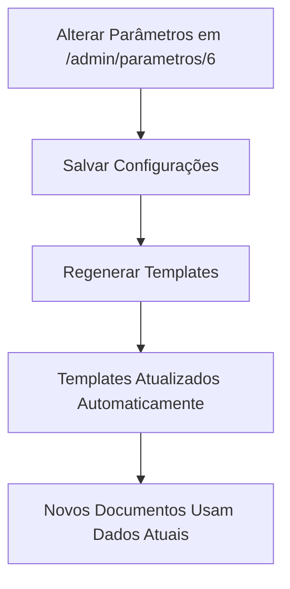

# 📋 Parâmetros Dinâmicos da Câmara Municipal

## 🎯 Objetivo

O submódulo **"Dados Gerais da Câmara"** centraliza todas as informações institucionais em `/admin/parametros/6`, permitindo que os templates sejam automaticamente atualizados sempre que necessário.

---

## 🏛️ Parâmetros Disponíveis

### 🏢 **Identificação**
| Campo | Variável | Descrição | Exemplo |
|-------|----------|-----------|---------|
| **Nome Oficial** | `${nome_camara}` | Nome completo oficial | CÂMARA MUNICIPAL DE SÃO PAULO |
| **Nome Abreviado** | `${nome_camara_abreviado}` | Sigla ou abreviação | CMSP |
| **Município** | `${municipio}` | Nome do município | São Paulo |
| **UF** | `${municipio_uf}` | Estado | SP |

### 📍 **Endereço**
| Campo | Variável | Descrição | Exemplo |
|-------|----------|-----------|---------|
| **Logradouro** | `${endereco_camara}` | Rua, Avenida, Praça | Viaduto Jacareí, 100 |
| **Bairro** | `${endereco_bairro}` | Bairro | Centro |
| **CEP** | `${endereco_cep}` | Código postal | 01008-902 |
| **Endereço Completo** | `${endereco_completo}` | Logradouro + Bairro + CEP | Viaduto Jacareí, 100, Centro - CEP: 01008-902 |

### 📞 **Contatos**
| Campo | Variável | Descrição | Exemplo |
|-------|----------|-----------|---------|
| **Telefone Principal** | `${telefone_camara}` | Telefone geral | (11) 3396-4000 |
| **Telefone Protocolo** | `${telefone_protocolo}` | Telefone específico do protocolo | (11) 3396-4050 |
| **E-mail Oficial** | `${email_camara}` | E-mail institucional | atendimento@camara.sp.gov.br |
| **Website** | `${website_camara}` | Site oficial | www.saopaulo.sp.leg.br |

### 🏛️ **Dados Administrativos**
| Campo | Variável | Descrição | Exemplo |
|-------|----------|-----------|---------|
| **CNPJ** | `${cnpj_camara}` | CNPJ da instituição | 12.345.678/0001-90 |
| **Nome Presidente** | `${presidente_nome}` | Nome completo do Presidente | João Silva Santos |
| **Tratamento Presidente** | `${presidente_tratamento}` | Forma de tratamento | Excelentíssimo Senhor |

### 🕐 **Horários**
| Campo | Variável | Descrição | Exemplo |
|-------|----------|-----------|---------|
| **Funcionamento** | `${horario_funcionamento}` | Horário geral | Segunda a Sexta: 8h às 17h |
| **Protocolo** | `${horario_protocolo}` | Horário específico | Segunda a Sexta: 9h às 16h |

---

## 🔧 **Como Configurar**

### 📱 **Via Interface Web**
1. Acesse `/admin/parametros/6`
2. Localize o card **"Dados Gerais da Câmara"**
3. Preencha os campos desejados
4. Clique em **"Salvar"**
5. Execute **"Regenerar Todos"** na interface de templates

### 💻 **Via Linha de Comando**

#### **Configuração Rápida**
```bash
php artisan camara:configurar-dados \
  --nome="CÂMARA MUNICIPAL DE SANTOS" \
  --municipio="Santos" \
  --uf="SP" \
  --endereco="Praça Mauá, 39" \
  --telefone="(13) 3219-5555" \
  --email="contato@santos.sp.leg.br" \
  --website="www.santos.sp.leg.br"
```

#### **Configuração Interativa**
```bash
php artisan camara:configurar-dados --interactive
```

#### **Aplicar aos Templates**
```bash
php artisan templates:aplicar-padroes-legais --force
```

---

## 📄 **Uso nos Templates**

### **Exemplo de Template RTF**
```rtf
{\rtf1\ansi\ansicpg65001\deff0 {\fonttbl {\f0 Arial;}}
\f0\fs24

${nome_camara}
${endereco_completo}
Telefone: ${telefone_camara}
E-mail: ${email_camara}
Website: ${website_camara}

PROJETO DE LEI Nº ${numero_proposicao}/${ano}

Dispõe sobre ${ementa} no âmbito do Município de ${municipio}-${municipio_uf}.

A CÂMARA MUNICIPAL DE ${municipio} DECRETA:

Art. 1º ${texto}.

Art. 2º Esta lei entra em vigor na data de sua publicação.

${municipio}, ${data_atual}.

${assinatura_padrao}
}
```

### **Resultado Após Processamento**
```
CÂMARA MUNICIPAL DE SÃO PAULO
Viaduto Jacareí, 100, Centro - CEP: 01008-902
Telefone: (11) 3396-4000
E-mail: atendimento@saopaulo.sp.leg.br
Website: www.saopaulo.sp.leg.br

PROJETO DE LEI Nº 001/2025

Dispõe sobre regulamentação do comércio ambulante no âmbito do Município de São Paulo-SP.

A CÂMARA MUNICIPAL DE São Paulo DECRETA:

Art. 1º Fica regulamentado o comércio ambulante no município.

Art. 2º Esta lei entra em vigor na data de sua publicação.

São Paulo, 06/08/2025.

[Área de Assinatura]
```

---

## ⚡ **Benefícios**

### ✅ **Centralização**
- Todos os dados da Câmara em um só lugar
- Mudanças refletem automaticamente em todos os templates

### ✅ **Flexibilidade**  
- Configuração via interface web ou linha de comando
- Suporte a diferentes formatos (completo, abreviado, etc.)

### ✅ **Padronização**
- Garantia de consistência em todos os documentos
- Conformidade com LC 95/1998 e padrões legais

### ✅ **Manutenibilidade**
- Atualização fácil quando houver mudanças administrativas
- Versionamento automático de alterações

---

## 🔄 **Fluxo de Atualização**



---

## 📚 **Comandos Úteis**

```bash
# Ver status dos parâmetros
php artisan tinker
>>> App\Services\Template\TemplateParametrosService::class
>>> $service = app('App\Services\Template\TemplateParametrosService');
>>> $service->obterParametrosTemplates();

# Limpar cache de parâmetros
php artisan cache:forget parametros.templates

# Listar variáveis disponíveis
php artisan tinker
>>> $service->obterVariaveisDisponiveis();

# Regenerar todos os templates
php artisan templates:aplicar-padroes-legais --force
```

---

## 🆘 **Suporte**

### **Problemas Comuns**
1. **Templates não atualizados**: Execute `php artisan templates:aplicar-padroes-legais --force`
2. **Parâmetros não carregados**: Verifique cache com `php artisan cache:clear`
3. **Variáveis não substituídas**: Confirme que a sintaxe é `${variavel}` (com chaves)

### **Logs de Debug**
```bash
tail -f /home/bruno/legisinc/storage/logs/laravel.log | grep -E "parametros|template"
```

---

**Última atualização**: 06/08/2025  
**Versão**: 2.0  
**Compatibilidade**: LC 95/1998, UTF-8, OnlyOffice