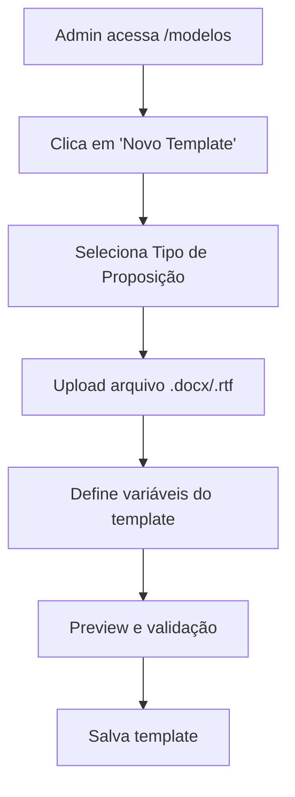
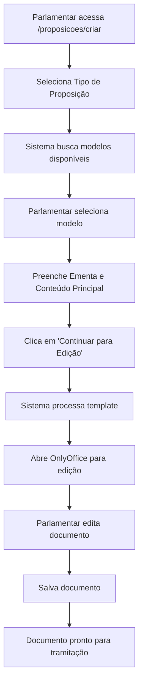
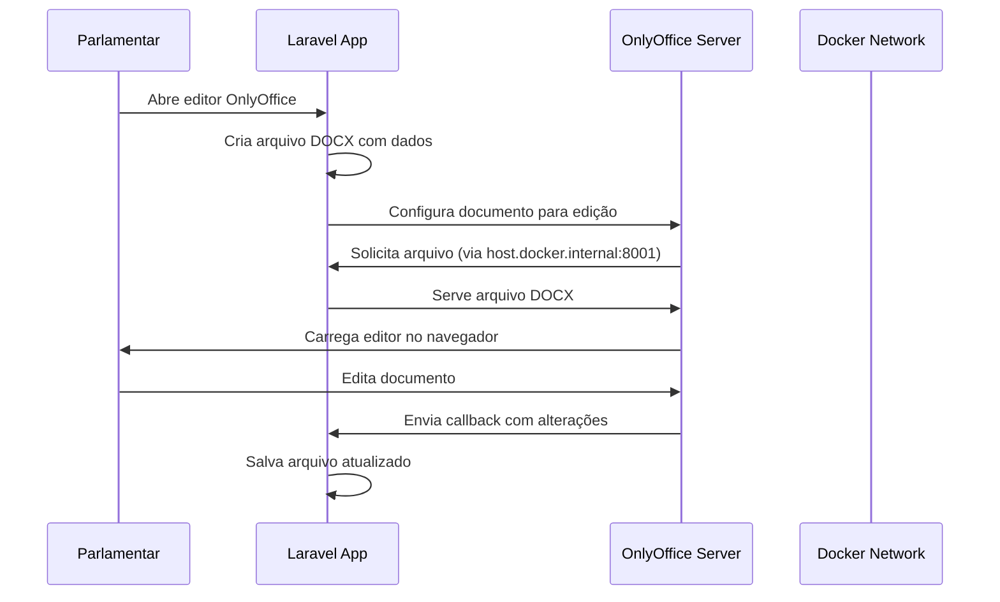

# Sistema de Templates e Proposições - LegisInc

## Visão Geral

Este documento descreve o fluxo completo do sistema de templates para proposições legislativas, desde a criação do template pelo administrador até a criação e edição da proposição pelo parlamentar usando OnlyOffice.

## 🔧 Arquitetura do Sistema

### Principais Componentes:
- **Templates**: Modelos criados pelo administrador
- **Tipos de Proposição**: Categorias de documentos legislativos
- **Proposições**: Documentos criados pelos parlamentares
- **OnlyOffice**: Editor de documentos integrado
- **TemplateProcessorService**: Serviço de processamento de variáveis

---

## 🏗️ Fase 1: Criação do Template (Administrador)

### 1.1 Acesso ao Sistema
- **Perfil**: Administrador
- **Rota**: `/admin/templates` ou `/modelos`
- **Permissões**: `documentos.create`, `documentos.edit`

### 1.2 Processo de Criação



### 1.3 Estrutura do Template

**Arquivo físico**: 
- Formato: `.docx` ou `.rtf`
- Local: `storage/app/public/templates/`
- Variáveis: `{nome_variavel}` no documento

**Variáveis Disponíveis**:

#### Variáveis do Sistema (automáticas):
- `{data}` - Data atual
- `{nome_parlamentar}` - Nome do parlamentar logado
- `{cargo_parlamentar}` - Cargo do parlamentar
- `{email_parlamentar}` - Email do parlamentar
- `{data_extenso}` - Data por extenso
- `{mes_atual}`, `{ano_atual}`, `{dia_atual}`, `{hora_atual}`
- `{numero_proposicao}` - Número da proposição
- `{tipo_proposicao}` - Tipo da proposição
- `{nome_municipio}`, `{nome_camara}`
- `{legislatura_atual}`, `{sessao_legislativa}`

#### Variáveis Editáveis (preenchidas pelo parlamentar):
- `{ementa}` - Ementa da proposição
- `{texto}` - Texto principal da proposição
- `{justificativa}` - Justificativa da proposição
- `{observacoes}` - Observações adicionais
- `{considerandos}` - Considerandos
- `{artigo_1}`, `{artigo_2}`, `{artigo_3}` - Artigos

### 1.4 Tabelas do Banco de Dados

**tipo_proposicao_templates**:
```sql
- id (Primary Key)
- nome (VARCHAR)
- descricao (TEXT)
- tipo_proposicao_id (Foreign Key)
- arquivo_path (VARCHAR)
- variaveis_template (JSON)
- ativo (BOOLEAN)
- created_at, updated_at
```

---

## 📋 Fase 2: Criação da Proposição (Parlamentar)

### 2.1 Acesso e Navegação
- **Perfil**: Parlamentar
- **Rota inicial**: `/proposicoes/criar`
- **Permissões**: `proposicoes.create`

### 2.2 Fluxo Completo do Parlamentar



### 2.3 Processo Detalhado

#### 2.3.1 Seleção do Tipo e Modelo

**Endpoint**: `GET /proposicoes/modelos/{tipo}`
```php
// ProposicaoController@buscarModelos
// Retorna apenas templates OnlyOffice + Template em Branco
$modelosArray = [
    [
        'id' => 'template_blank',
        'nome' => 'Documento em Branco',
        'descricao' => 'Criar proposição com template em branco',
        'is_template' => true,
        'template_id' => 'blank'
    ],
    // ... templates específicos do admin
];
```

#### 2.3.2 Preenchimento dos Campos

**Tela**: `/proposicoes/{id}/preencher-modelo/{modeloId}`
**Campos obrigatórios**:
- `conteudo_modelo[ementa]` - Ementa da proposição
- `conteudo_modelo[conteudo]` - Conteúdo principal

#### 2.3.3 Processamento do Template

**Endpoint**: `POST /proposicoes/{id}/gerar-texto`

```php
// Mapeamento de campos
$variaveisTemplate = $request->conteudo_modelo;
$variaveisTemplate['texto'] = $variaveisTemplate['conteudo'] ?? '';

// Para templates específicos
if ($template) {
    $templateProcessor = app(TemplateProcessorService::class);
    $textoGerado = $templateProcessor->processarTemplate(
        $template,
        $proposicao,
        $variaveisTemplate
    );
}

// Para template em branco
else {
    $textoGerado = $this->criarTextoBasico($proposicao, $variaveisTemplate);
}
```

#### 2.3.4 Abertura no OnlyOffice

**Rota**: `/proposicoes/{id}/editar-onlyoffice/{templateId}`

```php
// Criação do documento
$documentKey = 'proposicao_' . $proposicaoId . '_template_' . $templateId . '_' . time();
$arquivoProposicaoPath = $this->criarArquivoProposicao($proposicaoId, $template);

// Configuração OnlyOffice
$config = [
    "document" => [
        "fileType" => "docx",
        "key" => $documentKey,
        "url" => "http://host.docker.internal:8001/onlyoffice/file/proposicao/{id}/{arquivo}",
    ],
    "editorConfig" => [
        "callbackUrl" => "http://host.docker.internal:8001/api/onlyoffice/callback/proposicao/{id}",
        "mode" => "edit",
        "lang" => "pt-BR"
    ]
];
```

---

## 🔄 Fase 3: Integração OnlyOffice

### 3.1 Arquitetura de Comunicação



### 3.2 Rotas Específicas OnlyOffice

```php
// Servir arquivos (sem autenticação - OnlyOffice precisa de acesso direto)
Route::get('/onlyoffice/file/proposicao/{proposicao}/{arquivo}', 
    [ProposicaoController::class, 'serveFile']
)->name('onlyoffice.file.proposicao');

// Callback para salvar alterações (API routes - sem CSRF)
Route::post('/api/onlyoffice/callback/proposicao/{proposicao}', 
    [ProposicaoController::class, 'onlyOfficeCallback']
)->name('api.onlyoffice.callback.proposicao');
```

### 3.3 Processamento de Callbacks

```php
// Status do OnlyOffice
// 1 = Documento sendo editado
// 2 = Documento pronto para salvar
// 4 = Documento fechado sem alterações
// 6 = Documento sendo editado com co-edição

if ($status == 2) {
    // Download do arquivo atualizado
    $url = str_replace('http://localhost:8080', 'http://172.24.0.3', $data['url']);
    $fileContent = curl_exec($ch);
    
    // Salvar arquivo atualizado
    Storage::disk('public')->put($pathDestino, $fileContent);
    
    // Atualizar registro da proposição
    $proposicao->update([
        'arquivo_path' => $pathDestino,
        'ultima_modificacao' => now(),
        'status' => 'em_edicao'
    ]);
}
```

---

## 📊 Fase 4: Estados e Gerenciamento

### 4.1 Estados da Proposição

| Status | Descrição | Ações Permitidas |
|--------|-----------|------------------|
| `rascunho` | Proposição criada, não processada | Editar, Excluir, Processar |
| `em_edicao` | Proposição processada, sendo editada | Editar OnlyOffice, Excluir, Enviar |
| `enviado_legislativo` | Enviada para análise | Visualizar |
| `retornado_legislativo` | Retornada com observações | Assinar |
| `assinado` | Assinada digitalmente | Protocolar |
| `protocolado` | Protocolada oficialmente | Visualizar |

### 4.2 Permissões de Exclusão

```php
// Método podeSerExcluida() no Model
public function podeSerExcluida(): bool
{
    return in_array($this->status, ['rascunho', 'em_edicao']);
}

// Controller - Verificação de exclusão
$statusPermitidos = ['rascunho', 'em_edicao'];
if (!in_array($proposicao->status, $statusPermitidos)) {
    return response()->json([
        'success' => false,
        'message' => 'Apenas rascunhos e proposições em edição podem ser excluídas.'
    ], 400);
}
```

---

## 🗂️ Estrutura de Arquivos

### Arquivos de Template
```
storage/app/public/
├── templates/
│   ├── template_1.docx
│   ├── template_2.rtf
│   └── ...
└── proposicoes/
    ├── proposicao_1_template_5.docx
    ├── proposicao_2_template_blank.docx
    └── ...
```

### Controllers Principais
- `ProposicaoController.php` - Gestão de proposições
- `DocumentoModeloController.php` - Gestão de templates
- `OnlyOfficeController.php` - Integração OnlyOffice

### Services
- `TemplateProcessorService.php` - Processamento de variáveis
- `DocumentoModeloService.php` - Gestão de modelos

### Views Principais
- `proposicoes/create.blade.php` - Criação inicial
- `proposicoes/preencher-modelo.blade.php` - Preenchimento
- `proposicoes/preparar-edicao.blade.php` - Tela intermediária
- `proposicoes/editar-onlyoffice.blade.php` - Editor OnlyOffice

---

## 🔧 Configuração Técnica

### Variáveis de Ambiente (.env)
```env
# OnlyOffice Configuration
ONLYOFFICE_SERVER_URL=http://localhost:8080
ONLYOFFICE_JWT_SECRET=
ONLYOFFICE_STORAGE_PATH=/storage/onlyoffice
ONLYOFFICE_CALLBACK_URL=http://host.docker.internal:8001/api/onlyoffice/callback
```

### Docker Network
- **Laravel App**: `host.docker.internal:8001`
- **OnlyOffice Server**: `localhost:8080`
- **Comunicação**: Container-to-host via `host.docker.internal`

### Backup e Fallback
- **Banco de Dados**: Primário para persistência
- **Sessão**: Fallback em caso de problemas de conexão
- **Arquivos**: Storage local com cleanup automático

---

## 📈 Logs e Monitoramento

### Eventos Logados
```php
// Criação de proposição
\Log::info('Texto gerado para proposição', [
    'proposicao_id' => $proposicaoId,
    'modelo_id' => $modeloId,
    'is_template' => $isTemplate,
    'user_id' => Auth::id()
]);

// OnlyOffice
\Log::info('Abrindo proposição no OnlyOffice', [
    'proposicao_id' => $proposicaoId,
    'template_id' => $templateId,
    'document_key' => $documentKey
]);

// Callbacks
\Log::info('OnlyOffice callback recebido', [
    'proposicao_id' => $proposicaoId,
    'callback_data' => $data
]);

// Exclusões
\Log::info('Proposição excluída', [
    'proposicao_id' => $proposicaoId,
    'user_id' => Auth::id(),
    'method' => $method // 'database_deletion' ou 'session_cleanup'
]);
```

---

## 🚀 Melhorias Implementadas

### 1. Sistema Unificado OnlyOffice
- ✅ Removido editor simples
- ✅ Todas as proposições usam OnlyOffice
- ✅ Template em branco para flexibilidade

### 2. Mapeamento de Campos
- ✅ Formulário: `conteudo_modelo[conteudo]`
- ✅ Template: `{texto}`
- ✅ Mapeamento automático no controller

### 3. Conectividade Docker
- ✅ URLs corretas para container-to-host
- ✅ Callbacks funcionando via API routes
- ✅ Bypass CSRF para OnlyOffice

### 4. Gestão de Estados
- ✅ Exclusão permitida para `rascunho` e `em_edicao`
- ✅ Fallback para problemas de conexão BD
- ✅ Cleanup automático de arquivos

---

## 📋 Fluxo Resumido

1. **Admin**: Cria template com variáveis `{ementa}`, `{texto}`, etc.
2. **Parlamentar**: Seleciona tipo → modelo → preenche dados
3. **Sistema**: Processa template substituindo variáveis
4. **OnlyOffice**: Abre documento processado para edição
5. **Callbacks**: Salvam alterações automaticamente
6. **Resultado**: Documento editável pronto para tramitação

Este sistema garante flexibilidade, padronização e facilidade de uso tanto para administradores quanto para parlamentares.