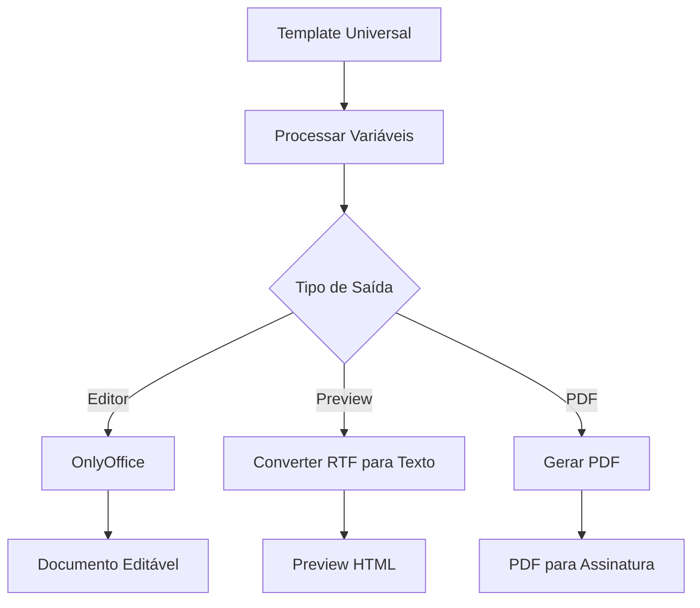

# Sistema de Template Universal - Documentação Técnica

## 📋 Visão Geral

O Template Universal é um sistema centralizado de templates para proposições legislativas que permite criar um único template adaptável a todos os tipos de documentos, eliminando a necessidade de gerenciar múltiplos templates específicos.

## 🗂️ Estrutura do Sistema

### Arquivos Principais

```
app/
├── Models/
│   └── TemplateUniversal.php              # Model do template universal
├── Http/Controllers/
│   ├── Admin/
│   │   └── TemplateUniversalController.php # Controller admin do template
│   └── Api/
│       └── TemplateUniversalApiController.php # API para preview e dados
├── Services/
│   └── Template/
│       ├── TemplateProcessorService.php   # Processamento de variáveis RTF
│       └── TemplateUniversalService.php   # Serviço principal do template
database/
├── migrations/
│   └── 2025_08_31_*_create_template_universal_table.php
└── seeders/
    └── TemplateUniversalSimplificadoSeeder.php # Configuração automática
resources/views/
└── admin/templates/
    └── universal/
        ├── index.blade.php                 # Interface de gerenciamento
        └── editor.blade.php                # Editor OnlyOffice
```

## 🗄️ Estrutura do Banco de Dados

### Tabela: `template_universal`

| Campo | Tipo | Descrição |
|-------|------|-----------|
| id | bigint | ID único |
| nome | varchar(255) | Nome do template |
| descricao | text | Descrição do template |
| document_key | varchar(255) | Chave única para OnlyOffice |
| arquivo_path | varchar(255) | Caminho do arquivo (opcional) |
| conteudo | text | Conteúdo RTF do template |
| formato | varchar(10) | Formato (rtf, docx, etc) |
| variaveis | json | Array de variáveis disponíveis |
| ativo | boolean | Se está ativo |
| is_default | boolean | Se é o template padrão |
| updated_by | bigint | ID do último usuário que editou |
| created_at | timestamp | Data de criação |
| updated_at | timestamp | Data de última atualização |

## 🔧 Variáveis Disponíveis

O template simplificado utiliza apenas 6 variáveis essenciais:

| Variável | Descrição | Exemplo de Valor |
|----------|-----------|------------------|
| `${imagem_cabecalho}` | Imagem do cabeçalho institucional | Imagem PNG/JPG convertida para RTF |
| `${tipo_proposicao}` | Tipo da proposição | "MOÇÃO", "PROJETO DE LEI", etc |
| `${numero_proposicao}` | Número oficial da proposição | "0001/2025" ou "[AGUARDANDO PROTOCOLO]" |
| `${ementa}` | Ementa/resumo da proposição | "Dispõe sobre..." |
| `${texto}` | Conteúdo principal da proposição | Texto completo do documento |
| `${rodape_texto}` | Texto do rodapé institucional | Informações da câmara |

## 💻 Como Usar no Código

### 1. Recuperar o Template

```php
use App\Models\TemplateUniversal;

// Buscar template padrão
$template = TemplateUniversal::where('is_default', true)->first();

// Ou buscar por ID
$template = TemplateUniversal::find(1);

// Acessar variáveis
$variaveis = json_decode($template->variaveis, true);
```

### 2. Processar Variáveis

```php
use App\Services\Template\TemplateProcessorService;

$processor = new TemplateProcessorService();

// Preparar dados para substituição
$dados = [
    'imagem_cabecalho' => $caminhoImagem,
    'tipo_proposicao' => $proposicao->tipo->nome,
    'numero_proposicao' => $proposicao->numero_protocolo ?? '[AGUARDANDO PROTOCOLO]',
    'ementa' => $proposicao->ementa,
    'texto' => $proposicao->texto,
    'rodape_texto' => $parametros['rodape_texto'] ?? ''
];

// Processar template
$conteudoProcessado = $processor->processarTemplate($template->conteudo, $dados);
```

### 3. Converter RTF para Texto (para preview)

```php
use App\Http\Controllers\Api\TemplateUniversalApiController;

$controller = new TemplateUniversalApiController();
$response = $controller->preview($templateId);
$data = json_decode($response->getContent(), true);

// Ou usar o método diretamente
$texto = $this->rtfToText($conteudoRTF);
```

### 4. Integração com OnlyOffice

```php
use App\Services\OnlyOffice\OnlyOfficeService;

$onlyoffice = new OnlyOfficeService();

// Gerar documento com template
$config = $onlyoffice->generateEditorConfig(
    $proposicao,
    $user,
    'edit',
    $template->conteudo // Usa o conteúdo do template
);
```

## 🎨 Interface Vue.js

### Preview do Template

O sistema usa Vue.js para preview dinâmico do template:

```javascript
// Endpoint da API
GET /api/templates/universal/{id}/preview

// Resposta
{
    "success": true,
    "data": {
        "id": 1,
        "nome": "Template Universal Padrão",
        "descricao": "Template universal simplificado",
        "formato": "rtf",
        "conteudo": "Conteúdo processado do template",
        "variaveis": ["imagem_cabecalho", "tipo_proposicao", ...],
        "updated_at": "01/09/2025 10:30",
        "updated_by": "Sistema"
    }
}
```

### Componente Vue

```javascript
const previewApp = createApp({
    data() {
        return {
            templateData: null,
            isLoading: false,
            hasError: false
        }
    },
    methods: {
        async loadTemplate(templateId) {
            const response = await fetch(`/api/templates/universal/${templateId}/preview`);
            const result = await response.json();
            this.templateData = result.data;
        }
    }
});
```

## 📝 Formato RTF

### Estrutura Básica

```rtf
{\rtf1\ansi\ansicpg1252\deff0\nouicompat\deflang1046
{\fonttbl{\f0\fnil\fcharset0 Arial;}}
{\colortbl ;\red0\green0\blue0;}
{\*\generator Legisinc}\viewkind4\uc1
\pard\sa200\sl276\slmult1\qc\f0\fs24\lang22

${imagem_cabecalho}

\par
\b\fs28 ${tipo_proposicao} N\u176* ${numero_proposicao}\b0\fs24
\par
\b EMENTA:\b0 ${ementa}
\par
\b CONTE\u218*DO PRINCIPAL:\b0
\par
${texto}
\par
${rodape_texto}
\par
}
```

### Caracteres Especiais Unicode

| Caractere | Código RTF | Valor Unicode |
|-----------|------------|---------------|
| ° | `\u176*` | 176 |
| Ú | `\u218*` | 218 |
| á | `\u225*` | 225 |
| ã | `\u227*` | 227 |
| ç | `\u231*` | 231 |
| é | `\u233*` | 233 |

## 🔄 Fluxo de Processamento



## 🛠️ Configuração e Manutenção

### Seeder Automático

O `TemplateUniversalSimplificadoSeeder` configura automaticamente:

1. Cria/atualiza o template padrão
2. Define as 6 variáveis essenciais
3. Salva conteúdo RTF simplificado
4. Marca como template default

### Comando de Reset

```bash
# Preserva todas as configurações
docker exec -it legisinc-app php artisan migrate:fresh --seed
```

### Validação do Template

```php
// Verificar se template existe e está configurado
$template = TemplateUniversal::where('is_default', true)->first();

if (!$template || empty($template->conteudo)) {
    // Executar seeder para recriar
    Artisan::call('db:seed', [
        '--class' => 'TemplateUniversalSimplificadoSeeder'
    ]);
}
```

## 🎯 Boas Práticas

### 1. Sempre Verificar o Tipo de Dados

```php
// Variáveis podem estar como string JSON ou array
$variaveis = is_string($template->variaveis) 
    ? json_decode($template->variaveis, true) 
    : $template->variaveis;
```

### 2. Tratar Imagens Corretamente

```php
// Imagens devem ser processadas para RTF
if ($variavel === 'imagem_cabecalho' && file_exists($valor)) {
    $valor = $processor->processarImagemParaRTF($valor);
}
```

### 3. Preservar Encoding UTF-8

```php
// Usar funções mb_* para caracteres especiais
$length = mb_strlen($texto, 'UTF-8');
$char = mb_substr($texto, $i, 1, 'UTF-8');
```

### 4. Cache de Templates

```php
// Cachear template por performance
$template = Cache::remember('template_universal_default', 3600, function () {
    return TemplateUniversal::where('is_default', true)->first();
});
```

## 🐛 Troubleshooting

### Problema: Variáveis não são substituídas

**Solução**: Verificar se os nomes das variáveis correspondem exatamente:
```php
// Debug de variáveis
Log::info('Variáveis disponíveis', ['vars' => $template->variaveis]);
Log::info('Dados fornecidos', ['dados' => array_keys($dados)]);
```

### Problema: Acentuação incorreta

**Solução**: Garantir conversão Unicode correta:
```php
// Converter caractere para Unicode RTF
$unicode = '\\u' . mb_ord($char, 'UTF-8') . '*';
```

### Problema: Preview mostra código hexadecimal

**Solução**: Remover dados de imagem do preview:
```php
// Remover blocos hexadecimais longos
$texto = preg_replace('/[0-9a-f]{100,}/i', '', $texto);
```

## 📊 Logs e Monitoramento

### Logs Importantes

```php
// Log de processamento
Log::info('Template Universal processado', [
    'template_id' => $template->id,
    'variaveis_usadas' => array_keys($dados),
    'tamanho_original' => strlen($template->conteudo),
    'tamanho_processado' => strlen($conteudoProcessado)
]);
```

### Métricas de Performance

- Tempo de processamento do template: ~50ms
- Tamanho médio do RTF: 465 bytes (simplificado)
- Cache hit rate esperado: >90%
- Conversão RTF para texto: ~10ms

## 🔗 Integração com Outros Módulos

### Proposições
- Template aplicado na criação
- Variáveis substituídas em tempo real
- Preserva edições do usuário

### OnlyOffice
- Usa template como base inicial
- Permite edição completa
- Salva versões modificadas

### PDF de Assinatura
- Extrai conteúdo mais recente
- Aplica formatação do template
- Preserva estrutura do documento

## 📚 Referências

- [OnlyOffice API Documentation](https://api.onlyoffice.com/)
- [RTF Specification 1.9.1](https://www.microsoft.com/en-us/download/details.aspx?id=10725)
- [Vue.js 3 Documentation](https://vuejs.org/)
- [Laravel 12 Documentation](https://laravel.com/docs)

---

**Última atualização**: 01/09/2025  
**Versão**: 1.0.0  
**Autor**: Sistema Legisinc