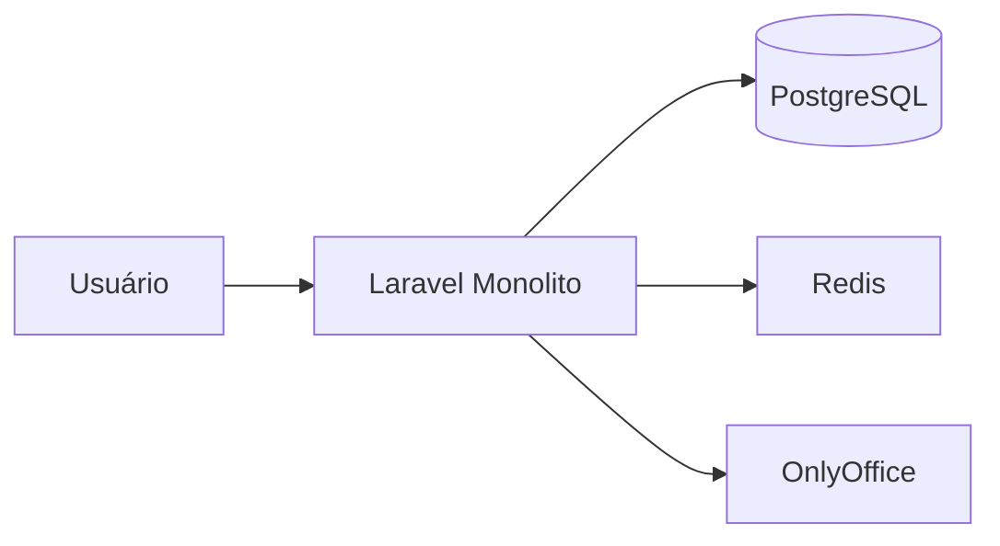
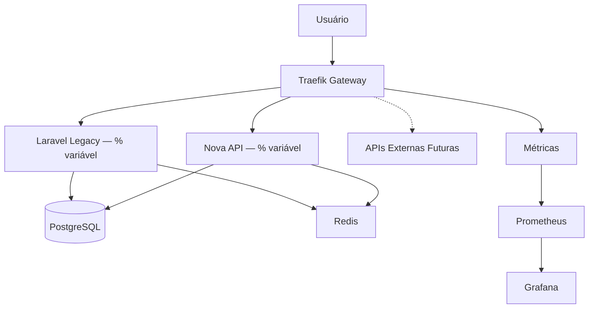

# 🏗️ Arquitetura Gateway — Explicação Completa

> **Para quem é este documento?**
> - **Gestores:** entender por que o Gateway traz segurança na evolução.
> - **Time Técnico:** como operar Shadow/Canary, integrar APIs externas e medir sucesso.

---

## 📌 Resumo Executivo

### O que mudou?
**Nada para o usuário final.** As mesmas URLs e experiência. Adicionamos um **API Gateway (Traefik)**, uma camada inteligente que recebe as requisições e decide, em tempo real, para qual backend encaminhar (Laravel atual, Nova API ou serviços externos).

### Por que mudamos?
- ✅ Evoluir **sem downtime** (deploy seguro e rollback instantâneo)
- ✅ **Testar em produção** com risco zero (Shadow) e risco controlado (Canary)
- ✅ **Integrar APIs externas** sem tocar no frontend
- ✅ **Observar** latência, erros e tráfego por endpoint (Prometheus/Grafana)
- ✅ **Escalar** apenas o que precisa (não o monolito inteiro)

---

## 🎯 Para Não-Técnicos — Entendendo a Mudança

### Analogia do Prédio
**Antes (sem recepção):**
Todo visitante ia direto ao 10º andar (Laravel). Sem controle, sem alternativas.

```
Visitante → Elevador → Escritório (única opção)
```

**Agora (com recepção inteligente):**
Há uma **Recepção (Gateway)** no térreo que direciona visitantes, registra entradas e oferece rotas alternativas.

- 🏢 **Recepcionista (Gateway)** direciona cada visita
- 📊 **Livro de visitas (Monitoramento)** registra tudo
- 🚪 **Múltiplas salas** (novos serviços) sem afetar o escritório
- 🔄 **Desvio** em caso de manutenção

```
Visitante → Recepção → Melhor caminho → Escritório
```

**Na prática:**
1) **Sem interrupções** — a "recepção" não impede o trabalho
2) **Mais opções** — adicionamos serviços sem mexer no existente
3) **Mais segurança** — controlamos quem acessa o quê
4) **Evolução gradual** — mudamos por partes, com métricas e rollback

---

## 🔧 Explicação Técnica

### Arquitetura Anterior (Monolítica)


**Limitações:**
- 🔴 Acoplamento forte frontend ↔ backend
- 🔴 Troca de tecnologia = refatoração pesada
- 🔴 Sem teste "real" de novas versões
- 🔴 Observabilidade limitada
- 🔴 Escala "tudo ou nada"

### Nova Arquitetura (com API Gateway)


**Capacidades técnicas:**
- ✅ **Roteamento inteligente** por path/header (ex.: `/api/proposicoes → Nova API`)
- ✅ **Shadow Traffic** (duplicação sem usar a resposta)
- ✅ **Canary Deployment** (tráfego ponderado por rota: 1%→100%)
- ✅ **Rate limit**, circuit breaker, timeouts e retries
- ✅ **Observabilidade**: RPS, p50/p95/p99, taxa de erro por endpoint

---

## 🚀 Implementação em Etapas (sem riscos)

### Etapa 1 — Gateway Transparente ✅ CONCLUÍDO
```yaml
# Tudo passa pelo Traefik, 100% ainda no Laravel
frontend:8001 → Traefik → Laravel (100%)
```
- **Risco**: zero • **Impacto**: nenhum • **Benefício**: base pronta (segurança + métricas)

### Etapa 2 — Shadow Traffic ✅ IMPLEMENTADO
```
Requisição real → Laravel (resposta do usuário)
             ↘︎  Nova API (teste silencioso — resposta ignorada)
```
- **Risco**: zero • **Impacto**: nenhum • **Benefício**: validação em tráfego real
- **Regra de ouro**: em Shadow, marque `X-Shadow-Mode: true` e não dispare side-effects (persistência, e-mail, fila).

### Etapa 3 — Canary Deployment ⚡ EM ANDAMENTO
```yaml
Traefik → 95% Laravel | 5% Nova API (exemplo)
```
- **Risco**: mínimo e controlado • **Benefício**: feedback real

**Guardrails (por endpoint):**
- **Promover**: erro ≤ 0,5% e p95 ≤ 200 ms por 2–4h
- **Congelar**: erro ∈ (0,5%, 1%) ou p95 > 200 ms por 15 min
- **Rollback**: erro > 1% ou p99 > 1 s por 5 min / incidente confirmado

### Etapa 4 — Migração Gradual 🔄 PRÓXIMO
```
Semana 1: 95/5 → Semana 2: 80/20 → Semana 3: 50/50 → Semana 4: 20/80 → Semana 5: 0/100
```
- **Ordem recomendada**: GET estáveis → POSTs de baixo impacto → PUT/PATCH → críticos (protocolar/assinar/publicar).

---

## 🔌 Integração com APIs Externas (plug-and-play)

### Exemplo — API de CEP

**Gateway (Traefik):**
```yaml
http:
  routers:
    cep-router:
      rule: "PathPrefix(`/api/cep`)"
      service: viacep-service
  services:
    viacep-service:
      loadBalancer:
        servers:
          - url: "https://viacep.com.br"
```

**Frontend (inalterado):**
```javascript
fetch('/api/cep/01310-100/json')
  .then(r => r.json())
  .then(console.log);
```

**Roteamento resultante:**
```
/api/cep          → ViaCEP (externo)
/api/users        → Laravel (legado)
/api/proposicoes  → Nova API
```

**Boas práticas de externos**: timeouts, retries idempotentes, cache, rate limit dedicado, mapeamento de erros e assinatura/HMAC em callbacks.

### Outros exemplos
- **OAuth**: `/auth/google`, `/auth/microsoft` → provedores; `/auth/local` → Laravel
- **IA**: `/api/ai/complete` → OpenAI; `/api/ai/analyze` → Anthropic
- **Pagamentos**: `/api/payment/stripe` → Stripe; `/api/payment/pagseguro` → PagSeguro

---

## 📊 Monitoramento e Observabilidade

### Performance
- Latência p50/p95/p99 por rota
- Taxa de erro por endpoint
- Throughput (RPS)

### Negócio
- Proposições (criadas/ativas) • Fila de OnlyOffice • Usuários ativos

### Saúde
- CPU/Memória por container • Queries lentas/conn DB • Redis hit rate

### Dashboards
1) **Overview** • 2) **Comparativo Legacy vs Nova API (Canary)** • 3) **PostgreSQL** • 4) **KPIs de negócio**

---

## 🛡️ Segurança

- **Rate Limiting** por IP/usuário/rota
- **WAF** (regras base contra SQLi/XSS)
- **Headers** (HSTS, X-Frame-Options, nosniff, CSP)
- **Auth centralizada** (SSO/OIDC pronto)
- **LGPD**: logs minimizados, pseudonimização de IDs em métricas, retenção definida
- **Callbacks externos** assinados (HMAC) e allow-list de destinos

---

## 💰 Benefícios para o Negócio (ROI)

1. **Zero downtime** em deploys + rollback imediato
2. **Time-to-market 3×** com trabalho paralelo (frontend/backend)
3. **Escala seletiva** → menos custo infra (estimativas internas)
4. **Integrações em horas** (gateway roteia, frontend não muda)

---

## 🔄 Processo de Migração por Endpoint (checklist)

1. **Escolher rota** (ex.: `GET /api/proposicoes`)
2. **Implementar na Nova API** com mesmo contrato
3. **Shadow 100%** + comparador JSON (ignore campos voláteis: `timestamp`, `request_id`)
4. **Canary 1–5%** → 10% → 25% → 50% → 75% → 100% (respeite guardrails)
5. **Observar 24–72h**; estável = concluído. Se não, rollback e corrigir.

### Exemplo de Nova API (FastAPI)
```python
@app.get("/api/proposicoes")
async def get_proposicoes():
    return {"success": True, "data": proposicoes, "meta": {"total": len(proposicoes)}}
```

---

## 📝 Casos de Uso

- **eSocial**: `/api/esocial/*` → API do governo (sem mexer no Laravel)
- **Busca elástica**: `/api/search/*` → ElasticSearch (100× mais rápido)
- **Relatórios pesados**: `/api/reports/*` → microserviço isolado
- **Parceiros**: `/external/v1/*` com quotas/rate limit específicos

---

## ❓ FAQ

**Vai quebrar produção?** Não. Começamos transparente; Shadow não afeta resposta; Canary limita impacto.

**Preciso mudar o frontend?** Não. As URLs permanecem; o Gateway decide o destino.

**Como debug com Gateway?** Distributed tracing (`request ID`/`traceparent`) + logs por hop.

**Fica mais lento?** O Gateway adiciona milissegundos; cache e balanceamento tendem a melhorar p95.

**E LGPD?** Logs sem dados sensíveis, retenção definida, auditoria e minimização por padrão.

---

## 🚦 Status

### ✅ Concluído
- [x] Traefik configurado
- [x] Shadow Traffic habilitado
- [x] Prometheus + Grafana
- [x] PostgreSQL Exporter
- [x] Comparador de respostas (baseline)

### 🔄 Em Andamento
- [ ] Canary 20% em `/api/proposicoes`
- [ ] Dashboard de migração por rota

### 📅 Próximos Passos
- [ ] Migrar `GET /api/users`
- [ ] Rate limiting por rota
- [ ] Regras WAF base
- [ ] Circuit breaker nas rotas críticas

---

## 📚 Referências Internas

- [Guia de Configuração do Gateway](/docs/gateway-config.md)
- [Troubleshooting](/docs/troubleshooting.md)
- [Playbook de Incidentes](/docs/incident-playbook.md)

**Ferramentas**: Grafana (:3000), Prometheus (:9090), Traefik (:8080), Canary Monitor (:3003)

---

## 💡 Conclusão

> **Adoção de API Gateway é evolução controlada**: reformamos a casa morando nela — um cômodo por vez, com métricas, rollback e transparência.

### Princípios
1) **Não quebrar nada existente** • 2) **Testes em produção com segurança**
3) **Migração gradual com métricas** • 4) **Rollback sempre disponível**
5) **Transparência total**

### Resultado
**Flexível** • **Resiliente** • **Observável** • **Escalável** • **Econômico**

---

*Última atualização: {{ now() }}*
*Versão do documento: 2.0*
*Responsável: Equipe DevOps LegisInc*