# Arquitetura Gateway - Visualização Completa

## 🏗️ Estrutura Atual do Projeto

### Arquitetura Geral dos Containers

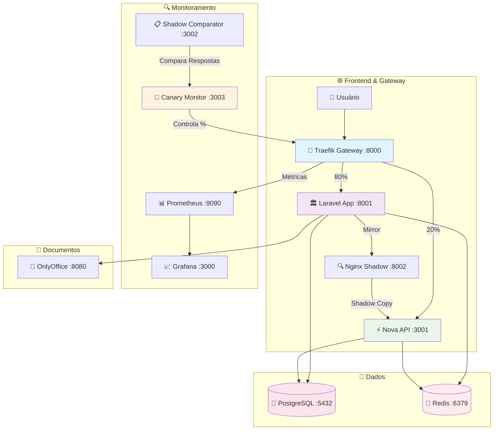

### Detalhamento dos Serviços

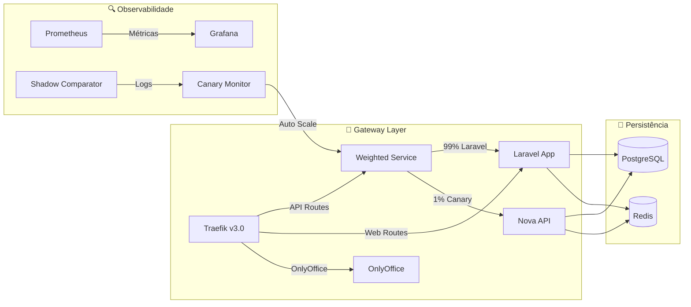

## 🔄 Fluxo de Requisições

### 1. Rota Normal (Web)

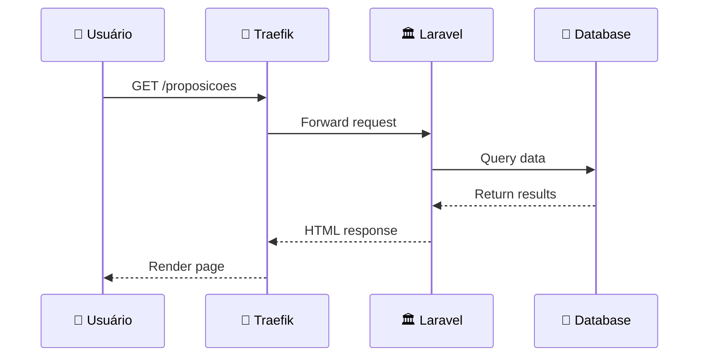

### 2. Rota API com Canary

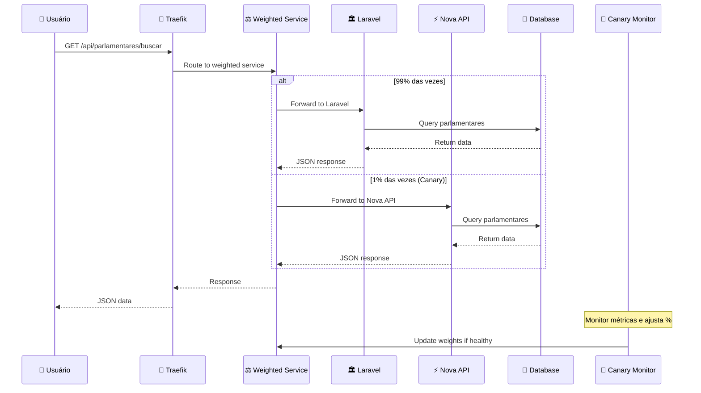

### 3. Shadow Traffic (Teste Paralelo)

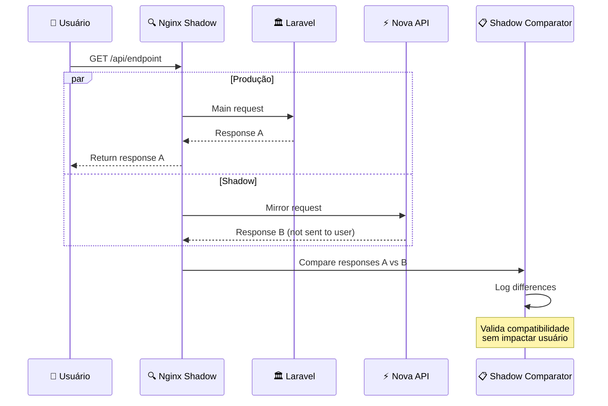

## 🚀 Processo de Migration Backend

### Etapa 1: Gateway Setup

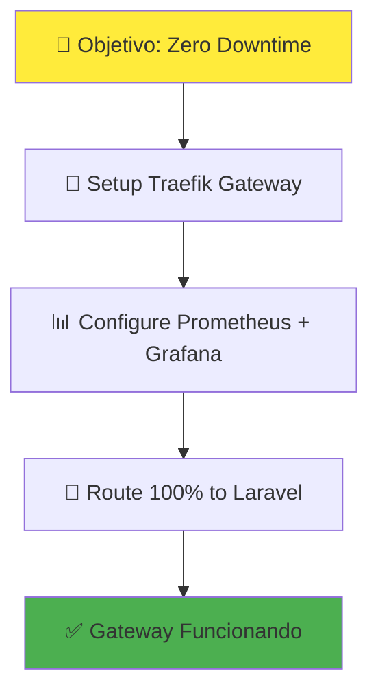

### Etapa 2: Shadow Traffic

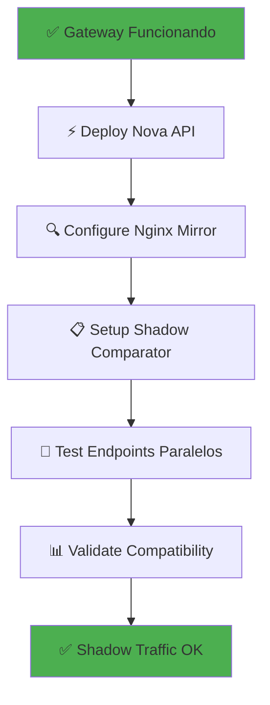

### Etapa 3: Canary Deployment

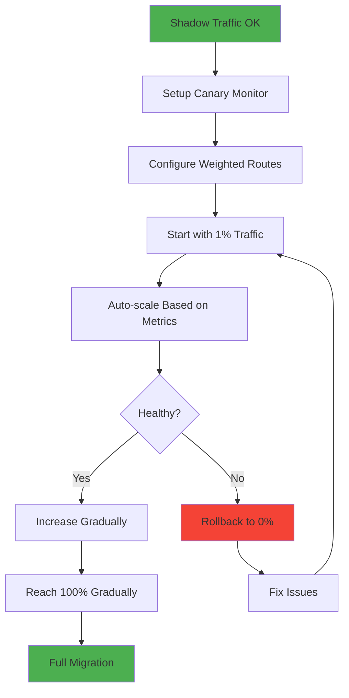

### Etapa 4: Full Replacement

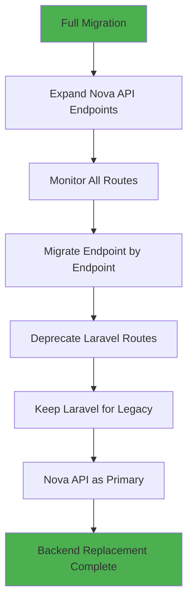

## 📊 Estados dos Containers

### Desenvolvimento Atual

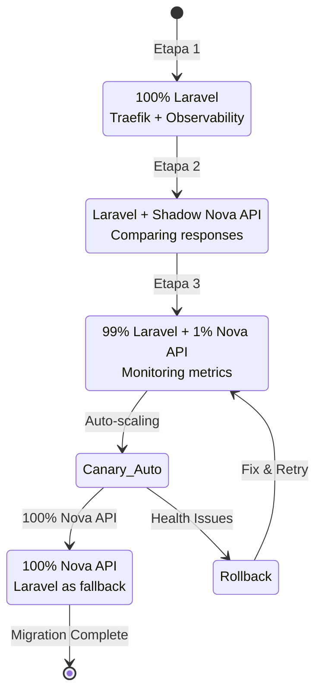

## 🔧 Como Trocar Backend: Exemplo Prático

### Adicionando Novo Endpoint

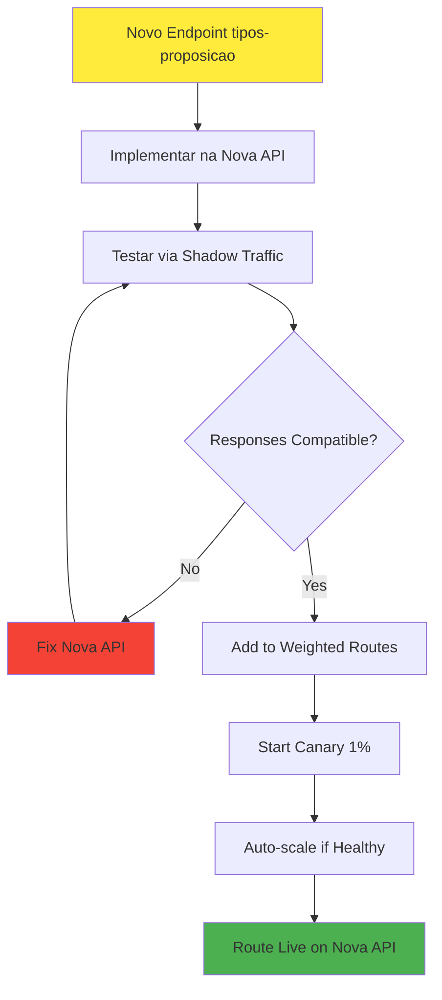

### Configuração Step-by-Step

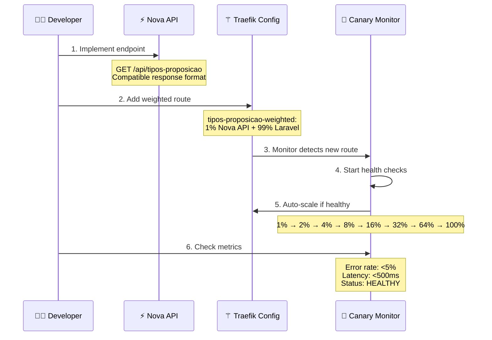

## 🔍 Monitoramento em Tempo Real

### Dashboard de Métricas

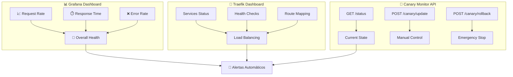

### Endpoints de Controle

| Endpoint | Método | Descrição |
|----------|--------|-----------|
| `http://localhost:3003/status` | GET | Status atual do canary |
| `http://localhost:3003/metrics/history` | GET | Histórico de métricas |
| `http://localhost:3003/canary/update` | POST | Controle manual do % |
| `http://localhost:3003/canary/rollback` | POST | Rollback de emergência |
| `http://localhost:8090/dashboard/` | GET | Dashboard Traefik |
| `http://localhost:3000` | GET | Grafana (admin/admin) |

## 🛡️ Rollback e Segurança

### Estratégias de Rollback

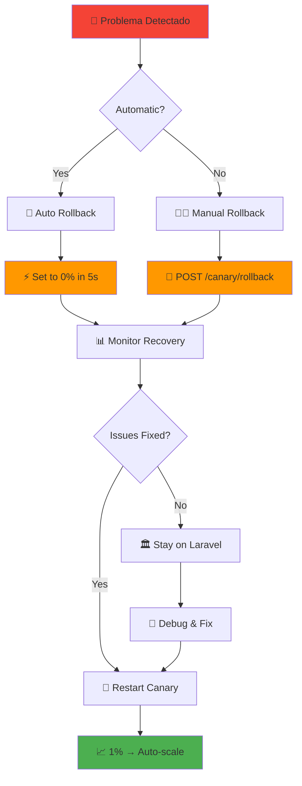

### Triggers de Rollback Automático

- **Error Rate > 5%**: Muitos erros 500/400
- **Latency > 500ms**: Resposta muito lenta
- **Health Check Fail**: Endpoint /health retorna erro
- **Manual Trigger**: Desenvolvedor força rollback

## 🎯 Benefícios da Arquitetura

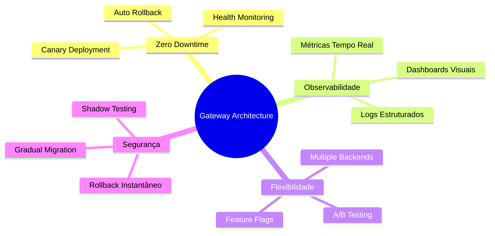

---

**📝 Documentação Técnica**: LegisInc v2 Gateway
**📅 Data**: 2025-09-17
**🏗️ Status**: ✅ Implementado e Funcionando
**🔄 Versão**: 1.0

---

> **💡 Esta arquitetura permite migration de backend sem risco, com observabilidade completa e rollback automático!**