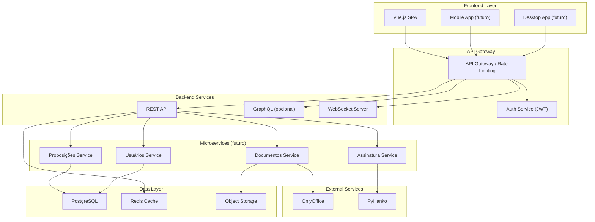
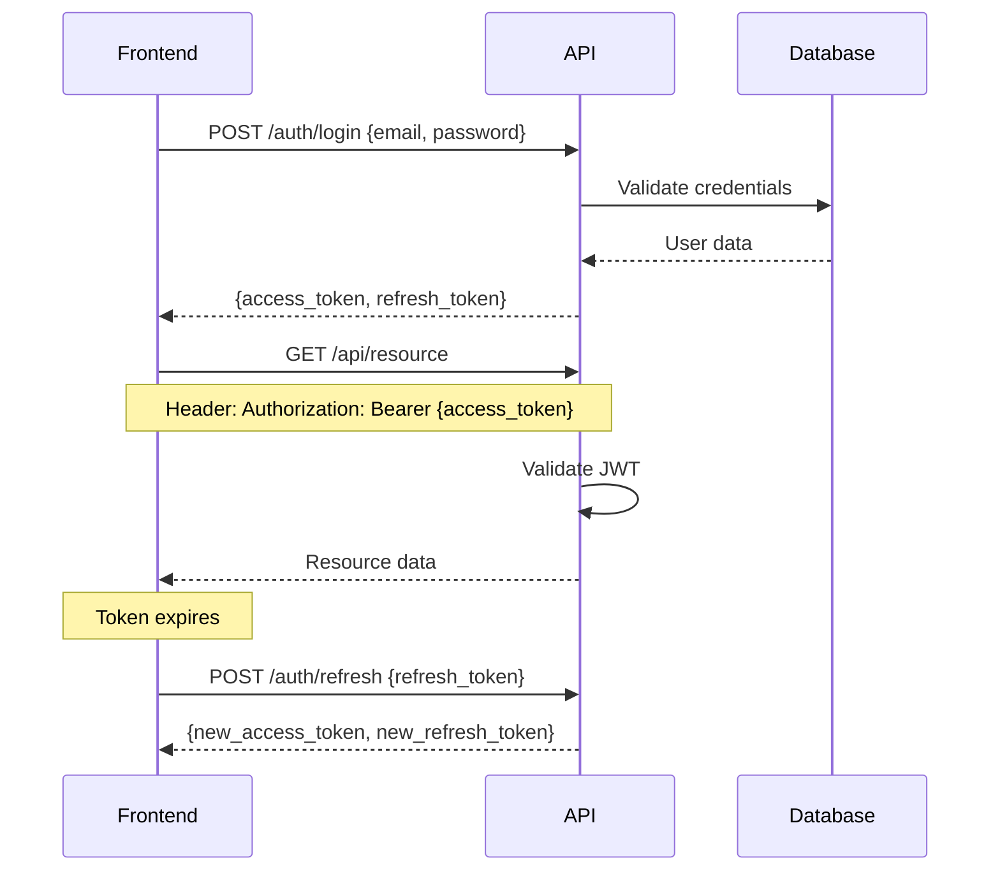

# Plano de Arquitetura: Separação Backend/Frontend - LegisInc

## 📋 Sumário Executivo

Este documento detalha o plano para transformar o LegisInc de uma aplicação monolítica Laravel para uma arquitetura completamente desacoplada, com backend API-first e frontend independente. Esta separação permitirá substituir ou reimplementar o backend sem impactar o frontend.

## 🎯 Objetivos

### Objetivos Primários
- **Desacoplamento Total:** Frontend e backend como aplicações independentes
- **API-First:** Toda comunicação via APIs REST/GraphQL padronizadas
- **Flexibilidade Tecnológica:** Possibilidade de substituir backend sem afetar frontend
- **Escalabilidade:** Permitir deploy independente de cada camada

### Benefícios Esperados
- Desenvolvimento paralelo de equipes frontend/backend
- Facilidade para testes automatizados
- Possibilidade de múltiplos clientes (web, mobile, desktop)
- Manutenção simplificada
- Deploy independente

## 🏗️ Arquitetura Proposta

### Visão Geral



### Stack Tecnológico Proposto

#### Frontend
- **Framework:** Vue.js 3 (Composition API)
- **State Management:** Pinia
- **Routing:** Vue Router
- **HTTP Client:** Axios com interceptors
- **Build Tool:** Vite
- **UI Components:** PrimeVue ou Vuetify
- **CSS:** Tailwind CSS
- **TypeScript:** Para type safety

#### Backend API
- **Fase 1:** Laravel API Resources (migração gradual)
- **Fase 2 (opcional):** Node.js/Express, Python/FastAPI, ou Go/Gin
- **API Spec:** OpenAPI 3.0 (Swagger)
- **Autenticação:** JWT com refresh tokens
- **Versionamento:** Semantic versioning (v1, v2, etc.)

## 📡 Especificação das APIs

### 1. Padrões REST

#### Estrutura de Endpoints

```
BASE_URL: https://api.legisinc.gov.br/v1

# Recursos principais
GET    /proposicoes              # Listar proposições
POST   /proposicoes              # Criar proposição
GET    /proposicoes/{id}         # Obter proposição
PUT    /proposicoes/{id}         # Atualizar proposição
DELETE /proposicoes/{id}         # Deletar proposição

GET    /proposicoes/{id}/documento     # Obter documento
POST   /proposicoes/{id}/assinar       # Assinar digitalmente
POST   /proposicoes/{id}/protocolar    # Protocolar

GET    /parlamentares            # Listar parlamentares
GET    /parlamentares/{id}       # Obter parlamentar
GET    /parlamentares/{id}/proposicoes # Proposições do parlamentar

GET    /usuarios                 # Listar usuários
GET    /usuarios/perfil          # Perfil atual
PUT    /usuarios/perfil          # Atualizar perfil

POST   /auth/login               # Login
POST   /auth/logout              # Logout
POST   /auth/refresh             # Refresh token
GET    /auth/me                  # Usuário atual
```

#### Formato de Resposta Padrão

```json
{
  "success": true,
  "data": {
    // Dados da resposta
  },
  "meta": {
    "timestamp": "2025-01-17T10:30:00Z",
    "version": "1.0.0",
    "pagination": {
      "current_page": 1,
      "total_pages": 10,
      "per_page": 20,
      "total": 200
    }
  },
  "errors": []
}
```

#### Tratamento de Erros

```json
{
  "success": false,
  "data": null,
  "errors": [
    {
      "code": "VALIDATION_ERROR",
      "message": "Campo obrigatório não preenchido",
      "field": "titulo",
      "details": {}
    }
  ],
  "meta": {
    "timestamp": "2025-01-17T10:30:00Z",
    "request_id": "uuid-v4"
  }
}
```

### 2. Autenticação e Autorização

#### JWT Token Structure

```json
{
  "header": {
    "alg": "RS256",
    "typ": "JWT"
  },
  "payload": {
    "sub": "user_id",
    "email": "user@email.com",
    "roles": ["parlamentar"],
    "permissions": ["proposicoes.create", "proposicoes.edit"],
    "iat": 1642416000,
    "exp": 1642419600,
    "refresh_token_id": "uuid"
  }
}
```

#### Fluxo de Autenticação



### 3. WebSocket para Real-time

```javascript
// Eventos WebSocket
const events = {
  // Proposições
  'proposicao.created': { proposicaoId, userId },
  'proposicao.updated': { proposicaoId, changes },
  'proposicao.status_changed': { proposicaoId, oldStatus, newStatus },

  // Documentos
  'documento.editing': { documentoId, userId },
  'documento.saved': { documentoId, version },

  // Notificações
  'notification.new': { userId, message, type }
};
```

## 🔄 Estratégia de Migração

### Fase 1: Preparação (2-3 semanas)

1. **Análise do Sistema Atual**
   - Mapear todas as rotas web existentes
   - Identificar lógica de negócio nos controllers
   - Documentar dependências do Blade

2. **Setup Inicial**
   - Criar projeto Vue.js separado
   - Configurar ambiente de desenvolvimento
   - Setup de testes automatizados

3. **API Gateway**
   - Implementar proxy reverso (nginx)
   - Configurar CORS
   - Setup de rate limiting

### Fase 2: Criação das APIs (4-6 semanas)

1. **Transformar Controllers em API Resources**
   ```php
   // Antes (Controller tradicional)
   public function index() {
       $proposicoes = Proposicao::all();
       return view('proposicoes.index', compact('proposicoes'));
   }

   // Depois (API Resource)
   public function index() {
       $proposicoes = Proposicao::paginate(20);
       return ProposicaoResource::collection($proposicoes);
   }
   ```

2. **Criar Resources e Collections**
   ```php
   class ProposicaoResource extends JsonResource {
       public function toArray($request) {
           return [
               'id' => $this->id,
               'numero' => $this->numero_protocolo ?? '[AGUARDANDO PROTOCOLO]',
               'tipo' => new TipoProposicaoResource($this->tipo),
               'autor' => new ParlamentarResource($this->autor),
               'status' => $this->status,
               'created_at' => $this->created_at->toISOString(),
               'links' => [
                   'self' => route('api.proposicoes.show', $this->id),
                   'documento' => route('api.proposicoes.documento', $this->id)
               ]
           ];
       }
   }
   ```

3. **Implementar Versionamento**
   ```php
   // routes/api.php
   Route::prefix('v1')->group(function () {
       Route::apiResource('proposicoes', ProposicaoController::class);
   });
   ```

### Fase 3: Desenvolvimento Frontend (6-8 semanas)

1. **Estrutura do Projeto Vue**
   ```
   frontend/
   ├── src/
   │   ├── api/           # Clients API
   │   ├── components/    # Componentes reutilizáveis
   │   ├── composables/   # Composition functions
   │   ├── layouts/       # Layouts da aplicação
   │   ├── pages/         # Páginas/Views
   │   ├── router/        # Configuração de rotas
   │   ├── stores/        # Pinia stores
   │   ├── types/         # TypeScript types
   │   └── utils/         # Utilitários
   ```

2. **API Client com Axios**
   ```typescript
   // src/api/client.ts
   import axios from 'axios';

   const apiClient = axios.create({
     baseURL: process.env.VUE_APP_API_URL,
     headers: {
       'Content-Type': 'application/json',
       'Accept': 'application/json'
     }
   });

   // Interceptor para adicionar token
   apiClient.interceptors.request.use((config) => {
     const token = localStorage.getItem('access_token');
     if (token) {
       config.headers.Authorization = `Bearer ${token}`;
     }
     return config;
   });

   // Interceptor para refresh token
   apiClient.interceptors.response.use(
     response => response,
     async error => {
       if (error.response?.status === 401) {
         await refreshToken();
         return apiClient.request(error.config);
       }
       return Promise.reject(error);
     }
   );
   ```

3. **Store Management com Pinia**
   ```typescript
   // src/stores/proposicoes.ts
   import { defineStore } from 'pinia';
   import { proposicoesApi } from '@/api/proposicoes';

   export const useProposicoesStore = defineStore('proposicoes', {
     state: () => ({
       proposicoes: [],
       currentProposicao: null,
       loading: false,
       error: null
     }),

     actions: {
       async fetchProposicoes(filters = {}) {
         this.loading = true;
         try {
           const response = await proposicoesApi.list(filters);
           this.proposicoes = response.data;
         } catch (error) {
           this.error = error.message;
         } finally {
           this.loading = false;
         }
       },

       async createProposicao(data) {
         const response = await proposicoesApi.create(data);
         this.proposicoes.push(response.data);
         return response.data;
       }
     }
   });
   ```

### Fase 4: Migração Gradual (4-6 semanas)

1. **Estratégia de Migração por Módulo**
   - Começar com módulos menos críticos
   - Migrar um módulo por vez
   - Manter ambas versões rodando em paralelo

2. **Proxy para Transição Suave**
   ```nginx
   # nginx.conf
   location / {
     # Rotas migradas vão para o Vue
     location ~ ^/(proposicoes|parlamentares) {
       proxy_pass http://frontend:3000;
     }

     # Rotas não migradas continuam no Laravel
     proxy_pass http://laravel:8000;
   }

   location /api {
     proxy_pass http://laravel:8000/api;
   }
   ```

### Fase 5: Testes e Validação (2-3 semanas)

1. **Testes Automatizados**
   ```javascript
   // Frontend tests
   describe('ProposicoesAPI', () => {
     it('should fetch proposicoes list', async () => {
       const response = await api.proposicoes.list();
       expect(response.data).toBeArray();
       expect(response.meta.pagination).toBeDefined();
     });
   });
   ```

2. **Testes E2E**
   ```javascript
   // Cypress E2E test
   describe('Proposicoes Flow', () => {
     it('creates new proposicao', () => {
       cy.login('parlamentar@email.com', 'password');
       cy.visit('/proposicoes/nova');
       cy.fillProposicaoForm();
       cy.submit();
       cy.url().should('include', '/proposicoes/');
     });
   });
   ```

### Fase 6: Deploy e Cutover (1-2 semanas)

1. **Deploy Progressivo**
   - Blue-green deployment
   - Feature flags para rollback rápido
   - Monitoramento em tempo real

## 📊 Cronograma

| Fase | Duração | Entregáveis |
|------|---------|-------------|
| Fase 1 - Preparação | 2-3 semanas | Análise completa, setup inicial |
| Fase 2 - APIs | 4-6 semanas | Todos endpoints REST funcionais |
| Fase 3 - Frontend | 6-8 semanas | SPA Vue.js completo |
| Fase 4 - Migração | 4-6 semanas | Módulos migrados gradualmente |
| Fase 5 - Testes | 2-3 semanas | Suite de testes completa |
| Fase 6 - Deploy | 1-2 semanas | Sistema em produção |
| **Total** | **19-28 semanas** | **Sistema completamente desacoplado** |

## 🔧 Considerações Técnicas

### Performance
- Implementar cache de API (Redis)
- Lazy loading no frontend
- Code splitting por rota
- Compressão gzip/brotli
- CDN para assets estáticos

### Segurança
- HTTPS obrigatório
- Rate limiting por IP/usuário
- Validação de input em ambas camadas
- CSP headers
- CORS configurado corretamente
- Sanitização de dados

### Monitoramento
- APM (Application Performance Monitoring)
- Logs centralizados (ELK Stack)
- Métricas de API (response time, errors)
- Health checks automatizados
- Alertas configurados

### Documentação
- OpenAPI/Swagger para APIs
- Storybook para componentes
- README detalhado por módulo
- Guias de migração
- Changelog versionado

## 🚀 Próximos Passos

1. **Aprovação do Plano**
   - Revisão com stakeholders
   - Ajustes baseados em feedback

2. **Formação de Equipes**
   - Time Backend API
   - Time Frontend
   - Time DevOps

3. **Proof of Concept**
   - Migrar módulo de Parlamentares como POC
   - Validar arquitetura proposta

4. **Kickoff do Projeto**
   - Setup de ambientes
   - Início da Fase 1

## 📈 Métricas de Sucesso

- **Desacoplamento:** 100% das funcionalidades acessíveis via API
- **Performance:** Response time < 200ms para 95% das requisições
- **Disponibilidade:** 99.9% uptime
- **Testes:** >80% code coverage
- **Documentação:** 100% dos endpoints documentados

## 🎯 Riscos e Mitigações

| Risco | Probabilidade | Impacto | Mitigação |
|-------|--------------|---------|-----------|
| Complexidade da migração | Alta | Alto | Migração gradual por módulos |
| Resistência dos usuários | Média | Médio | Treinamento e comunicação |
| Performance degradada | Baixa | Alto | Testes de carga frequentes |
| Incompatibilidade de dados | Média | Alto | Validação dupla frontend/backend |
| Problemas de autenticação | Baixa | Alto | Testes extensivos de segurança |

## 📝 Conclusão

A separação completa entre backend e frontend transformará o LegisInc em um sistema moderno, escalável e mantível. A arquitetura API-first permitirá:

- Evolução independente de cada camada
- Possibilidade de múltiplos clientes
- Facilidade para mudanças tecnológicas
- Melhor experiência de desenvolvimento
- Deploy e scaling independentes

O investimento inicial será compensado pela flexibilidade e redução de custos de manutenção a longo prazo.

---

*Documento criado em: 17/01/2025*
*Versão: 1.0.0*
*Autor: Equipe de Arquitetura LegisInc*