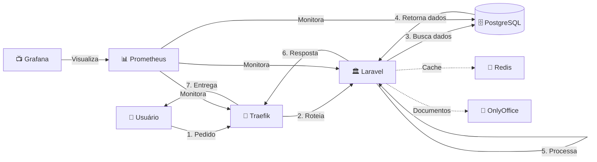
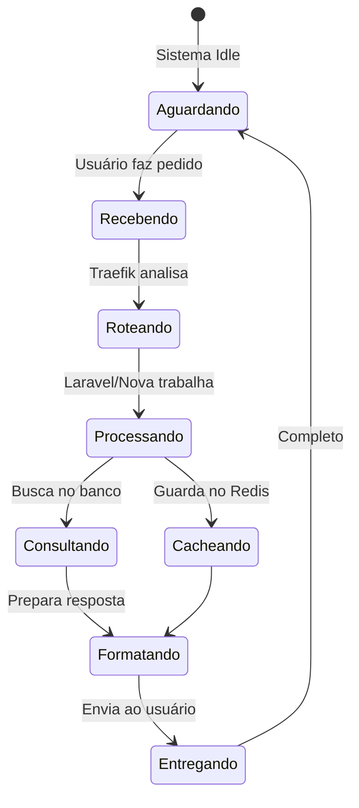

# 📦 Containers - Explicação Simples e Intuitiva

> **Para quem nunca ouviu falar em containers:** Imagine que cada serviço do sistema é como um apartamento independente em um condomínio. Cada um tem seu espaço, mas todos compartilham a mesma infraestrutura (água, luz, internet).

---

## 🏢 O Condomínio Digital

### Analogia: Sistema como Condomínio

Imagine nosso sistema LegisInc como um **condomínio moderno** onde:

- **Cada Container = Um Apartamento** com função específica
- **Docker = A Administração do Condomínio** que gerencia tudo
- **Network = Os Corredores e Elevadores** que conectam os apartamentos
- **Volumes = O Depósito Compartilhado** onde guardamos coisas importantes

```
🏢 Condomínio LegisInc
├── 🏠 Apt 101: Portaria (Traefik Gateway)
├── 🏠 Apt 201: Escritório Principal (Laravel)
├── 🏠 Apt 202: Escritório Novo (Nova API)
├── 🏠 Apt 301: Arquivo (PostgreSQL)
├── 🏠 Apt 302: Caixa Postal (Redis)
├── 🏠 Apt 401: Sala de Documentos (OnlyOffice)
├── 🏠 Apt 501: Central de Monitoramento (Prometheus)
└── 🏠 Apt 502: TV do Condomínio (Grafana)
```

---

## 🏠 Conhecendo Cada "Apartamento" (Container)

### 1. 🚪 Portaria (Traefik Gateway)
**Função:** Como um porteiro inteligente

```
Visitante chega → Porteiro verifica → Direciona ao apartamento certo
```

**Exemplo real:**
- Você acessa `www.legisinc.com/proposicoes`
- Traefik recebe e pensa: "Ah, isso é sobre proposições!"
- Encaminha para o apartamento certo (Laravel ou Nova API)

**Por que é importante?**
- Segurança: Não deixa qualquer um entrar
- Organização: Sabe onde está cada coisa
- Flexibilidade: Pode mudar destinos sem avisar visitantes

### 2. 🏛️ Escritório Principal (Laravel)
**Função:** Onde o trabalho principal acontece hoje

```
Recebe pedido → Processa → Busca dados → Retorna resposta
```

**Exemplo real:**
- Você clica em "Ver Proposições"
- Laravel recebe o pedido
- Consulta o arquivo (banco de dados)
- Mostra a lista na tela

**Características:**
- Maduro e estável (funciona há anos)
- Conhece todas as regras do negócio
- Faz tudo (às vezes demais)

### 3. ⚡ Escritório Novo (Nova API)
**Função:** A versão moderna e rápida para tarefas específicas

```
Especializado → Mais rápido → Menos recursos → Mesmos resultados
```

**Exemplo real:**
- Mesma função que Laravel, mas mais eficiente
- Como contratar um especialista vs generalista
- Faz menos coisas, mas faz muito bem

### 4. 🗄️ Arquivo (PostgreSQL)
**Função:** Guarda TODOS os dados importantes

```
📁 Gavetas organizadas com:
├── 📂 Usuários (quem acessa)
├── 📂 Proposições (documentos legais)
├── 📂 Documentos (arquivos processados)
└── 📂 Histórico (tudo que já aconteceu)
```

**Exemplo real:**
- Como um arquivo físico super organizado
- Encontra qualquer documento em milissegundos
- Nunca perde nada (backup automático)

### 5. 📮 Caixa Postal (Redis)
**Função:** Guarda informações temporárias para acesso rápido

```
Memória de curto prazo → Acesso instantâneo → Descartável
```

**Exemplo real:**
- Você faz login
- Redis guarda: "João está logado até 18h"
- Não precisa verificar senha toda hora
- Se desligar, não tem problema (dados não críticos)

### 6. 📝 Sala de Documentos (OnlyOffice)
**Função:** Editor de documentos online (como Google Docs)

```
Criar documento → Editar em equipe → Salvar automático → Exportar PDF
```

**Exemplo real:**
- Múltiplas pessoas editando uma proposição
- Vê mudanças em tempo real
- Converte para PDF quando finalizado

### 7. 📊 Central de Monitoramento (Prometheus)
**Função:** Câmeras de segurança do condomínio

```
Observa tudo → Coleta métricas → Armazena histórico → Detecta problemas
```

**Exemplo real:**
- Conta quantos visitantes por dia
- Mede tempo de espera no elevador
- Avisa se algo está lento ou quebrado

### 8. 📺 TV do Condomínio (Grafana)
**Função:** Mostra as informações de forma visual

```
Dados do Prometheus → Gráficos bonitos → Dashboards → Alertas visuais
```

**Exemplo real:**
- Painel mostrando: "287 visitantes hoje"
- Gráfico de horários mais movimentados
- Alerta vermelho se algo quebrar

---

## 🔗 Como os Containers se Comunicam

### A Rede Interna (Docker Network)

Imagine um **sistema de interfone** interno do condomínio:

```
🏠 Apt 201 (Laravel) precisa de dados
         ↓ [Interfone interno]
🏠 Apt 301 (PostgreSQL) envia os dados
```

**Características da comunicação:**
1. **Privada:** Só quem mora no condomínio usa
2. **Rápida:** Não sai para a rua (internet)
3. **Segura:** Protegida de externos
4. **Nomes simples:** "Ligue para PostgreSQL" (não precisa do número completo)

### Exemplos de Comunicação Real

#### 🎬 Cenário 1: Usuário quer ver proposições

```
1. 👤 Usuário → 🚪 Portaria (Traefik)
   "Quero ver as proposições"

2. 🚪 Portaria → 🏛️ Escritório (Laravel)
   "Tem alguém querendo ver proposições"

3. 🏛️ Escritório → 🗄️ Arquivo (PostgreSQL)
   "Me passa a lista de proposições"

4. 🗄️ Arquivo → 🏛️ Escritório
   "Aqui estão: [lista de 50 proposições]"

5. 🏛️ Escritório → 🚪 Portaria
   "Pronto, aqui está formatado"

6. 🚪 Portaria → 👤 Usuário
   "Aqui estão suas proposições!"
```

#### 🎬 Cenário 2: Login do usuário

```
1. 👤 Usuário → 🚪 Portaria
   "Login: joão, senha: ***"

2. 🚪 Portaria → 🏛️ Escritório
   "Alguém quer entrar"

3. 🏛️ Escritório → 🗄️ Arquivo
   "Senha do João está correta?"

4. 🗄️ Arquivo → 🏛️ Escritório
   "Sim, senha correta!"

5. 🏛️ Escritório → 📮 Caixa Postal (Redis)
   "Guarda aí: João está logado"

6. 📮 Caixa Postal
   "Ok, guardei por 8 horas"

7. 🏛️ Escritório → 🚪 Portaria → 👤 Usuário
   "Bem-vindo João!"
```

#### 🎬 Cenário 3: Editar documento

```
1. 👤 Usuário → 🚪 Portaria
   "Quero editar o documento X"

2. 🚪 Portaria → 📝 OnlyOffice
   "Abra o documento X para edição"

3. 📝 OnlyOffice → 🗄️ Arquivo
   "Me passa o documento X"

4. 🗄️ Arquivo → 📝 OnlyOffice
   "Aqui está o documento"

5. 📝 OnlyOffice → 👤 Usuário
   "Documento aberto, pode editar!"

[Usuário edita...]

6. 📝 OnlyOffice → 🗄️ Arquivo
   "Salva as mudanças"

7. 🗄️ Arquivo
   "Salvo com sucesso!"
```

---

## 🎯 Por Que Usar Containers?

### Analogia: Mudança de Apartamento

**Sem Containers (Casa própria):**
- Mudança é um pesadelo
- Precisa refazer toda instalação
- Coisas quebram no caminho
- Demora dias/semanas

**Com Containers (Apartamento mobiliado):**
- Pega suas malas e muda
- Tudo já está pronto
- Funciona igual em qualquer lugar
- Mudança em minutos

### Benefícios Reais

1. **🔄 Padronização**
   - Funciona igual no computador de qualquer desenvolvedor
   - Sem "na minha máquina funciona"

2. **🚀 Velocidade**
   - Sobe um novo serviço em segundos
   - Atualiza sem derrubar tudo

3. **🛡️ Isolamento**
   - Problema em um não afeta outros
   - Como apartamentos com paredes à prova de som

4. **📦 Portabilidade**
   - Muda de servidor facilmente
   - Como mudar de prédio levando o apartamento junto

5. **💰 Economia**
   - Usa recursos só quando precisa
   - Como pagar luz só do que usa

---

## 🔧 Comandos Básicos (Traduzidos)

### Para o Síndico Digital (Administrador)

| Comando | O que faz | Analogia |
|---------|-----------|----------|
| `docker ps` | Lista containers rodando | Ver quem está em casa |
| `docker logs [nome]` | Ver mensagens de um container | Ler o livro de ocorrências |
| `docker restart [nome]` | Reiniciar um container | Resetar o apartamento |
| `docker stats` | Ver uso de recursos | Ver consumo de água/luz |
| `docker-compose up` | Subir todos os serviços | Abrir o condomínio |
| `docker-compose down` | Parar todos os serviços | Fechar o condomínio |

---

## 🎨 Visualização da Comunicação

### Fluxo Simplificado



### Estados do Sistema



---

## ❓ Perguntas Comuns

### "Por que não está tudo em um lugar só?"

**Resposta com analogia:**
Você prefere um apartamento onde cozinha, quarto e banheiro são um cômodo só, ou separados? Separar permite:
- Reformar a cozinha sem mexer no quarto
- Se o banheiro quebrar, ainda pode cozinhar
- Cada cômodo otimizado para sua função

### "É mais complicado assim?"

**Resposta honesta:**
Para construir? Sim, um pouco. Para usar? Não!
Como um carro: o motor é complexo, mas dirigir é simples.

### "E se um container parar?"

**Resposta prática:**
Como apartamentos: se um morador viajar, os outros continuam normais.
- Temos backup (outro apartamento igual pronto)
- Sistema avisa automaticamente
- Religamos em segundos

### "Posso ver isso funcionando?"

**Resposta visual:**
Sim! Acesse:
- 📺 Grafana (localhost:3000): TV do condomínio mostrando tudo
- 🚪 Traefik (localhost:8080): Portaria mostrando quem entra/sai
- 📊 Prometheus (localhost:9090): Câmeras gravando tudo

---

## 🎯 Resumo para Não-Técnicos

### O Essencial

**Containers = Apartamentos digitais:**
- Cada um faz uma coisa bem feita
- Conversam entre si por interfone interno
- Se um quebra, outros continuam
- Fácil de mudar/atualizar/crescer

**Benefícios diretos:**
- ✅ Sistema mais confiável (não cai tudo junto)
- ✅ Atualizações sem parar o sistema
- ✅ Fácil adicionar novos serviços
- ✅ Economia de recursos (paga só o que usa)
- ✅ Monitoramento em tempo real

### A Mágica

> "É como transformar uma casa grande e confusa em um condomínio organizado, onde cada serviço tem seu espaço, mas todos trabalham juntos harmoniosamente."

---

## 🚀 Próximos Passos Simples

1. **Ver funcionando:** Acesse Grafana e veja os "apartamentos" trabalhando
2. **Entender o fluxo:** Acompanhe um pedido do início ao fim
3. **Identificar melhorias:** Que "apartamento" precisa de reforma?

---

*Última atualização: {{ now() }}*
*Versão: 1.0 - Linguagem Simplificada*
*Objetivo: Tornar containers compreensíveis para todos*