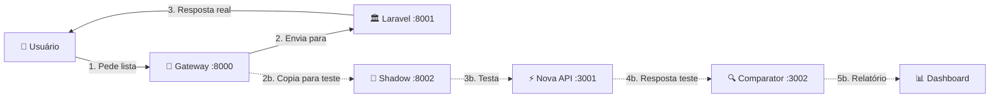
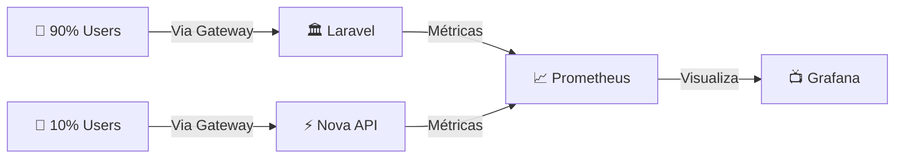

# 🆕 Containers Novos - O Que São e Por Quê Existem

> **Resumo:** Esses containers novos habilitam **3 superpoderes** que o monolito não tinha:
> 1. **🔀 Controle de Tráfego** (gateway, shadow, canary)
> 2. **📊 Observabilidade** (métricas e dashboards em tempo real)
> 3. **🚀 Serviços Modernos** (nova API, conversão de documentos)

---

## 🎯 Por Que Esses Containers Existem?

### Antes (Monolito)
```
❌ Tudo ou nada (deploy arriscado)
❌ Sem métricas detalhadas
❌ Difícil testar mudanças
❌ Sem controle fino de tráfego
```

### Agora (Com Containers)
```
✅ Migração gradual e segura
✅ Métricas em tempo real
✅ Teste em produção sem risco
✅ Controle por endpoint
```

---

## 📦 Visão Geral por Grupos

### 🔀 Grupo 1: Tráfego e Migração
**O que fazem:** Controlam para onde vai cada requisição e permitem testes seguros.

| Container | Porta | Analogia Simples | O Que Faz | Se Parar... | Como Verificar |
|-----------|-------|------------------|-----------|-------------|----------------|
| **🚦 Traefik Gateway** | 8000/8090 | Semáforo inteligente | Decide se requisição vai para Laravel (velho) ou Nova API (novo) | ❌ Frontend não consegue acessar backends | `curl -I localhost:8000/health` |
| **🔄 Nginx Shadow** | 8002 | Espelho mágico | Duplica requisições para teste (resposta não volta ao usuário) | ⚠️ Perde teste seguro, mas sistema continua | `curl -I localhost:8002` |
| **🔍 Shadow Comparator** | 3002 | Detetive de diferenças | Compara respostas (Legacy vs Nova) e mostra se são iguais | ⚠️ Fica "cego" sobre compatibilidade | `docker logs legisinc-shadow-comparator` |
| **📊 Canary Monitor** | 3003 | Painel de controle | Mostra % de tráfego e métricas por rota | ⚠️ Perde visualização, mas tráfego continua | `http://localhost:3003` |

### 🧠 Grupo 2: Aplicações (Onde o Trabalho Acontece)
**O que fazem:** Processam as requisições de verdade.

| Container | Porta | Analogia Simples | O Que Faz | Se Parar... | Como Verificar |
|-----------|-------|------------------|-----------|-------------|----------------|
| **🏛️ Laravel App** | 8001 | Escritório atual | Sistema legado que ainda atende a maioria | ❌ Sistema principal para | `curl localhost:8001/health` |
| **⚡ Nova API** | 3001 | Escritório novo | Versão moderna sendo testada | ⚠️ Canary volta 100% para Laravel | `curl localhost:3001/health` |

### 📊 Grupo 3: Observabilidade (Os Olhos do Sistema)
**O que fazem:** Coletam e mostram métricas para tomar decisões.

| Container | Porta | Analogia Simples | O Que Faz | Se Parar... | Como Verificar |
|-----------|-------|------------------|-----------|-------------|----------------|
| **📈 Prometheus** | 9090 | Câmeras de segurança | Coleta métricas de tudo | ⚠️ Perde gráficos, sistema continua | `http://localhost:9090` |
| **🐘 Postgres Exporter** | 9187 | Sensor do banco | Exporta métricas do PostgreSQL | ⚠️ Perde métricas de DB | `curl localhost:9187/metrics` |
| **📺 Grafana** | 3000 | TV de monitoramento | Mostra dashboards bonitos | ⚠️ Perde visualização apenas | `http://localhost:3000` |

### 🛠️ Grupo 4: Serviços de Suporte
**O que fazem:** Dão suporte essencial para o sistema funcionar bem.

| Container | Porta | Analogia Simples | O Que Faz | Se Parar... | Como Verificar |
|-----------|-------|------------------|-----------|-------------|----------------|
| **📝 OnlyOffice** | 8080 | Sala de edição | Converte e edita documentos | ⚠️ Edição/conversão param | `http://localhost:8080/healthcheck` |
| **📮 Redis** | 6379 | Memória rápida | Cache e filas | ⚠️ Sistema fica lento | `redis-cli ping` |
| **🗄️ PostgreSQL** | 5432 | Arquivo central | Banco de dados principal | ❌ Sistema para totalmente | `psql -h localhost` |

---

## 🎬 Exemplo Prático: O Que Acontece em Cada Requisição?

### Cenário 1: Shadow Traffic (Teste Invisível)


**O que acontece:**
1. Usuário pede `/api/proposicoes`
2. Gateway manda para Laravel (resposta real)
3. Shadow copia para Nova API (teste)
4. Comparator analisa diferenças
5. **Usuário nem sabe do teste!**

### Cenário 2: Canary Deployment (10% Real)


**O que acontece:**
- 90% dos usuários vão para Laravel
- 10% vão para Nova API (teste real)
- Métricas mostram se está tudo bem
- Se erro > 1% → volta tudo para Laravel

---

## 🚨 Troubleshooting Rápido

### 🔴 Container Parado

```bash
# Ver quais estão rodando
docker ps | grep legisinc

# Ver logs de um específico
docker logs legisinc-[nome] --tail 50

# Reiniciar um container
docker restart legisinc-[nome]
```

### 🟡 Nova API Unhealthy

```bash
# 1. Verificar se está respondendo
curl localhost:3001/health

# 2. Ver logs de erro
docker logs legisinc-nova-api --tail 100

# 3. Possíveis causas:
# - Porta errada no código
# - Dependência faltando (Redis/DB)
# - Timeout na conexão
```

### 🟠 Métricas não Aparecem

```bash
# 1. Prometheus está coletando?
curl http://localhost:9090/api/v1/targets

# 2. Exporter está funcionando?
curl http://localhost:9187/metrics

# 3. Grafana conectado?
# Acesse http://localhost:3000
# Settings → Data Sources → Test
```

### 🔵 Shadow Não Está Testando

```bash
# 1. Verificar configuração
docker exec legisinc-nginx-shadow cat /etc/nginx/nginx.conf

# 2. Ver se está espelhando
docker logs legisinc-nginx-shadow | grep mirror

# 3. Confirmar header X-Shadow-Mode
docker logs legisinc-nova-api | grep Shadow
```

---

## 💡 Dicas de Operação

### Para Gestores
- **Canary Monitor (3003)**: Veja % de tráfego por rota
- **Grafana (3000)**: Acompanhe métricas de negócio
- **Se algo quebrar**: Gateway volta tudo para Laravel automaticamente

### Para Desenvolvedores
- **Logs em tempo real**: `docker logs -f legisinc-[container]`
- **Testar endpoint**: `curl -H "X-Debug: true" localhost:8000/api/[rota]`
- **Forçar canary**: Adicione header `X-Force-Service: nova-api`

### Para DevOps
- **Health checks**: Todos os containers têm endpoint `/health`
- **Métricas**: Prometheus scrape a cada 15s
- **Rollback rápido**: `docker-compose -f gateway.yml down && docker-compose up -d`

---

## 📋 Checklist de Saúde do Sistema

### ✅ Tudo Funcionando Se:

- [ ] **Gateway**: `curl -I localhost:8000` retorna 200
- [ ] **Laravel**: `curl localhost:8001/health` retorna OK
- [ ] **Nova API**: `curl localhost:3001/health` retorna OK
- [ ] **Prometheus**: http://localhost:9090/targets mostra UP
- [ ] **Grafana**: http://localhost:3000 mostra dashboards
- [ ] **Canary**: http://localhost:3003 mostra rotas

### ⚠️ Atenção Se:

- Taxa de erro > 0.5% por 5 minutos
- Latência P95 > 500ms
- Menos de 2 réplicas healthy
- Redis memory > 80%
- PostgreSQL connections > 80%

### 🔴 Ação Imediata Se:

- Taxa de erro > 2%
- Gateway não responde
- PostgreSQL down
- Redis down por > 1 minuto

---

## 🎯 Resumo: O Que Cada Container Resolve

| Problema do Monolito | Container que Resolve | Como Resolve |
|---------------------|----------------------|--------------|
| Deploy tudo ou nada | Traefik Gateway | Migra endpoint por endpoint |
| Sem teste seguro | Shadow + Comparator | Testa em produção sem risco |
| Sem métricas | Prometheus + Grafana | Observabilidade completa |
| Tecnologia travada | Nova API | Liberdade para modernizar |
| Conversão manual | OnlyOffice | Automatiza documentos |
| Lentidão | Redis | Cache inteligente |

---

## 🚀 Comandos Úteis

```bash
# Ver todos os containers do projeto
docker ps --filter "name=legisinc"

# Parar tudo
docker-compose -f docker-compose.gateway-simple.yml down

# Subir tudo
docker-compose -f docker-compose.gateway-simple.yml up -d

# Ver uso de recursos
docker stats --filter "name=legisinc"

# Limpar logs antigos
docker system prune --volumes

# Backup rápido do estado
docker-compose ps > estado_$(date +%Y%m%d).txt
```

---

*Última atualização: {{ now() }}*
*Versão: 1.0*
*Objetivo: Explicar de forma simples todos os containers novos do sistema*