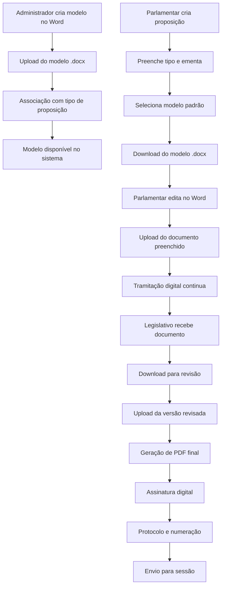

# Sistema de Modelos de Documentos - LegisInc

## Visão Geral da Solução

O sistema de modelos de documentos do LegisInc foi projetado para manter a **padronização profissional** dos documentos legislativos, aproveitando a **formatação avançada do Microsoft Word** e integrando com o **fluxo digital de tramitação**.

### Problema Identificado
- **Editores web limitados**: Falta de recursos avançados de formatação
- **Necessidade de padronização**: Documentos legislativos precisam seguir normas específicas
- **Qualidade profissional**: Word/LibreOffice oferecem recursos superiores
- **Fluxo híbrido**: Combinação de edição offline com tramitação digital

## Arquitetura da Solução

### Fluxo Principal do Sistema



### Componentes do Sistema

#### 1. **Módulo de Gestão de Modelos**
- **Upload de modelos**: Recebimento de arquivos .docx padrão
- **Categorização**: Associação com tipos de proposição
- **Versionamento**: Controle de versões dos modelos
- **Validação**: Verificação de integridade e formato

#### 2. **Módulo de Edição de Documentos**
- **Download inteligente**: Modelo com metadados da proposição
- **Variáveis dinâmicas**: Substituição automática de campos
- **Upload versionado**: Controle de versões do documento
- **Validação de formato**: Verificação de compatibilidade

#### 3. **Módulo de Conversão e Finalização**
- **Geração de PDF**: Conversão automática para formato final
- **Assinatura digital**: Integração com certificados digitais
- **Protocolo automático**: Numeração e registro oficial
- **Arquivo digital**: Armazenamento permanente

## Implementação Técnica

### 1. Estrutura de Banco de Dados

#### Tabela: documento_modelos
```sql
CREATE TABLE documento_modelos (
    id BIGINT PRIMARY KEY,
    nome VARCHAR(255) NOT NULL,
    descricao TEXT,
    tipo_proposicao_id BIGINT,
    arquivo_path VARCHAR(500),
    arquivo_nome VARCHAR(255),
    arquivo_size BIGINT,
    variaveis JSON, -- Campos que serão substituídos
    versao VARCHAR(50),
    ativo BOOLEAN DEFAULT true,
    created_by BIGINT,
    created_at TIMESTAMP,
    updated_at TIMESTAMP,
    
    FOREIGN KEY (tipo_proposicao_id) REFERENCES tipos_proposicao(id),
    FOREIGN KEY (created_by) REFERENCES users(id)
);
```

#### Tabela: documento_instancias
```sql
CREATE TABLE documento_instancias (
    id BIGINT PRIMARY KEY,
    projeto_id BIGINT,
    modelo_id BIGINT,
    arquivo_path VARCHAR(500),
    arquivo_nome VARCHAR(255),
    status ENUM('rascunho', 'parlamentar', 'legislativo', 'finalizado'),
    versao INTEGER DEFAULT 1,
    metadados JSON, -- Dados preenchidos
    created_by BIGINT,
    updated_by BIGINT,
    created_at TIMESTAMP,
    updated_at TIMESTAMP,
    
    FOREIGN KEY (projeto_id) REFERENCES projetos(id),
    FOREIGN KEY (modelo_id) REFERENCES documento_modelos(id),
    FOREIGN KEY (created_by) REFERENCES users(id),
    FOREIGN KEY (updated_by) REFERENCES users(id)
);
```

#### Tabela: documento_versoes
```sql
CREATE TABLE documento_versoes (
    id BIGINT PRIMARY KEY,
    instancia_id BIGINT,
    arquivo_path VARCHAR(500),
    arquivo_nome VARCHAR(255),
    versao INTEGER,
    modificado_por BIGINT,
    comentarios TEXT,
    hash_arquivo VARCHAR(64), -- Para verificação de integridade
    created_at TIMESTAMP,
    
    FOREIGN KEY (instancia_id) REFERENCES documento_instancias(id),
    FOREIGN KEY (modificado_por) REFERENCES users(id)
);
```

### 2. Estrutura de Arquivos Laravel

#### Models
```php
// app/Models/Documento/DocumentoModelo.php
class DocumentoModelo extends Model
{
    protected $fillable = [
        'nome', 'descricao', 'tipo_proposicao_id', 
        'arquivo_path', 'variaveis', 'versao', 'ativo'
    ];
    
    protected $casts = [
        'variaveis' => 'array',
        'ativo' => 'boolean'
    ];
    
    public function tipoProposicao()
    {
        return $this->belongsTo(TipoProposicao::class);
    }
    
    public function instancias()
    {
        return $this->hasMany(DocumentoInstancia::class, 'modelo_id');
    }
}

// app/Models/Documento/DocumentoInstancia.php
class DocumentoInstancia extends Model
{
    protected $fillable = [
        'projeto_id', 'modelo_id', 'arquivo_path', 
        'status', 'versao', 'metadados'
    ];
    
    protected $casts = [
        'metadados' => 'array'
    ];
    
    public function projeto()
    {
        return $this->belongsTo(Projeto::class);
    }
    
    public function modelo()
    {
        return $this->belongsTo(DocumentoModelo::class);
    }
    
    public function versoes()
    {
        return $this->hasMany(DocumentoVersao::class, 'instancia_id');
    }
}
```

#### Services
```php
// app/Services/Documento/DocumentoService.php
class DocumentoService
{
    public function criarInstanciaDocumento(int $projetoId, int $modeloId): DocumentoInstancia
    {
        $projeto = Projeto::findOrFail($projetoId);
        $modelo = DocumentoModelo::findOrFail($modeloId);
        
        // Criar instância do documento
        $instancia = DocumentoInstancia::create([
            'projeto_id' => $projetoId,
            'modelo_id' => $modeloId,
            'status' => 'rascunho',
            'versao' => 1,
            'metadados' => $this->extrairMetadadosProjeto($projeto)
        ]);
        
        return $instancia;
    }
    
    public function gerarDocumentoComVariaveis(DocumentoInstancia $instancia): string
    {
        $modelo = $instancia->modelo;
        $caminhoModelo = storage_path('app/' . $modelo->arquivo_path);
        
        // Processar variáveis no documento Word
        $templateProcessor = new \PhpOffice\PhpWord\TemplateProcessor($caminhoModelo);
        
        foreach ($instancia->metadados as $variavel => $valor) {
            $templateProcessor->setValue($variavel, $valor);
        }
        
        // Salvar documento processado
        $nomeArquivo = "documento_" . $instancia->id . "_v" . $instancia->versao . ".docx";
        $caminhoSaida = storage_path('app/documentos/instancias/' . $nomeArquivo);
        
        $templateProcessor->saveAs($caminhoSaida);
        
        // Atualizar instância com caminho do arquivo
        $instancia->update([
            'arquivo_path' => 'documentos/instancias/' . $nomeArquivo,
            'arquivo_nome' => $nomeArquivo
        ]);
        
        return $caminhoSaida;
    }
    
    public function converterParaPDF(DocumentoInstancia $instancia): string
    {
        $caminhoDocx = storage_path('app/' . $instancia->arquivo_path);
        $nomePdf = str_replace('.docx', '.pdf', $instancia->arquivo_nome);
        $caminhoPdf = storage_path('app/documentos/pdfs/' . $nomePdf);
        
        // Usar conversão via LibreOffice ou API externa
        $comando = "libreoffice --headless --convert-to pdf --outdir " . 
                  dirname($caminhoPdf) . " " . $caminhoDocx;
        
        exec($comando);
        
        return $caminhoPdf;
    }
}

// app/Services/Documento/VariavelService.php
class VariavelService
{
    public function extrairVariaveisDocumento(string $caminhoArquivo): array
    {
        $templateProcessor = new \PhpOffice\PhpWord\TemplateProcessor($caminhoArquivo);
        $variaveis = $templateProcessor->getVariables();
        
        return $variaveis;
    }
    
    public function definirVariaveisPadrao(): array
    {
        return [
            'numero_proposicao' => 'Número da Proposição',
            'tipo_proposicao' => 'Tipo da Proposição',
            'ementa' => 'Ementa da Proposição',
            'autor_nome' => 'Nome do Autor',
            'autor_cargo' => 'Cargo do Autor',
            'data_criacao' => 'Data de Criação',
            'legislatura' => 'Legislatura Atual',
            'sessao_legislativa' => 'Sessão Legislativa'
        ];
    }
}
```

#### Controllers
```php
// app/Http/Controllers/Documento/DocumentoModeloController.php
class DocumentoModeloController extends Controller
{
    public function __construct(
        private DocumentoService $documentoService,
        private VariavelService $variavelService
    ) {}
    
    public function store(Request $request)
    {
        $request->validate([
            'nome' => 'required|string|max:255',
            'tipo_proposicao_id' => 'required|exists:tipos_proposicao,id',
            'arquivo' => 'required|file|mimes:docx|max:10240'
        ]);
        
        // Upload do arquivo
        $arquivo = $request->file('arquivo');
        $path = $arquivo->store('documentos/modelos');
        
        // Extrair variáveis do documento
        $variaveis = $this->variavelService->extrairVariaveisDocumento(
            storage_path('app/' . $path)
        );
        
        // Criar modelo
        $modelo = DocumentoModelo::create([
            'nome' => $request->nome,
            'descricao' => $request->descricao,
            'tipo_proposicao_id' => $request->tipo_proposicao_id,
            'arquivo_path' => $path,
            'arquivo_nome' => $arquivo->getClientOriginalName(),
            'arquivo_size' => $arquivo->getSize(),
            'variaveis' => $variaveis,
            'versao' => '1.0',
            'created_by' => auth()->id()
        ]);
        
        return redirect()->route('documentos.modelos.index')
                        ->with('success', 'Modelo criado com sucesso!');
    }
    
    public function downloadModelo(DocumentoModelo $modelo, Projeto $projeto)
    {
        // Criar instância do documento
        $instancia = $this->documentoService->criarInstanciaDocumento(
            $projeto->id, 
            $modelo->id
        );
        
        // Gerar documento com variáveis preenchidas
        $caminhoArquivo = $this->documentoService->gerarDocumentoComVariaveis($instancia);
        
        return response()->download($caminhoArquivo, $instancia->arquivo_nome);
    }
}

// app/Http/Controllers/Documento/DocumentoInstanciaController.php
class DocumentoInstanciaController extends Controller
{
    public function uploadVersao(Request $request, DocumentoInstancia $instancia)
    {
        $request->validate([
            'arquivo' => 'required|file|mimes:docx|max:10240',
            'comentarios' => 'nullable|string'
        ]);
        
        $arquivo = $request->file('arquivo');
        $path = $arquivo->store('documentos/versoes');
        
        // Criar nova versão
        DocumentoVersao::create([
            'instancia_id' => $instancia->id,
            'arquivo_path' => $path,
            'arquivo_nome' => $arquivo->getClientOriginalName(),
            'versao' => $instancia->versoes()->count() + 1,
            'modificado_por' => auth()->id(),
            'comentarios' => $request->comentarios,
            'hash_arquivo' => hash_file('sha256', $arquivo->path())
        ]);
        
        // Atualizar status da instância
        $instancia->update([
            'status' => 'legislativo',
            'versao' => $instancia->versao + 1,
            'updated_by' => auth()->id()
        ]);
        
        return response()->json(['success' => true]);
    }
    
    public function gerarPDF(DocumentoInstancia $instancia)
    {
        $caminhoPdf = $this->documentoService->converterParaPDF($instancia);
        
        // Atualizar status para finalizado
        $instancia->update(['status' => 'finalizado']);
        
        return response()->download($caminhoPdf);
    }
}
```

### 3. Interface Administrativa

#### Views Structure
```php
resources/views/modules/documentos/
├── modelos/
│   ├── index.blade.php          # Listagem de modelos
│   ├── create.blade.php         # Criação de modelo
│   ├── edit.blade.php           # Edição de modelo
│   └── show.blade.php           # Visualização de modelo
├── instancias/
│   ├── index.blade.php          # Documentos em tramitação
│   ├── show.blade.php           # Detalhes da instância
│   └── versoes.blade.php        # Histórico de versões
└── components/
    ├── upload-zona.blade.php    # Zona de upload drag & drop
    ├── variavel-item.blade.php  # Item de variável
    └── status-badge.blade.php   # Badge de status
```

#### Funcionalidades da Interface
- **Upload drag & drop**: Interface moderna para upload de arquivos
- **Preview de variáveis**: Visualização das variáveis encontradas no documento
- **Histórico de versões**: Timeline com todas as modificações
- **Download inteligente**: Botões contextuais para cada tipo de usuário
- **Status visual**: Badges e indicadores de progresso

### 4. Fluxo de Trabalho Detalhado

#### Fase 1: Criação do Modelo (Administrador)
1. **Upload do modelo**: Administrador sobe arquivo .docx padrão
2. **Definição de variáveis**: Sistema detecta variáveis `${variavel}`
3. **Associação com tipo**: Vincula modelo ao tipo de proposição
4. **Validação**: Verifica integridade e formato do arquivo

#### Fase 2: Criação da Proposição (Parlamentar)
1. **Seleção do tipo**: Parlamentar escolhe tipo de proposição
2. **Preenchimento básico**: Ementa e dados obrigatórios
3. **Escolha do modelo**: Sistema mostra modelos disponíveis
4. **Download personalizado**: Documento com dados pré-preenchidos

#### Fase 3: Edição e Upload (Parlamentar)
1. **Edição offline**: Parlamentar edita no Microsoft Word
2. **Upload da versão**: Sistema recebe documento preenchido
3. **Validação de formato**: Verifica se mantém estrutura original
4. **Continuidade da tramitação**: Documento entra no fluxo normal

#### Fase 4: Revisão Legislativa
1. **Download para revisão**: Equipe legislativa baixa documento
2. **Edição técnica**: Correções e ajustes necessários
3. **Upload da versão final**: Sistema recebe versão revisada
4. **Geração de PDF**: Conversão automática para formato final

#### Fase 5: Finalização e Protocolo
1. **Assinatura digital**: Integração com certificados digitais
2. **Numeração automática**: Sistema atribui número oficial
3. **Protocolo digital**: Registro oficial no sistema
4. **Envio para sessão**: Documento pronto para votação

## Vantagens da Solução

### 1. **Qualidade Profissional**
- **Formatação avançada**: Aproveitamento total dos recursos do Word
- **Padronização garantida**: Modelos únicos para cada tipo
- **Flexibilidade de edição**: Liberdade total na criação de conteúdo

### 2. **Fluxo Híbrido Eficiente**
- **Melhor dos dois mundos**: Edição offline + tramitação digital
- **Controle de versões**: Histórico completo de modificações
- **Validação automática**: Verificação de integridade e formato

### 3. **Integração Sistêmica**
- **Tramitação digital**: Integração total com fluxo existente
- **Metadados automáticos**: Preenchimento automático de variáveis
- **Auditoria completa**: Rastreabilidade de todas as ações

### 4. **Usabilidade Otimizada**
- **Interface familiar**: Uso do editor que o usuário já conhece
- **Download inteligente**: Documentos personalizados automaticamente
- **Feedback visual**: Status claro em cada etapa do processo

## Tecnologias Utilizadas

### Backend
- **PhpOffice/PhpWord**: Manipulação de documentos Word
- **LibreOffice Headless**: Conversão para PDF
- **Laravel Storage**: Gerenciamento de arquivos
- **Queue System**: Processamento assíncrono de conversões

### Frontend
- **Dropzone.js**: Upload drag & drop
- **Preview.js**: Visualização de documentos
- **Progress.js**: Indicadores de progresso
- **Modal.js**: Interfaces modais para confirmações

### Integrações
- **Certificação Digital**: APIs de assinatura eletrônica
- **Antivírus**: Verificação automática de arquivos
- **Backup**: Armazenamento redundante de documentos importantes

Esta solução combina a **flexibilidade do Microsoft Word** com a **eficiência da tramitação digital**, garantindo documentos de alta qualidade e processo controlado.