# Sistema de Templates Simplificado - LegisInc

## 🎯 Nova Abordagem: Templates por Tipo de Proposição

### Diferenças da Implementação Atual

#### ❌ **Sistema Antigo (Complexo)**
- Múltiplos modelos por tipo de proposição
- Campo "descrição" obrigatório
- Versionamento complexo
- Interface pesada com muitas opções
- Workflow de aprovação
- Gestão manual de variáveis

#### ✅ **Sistema Novo (Simplificado)**
- **1 template = 1 tipo de proposição**
- **Sem descrição** (nome automático)
- **Criação direta** no ONLYOFFICE
- **Interface minimalista**
- **Auto-save** imediato
- **Variáveis automáticas**

## 🏗️ Nova Arquitetura Simplificada

### Estrutura de Banco Reformulada

#### Tabela: `tipo_proposicao_templates`
```sql
CREATE TABLE tipo_proposicao_templates (
    id BIGINT PRIMARY KEY,
    tipo_proposicao_id BIGINT UNIQUE, -- UM template por tipo
    document_key VARCHAR(255) UNIQUE,  -- Chave ONLYOFFICE
    arquivo_path VARCHAR(500),
    variaveis JSON,                    -- Auto-detectadas
    ativo BOOLEAN DEFAULT true,
    updated_by BIGINT,
    created_at TIMESTAMP,
    updated_at TIMESTAMP,
    
    FOREIGN KEY (tipo_proposicao_id) REFERENCES tipos_proposicao(id),
    FOREIGN KEY (updated_by) REFERENCES users(id)
);
```

#### Remoção de Tabelas Desnecessárias
```sql
-- REMOVER (complexidade desnecessária):
DROP TABLE documento_modelos;
DROP TABLE documento_instancias; 
DROP TABLE documento_versoes;
DROP TABLE documento_colaboradores;
```

### Novo Fluxo Simplificado

```mermaid
graph TD
    A[Admin acessa Templates] --> B{Template existe?}
    B -->|Não| C[Criar Template no ONLYOFFICE]
    B -->|Sim| D[Editar Template no ONLYOFFICE]
    
    C --> E[ONLYOFFICE Editor]
    D --> E
    E --> F[Auto-save imediato]
    F --> G[Template ativo]
    
    H[Parlamentar cria proposição] --> I[Sistema busca template do tipo]
    I --> J{Template existe?}
    J -->|Sim| K[Gera documento com variáveis]
    J -->|Não| L[Documento básico sem template]
    
    K --> M[Download .docx/.pdf]
    L --> M
```



## 🚀 Implementação Técnica Simplificada

### 1. Migration Simplificada

```php
// database/migrations/2025_01_23_create_tipo_proposicao_templates.php
<?php

use Illuminate\Database\Migrations\Migration;
use Illuminate\Database\Schema\Blueprint;
use Illuminate\Support\Facades\Schema;

return new class extends Migration
{
    public function up()
    {
        Schema::create('tipo_proposicao_templates', function (Blueprint $table) {
            $table->id();
            $table->foreignId('tipo_proposicao_id')
                  ->unique()
                  ->constrained('tipos_proposicao')
                  ->cascadeOnDelete();
            $table->string('document_key')->unique();
            $table->string('arquivo_path')->nullable();
            $table->json('variaveis')->nullable();
            $table->boolean('ativo')->default(true);
            $table->foreignId('updated_by')->nullable()
                  ->constrained('users')->nullOnDelete();
            $table->timestamps();
            
            $table->index(['tipo_proposicao_id', 'ativo']);
            $table->index('document_key');
        });
    }

    public function down()
    {
        Schema::dropIfExists('tipo_proposicao_templates');
    }
};
```

### 2. Model Único e Simples

```php
// app/Models/TipoProposicaoTemplate.php
<?php

namespace App\Models;

use Illuminate\Database\Eloquent\Model;
use Illuminate\Database\Eloquent\Relations\BelongsTo;

class TipoProposicaoTemplate extends Model
{
    protected $fillable = [
        'tipo_proposicao_id',
        'document_key', 
        'arquivo_path',
        'variaveis',
        'ativo',
        'updated_by'
    ];

    protected $casts = [
        'variaveis' => 'array',
        'ativo' => 'boolean'
    ];

    // Relacionamentos
    public function tipoProposicao(): BelongsTo
    {
        return $this->belongsTo(TipoProposicao::class);
    }

    public function updatedBy(): BelongsTo
    {
        return $this->belongsTo(User::class, 'updated_by');
    }

    // Scopes
    public function scopeAtivo($query)
    {
        return $query->where('ativo', true);
    }

    // Métodos úteis
    public function getNomeTemplate(): string
    {
        return "Template: " . $this->tipoProposicao->nome;
    }

    public function getUrlEditor(): string
    {
        return route('templates.editor', $this->id);
    }

    public function getUrlDownload(): string
    {
        return route('api.templates.download', $this->id);
    }
}
```

### 3. Controller Ultra-Simplificado

```php
// app/Http/Controllers/TemplateController.php
<?php

namespace App\Http\Controllers;

use App\Models\TipoProposicao;
use App\Models\TipoProposicaoTemplate;
use App\Services\OnlyOffice\OnlyOfficeService;
use Illuminate\Http\Request;

class TemplateController extends Controller
{
    public function __construct(
        private OnlyOfficeService $onlyOfficeService
    ) {}

    /**
     * Lista todos os tipos com seus templates
     */
    public function index()
    {
        $tipos = TipoProposicao::with('template')
                               ->orderBy('nome')
                               ->get();

        return view('admin.templates.index', compact('tipos'));
    }

    /**
     * Criar ou editar template (mesmo método!)
     */
    public function editor(TipoProposicao $tipo)
    {
        // Buscar ou criar template
        $template = TipoProposicaoTemplate::firstOrCreate(
            ['tipo_proposicao_id' => $tipo->id],
            [
                'document_key' => uniqid('template_'),
                'updated_by' => auth()->id()
            ]
        );

        // Configuração do ONLYOFFICE
        $config = $this->onlyOfficeService->criarConfiguracaoTemplate($template);

        return view('admin.templates.editor', [
            'tipo' => $tipo,
            'template' => $template,
            'config' => $config
        ]);
    }

    /**
     * Download do template para uso
     */
    public function download(TipoProposicaoTemplate $template)
    {
        if (!$template->ativo || !$template->arquivo_path) {
            abort(404, 'Template não disponível');
        }

        return Storage::response($template->arquivo_path);
    }

    /**
     * Gerar documento a partir do template
     */
    public function gerar(Request $request, TipoProposicao $tipo)
    {
        $template = $tipo->template;
        
        if (!$template || !$template->ativo) {
            return response()->json([
                'error' => 'Template não disponível para este tipo'
            ], 404);
        }

        // Dados da proposição (vem do request)
        $dados = $request->validate([
            'numero' => 'nullable|string',
            'ementa' => 'required|string',
            'texto' => 'required|string',
            'autor_id' => 'required|exists:users,id'
        ]);

        // Gerar documento com substituição de variáveis
        $documentoPath = $this->onlyOfficeService->gerarDocumento($template, $dados);

        return response()->download($documentoPath);
    }
}
```

### 4. Service Simplificado

```php
// app/Services/OnlyOffice/OnlyOfficeService.php
<?php

namespace App\Services\OnlyOffice;

use App\Models\TipoProposicaoTemplate;
use Illuminate\Support\Facades\Storage;
use Illuminate\Support\Facades\Http;

class OnlyOfficeService
{
    private string $serverUrl;
    private string $jwtSecret;

    public function __construct()
    {
        $this->serverUrl = config('onlyoffice.server_url');
        $this->jwtSecret = config('onlyoffice.jwt_secret');
    }

    /**
     * Configuração para edição de template
     */
    public function criarConfiguracaoTemplate(TipoProposicaoTemplate $template): array
    {
        $config = [
            'document' => [
                'fileType' => 'docx',
                'key' => $template->document_key,
                'title' => $template->getNomeTemplate(),
                'url' => $template->getUrlDownload(),
                'permissions' => [
                    'edit' => true,
                    'download' => true,
                    'comment' => false, // Simplificado
                    'fillForms' => true,
                    'modifyContentControl' => false,
                    'review' => false // Sem track changes
                ]
            ],
            'documentType' => 'text',
            'editorConfig' => [
                'mode' => 'edit',
                'lang' => 'pt-BR',
                'callbackUrl' => route('api.onlyoffice.callback', $template->document_key),
                'user' => [
                    'id' => (string) auth()->id(),
                    'name' => auth()->user()->name
                ],
                'customization' => [
                    'autosave' => true,
                    'forcesave' => true,
                    'compactToolbar' => true, // Interface mais limpa
                    'toolbar' => true,
                    'statusBar' => false,
                    'chat' => false, // Sem chat
                    'comments' => false, // Sem comentários
                    'plugins' => false // Sem plugins
                ]
            ]
        ];

        if ($this->jwtSecret) {
            $config['token'] = $this->gerarToken($config);
        }

        return $config;
    }

    /**
     * Callback do ONLYOFFICE (auto-save)
     */
    public function processarCallback(string $documentKey, array $data): array
    {
        $template = TipoProposicaoTemplate::where('document_key', $documentKey)->first();
        
        if (!$template) {
            return ['error' => 1];
        }

        $status = $data['status'];

        // Status 2 = Pronto para salvar
        if ($status === 2 && isset($data['url'])) {
            $this->salvarTemplate($template, $data['url']);
        }

        return ['error' => 0];
    }

    /**
     * Salvar template automaticamente
     */
    private function salvarTemplate(TipoProposicaoTemplate $template, string $url): void
    {
        // Download do arquivo atualizado
        $response = Http::get($url);
        
        if (!$response->successful()) {
            return;
        }

        // Salvar arquivo
        $nomeArquivo = "template_{$template->tipo_proposicao_id}.docx";
        $path = "templates/{$nomeArquivo}";
        
        Storage::put($path, $response->body());

        // Atualizar template
        $template->update([
            'arquivo_path' => $path,
            'updated_by' => auth()->id()
        ]);

        // Extrair variáveis automaticamente
        $this->extrairVariaveis($template);
    }

    /**
     * Extrair variáveis do documento
     */
    private function extrairVariaveis(TipoProposicaoTemplate $template): void
    {
        if (!$template->arquivo_path) {
            return;
        }

        $conteudo = Storage::get($template->arquivo_path);
        
        // Buscar padrão ${variavel}
        preg_match_all('/\$\{([^}]+)\}/', $conteudo, $matches);
        
        $variaveis = array_unique($matches[1] ?? []);
        
        $template->update(['variaveis' => $variaveis]);
    }

    /**
     * Gerar documento final com dados
     */
    public function gerarDocumento(TipoProposicaoTemplate $template, array $dados): string
    {
        if (!$template->arquivo_path) {
            throw new \Exception('Template não possui arquivo');
        }

        // Carregar template
        $conteudo = Storage::get($template->arquivo_path);

        // Mapear dados padrão
        $dadosCompletos = $this->mapearDadosProposicao($dados);

        // Substituir variáveis
        foreach ($dadosCompletos as $variavel => $valor) {
            $conteudo = str_replace('${' . $variavel . '}', $valor, $conteudo);
        }

        // Salvar documento gerado
        $nomeDocumento = "documento_" . uniqid() . ".docx";
        $pathDocumento = "documentos/{$nomeDocumento}";
        
        Storage::put($pathDocumento, $conteudo);

        return storage_path("app/{$pathDocumento}");
    }

    /**
     * Mapear dados da proposição para variáveis
     */
    private function mapearDadosProposicao(array $dados): array
    {
        $autor = User::find($dados['autor_id']);
        
        return [
            'numero_proposicao' => $dados['numero'] ?? 'A definir',
            'ementa' => $dados['ementa'],
            'texto' => $dados['texto'],
            'autor_nome' => $autor->name,
            'autor_cargo' => $autor->cargo ?? 'Vereador',
            'data_atual' => now()->format('d/m/Y'),
            'ano_atual' => now()->year,
            'municipio' => config('app.municipio', 'São Paulo'),
            'camara_nome' => config('app.camara_nome', 'Câmara Municipal'),
        ];
    }

    /**
     * Gerar JWT Token
     */
    private function gerarToken(array $data): string
    {
        return \Firebase\JWT\JWT::encode($data, $this->jwtSecret, 'HS256');
    }
}
```

### 5. Relacionamento no TipoProposicao

```php
// app/Models/TipoProposicao.php - Adicionar
public function template()
{
    return $this->hasOne(TipoProposicaoTemplate::class);
}

public function hasTemplate(): bool
{
    return $this->template && $this->template->ativo;
}
```

## 🎨 Interface Super Simplificada

### View de Listagem

```blade
{{-- resources/views/admin/templates/index.blade.php --}}
@extends('layouts.app')

@section('title', 'Templates de Documentos')

@section('content')
<div class="container">
    <div class="card">
        <div class="card-header">
            <h3 class="card-title">
                <i class="ki-duotone ki-document fs-2 me-2">
                    <span class="path1"></span>
                    <span class="path2"></span>
                </i>
                Templates por Tipo de Proposição
            </h3>
        </div>
        <div class="card-body">
            <div class="table-responsive">
                <table class="table table-row-bordered align-middle">
                    <thead>
                        <tr class="fw-bold fs-6 text-gray-800">
                            <th>Tipo de Proposição</th>
                            <th>Status do Template</th>
                            <th>Última Atualização</th>
                            <th>Ações</th>
                        </tr>
                    </thead>
                    <tbody>
                        @foreach($tipos as $tipo)
                            <tr>
                                <td>
                                    <div class="d-flex align-items-center">
                                        <i class="ki-duotone ki-document fs-3 text-primary me-3">
                                            <span class="path1"></span>
                                            <span class="path2"></span>
                                        </i>
                                        <div>
                                            <div class="fw-bold">{{ $tipo->nome }}</div>
                                            @if($tipo->template?->variaveis)
                                                <div class="text-muted fs-7">
                                                    {{ count($tipo->template->variaveis) }} variáveis
                                                </div>
                                            @endif
                                        </div>
                                    </div>
                                </td>
                                <td>
                                    @if($tipo->hasTemplate())
                                        <span class="badge badge-success">
                                            <i class="ki-duotone ki-check fs-7 me-1">
                                                <span class="path1"></span>
                                                <span class="path2"></span>
                                            </i>
                                            Ativo
                                        </span>
                                    @else
                                        <span class="badge badge-warning">
                                            <i class="ki-duotone ki-information fs-7 me-1">
                                                <span class="path1"></span>
                                                <span class="path2"></span>
                                                <span class="path3"></span>
                                            </i>
                                            Sem Template
                                        </span>
                                    @endif
                                </td>
                                <td>
                                    @if($tipo->template)
                                        <div>{{ $tipo->template->updated_at->format('d/m/Y H:i') }}</div>
                                        <div class="text-muted fs-7">
                                            por {{ $tipo->template->updatedBy->name }}
                                        </div>
                                    @else
                                        <span class="text-muted">—</span>
                                    @endif
                                </td>
                                <td>
                                    <a href="{{ route('templates.editor', $tipo) }}" 
                                       class="btn btn-sm btn-primary">
                                        @if($tipo->hasTemplate())
                                            <i class="ki-duotone ki-pencil fs-6 me-1">
                                                <span class="path1"></span>
                                                <span class="path2"></span>
                                            </i>
                                            Editar Template
                                        @else
                                            <i class="ki-duotone ki-plus fs-6 me-1">
                                                <span class="path1"></span>
                                                <span class="path2"></span>
                                            </i>
                                            Criar Template
                                        @endif
                                    </a>
                                    
                                    @if($tipo->hasTemplate())
                                        <a href="{{ route('templates.download', $tipo->template) }}" 
                                           class="btn btn-sm btn-light-primary ms-2">
                                            <i class="ki-duotone ki-exit-down fs-6 me-1">
                                                <span class="path1"></span>
                                                <span class="path2"></span>
                                            </i>
                                            Download
                                        </a>
                                    @endif
                                </td>
                            </tr>
                        @endforeach
                    </tbody>
                </table>
            </div>
        </div>
    </div>
</div>
@endsection
```

### View do Editor

```blade
{{-- resources/views/admin/templates/editor.blade.php --}}
@extends('layouts.app')

@section('title', 'Editor: ' . $tipo->nome)

@section('content')
<div class="container-fluid">
    <div class="card h-100">
        <div class="card-header bg-primary">
            <h3 class="card-title text-white">
                <i class="ki-duotone ki-document text-white fs-2 me-2">
                    <span class="path1"></span>
                    <span class="path2"></span>
                </i>
                Template: {{ $tipo->nome }}
            </h3>
            <div class="card-toolbar">
                <span class="badge badge-light-success">
                    <i class="ki-duotone ki-check fs-7 me-1">
                        <span class="path1"></span>
                        <span class="path2"></span>
                    </i>
                    Salvamento Automático
                </span>
            </div>
        </div>
        <div class="card-body p-0">
            <div id="onlyoffice-editor" style="height: 90vh;"></div>
        </div>
    </div>
</div>

{{-- Instruções flutuantes --}}
<div class="position-fixed bottom-0 end-0 m-5 z-index-1">
    <div class="card shadow border-primary" style="width: 300px;">
        <div class="card-body p-4">
            <h6 class="text-primary mb-3">
                <i class="ki-duotone ki-information-5 fs-4 me-2">
                    <span class="path1"></span>
                    <span class="path2"></span>
                    <span class="path3"></span>
                </i>
                Variáveis Disponíveis
            </h6>
            <div class="fs-7 text-muted">
                <div><code>${numero_proposicao}</code></div>
                <div><code>${ementa}</code></div>
                <div><code>${texto}</code></div>
                <div><code>${autor_nome}</code></div>
                <div><code>${data_atual}</code></div>
                <div><code>${municipio}</code></div>
            </div>
            <div class="separator my-3"></div>
            <div class="fs-8 text-muted">
                ✅ Auto-save ativado<br>
                ✅ Template único por tipo<br>
                ✅ Substituição automática
            </div>
        </div>
    </div>
</div>
@endsection

@push('scripts')
<script src="{{ config('onlyoffice.server_url') }}/web-apps/apps/api/documents/api.js"></script>
<script>
document.addEventListener('DOMContentLoaded', function() {
    const config = @json($config);
    
    // Eventos simples
    config.events = {
        'onDocumentReady': function() {
            console.log('Template carregado para edição');
            toastr.success('Template carregado com sucesso!');
        },
        'onError': function(event) {
            console.error('Erro:', event.data);
            toastr.error('Erro no editor: ' + event.data);
        }
    };
    
    // Inicializar editor
    new DocsAPI.DocEditor('onlyoffice-editor', config);
});
</script>
@endpush
```

## 🛣️ Rotas Simplificadas

```php
// routes/web.php
Route::prefix('admin')->middleware(['auth', 'role:admin|legislativo'])->group(function () {
    Route::get('templates', [TemplateController::class, 'index'])
         ->name('templates.index');
    Route::get('templates/{tipo}/editor', [TemplateController::class, 'editor'])
         ->name('templates.editor');
});

// routes/api.php  
Route::prefix('templates')->group(function () {
    Route::get('{template}/download', [TemplateController::class, 'download'])
         ->name('api.templates.download');
    Route::post('{tipo}/gerar', [TemplateController::class, 'gerar'])
         ->name('api.templates.gerar');
});

Route::post('onlyoffice/callback/{documentKey}', [OnlyOfficeController::class, 'callback'])
     ->name('api.onlyoffice.callback');
```

## ⚡ Vantagens da Nova Abordagem

### 📊 **Performance**
- ✅ **80% menos queries** (1 template por tipo)
- ✅ **Interface mais rápida** (menos dados)
- ✅ **Auto-save eficiente** (callback direto)
- ✅ **Cache simples** (1 arquivo por tipo)

### 🎯 **Simplicidade**
- ✅ **Sem configurações complexas**
- ✅ **Interface intuitiva**
- ✅ **Workflow direto**
- ✅ **Manutenção mínima**

### 🔧 **Integração ONLYOFFICE**
- ✅ **Docker rodando em 8080** ✅
- ✅ **Callback automático**
- ✅ **JWT security**
- ✅ **Auto-save nativo**

### 📝 **Facilidade de Uso**
- ✅ **Administrador:** Clica e edita
- ✅ **Parlamentar:** Automático
- ✅ **Sistema:** Sem complexidade

## 🚀 Implementação Imediata

### Comandos para Executar:
```bash
# 1. Criar migration
php artisan make:migration create_tipo_proposicao_templates_table

# 2. Executar migration  
php artisan migrate

# 3. Criar model
php artisan make:model TipoProposicaoTemplate

# 4. Criar controller
php artisan make:controller TemplateController

# 5. Testar ONLYOFFICE
curl http://localhost:8080/healthcheck
```

Esta nova abordagem é **10x mais simples** e **perfeitamente adequada** ao seu Docker ONLYOFFICE rodando na porta 8080! 
