# Sistema de Permissões - Guia Técnico Completo para Laravel 12.0

## 📋 Índice
- [Arquitetura Geral](#arquitetura-geral)
- [Stack Tecnológico](#stack-tecnológico)
- [Estrutura de Banco de Dados](#estrutura-de-banco-de-dados)
- [Hierarquia de Roles](#hierarquia-de-roles)
- [Middleware e Proteção de Rotas](#middleware-e-proteção-de-rotas)
- [Otimização de Performance](#otimização-de-performance)
- [Interface de Gerenciamento](#interface-de-gerenciamento)
- [Implementação com Claude Code](#implementação-com-claude-code)
- [Segurança e Auditoria](#segurança-e-auditoria)
- [Testes Automatizados](#testes-automatizados)

---

## 🏗️ Arquitetura Geral

### Conceito Híbrido
O sistema implementa uma arquitetura híbrida que combina:
- **Spatie Laravel Permission v6.20** para RBAC padrão
- **Sistema customizado de screen permissions** para controle granular
- **Laravel 12.0** com middleware otimizado

### Fluxo de Autorização

```mermaid
graph TD
    A[Requisição] --> B{User Autenticado?}
    B -->|Não| C[Redirect Login]
    B -->|Sim| D{É Admin?}
    D -->|Sim| E[Acesso Liberado]
    D -->|Não| F[Verificar Screen Permission]
    F --> G{Tem Permissão?}
    G -->|Sim| E
    G -->|Não| H[403 Forbidden]
```


---

## 🛠️ Stack Tecnológico

### Framework e Versões
- **Laravel**: 12.0 (com novo sistema de middleware)
- **PHP**: ^8.2 (com typed properties e enums)
- **Spatie Laravel Permission**: ^6.20
- **Cache**: Redis (obrigatório para performance)
- **Database**: MySQL 8.0+ com índices otimizados
- **Frontend**: TailwindCSS ^4.0.0 + AlpineJS
- **Testing**: PestPHP ^3.8 com mutation testing

### Dependências Essenciais
```json
{
  "spatie/laravel-permission": "^6.20",
  "predis/predis": "^2.0",
  "laravel/telescope": "^5.0",
  "spatie/laravel-query-builder": "^6.0",
  "spatie/laravel-activitylog": "^4.8"
}
```

---

## 🗄️ Estrutura de Banco de Dados

### Tabela Principal: `screen_permissions`
```sql
CREATE TABLE screen_permissions (
    id BIGINT UNSIGNED AUTO_INCREMENT PRIMARY KEY,
    role_name VARCHAR(50) NOT NULL,
    screen_route VARCHAR(100) NOT NULL,
    screen_name VARCHAR(100) NOT NULL,
    screen_module ENUM('dashboard', 'parlamentares', 'comissoes', 'projetos', 'sessoes', 'usuarios', 'modelos') NOT NULL,
    can_access BOOLEAN DEFAULT FALSE,
    can_create BOOLEAN DEFAULT FALSE,
    can_edit BOOLEAN DEFAULT FALSE,
    can_delete BOOLEAN DEFAULT FALSE,
    created_at TIMESTAMP NULL DEFAULT NULL,
    updated_at TIMESTAMP NULL DEFAULT NULL,
    
    -- Índices para performance
    INDEX idx_role_module (role_name, screen_module),
    INDEX idx_route_access (screen_route, can_access),
    INDEX idx_module_permissions (screen_module, can_access, can_create, can_edit, can_delete),
    
    -- Constraint de unicidade
    UNIQUE KEY uk_role_route (role_name, screen_route)
);
```

### Estrutura de Caching
```sql
-- Tabela para cache de permissões de usuário
CREATE TABLE user_permission_cache (
    user_id BIGINT UNSIGNED,
    permissions_hash VARCHAR(64),
    cached_permissions JSON,
    expires_at TIMESTAMP,
    
    PRIMARY KEY (user_id),
    INDEX idx_expires (expires_at)
);
```

### Auditoria de Permissões
```sql
CREATE TABLE permission_audit_log (
    id BIGINT UNSIGNED AUTO_INCREMENT PRIMARY KEY,
    user_id BIGINT UNSIGNED,
    admin_user_id BIGINT UNSIGNED,
    action ENUM('grant', 'revoke', 'modify') NOT NULL,
    permission_type VARCHAR(50),
    old_value JSON,
    new_value JSON,
    ip_address VARCHAR(45),
    user_agent TEXT,
    created_at TIMESTAMP DEFAULT CURRENT_TIMESTAMP,
    
    INDEX idx_user_action (user_id, action),
    INDEX idx_admin_audit (admin_user_id, created_at),
    INDEX idx_ip_tracking (ip_address, created_at)
);
```

---

## 👥 Hierarquia de Roles

### Definição de Roles com Herança
```php
enum UserRole: string 
{
    case ADMIN = 'ADMIN';
    case LEGISLATIVO = 'LEGISLATIVO';
    case PARLAMENTAR = 'PARLAMENTAR';
    case RELATOR = 'RELATOR';
    case PROTOCOLO = 'PROTOCOLO';
    case ASSESSOR = 'ASSESSOR';
    case CIDADAO_VERIFICADO = 'CIDADAO_VERIFICADO';
    case PUBLICO = 'PUBLICO';
    
    public function getLevel(): int 
    {
        return match($this) {
            self::ADMIN => 100,
            self::LEGISLATIVO => 80,
            self::PARLAMENTAR => 70,
            self::RELATOR => 65,
            self::PROTOCOLO => 50,
            self::ASSESSOR => 40,
            self::CIDADAO_VERIFICADO => 20,
            self::PUBLICO => 10,
        };
    }
    
    public function canAccessRole(UserRole $targetRole): bool 
    {
        return $this->getLevel() >= $targetRole->getLevel();
    }
    
    public function getDefaultPermissions(): array 
    {
        return match($this) {
            self::ADMIN => ['*'],
            self::LEGISLATIVO => [
                'dashboard.view',
                'parlamentares.*',
                'comissoes.*',
                'projetos.*',
                'sessoes.*',
                'modelos.*'
            ],
            self::PARLAMENTAR => [
                'dashboard.view',
                'parlamentares.view',
                'comissoes.view',
                'projetos.view',
                'projetos.create',
                'sessoes.view'
            ],
            // ... outras definições
        };
    }
}
```

### Módulos do Sistema
```php
enum SystemModule: string 
{
    case DASHBOARD = 'dashboard';
    case PARLAMENTARES = 'parlamentares';
    case COMISSOES = 'comissoes';
    case PROJETOS = 'projetos';
    case SESSOES = 'sessoes';
    case USUARIOS = 'usuarios';
    case MODELOS = 'modelos';
    
    public function getRoutes(): array 
    {
        return match($this) {
            self::DASHBOARD => [
                'dashboard.index' => 'Painel Principal'
            ],
            self::PARLAMENTARES => [
                'parlamentares.index' => 'Listar Parlamentares',
                'parlamentares.create' => 'Criar Parlamentar',
                'parlamentares.edit' => 'Editar Parlamentar',
                'parlamentares.mesa-diretora' => 'Mesa Diretora'
            ],
            // ... outras definições
        };
    }
}
```

---

## 🛡️ Middleware e Proteção de Rotas

### CheckScreenPermission Middleware Otimizado
```php
<?php

namespace App\Http\Middleware;

use App\Services\PermissionCacheService;
use App\Enums\UserRole;
use Closure;
use Illuminate\Http\Request;
use Illuminate\Support\Facades\Auth;
use Illuminate\Support\Facades\Cache;
use Illuminate\Support\Facades\Log;

class CheckScreenPermissionMiddleware
{
    public function __construct(
        private PermissionCacheService $permissionCache
    ) {}

    public function handle(Request $request, Closure $next, string $screen, string $action = 'view'): mixed
    {
        $user = Auth::user();
        
        if (!$user) {
            return redirect()->route('login');
        }

        // Admin sempre tem acesso
        if ($user->hasRole(UserRole::ADMIN->value)) {
            return $next($request);
        }

        // Verificação em cache com fallback
        $hasPermission = $this->permissionCache->userHasScreenPermission(
            $user->id,
            $screen,
            $action
        );

        if (!$hasPermission) {
            Log::warning('Access denied', [
                'user_id' => $user->id,
                'screen' => $screen,
                'action' => $action,
                'ip' => $request->ip(),
                'user_agent' => $request->userAgent()
            ]);
            
            abort(403, "Acesso negado à tela: {$screen}");
        }

        return $next($request);
    }
}
```

### Service de Cache de Permissões
```php
<?php

namespace App\Services;

use App\Models\User;
use App\Models\ScreenPermission;
use Illuminate\Support\Facades\Cache;
use Illuminate\Support\Facades\DB;

class PermissionCacheService
{
    private const CACHE_TTL = 3600; // 1 hora
    private const CACHE_PREFIX = 'user_permissions_';

    public function userHasScreenPermission(int $userId, string $screen, string $action): bool
    {
        $cacheKey = self::CACHE_PREFIX . $userId;
        
        $permissions = Cache::remember($cacheKey, self::CACHE_TTL, function () use ($userId) {
            return $this->loadUserPermissions($userId);
        });

        $permissionKey = "{$screen}.{$action}";
        return $permissions[$permissionKey] ?? false;
    }

    private function loadUserPermissions(int $userId): array
    {
        $user = User::with('roles')->find($userId);
        $permissions = [];

        foreach ($user->roles as $role) {
            $screenPermissions = ScreenPermission::where('role_name', $role->name)
                ->get()
                ->keyBy(function ($permission) {
                    return $permission->screen_route;
                });

            foreach ($screenPermissions as $route => $permission) {
                if ($permission->can_access) $permissions["{$route}.view"] = true;
                if ($permission->can_create) $permissions["{$route}.create"] = true;
                if ($permission->can_edit) $permissions["{$route}.edit"] = true;
                if ($permission->can_delete) $permissions["{$route}.delete"] = true;
            }
        }

        return $permissions;
    }

    public function clearUserCache(int $userId): void
    {
        Cache::forget(self::CACHE_PREFIX . $userId);
    }

    public function clearAllPermissionCaches(): void
    {
        $pattern = self::CACHE_PREFIX . '*';
        $keys = Cache::store('redis')->connection()->keys($pattern);
        
        if (!empty($keys)) {
            Cache::store('redis')->connection()->del($keys);
        }
    }
}
```

### Registro de Middleware no Laravel 12.0
```php
// bootstrap/app.php
return Application::configure(basePath: dirname(__DIR__))
    ->withRouting(
        web: __DIR__.'/../routes/web.php',
        commands: __DIR__.'/../routes/console.php',
        health: '/up',
    )
    ->withMiddleware(function (Middleware $middleware) {
        $middleware->alias([
            'check.screen.permission' => \App\Http\Middleware\CheckScreenPermissionMiddleware::class,
        ]);
        
        $middleware->web([
            \App\Http\Middleware\LogPermissionChecks::class,
        ]);
    })
    ->create();
```

---

## ⚡ Otimização de Performance

### Estratégias de Caching
```php
// Service Provider para otimizações
class PermissionOptimizationServiceProvider extends ServiceProvider
{
    public function boot(): void
    {
        // Pre-load permissions para usuários ativos
        $this->preloadActiveUserPermissions();
        
        // Warming do cache em background
        $this->schedulePermissionCacheWarming();
    }

    private function preloadActiveUserPermissions(): void
    {
        $activeUsers = User::where('last_activity', '>', now()->subHours(24))
            ->with('roles')
            ->get();

        foreach ($activeUsers as $user) {
            app(PermissionCacheService::class)->userHasScreenPermission(
                $user->id, 
                'dashboard', 
                'view'
            ); // Força o carregamento do cache
        }
    }
}
```

### Otimização de Queries
```php
// Query Builder otimizado para permissões
class PermissionQueryBuilder
{
    public static function getUserPermissionsOptimized(int $userId): Collection
    {
        return DB::table('users')
            ->join('model_has_roles', 'users.id', '=', 'model_has_roles.model_id')
            ->join('roles', 'model_has_roles.role_id', '=', 'roles.id')
            ->join('screen_permissions', 'roles.name', '=', 'screen_permissions.role_name')
            ->where('users.id', $userId)
            ->where('screen_permissions.can_access', true)
            ->select([
                'screen_permissions.screen_route',
                'screen_permissions.can_access',
                'screen_permissions.can_create',
                'screen_permissions.can_edit',
                'screen_permissions.can_delete'
            ])
            ->get();
    }
}
```

---

## 🎨 Interface de Gerenciamento

### Controller da Tela de Permissões
```php
<?php

namespace App\Http\Controllers\Admin;

use App\Http\Controllers\Controller;
use App\Services\PermissionManagementService;
use App\Services\PermissionCacheService;
use App\Enums\UserRole;
use App\Enums\SystemModule;
use Illuminate\Http\Request;
use Illuminate\Http\JsonResponse;

class ScreenPermissionController extends Controller
{
    public function __construct(
        private PermissionManagementService $permissionService,
        private PermissionCacheService $cacheService
    ) {
        $this->middleware(['auth', 'check.screen.permission:usuarios,view']);
    }

    public function index(): \Illuminate\View\View
    {
        $roles = UserRole::cases();
        $modules = SystemModule::cases();
        $permissions = $this->permissionService->getPermissionMatrix();
        
        return view('admin.screen-permissions.index', compact(
            'roles', 
            'modules', 
            'permissions'
        ));
    }

    public function update(Request $request): JsonResponse
    {
        $request->validate([
            'role' => 'required|string',
            'permissions' => 'required|array',
            'permissions.*.screen_route' => 'required|string',
            'permissions.*.can_access' => 'boolean',
            'permissions.*.can_create' => 'boolean',
            'permissions.*.can_edit' => 'boolean',
            'permissions.*.can_delete' => 'boolean',
        ]);

        try {
            $this->permissionService->updateRolePermissions(
                $request->input('role'),
                $request->input('permissions')
            );

            // Limpar cache após alterações
            $this->cacheService->clearAllPermissionCaches();

            return response()->json(['success' => true]);
            
        } catch (\Exception $e) {
            return response()->json([
                'success' => false,
                'message' => $e->getMessage()
            ], 500);
        }
    }

    public function reset(Request $request): JsonResponse
    {
        $request->validate(['role' => 'required|string']);
        
        $role = UserRole::from($request->input('role'));
        $this->permissionService->resetRoleToDefaults($role);
        
        return response()->json(['success' => true]);
    }
}
```

### Service de Gerenciamento
```php
<?php

namespace App\Services;

use App\Models\ScreenPermission;
use App\Enums\UserRole;
use App\Enums\SystemModule;
use Illuminate\Support\Facades\DB;
use Illuminate\Support\Facades\Log;

class PermissionManagementService
{
    public function getPermissionMatrix(): array
    {
        $matrix = [];
        
        foreach (UserRole::cases() as $role) {
            $permissions = ScreenPermission::where('role_name', $role->value)->get();
            
            $matrix[$role->value] = [
                'role' => $role,
                'permissions' => $permissions->keyBy('screen_route'),
                'total_screens' => $this->getTotalScreensCount(),
                'active_permissions' => $permissions->where('can_access', true)->count()
            ];
        }
        
        return $matrix;
    }

    public function updateRolePermissions(string $roleName, array $permissions): void
    {
        DB::transaction(function () use ($roleName, $permissions) {
            foreach ($permissions as $permission) {
                ScreenPermission::updateOrCreate(
                    [
                        'role_name' => $roleName,
                        'screen_route' => $permission['screen_route']
                    ],
                    [
                        'can_access' => $permission['can_access'] ?? false,
                        'can_create' => $permission['can_create'] ?? false,
                        'can_edit' => $permission['can_edit'] ?? false,
                        'can_delete' => $permission['can_delete'] ?? false,
                    ]
                );
            }
            
            Log::info('Permissions updated', [
                'role' => $roleName,
                'admin_user' => auth()->id(),
                'permissions_count' => count($permissions)
            ]);
        });
    }

    public function resetRoleToDefaults(UserRole $role): void
    {
        $defaultPermissions = $role->getDefaultPermissions();
        
        DB::transaction(function () use ($role, $defaultPermissions) {
            // Remover permissões existentes
            ScreenPermission::where('role_name', $role->value)->delete();
            
            // Aplicar permissões padrão
            foreach ($defaultPermissions as $permission) {
                if ($permission === '*') {
                    $this->grantAllPermissions($role);
                    break;
                }
                
                $this->grantSpecificPermission($role, $permission);
            }
        });
    }

    private function getTotalScreensCount(): int
    {
        return collect(SystemModule::cases())
            ->sum(fn($module) => count($module->getRoutes()));
    }
}
```

### Interface Vue.js/Alpine.js
```html
<div x-data="permissionManager()" class="permission-management">
    <!-- Seletor de Role -->
    <div class="mb-6">
        <label class="block text-sm font-medium text-gray-700 mb-2">
            Selecionar Perfil
        </label>
        <select x-model="selectedRole" @change="loadPermissions()" 
                class="form-select rounded-md shadow-sm">
            <template x-for="role in roles" :key="role.value">
                <option :value="role.value" x-text="role.label"></option>
            </template>
        </select>
    </div>

    <!-- Grid de Módulos -->
    <div class="grid grid-cols-1 md:grid-cols-2 lg:grid-cols-3 gap-6">
        <template x-for="module in modules" :key="module.name">
            <div class="bg-white rounded-lg shadow-md p-6">
                <!-- Header do Card -->
                <div class="flex items-center justify-between mb-4">
                    <div class="flex items-center">
                        <div :class="module.iconClass" class="w-8 h-8 mr-3"></div>
                        <h3 class="text-lg font-semibold" x-text="module.label"></h3>
                    </div>
                    <span class="badge" x-text="getModulePercentage(module) + '%'"></span>
                </div>

                <!-- Progress Bar -->
                <div class="w-full bg-gray-200 rounded-full h-2 mb-4">
                    <div class="bg-blue-600 h-2 rounded-full transition-all duration-300"
                         :style="'width: ' + getModulePercentage(module) + '%'"></div>
                </div>

                <!-- Switches de Permissão -->
                <div class="space-y-3">
                    <template x-for="screen in module.screens" :key="screen.route">
                        <div class="flex items-center justify-between">
                            <label class="text-sm text-gray-700" x-text="screen.name"></label>
                            <div class="flex space-x-2">
                                <!-- Switch Ver -->
                                <label class="switch">
                                    <input type="checkbox" 
                                           x-model="permissions[screen.route].can_access"
                                           @change="updatePermission(screen.route, 'can_access', $event.target.checked)">
                                    <span class="slider"></span>
                                </label>
                                
                                <!-- Switches adicionais para criar/editar/deletar -->
                                <template x-if="permissions[screen.route].can_access">
                                    <div class="flex space-x-1">
                                        <button class="btn-sm" 
                                                :class="permissions[screen.route].can_create ? 'btn-success' : 'btn-gray'"
                                                @click="togglePermission(screen.route, 'can_create')">
                                            C
                                        </button>
                                        <button class="btn-sm"
                                                :class="permissions[screen.route].can_edit ? 'btn-warning' : 'btn-gray'"
                                                @click="togglePermission(screen.route, 'can_edit')">
                                            E
                                        </button>
                                        <button class="btn-sm"
                                                :class="permissions[screen.route].can_delete ? 'btn-danger' : 'btn-gray'"
                                                @click="togglePermission(screen.route, 'can_delete')">
                                            D
                                        </button>
                                    </div>
                                </template>
                            </div>
                        </div>
                    </template>
                </div>
            </div>
        </template>
    </div>

    <!-- Botões de Ação -->
    <div class="flex justify-end space-x-4 mt-8">
        <button @click="resetPermissions()" 
                class="btn btn-secondary">
            Restaurar Padrões
        </button>
        <button @click="savePermissions()" 
                class="btn btn-primary"
                :disabled="saving">
            <span x-show="!saving">Salvar Alterações</span>
            <span x-show="saving">Salvando...</span>
        </button>
    </div>
</div>

<script>
function permissionManager() {
    return {
        selectedRole: '',
        permissions: {},
        saving: false,
        roles: @json($roles),
        modules: @json($modules),
        
        loadPermissions() {
            if (!this.selectedRole) return;
            
            fetch(`/admin/screen-permissions/role/${this.selectedRole}`)
                .then(response => response.json())
                .then(data => {
                    this.permissions = data.permissions;
                });
        },
        
        updatePermission(route, action, value) {
            if (!this.permissions[route]) {
                this.permissions[route] = {};
            }
            this.permissions[route][action] = value;
            
            // Se desabilitar acesso, desabilitar outras permissões
            if (action === 'can_access' && !value) {
                this.permissions[route].can_create = false;
                this.permissions[route].can_edit = false;
                this.permissions[route].can_delete = false;
            }
        },
        
        togglePermission(route, action) {
            this.permissions[route][action] = !this.permissions[route][action];
        },
        
        getModulePercentage(module) {
            const totalScreens = module.screens.length;
            const activeScreens = module.screens.filter(screen => 
                this.permissions[screen.route]?.can_access
            ).length;
            
            return totalScreens > 0 ? Math.round((activeScreens / totalScreens) * 100) : 0;
        },
        
        async savePermissions() {
            this.saving = true;
            
            try {
                const response = await fetch('/admin/screen-permissions', {
                    method: 'POST',
                    headers: {
                        'Content-Type': 'application/json',
                        'X-CSRF-TOKEN': document.querySelector('meta[name="csrf-token"]').content
                    },
                    body: JSON.stringify({
                        role: this.selectedRole,
                        permissions: this.permissions
                    })
                });
                
                if (response.ok) {
                    this.showNotification('Permissões salvas com sucesso!', 'success');
                } else {
                    throw new Error('Erro ao salvar permissões');
                }
            } catch (error) {
                this.showNotification('Erro ao salvar permissões', 'error');
            } finally {
                this.saving = false;
            }
        },
        
        showNotification(message, type) {
            // Implementar sistema de notificações
            console.log(`${type}: ${message}`);
        }
    }
}
</script>
```

---

## 🔧 Implementação com Claude Code

### Comandos para Claude Code
```bash
# Análise da estrutura atual
claude analyze --type=permission-system --path=app/

# Criação da estrutura base
claude create middleware CheckScreenPermissionMiddleware --template=permission-check
claude create service PermissionCacheService --template=cache-optimization
claude create enum UserRole --template=hierarchical-roles
claude create controller ScreenPermissionController --template=admin-interface

# Otimização de performance
claude optimize --target=permission-queries --strategy=caching
claude refactor --component=middleware --pattern=performance-first

# Geração de testes
claude test:generate --type=permission-matrix --coverage=complete
claude test:performance --target=permission-checks --threshold=100ms

# Auditoria de segurança
claude security:audit --focus=permission-escalation
claude security:generate --type=audit-trail
```

### Estrutura de Arquivos Recomendada
```
app/
├── Enums/
│   ├── UserRole.php
│   ├── SystemModule.php
│   └── PermissionAction.php
├── Http/
│   ├── Controllers/
│   │   └── Admin/
│   │       └── ScreenPermissionController.php
│   └── Middleware/
│       ├── CheckScreenPermissionMiddleware.php
│       └── LogPermissionChecks.php
├── Models/
│   ├── ScreenPermission.php
│   └── PermissionAuditLog.php
├── Services/
│   ├── PermissionCacheService.php
│   ├── PermissionManagementService.php
│   └── PermissionAuditService.php
└── Providers/
    └── PermissionServiceProvider.php

database/
├── migrations/
│   ├── 2024_01_01_000001_create_screen_permissions_table.php
│   ├── 2024_01_01_000002_create_permission_audit_log_table.php
│   └── 2024_01_01_000003_add_permission_indexes.php
└── seeders/
    ├── RolePermissionSeeder.php
    └── DefaultPermissionSeeder.php

tests/
├── Feature/
│   ├── PermissionMiddlewareTest.php
│   ├── ScreenPermissionControllerTest.php
│   └── PermissionCacheTest.php
├── Unit/
│   ├── UserRoleTest.php
│   ├── PermissionServiceTest.php
│   └── PermissionQueryTest.php
└── Performance/
    └── PermissionPerformanceTest.php
```

---

## 🔒 Segurança e Auditoria

### Implementação de Auditoria
```php
<?php

namespace App\Services;

use App\Models\PermissionAuditLog;
use Illuminate\Support\Facades\Auth;
use Illuminate\Http\Request;

class PermissionAuditService
{
    public function logPermissionChange(
        string $action,
        string $permissionType,
        mixed $oldValue,
        mixed $newValue,
        ?int $targetUserId = null
    ): void {
        PermissionAuditLog::create([
            'user_id' => $targetUserId,
            'admin_user_id' => Auth::id(),
            'action' => $action,
            'permission_type' => $permissionType,
            'old_value' => json_encode($oldValue),
            'new_value' => json_encode($newValue),
            'ip_address' => request()->ip(),
            'user_agent' => request()->userAgent(),
        ]);
    }

    public function getAuditTrail(int $userId, int $days = 30): \Illuminate\Database\Eloquent\Collection
    {
        return PermissionAuditLog::where('user_id', $userId)
            ->where('created_at', '>=', now()->subDays($days))
            ->with('adminUser:id,name,email')
            ->orderBy('created_at', 'desc')
            ->get();
    }
}
```

### Validação de Segurança
```php
// Middleware para prevenir escalação de privilégios
class PreventPrivilegeEscalationMiddleware
{
    public function handle(Request $request, Closure $next): mixed
    {
        $user = Auth::user();
        $targetRole = $request->input('role');
        
        // Verificar se usuário pode modificar o role alvo
        if ($targetRole && !$this->canModifyRole($user, $targetRole)) {
            abort(403, 'Não é possível modificar permissões deste perfil');
        }
        
        // Verificar se as permissões sendo concedidas são válidas
        if ($request->has('permissions')) {
            $this->validatePermissionGrants($user, $request->input('permissions'));
        }
        
        return $next($request);
    }
    
    private function canModifyRole(User $user, string $targetRole): bool
    {
        $userRole = UserRole::from($user->getRoleNames()->first());
        $targetRoleEnum = UserRole::from($targetRole);
        
        // Só pode modificar roles de nível igual ou inferior
        return $userRole->getLevel() >= $targetRoleEnum->getLevel();
    }
    
    private function validatePermissionGrants(User $user, array $permissions): void
    {
        foreach ($permissions as $permission) {
            if (!$this->userCanGrantPermission($user, $permission)) {
                abort(403, "Não é possível conceder a permissão: {$permission['screen_route']}");
            }
        }
    }
}
```

### Rate Limiting para Operações Sensíveis
```php
// Aplicar rate limiting em operações de permissão
Route::middleware(['throttle:permission-changes'])
    ->group(function () {
        Route::post('/admin/screen-permissions', [ScreenPermissionController::class, 'update']);
        Route::post('/admin/screen-permissions/reset', [ScreenPermissionController::class, 'reset']);
    });

// No RouteServiceProvider
RateLimiter::for('permission-changes', function (Request $request) {
    return Limit::perUser(10)->perMinute(); // 10 alterações por minuto por usuário
});
```

---

## 🧪 Testes Automatizados

### Testes de Middleware
```php
<?php

namespace Tests\Feature;

use Tests\TestCase;
use App\Models\User;
use App\Enums\UserRole;
use Spatie\Permission\Models\Role;
use Illuminate\Foundation\Testing\RefreshDatabase;

class PermissionMiddlewareTest extends TestCase
{
    use RefreshDatabase;

    /** @test */
    public function admin_can_access_all_screens(): void
    {
        $admin = User::factory()->create();
        $admin->assignRole(UserRole::ADMIN->value);

        $response = $this->actingAs($admin)
            ->get('/admin/screen-permissions');

        $response->assertOk();
    }

    /** @test */
    public function public_user_cannot_access_admin_screens(): void
    {
        $user = User::factory()->create();
        $user->assignRole(UserRole::PUBLICO->value);

        $response = $this->actingAs($user)
            ->get('/admin/screen-permissions');

        $response->assertForbidden();
    }

    /** @test */
    public function middleware_respects_screen_permissions(): void
    {
        $user = User::factory()->create();
        $user->assignRole(UserRole::PARLAMENTAR->value);

        // Conceder permissão específica
        $this->createScreenPermission(
            UserRole::PARLAMENTAR->value,
            'parlamentares.index',
            true
        );

        $response = $this->actingAs($user)
            ->get('/parlamentares');

        $response->assertOk();
    }

    /** @test */
    public function cache_improves_permission_check_performance(): void
    {
        $user = User::factory()->create();
        $user->assignRole(UserRole::LEGISLATIVO->value);

        // Primeira verificação (sem cache)
        $start = microtime(true);
        $this->actingAs($user)->get('/dashboard');
        $firstCheck = microtime(true) - $start;

        // Segunda verificação (com cache)
        $start = microtime(true);
        $this->actingAs($user)->get('/dashboard');
        $secondCheck = microtime(true) - $start;

        // Cache deve tornar a segunda verificação mais rápida
        $this->assertLessThan($firstCheck, $secondCheck);
    }

    private function createScreenPermission(string $role, string $route, bool $canAccess): void
    {
        \App\Models\ScreenPermission::create([
            'role_name' => $role,
            'screen_route' => $route,
            'screen_name' => 'Test Screen',
            'screen_module' => 'parlamentares',
            'can_access' => $canAccess,
        ]);
    }
}
```

### Testes de Performance
```php
<?php

namespace Tests\Performance;

use Tests\TestCase;
use App\Models\User;
use App\Services\PermissionCacheService;
use Illuminate\Foundation\Testing\RefreshDatabase;

class PermissionPerformanceTest extends TestCase
{
    use RefreshDatabase;

    /** @test */
    public function permission_check_completes_under_100ms(): void
    {
        $user = User::factory()->create();
        $this->seedPermissions();

        $start = microtime(true);
        
        $cacheService = app(PermissionCacheService::class);
        $hasPermission = $cacheService->userHasScreenPermission(
            $user->id,
            'dashboard',
            'view'
        );
        
        $duration = (microtime(true) - $start) * 1000; // Converter para ms

        $this->assertLessThan(100, $duration, 'Permission check took too long');
    }

    /** @test */
    public function bulk_permission_checks_scale_linearly(): void
    {
        $users = User::factory(100)->create();
        $this->seedPermissions();

        $start = microtime(true);
        
        foreach ($users as $user) {
            app(PermissionCacheService::class)->userHasScreenPermission(
                $user->id,
                'dashboard',
                'view'
            );
        }
        
        $duration = microtime(true) - $start;

        // 100 usuários devem ser processados em menos de 1 segundo
        $this->assertLessThan(1.0, $duration);
    }

    /** @test */
    public function cache_hit_ratio_exceeds_90_percent(): void
    {
        $user = User::factory()->create();
        $cacheService = app(PermissionCacheService::class);

        // Pré-aquecer cache
        $cacheService->userHasScreenPermission($user->id, 'dashboard', 'view');

        // Fazer múltiplas verificações
        $cacheHits = 0;
        $totalChecks = 100;

        for ($i = 0; $i < $totalChecks; $i++) {
            $start = microtime(true);
            $cacheService->userHasScreenPermission($user->id, 'dashboard', 'view');
            $duration = microtime(true) - $start;

            // Se duração < 0.001s, provavelmente foi cache hit
            if ($duration < 0.001) {
                $cacheHits++;
            }
        }

        $hitRatio = ($cacheHits / $totalChecks) * 100;
        $this->assertGreaterThan(90, $hitRatio);
    }
}
```

### Matrix de Testes de Permissões
```php
<?php

namespace Tests\Unit;

use Tests\TestCase;
use App\Enums\UserRole;
use App\Enums\SystemModule;

class PermissionMatrixTest extends TestCase
{
    /**
     * @test
     * @dataProvider rolePermissionProvider
     */
    public function role_has_correct_default_permissions(UserRole $role, array $expectedPermissions): void
    {
        $actualPermissions = $role->getDefaultPermissions();
        
        foreach ($expectedPermissions as $permission) {
            $this->assertContains($permission, $actualPermissions);
        }
    }

    /**
     * @test
     * @dataProvider hierarchyProvider
     */
    public function role_hierarchy_is_respected(UserRole $higherRole, UserRole $lowerRole): void
    {
        $this->assertTrue(
            $higherRole->canAccessRole($lowerRole),
            "{$higherRole->value} should be able to access {$lowerRole->value}"
        );
        
        $this->assertFalse(
            $lowerRole->canAccessRole($higherRole),
            "{$lowerRole->value} should not be able to access {$higherRole->value}"
        );
    }

    public static function rolePermissionProvider(): array
    {
        return [
            [UserRole::ADMIN, ['*']],
            [UserRole::LEGISLATIVO, ['dashboard.view', 'parlamentares.*']],
            [UserRole::PARLAMENTAR, ['dashboard.view', 'projetos.view']],
            [UserRole::PUBLICO, ['dashboard.view']],
        ];
    }

    public static function hierarchyProvider(): array
    {
        return [
            [UserRole::ADMIN, UserRole::LEGISLATIVO],
            [UserRole::LEGISLATIVO, UserRole::PARLAMENTAR],
            [UserRole::PARLAMENTAR, UserRole::PROTOCOLO],
            [UserRole::PROTOCOLO, UserRole::ASSESSOR],
            [UserRole::ASSESSOR, UserRole::CIDADAO_VERIFICADO],
            [UserRole::CIDADAO_VERIFICADO, UserRole::PUBLICO],
        ];
    }
}
```

---

## 📊 Monitoramento e Métricas

### Dashboard de Métricas
```php
<?php

namespace App\Http\Controllers\Admin;

use App\Services\PermissionMetricsService;
use Illuminate\Http\Request;

class PermissionMetricsController extends Controller
{
    public function dashboard(PermissionMetricsService $metrics)
    {
        return view('admin.metrics.permissions', [
            'totalUsers' => $metrics->getTotalUsers(),
            'activeUsers' => $metrics->getActiveUsers(),
            'permissionChecksToday' => $metrics->getPermissionChecksToday(),
            'cacheHitRatio' => $metrics->getCacheHitRatio(),
            'averageResponseTime' => $metrics->getAverageResponseTime(),
            'topAccessedScreens' => $metrics->getTopAccessedScreens(),
            'roleDistribution' => $metrics->getRoleDistribution(),
            'failedAccessAttempts' => $metrics->getFailedAccessAttempts(),
        ]);
    }
}
```

### Service de Métricas
```php
<?php

namespace App\Services;

use Illuminate\Support\Facades\DB;
use Illuminate\Support\Facades\Cache;
use Carbon\Carbon;

class PermissionMetricsService
{
    public function getCacheHitRatio(): float
    {
        $hits = Cache::get('permission_cache_hits', 0);
        $misses = Cache::get('permission_cache_misses', 0);
        
        if (($hits + $misses) === 0) return 0;
        
        return round(($hits / ($hits + $misses)) * 100, 2);
    }

    public function getAverageResponseTime(): float
    {
        return DB::table('permission_performance_log')
            ->where('created_at', '>=', now()->subDay())
            ->avg('response_time_ms') ?? 0;
    }

    public function getTopAccessedScreens(int $limit = 10): array
    {
        return DB::table('permission_access_log')
            ->select('screen_route', DB::raw('COUNT(*) as access_count'))
            ->where('created_at', '>=', now()->subWeek())
            ->groupBy('screen_route')
            ->orderBy('access_count', 'desc')
            ->limit($limit)
            ->get()
            ->toArray();
    }

    public function getFailedAccessAttempts(): array
    {
        return DB::table('permission_access_log')
            ->where('status', 'denied')
            ->where('created_at', '>=', now()->subDay())
            ->select('screen_route', 'user_id', 'ip_address', 'created_at')
            ->orderBy('created_at', 'desc')
            ->limit(50)
            ->get()
            ->toArray();
    }
}
```

---

## 🚀 Deploy e Configuração

### Configuração de Produção
```php
// config/permission.php
return [
    'models' => [
        'permission' => Spatie\Permission\Models\Permission::class,
        'role' => Spatie\Permission\Models\Role::class,
    ],

    'table_names' => [
        'roles' => 'roles',
        'permissions' => 'permissions',
        'model_has_permissions' => 'model_has_permissions',
        'model_has_roles' => 'model_has_roles',
        'role_has_permissions' => 'role_has_permissions',
    ],

    'cache' => [
        'expiration_time' => \DateInterval::createFromDateString('24 hours'),
        'key' => 'spatie.permission.cache',
        'store' => 'redis',
    ],

    // Configurações customizadas
    'screen_permissions' => [
        'cache_ttl' => 3600,
        'enable_audit' => env('PERMISSION_AUDIT_ENABLED', true),
        'performance_monitoring' => env('PERMISSION_MONITORING', true),
        'max_failed_attempts' => 5,
        'lockout_duration' => 300,
    ],
];
```

### Docker Configuration
```dockerfile
# Dockerfile para ambiente de produção
FROM php:8.2-fpm-alpine

# Instalar extensões necessárias
RUN docker-php-ext-install pdo_mysql redis

# Redis para cache de permissões
RUN apk add --no-cache redis

# Configurar PHP para performance
COPY php.ini /usr/local/etc/php/
```

### Environment Variables
```bash
# .env.production
PERMISSION_CACHE_DRIVER=redis
PERMISSION_AUDIT_ENABLED=true
PERMISSION_MONITORING=true
PERMISSION_CACHE_TTL=3600

# Redis configuration
REDIS_HOST=redis
REDIS_PASSWORD=null
REDIS_PORT=6379
REDIS_DB=1

# Database optimization
DB_CONNECTION=mysql
DB_HOST=mysql
DB_PORT=3306
DB_DATABASE=legislative_system
DB_USERNAME=app_user
DB_PASSWORD=secure_password

# Performance settings
OCTANE_SERVER=swoole
OCTANE_WORKERS=4
```

---

## 📝 Scripts de Instalação

### Artisan Commands
```php
<?php

namespace App\Console\Commands;

use Illuminate\Console\Command;
use App\Services\PermissionSetupService;

class InstallPermissionSystemCommand extends Command
{
    protected $signature = 'permission:install {--seed : Seed default permissions}';
    protected $description = 'Install the complete permission system';

    public function handle(PermissionSetupService $setupService): int
    {
        $this->info('Installing Permission System...');

        // 1. Publicar migrações
        $this->call('vendor:publish', [
            '--provider' => 'Spatie\Permission\PermissionServiceProvider',
            '--tag' => 'laravel-permission-migrations'
        ]);

        // 2. Executar migrações
        $this->call('migrate');

        // 3. Limpar cache
        $this->call('permission:cache-reset');

        // 4. Criar roles padrão
        $setupService->createDefaultRoles();

        // 5. Seed permissões se solicitado
        if ($this->option('seed')) {
            $this->call('db:seed', ['--class' => 'DefaultPermissionSeeder']);
        }

        // 6. Configurar índices de performance
        $setupService->createPerformanceIndexes();

        $this->info('Permission system installed successfully!');
        
        return Command::SUCCESS;
    }
}
```

### Migration Generator
```php
<?php

use Illuminate\Database\Migrations\Migration;
use Illuminate\Database\Schema\Blueprint;
use Illuminate\Support\Facades\Schema;

return new class extends Migration
{
    public function up(): void
    {
        Schema::create('screen_permissions', function (Blueprint $table) {
            $table->id();
            $table->string('role_name', 50);
            $table->string('screen_route', 100);
            $table->string('screen_name', 100);
            $table->enum('screen_module', [
                'dashboard', 'parlamentares', 'comissoes', 
                'projetos', 'sessoes', 'usuarios', 'modelos'
            ]);
            $table->boolean('can_access')->default(false);
            $table->boolean('can_create')->default(false);
            $table->boolean('can_edit')->default(false);
            $table->boolean('can_delete')->default(false);
            $table->timestamps();

            // Índices para performance
            $table->index(['role_name', 'screen_module'], 'idx_role_module');
            $table->index(['screen_route', 'can_access'], 'idx_route_access');
            $table->index([
                'screen_module', 'can_access', 'can_create', 'can_edit', 'can_delete'
            ], 'idx_module_permissions');
            
            // Constraint de unicidade
            $table->unique(['role_name', 'screen_route'], 'uk_role_route');
            
            // Foreign key
            $table->foreign('role_name')->references('name')->on('roles')->onDelete('cascade');
        });
    }

    public function down(): void
    {
        Schema::dropIfExists('screen_permissions');
    }
};
```

---

## 🔧 Troubleshooting e FAQ

### Problemas Comuns

**1. Performance lenta em verificações de permissão**
```bash
# Verificar cache Redis
redis-cli info memory

# Limpar cache de permissões
php artisan permission:cache-reset

# Recriar índices de banco
php artisan db:seed --class=PerformanceIndexSeeder
```

**2. Permissões não sendo aplicadas**
```bash
# Verificar configuração do cache
php artisan config:cache

# Limpar todos os caches
php artisan optimize:clear

# Verificar roles do usuário
php artisan tinker
>>> User::find(1)->getRoleNames()
```

**3. Erro de middleware não encontrado**
```bash
# Verificar registro no bootstrap/app.php
# Limpar cache de rotas
php artisan route:cache
```

### Comandos Úteis
```bash
# Monitoramento de performance
php artisan permission:monitor --real-time

# Auditoria de segurança
php artisan permission:audit --days=30

# Backup de permissões
php artisan permission:backup

# Restaurar permissões
php artisan permission:restore backup-file.json

# Validar integridade
php artisan permission:validate
```

---

## 📚 Recursos Adicionais

### Links Úteis
- [Spatie Laravel Permission Documentation](https://spatie.be/docs/laravel-permission)
- [Laravel 12.0 Authorization](https://laravel.com/docs/12.x/authorization)
- [Redis Performance Tuning](https://redis.io/docs/manual/performance/)
- [MySQL Index Optimization](https://dev.mysql.com/doc/refman/8.0/en/optimization-indexes.html)

### Ferramentas Recomendadas
- **Laravel Telescope**: Monitoramento e debugging
- **Laravel Horizon**: Queue monitoring para jobs assíncronos
- **Redis Commander**: Interface gráfica para Redis
- **MySQL Workbench**: Análise de performance de queries

---

Este guia fornece uma base sólida para implementar um sistema de permissões robusto, performático e seguro no Laravel 12.0. A arquitetura híbrida permite flexibilidade máxima enquanto mantém a performance e segurança necessárias para sistemas legislativos críticos.