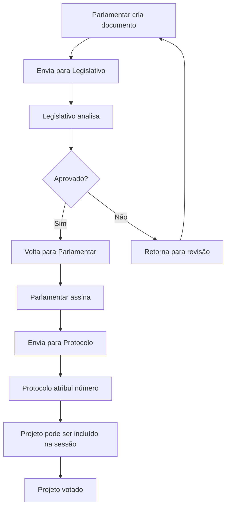

# Prompt para Claude Code - Sistema de Tramitação Parlamentar LegisInc

## Contexto do Projeto

Você está trabalhando no **LegisInc**, um sistema de gestão legislativa em Laravel 12 com interface Metronic. O projeto já possui:

- ✅ Estrutura base com Laravel 12 + PHP 8.2
- ✅ Sistema de usuários com permissões (Spatie Laravel Permission)
- ✅ Interface administrativa com template Metronic
- ✅ Módulos de Projetos, Usuários, Comissões e Parlamentares
- ✅ Sistema de APIs (Mock + Externa)
- ✅ Configuração Docker completa

## Objetivo da Implementação

Implementar um **sistema de tramitação parlamentar** com workflow específico para criação e aprovação de projetos legislativos.

## Fluxo de Tramitação Requerido



## Roles e Permissões Necessárias

### Roles:
- **parlamentar**: Cria documentos, assina projetos
- **legislativo**: Analisa e aprova/rejeita documentos
- **protocolo**: Atribui números de protocolo
- **admin**: Controle total do sistema

### Permissões por Role:
```php
'parlamentar' => [
    'projeto.create',
    'projeto.edit_own',
    'projeto.sign',
    'projeto.view_own'
],
'legislativo' => [
    'projeto.view_all',
    'projeto.analyze',
    'projeto.approve',
    'projeto.reject',
    'tramitacao.manage'
],
'protocolo' => [
    'projeto.view_approved',
    'projeto.assign_number',
    'projeto.include_session'
],
'admin' => ['*']
```

## Estrutura de Dados Requerida

### Tabela: projetos
```sql
- id (PK)
- titulo
- descricao
- tipo_projeto_id (FK)
- autor_id (FK - User parlamentar)
- conteudo (TEXT)
- status (enum: rascunho, enviado, em_analise, aprovado, rejeitado, assinado, protocolado, em_sessao, votado)
- numero_protocolo (nullable)
- data_criacao
- data_assinatura (nullable)
- data_protocolo (nullable)
- observacoes (TEXT nullable)
- timestamps
```

### Tabela: projeto_tramitacao
```sql
- id (PK)
- projeto_id (FK)
- usuario_id (FK)
- status_anterior
- status_atual
- acao (enum: criou, enviou, analisou, aprovou, rejeitou, assinou, protocolou, incluiu_sessao, votou)
- observacoes (TEXT nullable)
- timestamps
```

### Tabela: tipo_projetos
```sql
- id (PK)
- nome (Lei Ordinária, Lei Complementar, Emenda, etc.)
- descricao
- template_conteudo (TEXT)
- ativo (boolean)
- timestamps
```

## Funcionalidades a Implementar

### 1. Dashboard por Role
```php
// Parlamentar: Meus projetos, status, próximas ações
// Legislativo: Projetos para análise, estatísticas
// Protocolo: Projetos para protocolar, numeração
// Admin: Visão geral completa
```

### 2. Sistema de Workflows
```php
// Service: ProjetoWorkflowService
// - enviarParaAnalise()
// - aprovarProjeto()
// - rejeitarProjeto()
// - assinarProjeto()
// - protocolarProjeto()
// - incluirEmSessao()
```

### 3. Notificações
```php
// Sistema de notificações para:
// - Novo projeto para análise
// - Projeto aprovado/rejeitado
// - Projeto aguardando assinatura
// - Projeto protocolado
```

### 4. Interface Específica por Role
```php
// Views organizadas por role:
// - resources/views/parlamentar/projetos/
// - resources/views/legislativo/projetos/
// - resources/views/protocolo/projetos/
```

## Tarefas Específicas para Implementação

### 1. Migrations e Models
- [ ] Criar migration para `projeto_tramitacao`
- [ ] Criar migration para `tipo_projetos`
- [ ] Atualizar model `Projeto` com relacionamentos
- [ ] Criar model `ProjetoTramitacao`
- [ ] Criar model `TipoProjeto`
- [ ] Adicionar scopes por status nos models

### 2. Seeders e Permissions
- [ ] Criar seeder para roles e permissions
- [ ] Criar seeder para tipos de projetos
- [ ] Configurar middleware de permissões nas rotas

### 3. Services e Controllers
- [ ] Criar `ProjetoWorkflowService`
- [ ] Criar `TramitacaoService`
- [ ] Atualizar `ProjetoController` com workflows
- [ ] Criar `TramitacaoController`

### 4. Views e Interface
- [ ] Criar dashboards específicos por role
- [ ] Criar formulários de criação/edição por status
- [ ] Criar timeline de tramitação
- [ ] Implementar sistema de assinatura digital
- [ ] Criar interface de protocolo/numeração

### 5. Testes
- [ ] Testes unitários para WorkflowService
- [ ] Testes de feature para fluxo completo
- [ ] Testes de permissões por role

## Estrutura de Arquivos Sugerida

```
app/
├── Models/
│   ├── Projeto.php (atualizar)
│   ├── ProjetoTramitacao.php (novo)
│   └── TipoProjeto.php (novo)
├── Services/
│   ├── ProjetoWorkflowService.php (novo)
│   └── TramitacaoService.php (novo)
├── Http/Controllers/
│   ├── Projeto/ProjetoController.php (atualizar)
│   └── TramitacaoController.php (novo)
├── Http/Middleware/
│   └── CheckProjetoPermission.php (novo)
└── Policies/
    └── ProjetoPolicy.php (atualizar)

resources/views/
├── parlamentar/
│   └── projetos/
├── legislativo/
│   └── projetos/
└── protocolo/
    └── projetos/

database/
├── migrations/
│   ├── xxxx_create_projeto_tramitacao_table.php
│   └── xxxx_create_tipo_projetos_table.php
└── seeders/
    ├── RolesAndPermissionsSeeder.php
    └── TipoProjetoSeeder.php
```

## Considerações Técnicas

### Padrões do Projeto
- Usar estrutura de Services para lógica de negócio
- Seguir padrão Metronic para interface
- Utilizar DTOs para transferência de dados
- Implementar Policies para autorização
- Usar eventos Laravel para notificações

### Integração com Sistema Existente
- Aproveitar sistema de usuários atual
- Integrar com sistema de permissões Spatie
- Manter compatibilidade com Mock/External API
- Seguir padrões de nomenclatura existentes

### Performance e Escalabilidade
- Implementar cache para consultas frequentes
- Usar eager loading para relacionamentos
- Implementar paginação nas listagens
- Otimizar queries com indices adequados

## Comandos Artisan Personalizados

Criar comandos úteis para o sistema:

```bash
php artisan projeto:workflow status  # Ver status geral
php artisan projeto:migrate-status   # Migrar status antigos
php artisan tramitacao:cleanup       # Limpeza de registros
```

## Pontos de Atenção

1. **Segurança**: Validar permissões em cada etapa
2. **Auditoria**: Registrar todas as ações na tramitação
3. **Integridade**: Garantir que status seguem fluxo correto
4. **Performance**: Otimizar queries com muitos relacionamentos
5. **UX**: Interface intuitiva para cada tipo de usuário

---

**Prioridade de Implementação:**
1. Models e Migrations (base de dados)
2. Services e Workflow (lógica de negócio)
3. Controllers e Rotas (endpoints)
4. Views e Interface (experiência do usuário)
5. Testes e Refinamentos (qualidade)

**Tempo estimado:** 2-3 sprints de desenvolvimento

**Resultado esperado:** Sistema completo de tramitação parlamentar integrado ao LegisInc com interface específica por role e workflow automatizado.