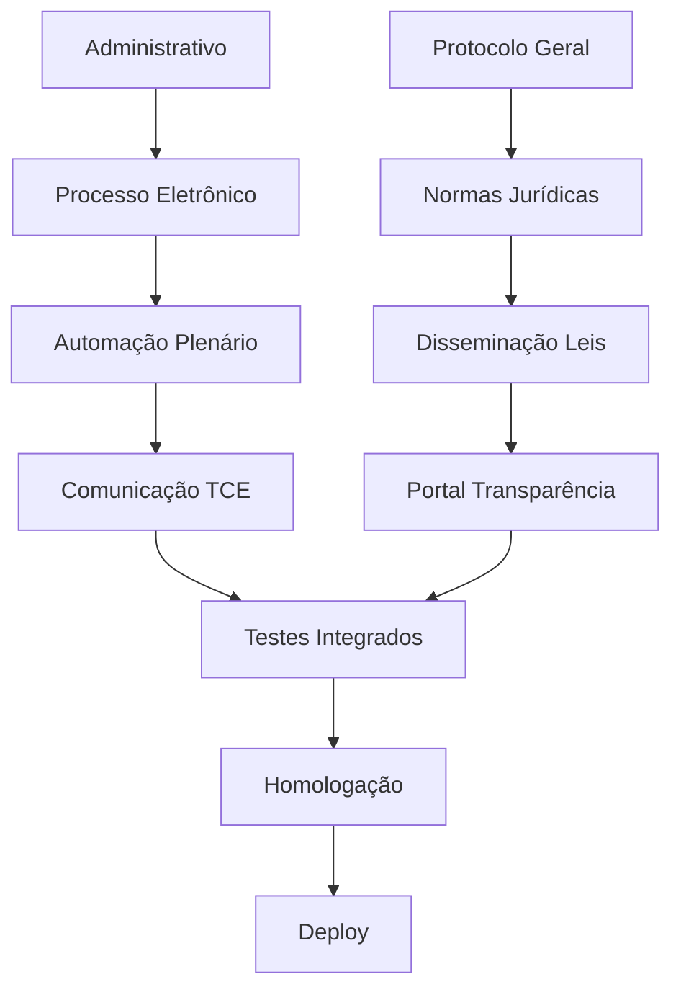

# Acompanhamento de Progresso - Sistema de Tramitação Parlamentar 2.0

## 🔎 Visão Geral

Documento revisado para alinhar o projeto com o **TR da Câmara de Franco da Rocha** e com o **estado atual do Legisinc**. 

Consolidamos:
1. O que já está pronto
2. O que falta para cumprir o TR
3. Um cronograma curto para desenvolvimento, testes, homologação e **deploy**

---

## 📊 Status Atual

- **Módulos Implementados:** **9/25** → **36%** (corrigido; antes constava 35%)
- **Cobertura do TR (módulos obrigatórios):** **9/17** → **53%** (faltam 8 para 100% do TR)
- **Base do Sistema:** mantida como **100%** concluída (stack, autenticação, permissões, containerização e mocks)

### ✅ Estrutura Base (100% Concluída)
- **Stack:** Laravel 12 + PHP 8.2 (mantido como no documento original) + Docker + Vite
- **UI:** Template Metronic + Blade Components + (TailwindCSS utilizado em componentes auxiliares)
- **Autenticação:** Login/Logout/Registro (middleware e JWT/Sanctum conforme ambiente)
- **Permissões:** Spatie Permission (roles e permissões)
- **DevOps:** Docker + Makefile
- **Mocks:** 31 endpoints com cache para desenvolvimento

> **Correção de consistência:** Onde o documento referia-se a “Projetos”, já está migrado para **Proposições**. A seção de arquivos foi atualizada para refletir essa migração (removendo referências ao `ProjetoController`).

### ✅ Módulos Core Implementados (100% Funcionais)

1. **Autenticação e Identidade Digital**
2. **Gestão de Usuários**
3. **Parlamentares e Estrutura** (inclui **Mesa Diretora** e **Partidos**)
4. **Comissões**
5. **Proposições e Tramitação Legislativa** (workflow completo: Criação → Revisão → Assinatura → Protocolo → Tramitação)
6. **Sistema de Parâmetros Modulares** (API real funcional)
7. **Mesa Diretora e Estrutura Organizacional**
8. **Sistema de Partidos Políticos**
9. **Sistema de Documentos Avançado** (editor interno; versionamento; download)

> **Observação:** A edição colaborativa avançada e requisitos de **PDF/A** entram na fase de **Processo Eletrônico** (ver abaixo) para atender às exigências do TR (assinatura ICP‑Brasil, validação e preservação).

---

## 🧭 Delta vs. TR (o que falta para 100% do TR)

### **Módulos a Criar (novos):**

1. **Administrativo** — documentos administrativos, peticionamento, arquivo permanente
2. **Protocolo Geral** — registro/anulação, etiquetas/código de barras/QR
3. **Processo Eletrônico (ICP‑Brasil/PAdES + PDF/A)** — assinatura e validação no fluxo
4. **Normas Jurídicas (+ LexML)** — cadastro/compilação/vigência/publicação
5. **Automação do Plenário** — presença, oradores, cronômetro, pautas/atas, votações
6. **Disseminação de Leis & App do Plenário** — portal pesquisável + acompanhamento em tempo real
7. **Comunicação com Tribunal de Contas (TCE)** — coletas, validações, prazos, portal de auditoria
8. **Portal da Transparência & Contato com Vereadores** — páginas, ouvidoria, notificações

### **Módulos a Finalizar/Adequar (já existem, alinhar a requisitos do TR):**

- **Proposições**: geração de pauta/ata conforme TR; calendários/prazos regimentais; ritos especiais (ex.: LOM em 2 turnos)
- **Usuários/Institucional**: Mesa por legislatura/período; **Comissões** com reuniões/pareceres; **Bancadas/Blocos**
- **Templates**: variáveis extras (quórum, resultado de votação, turnos); validações de conformidade (LC 95/1998)
- **Parâmetros**: cadastros de tipos e ritos regimentais; integrações (LexML/TCE)
- **Permissões**: logs detalhados; MFA opcional; trilha auditável
- **Relatórios**: presença, votação, sessões, tramitações (PDF/Excel/HTML/RSS)
- **Documentos/PDF**: **PDF/A** quando exigido; carimbo de tempo; metadados

---

## 🗓️ Cronograma de Desenvolvimento (Setembro → Outubro/2025)

> **🎯 Meta Principal:** Concluir os **8 módulos faltantes** do TR, realizar testes e homologar até **07/10/2025**

### 📅 Visão Geral do Cronograma

| Semana | Período | Status | Módulos | Entregas Principais |
|--------|---------|---------|---------|-------------------|
| **S1** | 02-06/Set | 🔄 Planejado | 2 módulos | Administrativo + Protocolo Geral |
| **S2** | 09-13/Set | 🔄 Planejado | 2 módulos | Processo Eletrônico + Normas Jurídicas |
| **S3** | 16-20/Set | 🔄 Planejado | 2 módulos | Automação Plenário + Disseminação |
| **S4** | 23-27/Set | 🔄 Planejado | 2 módulos | TCE + Portal Transparência |
| **S5** | 30/Set-07/Out | 🔄 Planejado | Finalização | Testes + Homologação + Deploy |

---

### 🚀 Detalhamento Semanal

#### **📍 SEMANA 1 (02-06 Setembro)** - Fundação Base
**Status:** 🔄 Aguardando início  
**Prioridade:** ALTA

| Módulo | Atividades Principais | Critério de Aceite | Complexidade |
|--------|----------------------|-------------------|--------------|
| **🗂️ Administrativo** | • CRUD documentos administrativos<br>• Sistema de caixas (entrada/rascunhos/enviados)<br>• Arquivo permanente com busca<br>• Auditoria básica | ✅ Funcionalidades básicas operacionais | 🟡 Média |
| **📋 Protocolo Geral** | • Numeração sequencial automática<br>• Sistema de etiquetas/QR Code<br>• Pesquisa avançada<br>• Integração com módulos existentes | ✅ Protocolo funcionando fim-a-fim | 🟡 Média |

**🎯 Entrega S1:** Base sólida para protocolação e documentos administrativos

---

#### **📍 SEMANA 2 (09-13 Setembro)** - Segurança & Normas
**Status:** 🔄 Dependente de S1  
**Prioridade:** CRÍTICA

| Módulo | Atividades Principais | Critério de Aceite | Complexidade |
|--------|----------------------|-------------------|--------------|
| **🔐 Processo Eletrônico** | • Implementação ICP-Brasil/PAdES<br>• Validação PDF/A<br>• Cadeia de confiança<br>• Histórico de assinaturas | ✅ Assinatura digital funcionando | 🔴 Alta |
| **⚖️ Normas Jurídicas** | • CRUD normas + vigência<br>• Exportação LexML<br>• Índice temático<br>• Sistema de busca | ✅ Cadastro e publicação LexML | 🟡 Média |

**🎯 Entrega S2:** Conformidade legal e assinatura digital operacional

---

#### **📍 SEMANA 3 (16-20 Setembro)** - Automação & Portal
**Status:** 🔄 Dependente de S2  
**Prioridade:** ALTA

| Módulo | Atividades Principais | Critério de Aceite | Complexidade |
|--------|----------------------|-------------------|--------------|
| **🏛️ Automação Plenário** | • Sistema de presença<br>• Controle de oradores<br>• Cronômetro de sessão<br>• Painel do presidente | ✅ Sessão plenária automatizada | 🔴 Alta |
| **🌐 Disseminação & App** | • Portal pesquisável<br>• App mobile responsivo<br>• SEO + acessibilidade<br>• Cache + CDN | ✅ Portal público funcional | 🟡 Média |

**🎯 Entrega S3:** Plenário digital e transparência ativa

---

#### **📍 SEMANA 4 (23-27 Setembro)** - Integração Externa
**Status:** 🔄 Dependente de S3  
**Prioridade:** ALTA

| Módulo | Atividades Principais | Critério de Aceite | Complexidade |
|--------|----------------------|-------------------|--------------|
| **🏦 Comunicação TCE** | • Painel de prazos<br>• Validação automática<br>• Portal de auditoria<br>• Registro de envios | ✅ Integração TCE operacional | 🟡 Média |
| **👥 Portal Transparência** | • Páginas por vereador<br>• Sistema de ouvidoria<br>• Notificações push/email<br>• Moderação de conteúdo | ✅ Transparência + contato cidadão | 🟡 Média |

**🎯 Entrega S4:** Compliance total e engajamento cidadão

---

#### **📍 SEMANA 5 (30/Set - 07/Out)** - Validação & Deploy
**Status:** 🔄 Dependente de S1-S4  
**Prioridade:** CRÍTICA

| Fase | Atividades | Duração | Responsável |
|------|------------|---------|-------------|
| **🧪 Testes Integrados** | • Testes funcionais<br>• Performance/carga<br>• Segurança/penetração | 5 dias | Equipe Dev |
| **👥 Homologação** | • Treinamento usuários<br>• Testes de aceitação<br>• Ajustes finais | 2 dias | Usuários-chave |
| **🚀 Deploy Produção** | • Migração dados<br>• Go-live<br>• Monitoramento | 1 dia | DevOps |

**🎯 Entrega S5:** Sistema em produção com qualidade assegurada

---

### 🎯 Marcos Críticos de Validação

| Marco | Data | Critério de Sucesso | Impacto se Falhar |
|-------|------|-------------------|------------------|
| **🏁 Checkpoint S1** | 06/Set | Administrativo + Protocolo 100% | ⚠️ Atraso cascata (baixo) |
| **🔥 Checkpoint S2** | 13/Set | ICP-Brasil funcionando | 🚨 Risco alto no projeto |
| **⚡ Checkpoint S3** | 20/Set | Plenário operacional | ⚠️ Impacto médio |
| **🎯 Checkpoint S4** | 27/Set | Módulos finalizados | ⚠️ Compromete homologação |
| **🚀 Go-Live** | 07/Out | **ENTREGA FINAL** | 🚨 Descumprimento do TR |

---

### 📊 Indicadores de Progresso

#### Progresso Atual
```
📈 Módulos Implementados: ████████████░░░░░░░░░░░░░ 36% (9/25)
📋 Cobertura do TR:       █████████████░░░░░░░░░░░░ 53% (9/17)
🏗️  Infraestrutura:       ████████████████████████ 100%
```

#### Meta de Cada Semana
- **S1:** 📈 +12% → 48% total (11/25 módulos)
- **S2:** 📈 +12% → 60% total (13/25 módulos)  
- **S3:** 📈 +12% → 72% total (15/25 módulos)
- **S4:** 📈 +12% → 84% total (17/25 módulos)
- **S5:** 📈 +16% → **100%** total (25/25 módulos) ✅

---

### ⚠️ Matriz de Riscos por Semana

| Semana | Risco Principal | Probabilidade | Impacto | Mitigação |
|---------|----------------|---------------|---------|-----------|
| S1 | Complexidade CRUD | 🟡 Baixa | 🟢 Baixo | Templates existentes |
| S2 | Certificados ICP-Brasil | 🔴 Alta | 🚨 Crítico | Ambiente de testes preparado |
| S3 | Hardware plenário | 🟡 Média | 🟡 Médio | Fallback sem hardware dedicado |
| S4 | APIs externas TCE | 🟡 Média | 🟡 Médio | Simuladores/mocks |
| S5 | Tempo para ajustes | 🟡 Média | 🟡 Médio | Buffer de contingência |

---

### 🔄 Dependências Entre Módulos



## ✅ Checklists de Aceite (por módulo)

### Administrativo

- [ ] CRUD de documentos administrativos com anexo e metadados
- [ ] Caixas (entrada/rascunhos/enviados) e recebimento
- [ ] Arquivo permanente com pesquisa
- [ ] Auditoria de eventos

### Protocolo Geral

- [ ] Numeração sequencial e anulação com trilha
- [ ] Impressão de etiquetas (direto/código de barras/QR)
- [ ] Pesquisa por número/origem/período
- [ ] Integração com Proposições/Administrativo

### Processo Eletrônico (ICP‑Brasil/PAdES, PDF/A)

- [ ] Assinatura PAdES; cadeia de confiança verificada
- [ ] Validação de integridade + carimbo de tempo
- [ ] Geração/validação PDF/A quando exigido
- [ ] Históricos de assinatura e logs

### Normas Jurídicas (+ LexML)

- [ ] Cadastro/compilação com controle de vigência
- [ ] Índice temático e relacionamentos
- [ ] Exportação/publicação LexML
- [ ] Busca por nº/ano/assunto/palavra-chave

### Automação do Plenário

- [ ] Presenças, oradores, cronômetro, pauta/ata
- [ ] Votação nominal/simbólica + relatórios
- [ ] Painel do presidente/operador
- [ ] Integração multimídia (opcional escalável)

### Disseminação de Leis & App do Plenário

- [ ] Repositório pesquisável de normas/pautas/resultados
- [ ] App/web mobile com atualização em tempo real
- [ ] SEO/acessibilidade/caching/CDN
- [ ] Exportações (PDF/RSS/CSV quando aplicável)

### Comunicação com TCE

- [ ] Painel de prazos e pendências
- [ ] Validação de formato/tamanho/nomenclatura
- [ ] Registro/protocolo de envios
- [ ] Portal de auditoria (respeitando LGPD/sigilo)

### Transparência & Contato com Vereadores

- [ ] Páginas por vereador com contatos/redes
- [ ] Ouvidoria/Fale com vereador (gera protocolo)
- [ ] Notificações (e‑mail/push) e assinaturas
- [ ] Moderação + auditoria

## 🧱 Arquitetura Técnica (ajustes pontuais)

- **Backend:** Laravel 12 + PHP 8.2; PostgreSQL; Cache; Queue
- **Frontend:** Metronic (Bootstrap) + Blade; componentes auxiliares com Tailwind quando necessário
- **Docs/Assinaturas:** Editor interno + pipeline PDF/A; assinatura ICP‑Brasil/PAdES no módulo Processo Eletrônico
- **Integrações:** LexML (Normas); TCE (Comunicação)
- **Permissões/Auditoria:** Spatie Permission; logs detalhados por módulo e evento

## 🗂️ Estrutura de Arquivos (corrigida)

### 📁 Módulos Implementados:

```
├── app/Http/Controllers/
│   ├── Auth/AuthController.php ✅
│   ├── User/UserController.php ✅
│   ├── Parlamentar/ParlamentarController.php ✅
│   ├── Comissao/ComissaoController.php ✅
│   ├── Proposicao/ProposicaoController.php ✅
│   ├── Proposicao/ProposicaoLegislativoController.php ✅
│   ├── Proposicao/ProposicaoAssinaturaController.php ✅
│   ├── Proposicao/ProposicaoProtocoloController.php ✅
│   ├── Parametro/ParametroController.php ✅
│   └── Mock/MockApiController.php ✅ (31 endpoints)
├── app/Services/ (Service Layer + ParametroService + Auditoria/Cache)
├── resources/views/modules/ (usuarios, parlamentares, comissoes, proposicoes, admin/parametros, etc.)
├── routes/api.php (endpoints reais de parâmetros + mocks)
└── docs/
    ├── apiDocumentation.md ✅
    └── api-implementation-checklist.md ✅
```
## ⚠️ Riscos & Mitigações (resumo)

- **ICP‑Brasil/PAdES/PDF‑A:** padronizar biblioteca/serviço; testar certificados reais; cenários multi‑assinatura
- **LexML:** mapear metadados/ontologias; testes de round‑trip (import/export)
- **Plenário/Multimídia:** prever fallback sem hardware dedicado; logs completos de sessão
- **Prazos TCE:** calendário oficial + alertas; validações automáticas impedindo erro humano
- **Segurança/LGPD:** revisão de perfis de acesso; anonimização/minimização em portais públicos

## 📈 Métricas e Progresso (atualizadas)

- **Implementados:** 9/25 (36%) — base sólida para acelerar
- **TR Cobertura:** 9/17 (53%) — meta 100% até 2025-10-07
- **Infra/DevOps/Permissões:** 100% para suportar S1–S5
- **Qualidade:** padrões PSR-12, validações e documentação mantidas

## ✅ Próximas Ações Imediatas

- **S1 Kickoff (09/02):** criar branches e checklists por módulo (Administrativo, Protocolo)
- **S2 Preparação:** decidir pipeline PAdES/PDF‑A e esquema LexML (campos/validações)
- **S3–S4:** consolidar Plenário e Portais; iniciar TCE
- **S5:** testes integrados (funcionais, carga e segurança), homologação, deploy

---

Este documento substitui a versão de 2025‑07‑27 onde necessário, corrigindo a porcentagem geral, removendo referências a "Projetos" na estrutura, e incluindo o plano tático de setembro 2025 para cumprimento do TR.
