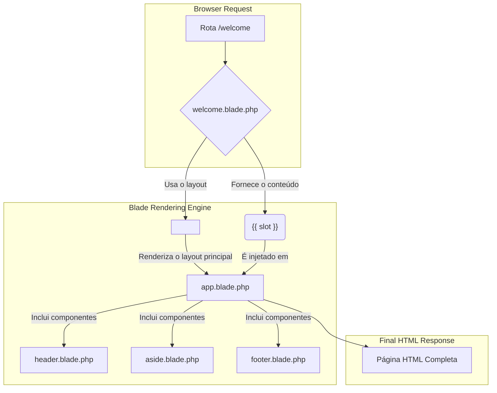
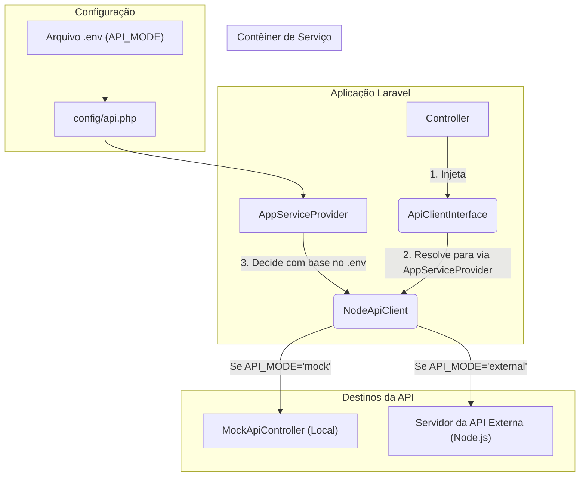

# Explicação do Fluxo do Projeto

Este documento detalha o fluxo de renderização de views e a comunicação com a API no projeto, ilustrando como os componentes do frontend e backend se interconectam.

## 🎨 Fluxo de Renderização do Frontend (Blade)

A estrutura do frontend é baseada em componentes Blade, o que promove a reutilização e a organização do código. O fluxo principal é o seguinte:

1.  **View de Página**: Uma view específica, como `resources/views/welcome.blade.php`, é chamada por uma rota. Esta view é responsável pelo conteúdo principal da página.
2.  **Layout Principal**: A view da página utiliza o componente de layout principal, `<x-layouts.app>`, para herdar toda a estrutura HTML, incluindo cabeçalho, menu lateral e rodapé.
3.  **Componente `app.blade.php`**: Este é o arquivo de layout central, localizado em `resources/views/components/layouts/app.blade.php`. Ele define a estrutura geral da página e inclui os componentes globais:
    *   `<x-layouts.header />`: O cabeçalho da página.
    *   `<x-layouts.aside.aside />`: O menu lateral (sidebar).
    *   `<x-layouts.footer />`: O rodapé.
4.  **Injeção de Conteúdo**: O `app.blade.php` usa a variável `{{ $slot }}` para injetar o conteúdo específico da view da página (como `welcome.blade.php`) no local apropriado do layout.

### Diagrama do Fluxo de Views



## 🔌 Fluxo de Comunicação com a API

O sistema de comunicação com a API foi projetado para ser flexível, permitindo alternar facilmente entre um **servidor de mock local** (para desenvolvimento) e uma **API externa real** (para produção).

O coração dessa flexibilidade está na abstração do cliente da API.

1.  **Arquivo de Configuração (`config/api.php`)**: Este arquivo centraliza todas as configurações da API. A chave mais importante é `'mode'`, que pode ser definida como `'mock'` or `'external'` através da variável de ambiente `API_MODE`. O arquivo contém as URLs base e os endpoints específicos para cada modo.

2.  **Service Provider (`AppServiceProvider.php`)**: Ele registra a interface `ApiClientInterface` no contêiner de serviço do Laravel. Ao resolver essa interface, ele verifica o `config('api.mode')` e instancia o `NodeApiClient` com as configurações corretas (seja para o mock ou para a API externa).

3.  **Cliente Inteligente (`NodeApiClient.php`)**: Esta classe implementa a `ApiClientInterface`. Ela é "inteligente" porque seu comportamento se adapta com base na configuração que recebe do `AppServiceProvider`.
    *   **Modo Mock**: As requisições são direcionadas para o `MockApiController` local (`/api/mock-api/*`). A autenticação com JWT é ignorada.
    *   **Modo External**: As requisições são direcionadas para a URL da API externa definida em `EXTERNAL_API_URL`. A autenticação com JWT é tratada, armazenando e enviando o token automaticamente.

4.  **Controlador de Mock (`MockApiController.php`)**: Quando em modo `mock`, este controlador intercepta as chamadas e retorna respostas pré-definidas, simulando o comportamento da API real. Ele usa o sistema de cache do Laravel para persistir dados temporariamente (ex: usuários recém-criados).

### Diagrama do Fluxo da API



### Como Alternar o Modo da API

Você pode alternar o modo da API facilmente usando o comando Artisan personalizado:

```bash
# Para usar a API de mock
php artisan api:mode mock

# Para usar a API externa
php artisan api:mode external

# Para verificar o status atual
php artisan api:mode --status
```
Ou alterando diretamente a variável no seu arquivo `.env`:
```
API_MODE=mock
``` 