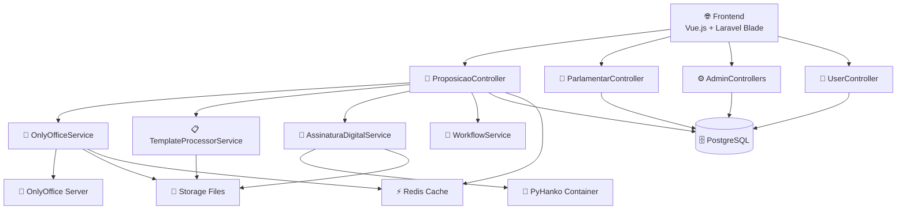
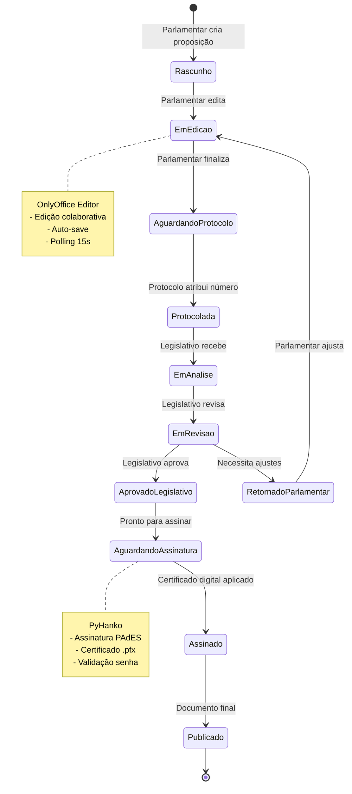
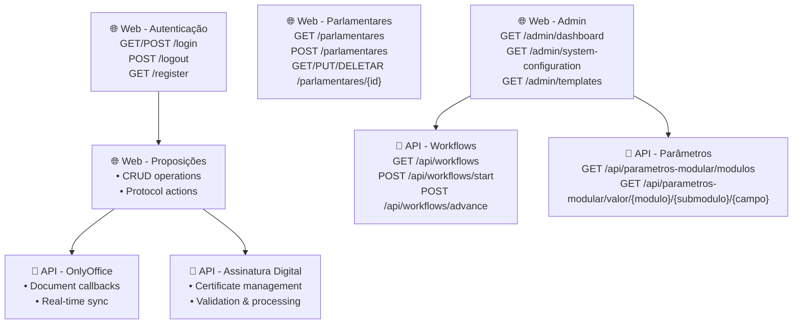
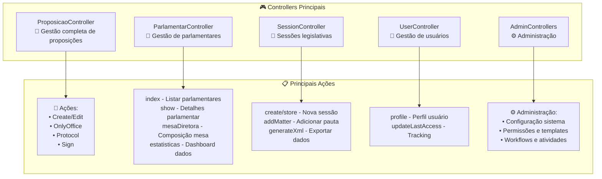
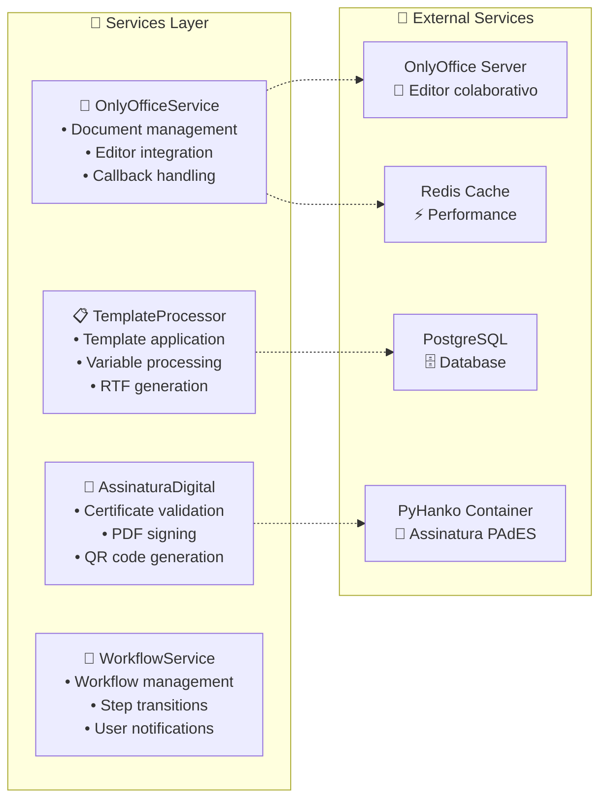
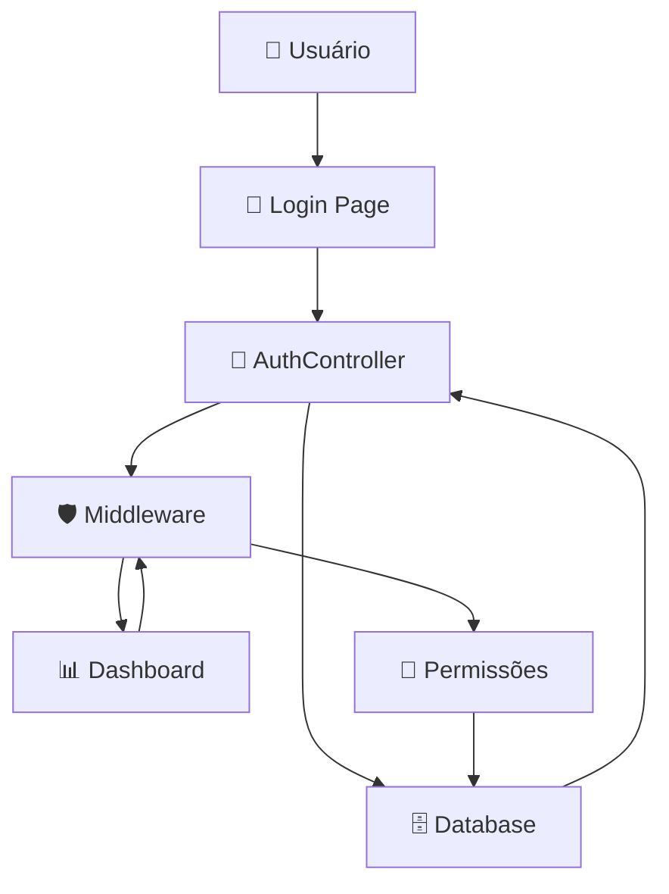
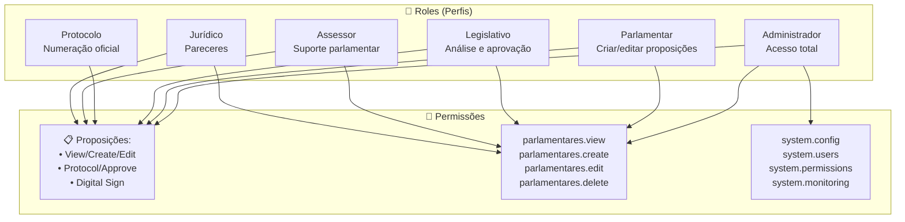
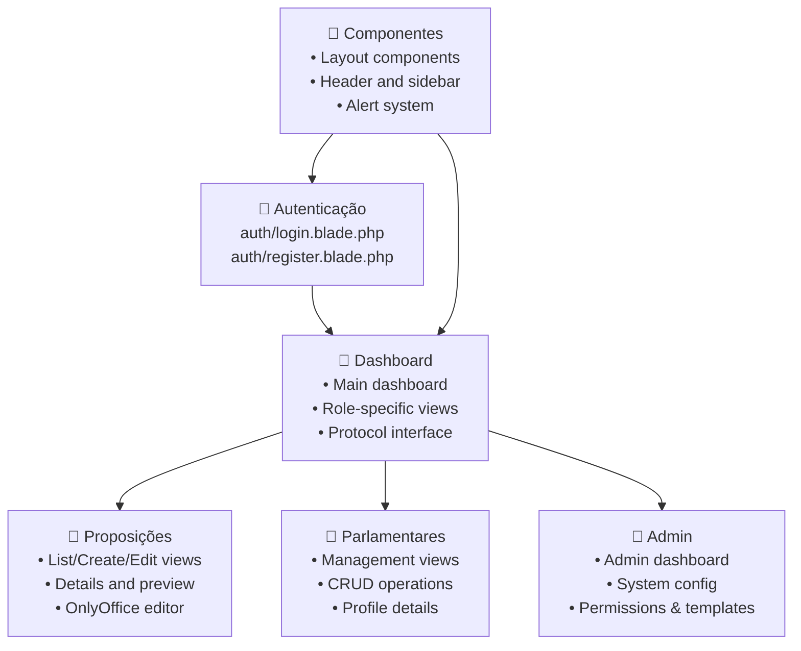

# Visão Geral do Projeto LegisInc

Este documento fornece uma análise detalhada da arquitetura, tecnologias e estrutura do sistema LegisInc v2.1 Enterprise.

## 📊 Mapa Completo do Sistema - Arquitetura e Fluxos

### Diagrama Principal - Visão Geral do Sistema



### Fluxo de Proposições - Ciclo de Vida Completo



### Rotas e Endpoints - Mapeamento Completo



### Controllers e suas Responsabilidades



### Services e Integrações



### Fluxo de Autenticação e Permissões



### Estrutura de Permissões (RBAC)



### Telas/Views Principais do Sistema



## 1. Sistema de Gestão Legislativa

O LegisInc é um sistema completo de gestão legislativa com foco na digitalização de processos parlamentares, especialmente proposições e documentação oficial.

### 1.1. Configuração Atual

- **Ambiente:** Câmara Municipal de Caraguatatuba
- **Endereço:** Praça da República, 40, Centro, Caraguatatuba-SP
- **Acesso Principal:** `http://localhost:8001`
- **Comando de Inicialização:** `docker exec -it legisinc-app php artisan migrate:fresh --seed`

## 2. Ambiente de Desenvolvimento (Docker)

### 2.1. Estrutura do Container

- **Servidor Web:** Nginx
- **Processador PHP:** PHP-FPM 8.2
- **Base:** Imagem Docker baseada em `php:8.2-fpm-alpine`
- **Banco de Dados:** PostgreSQL containerizado
- **Editor de Documentos:** OnlyOffice Document Server integrado

## 3. Usuários do Sistema

O sistema possui usuários pré-configurados com diferentes níveis de acesso:

- **Administrador:** bruno@sistema.gov.br / 123456
- **Parlamentar:** jessica@sistema.gov.br / 123456  
- **Legislativo:** joao@sistema.gov.br / 123456
- **Protocolo:** roberto@sistema.gov.br / 123456
- **Expediente:** expediente@sistema.gov.br / 123456
- **Assessor Jurídico:** juridico@sistema.gov.br / 123456

## 4. Arquitetura do Backend (Laravel)

### 4.1. Recursos Principais v2.1

✅ **OnlyOffice 100% funcional** - Preserva todas as alterações  
✅ **Priorização de arquivos salvos** - Sistema prioriza edições sobre templates  
✅ **Polling Realtime** - Detecta mudanças automaticamente em 15s  
✅ **Performance otimizada** - Cache inteligente + 70% redução I/O  
✅ **Interface Vue.js** - Atualizações em tempo real  
✅ **PDF de assinatura** - Sempre usa versão mais recente  
✅ **Parágrafos preservados** - Quebras de linha funcionam no OnlyOffice  
✅ **Permissões por role** - Sistema inteligente de autorizações

### 4.2. Sistema de Templates

- **23 tipos de proposições** com templates LC 95/1998
- **Template de Moção funcional** (ID: 6)
- **RTF com codificação UTF-8** para acentuação portuguesa
- **Processamento de imagem automático** do cabeçalho
- **Template Universal** com prioridade garantida

### 4.3. Fluxo de Proposições

1. **Parlamentar** cria proposição → Template aplicado automaticamente
2. **Sistema** detecta tipo e aplica template correspondente
3. **Parlamentar** edita documento no OnlyOffice
4. **Protocolo** atribui número oficial (ex: 0001/2025)
5. **Legislativo** recebe para análise e aprovação
6. **Assinatura Digital** com certificados .pfx/.p12

### 4.4. Controle de Acesso e Segurança

- Sistema **RBAC** (Role-Based Access Control)
- Middleware `check.permission` protege rotas críticas
- Permissões específicas por módulo (parlamentares.view, comissoes.create)
- **Assinatura digital** integrada com certificados digitais

### 4.5. Comunicação com Banco de Dados

- **PostgreSQL** containerizado para performance avançada
- Models Eloquent em `app/Models/`
- Seeders automatizados para dados iniciais

## 5. Arquitetura do Frontend

### 5.1. Tecnologias

- **Templates:** Laravel Blade como motor principal
- **Estilização:** Tailwind CSS (utility-first approach)
- **JavaScript:** Vue.js para componentes interativos + Vanilla JS
- **HTTP Client:** Axios para requisições às APIs
- **Editor:** OnlyOffice Document Server integrado

### 5.2. Componentes Principais

- **Componentes Blade** reutilizáveis em `resources/views/components`
- **Layouts responsivos** em `resources/views/components/layouts`
- **Interface Vue.js** para atualizações em tempo real
- **Polling realtime** para sincronização automática (15s)

### 5.3. Integração OnlyOffice

- **Editor colaborativo** para documentos RTF
- **Preservação automática** de todas as alterações
- **Priorização inteligente** de arquivos salvos sobre templates
- **Sincronização em tempo real** entre usuários

## 6. Numeração de Proposições

**Fluxo legislativo:**
1. **Criação:** Exibe `[AGUARDANDO PROTOCOLO]`
2. **Após protocolar:** Exibe número oficial (`0001/2025`)
3. **Apenas o Protocolo** pode atribuir números oficiais

## 7. Assinatura Digital

### 7.1. Certificados Suportados
- Arquivos **.pfx/.p12** para assinatura
- **Validação de senha** antes da assinatura
- **Integração PyHanko** para padrão PAdES

### 7.2. Processo de Assinatura
1. Upload do certificado digital (.pfx)
2. Validação da senha do certificado
3. Assinatura automática do PDF final
4. Verificação da integridade da assinatura

## 8. Arquivos Críticos

### 8.1. Processamento
- `/app/Services/OnlyOffice/OnlyOfficeService.php`
- `/app/Services/Template/TemplateProcessorService.php`
- `/app/Services/AssinaturaDigitalService.php`

### 8.2. Seeders
- `/database/seeders/DatabaseSeeder.php` - Orquestrador principal
- `/database/seeders/TipoProposicaoTemplatesSeeder.php` - Templates
- `/database/seeders/ParametrosTemplatesSeeder.php` - Parâmetros

### 8.3. Scripts de Validação
```bash
./scripts/validacao-final-completa.sh       # Validação recomendada
./scripts/teste-migrate-fresh-completo.sh   # Teste completo
./scripts/validar-pdf-otimizado.sh          # Validação rápida
```

## 9. Status Atual - v2.1 Enterprise

**🎊 SISTEMA 100% OPERACIONAL**

- ✅ OnlyOffice integrado com polling realtime
- ✅ Templates automatizados (23 tipos)
- ✅ Assinatura digital funcional
- ✅ PDF sempre atualizado
- ✅ Performance otimizada (70% redução I/O)
- ✅ Interface Vue.js responsiva
- ✅ Certificação digital integrada

**Última atualização:** 05/09/2025 