# Visão Geral do Projeto LegisInc

Este documento fornece uma análise detalhada da arquitetura, tecnologias e estrutura do sistema LegisInc v2.1 Enterprise.

## 📊 Mapa Completo do Sistema - Arquitetura e Fluxos

### Diagrama Principal - Arquitetura com Gateway e Múltiplos Backends

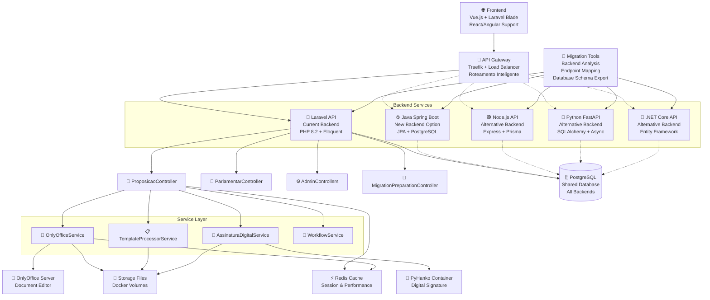

### Fluxo de Proposições - Ciclo de Vida Completo

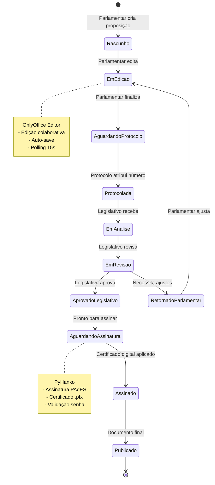

### Gateway e Roteamento Inteligente - Nova Arquitetura

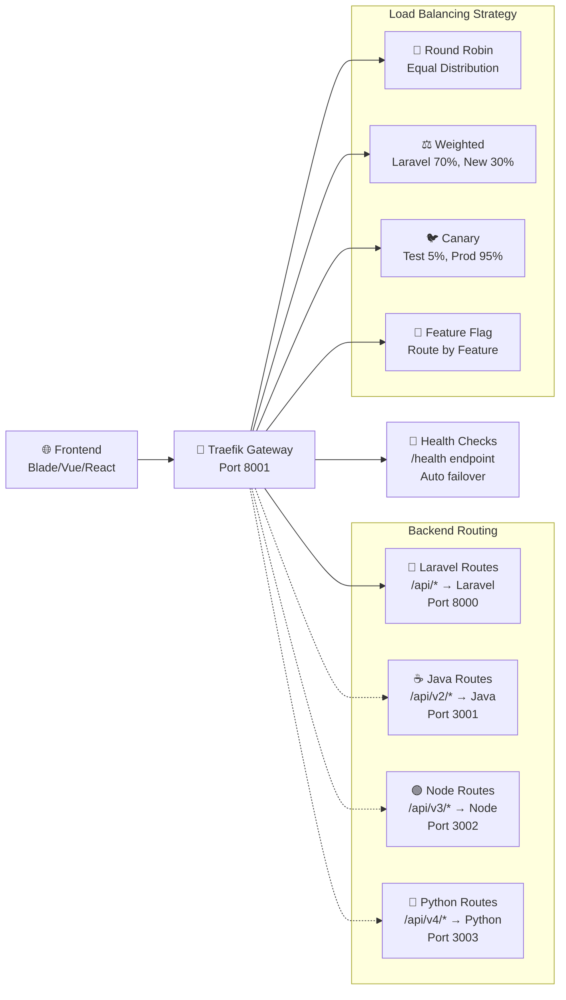

### Migration Tools e Backend Analysis

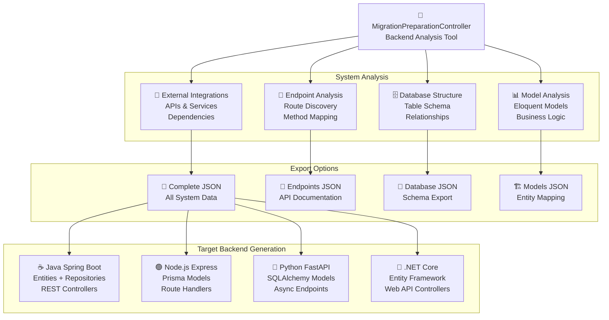

### Rotas e Endpoints - Mapeamento Completo

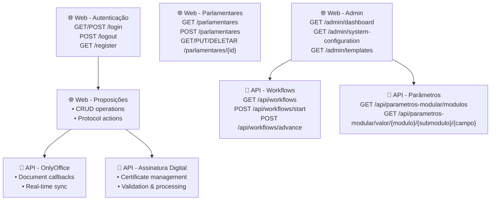

### Controllers e suas Responsabilidades

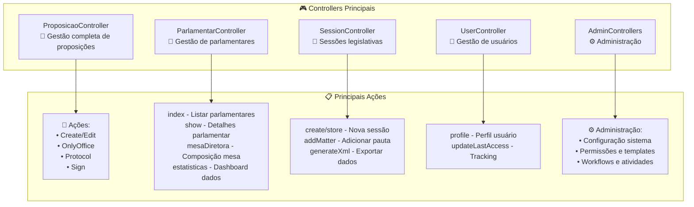

### Services e Integrações

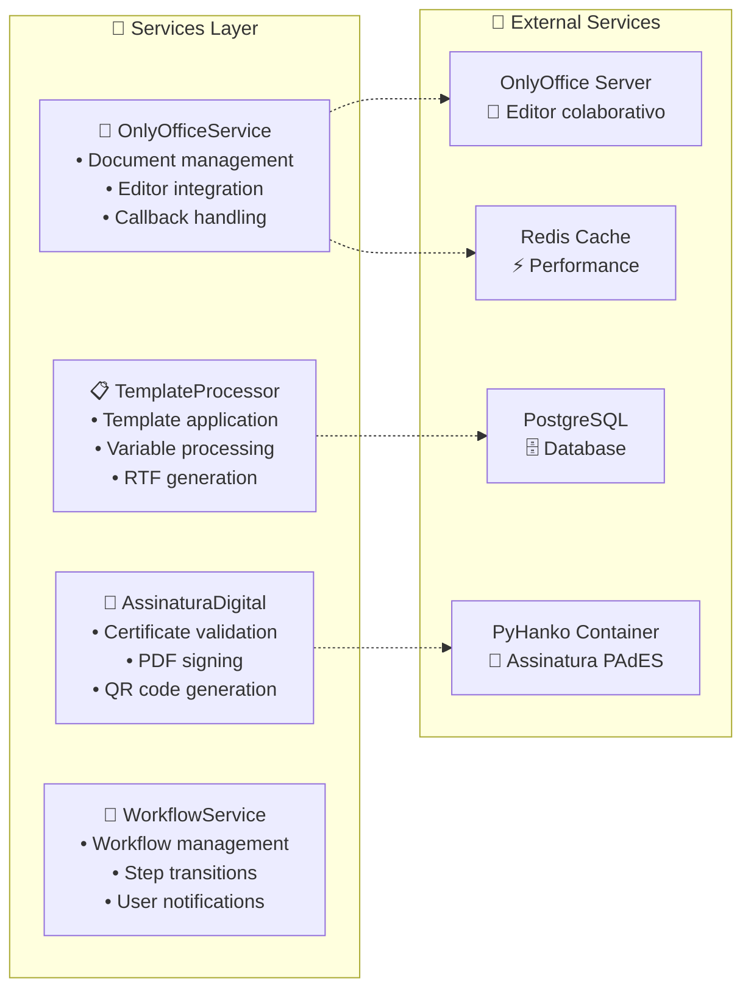

### Fluxo de Autenticação e Permissões

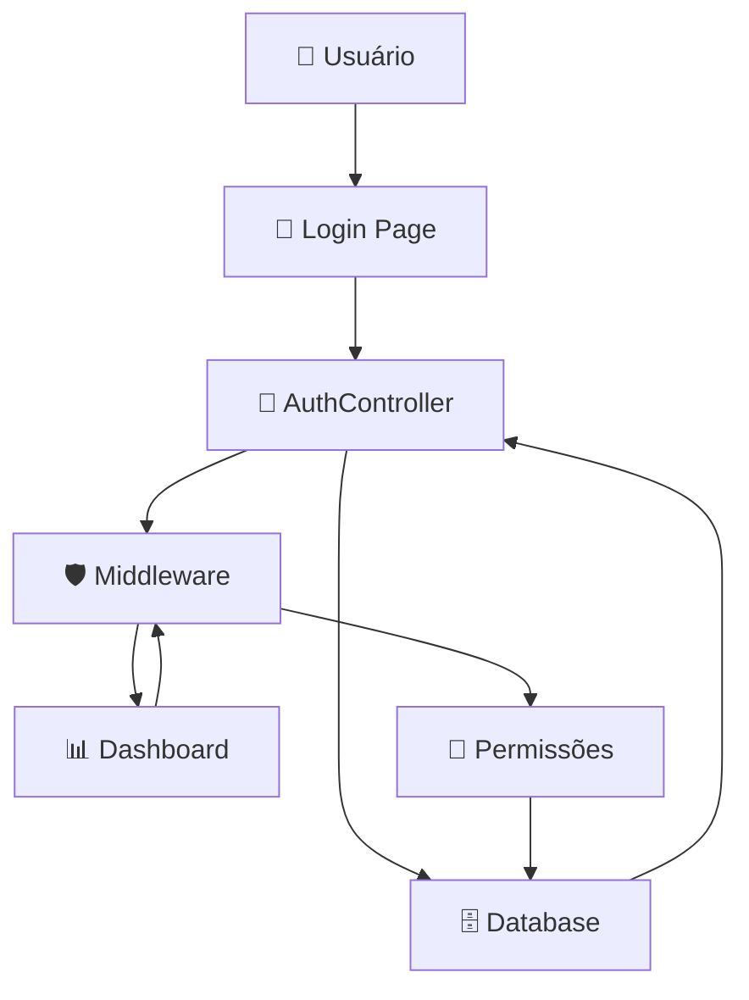

### Estrutura de Permissões (RBAC)

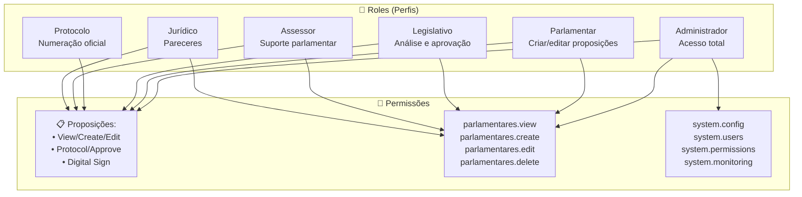

### Telas/Views Principais do Sistema

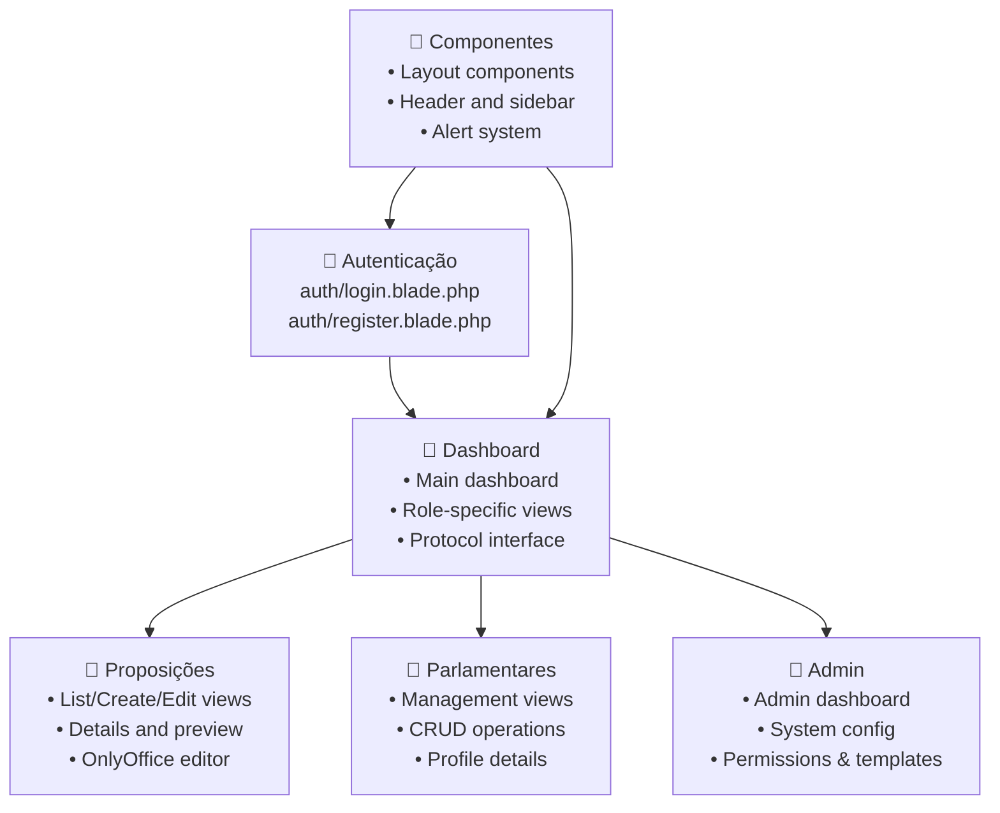

## 1. Sistema de Gestão Legislativa

O LegisInc é um sistema completo de gestão legislativa com foco na digitalização de processos parlamentares, especialmente proposições e documentação oficial.

### 1.1. Configuração Atual

- **Ambiente:** Câmara Municipal de Caraguatatuba
- **Endereço:** Praça da República, 40, Centro, Caraguatatuba-SP
- **Acesso Principal:** `http://localhost:8001`
- **Comando de Inicialização:** `docker exec -it legisinc-app php artisan migrate:fresh --seed`

## 2. Nova Arquitetura de Containers

### 2.1. Stack de Containers com Gateway

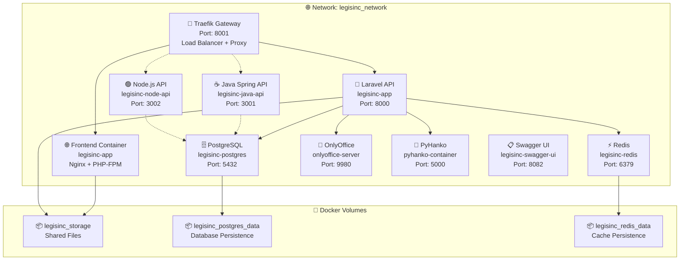

### 2.2. Configuração Docker Compose

#### docker-compose.gateway.yml (Nova Arquitetura)
```yaml
version: '3.8'

services:
  # API Gateway
  traefik:
    image: traefik:v2.10
    container_name: legisinc-gateway
    command:
      - "--api.insecure=true"
      - "--providers.docker=true"
      - "--entrypoints.web.address=:8001"
    ports:
      - "8001:8001"  # Main access port
      - "8080:8080"  # Traefik dashboard
    volumes:
      - /var/run/docker.sock:/var/run/docker.sock
    networks:
      - legisinc_network

  # Laravel Backend (Legacy)
  laravel-app:
    build: .
    container_name: legisinc-app
    labels:
      - "traefik.enable=true"
      - "traefik.http.routers.laravel.rule=PathPrefix(`/api/`)"
      - "traefik.http.services.laravel.loadbalancer.server.port=8000"
    networks:
      - legisinc_network

  # Java Spring Boot Backend (New)
  java-api:
    build: ./java-backend
    container_name: legisinc-java-api
    labels:
      - "traefik.enable=true"
      - "traefik.http.routers.java.rule=PathPrefix(`/api/v2/`)"
      - "traefik.http.services.java.loadbalancer.server.port=3001"
    environment:
      - SPRING_DATASOURCE_URL=jdbc:postgresql://legisinc-postgres:5432/legisinc
    networks:
      - legisinc_network

  # Shared Database
  postgres:
    image: postgres:15
    container_name: legisinc-postgres
    environment:
      POSTGRES_DB: legisinc
      POSTGRES_USER: postgres
      POSTGRES_PASSWORD: 123456
    volumes:
      - legisinc_postgres_data:/var/lib/postgresql/data
    networks:
      - legisinc_network

networks:
  legisinc_network:
    driver: bridge

volumes:
  legisinc_postgres_data:
  legisinc_storage:
  legisinc_redis_data:
```

### 2.3. Estratégias de Deploy

#### Estratégia 1: Canary Deployment
```yaml
# Traefik: 95% Laravel, 5% Java
labels:
  - "traefik.http.routers.laravel.rule=PathPrefix(`/api/`) && (!Header(`X-Test-Backend`, `java`))"
  - "traefik.http.routers.java.rule=PathPrefix(`/api/`) && Header(`X-Test-Backend`, `java`)"
```

#### Estratégia 2: Weighted Load Balancing
```yaml
# Traefik: 70% Laravel, 30% Java
labels:
  - "traefik.http.services.laravel.loadbalancer.weight=70"
  - "traefik.http.services.java.loadbalancer.weight=30"
```

#### Estratégia 3: Feature Flag Routing
```yaml
# Route by feature flag
labels:
  - "traefik.http.routers.laravel.rule=PathPrefix(`/api/`) && (!Query(`backend`, `java`))"
  - "traefik.http.routers.java.rule=PathPrefix(`/api/`) && Query(`backend`, `java`)"
```

## 3. Ambiente de Desenvolvimento (Docker Legacy)

### 2.1. Estrutura do Container

- **Servidor Web:** Nginx
- **Processador PHP:** PHP-FPM 8.2
- **Base:** Imagem Docker baseada em `php:8.2-fpm-alpine`
- **Banco de Dados:** PostgreSQL containerizado
- **Editor de Documentos:** OnlyOffice Document Server integrado

## 3. Usuários do Sistema

O sistema possui usuários pré-configurados com diferentes níveis de acesso:

- **Administrador:** bruno@sistema.gov.br / 123456
- **Parlamentar:** jessica@sistema.gov.br / 123456  
- **Legislativo:** joao@sistema.gov.br / 123456
- **Protocolo:** roberto@sistema.gov.br / 123456
- **Expediente:** expediente@sistema.gov.br / 123456
- **Assessor Jurídico:** juridico@sistema.gov.br / 123456

## 4. Nova Arquitetura Multi-Backend

### 4.1. Gateway e Roteamento Inteligente

O sistema agora suporta uma **arquitetura híbrida** com múltiplos backends através de um **API Gateway** baseado em Traefik:

- **🚪 Gateway Centralizado:** Traefik na porta 8001 gerencia todo o tráfego
- **🔄 Roteamento por Path:** `/api/*` → Laravel, `/api/v2/*` → Java, etc.
- **⚖️ Load Balancing:** Distribuição inteligente de carga entre backends
- **💓 Health Checks:** Monitoramento automático e failover
- **🐦 Canary Deployment:** Teste gradual de novos backends

### 4.2. Ferramentas de Migração

#### MigrationPreparationController
Novo controller especializado em análise e preparação para migração de backend:

**Funcionalidades principais:**
- **📍 Análise de Endpoints:** Mapeamento completo de todas as rotas do sistema
- **🗄️ Estrutura de Banco:** Export detalhado do schema PostgreSQL com relacionamentos
- **📊 Análise de Models:** Extração de entidades Eloquent, relacionamentos e regras
- **🔌 Integrações Externas:** Identificação de APIs, filas e dependências
- **📄 Export JSON:** Geração de documentação completa para novos backends

**Endpoints disponíveis:**
```
GET  /admin/migration-preparation          # Interface principal
POST /admin/migration-preparation/endpoints # JSON com todos endpoints
POST /admin/migration-preparation/database  # Estrutura completa do banco
POST /admin/migration-preparation/models    # Análise dos Models Eloquent
POST /admin/migration-preparation/complete  # Export completo do sistema
```

### 4.3. Backends Suportados

O sistema foi projetado para suportar múltiplos backends mantendo **compatibilidade total** com o frontend:

| Backend | Status | Porta | Path Pattern | Tecnologia |
|---------|--------|-------|--------------|------------|
| **Laravel** | ✅ Atual | 8000 | `/api/*` | PHP 8.2 + Eloquent |
| **Java Spring** | 🔄 Em desenvolvimento | 3001 | `/api/v2/*` | Java 17 + JPA |
| **Node.js** | 📋 Planejado | 3002 | `/api/v3/*` | Express + Prisma |
| **Python FastAPI** | 📋 Planejado | 3003 | `/api/v4/*` | Python + SQLAlchemy |
| **ASP.NET Core** | 📋 Planejado | 3004 | `/api/v5/*` | C# + Entity Framework |

### 4.4. Estratégias de Migração

#### Migração Gradual por Funcionalidade
1. **Fase 1:** Endpoints GET simples (consultas sem side-effects)
2. **Fase 2:** Endpoints POST/PUT (operações CRUD)
3. **Fase 3:** Funcionalidades complexas (OnlyOffice, Assinatura)
4. **Fase 4:** Migração completa e descomissionamento do Laravel

#### Compatibilidade de APIs
- **Mesmo formato JSON:** Responses idênticas entre backends
- **Mesma estrutura de erros:** Códigos HTTP e mensagens padronizadas
- **Headers compatíveis:** CORS, autenticação e cache mantidos
- **Versionamento:** Suporte a múltiplas versões da API

## 5. Arquitetura do Backend (Laravel Legacy)

### 4.1. Recursos Principais v2.1

✅ **OnlyOffice 100% funcional** - Preserva todas as alterações  
✅ **Priorização de arquivos salvos** - Sistema prioriza edições sobre templates  
✅ **Polling Realtime** - Detecta mudanças automaticamente em 15s  
✅ **Performance otimizada** - Cache inteligente + 70% redução I/O  
✅ **Interface Vue.js** - Atualizações em tempo real  
✅ **PDF de assinatura** - Sempre usa versão mais recente  
✅ **Parágrafos preservados** - Quebras de linha funcionam no OnlyOffice  
✅ **Permissões por role** - Sistema inteligente de autorizações

### 4.2. Sistema de Templates

- **23 tipos de proposições** com templates LC 95/1998
- **Template de Moção funcional** (ID: 6)
- **RTF com codificação UTF-8** para acentuação portuguesa
- **Processamento de imagem automático** do cabeçalho
- **Template Universal** com prioridade garantida

### 4.3. Fluxo de Proposições

1. **Parlamentar** cria proposição → Template aplicado automaticamente
2. **Sistema** detecta tipo e aplica template correspondente
3. **Parlamentar** edita documento no OnlyOffice
4. **Protocolo** atribui número oficial (ex: 0001/2025)
5. **Legislativo** recebe para análise e aprovação
6. **Assinatura Digital** com certificados .pfx/.p12

### 4.4. Controle de Acesso e Segurança

- Sistema **RBAC** (Role-Based Access Control)
- Middleware `check.permission` protege rotas críticas
- Permissões específicas por módulo (parlamentares.view, comissoes.create)
- **Assinatura digital** integrada com certificados digitais

### 4.5. Comunicação com Banco de Dados

- **PostgreSQL** containerizado para performance avançada
- Models Eloquent em `app/Models/`
- Seeders automatizados para dados iniciais

## 5. Arquitetura do Frontend

### 5.1. Tecnologias

- **Templates:** Laravel Blade como motor principal
- **Estilização:** Tailwind CSS (utility-first approach)
- **JavaScript:** Vue.js para componentes interativos + Vanilla JS
- **HTTP Client:** Axios para requisições às APIs
- **Editor:** OnlyOffice Document Server integrado

### 5.2. Componentes Principais

- **Componentes Blade** reutilizáveis em `resources/views/components`
- **Layouts responsivos** em `resources/views/components/layouts`
- **Interface Vue.js** para atualizações em tempo real
- **Polling realtime** para sincronização automática (15s)

### 5.3. Integração OnlyOffice

- **Editor colaborativo** para documentos RTF
- **Preservação automática** de todas as alterações
- **Priorização inteligente** de arquivos salvos sobre templates
- **Sincronização em tempo real** entre usuários

## 6. Numeração de Proposições

**Fluxo legislativo:**
1. **Criação:** Exibe `[AGUARDANDO PROTOCOLO]`
2. **Após protocolar:** Exibe número oficial (`0001/2025`)
3. **Apenas o Protocolo** pode atribuir números oficiais

## 7. Assinatura Digital

### 7.1. Certificados Suportados
- Arquivos **.pfx/.p12** para assinatura
- **Validação de senha** antes da assinatura
- **Integração PyHanko** para padrão PAdES

### 7.2. Processo de Assinatura
1. Upload do certificado digital (.pfx)
2. Validação da senha do certificado
3. Assinatura automática do PDF final
4. Verificação da integridade da assinatura

## 8. Arquivos Críticos

### 8.1. Processamento
- `/app/Services/OnlyOffice/OnlyOfficeService.php`
- `/app/Services/Template/TemplateProcessorService.php`
- `/app/Services/AssinaturaDigitalService.php`

### 8.2. Seeders
- `/database/seeders/DatabaseSeeder.php` - Orquestrador principal
- `/database/seeders/TipoProposicaoTemplatesSeeder.php` - Templates
- `/database/seeders/ParametrosTemplatesSeeder.php` - Parâmetros

### 8.3. Scripts de Validação
```bash
./scripts/validacao-final-completa.sh       # Validação recomendada
./scripts/teste-migrate-fresh-completo.sh   # Teste completo
./scripts/validar-pdf-otimizado.sh          # Validação rápida
```

## 9. Status Atual - v2.2 Multi-Backend Architecture

**🎊 SISTEMA 100% OPERACIONAL + NOVA ARQUITETURA**

### Core Features (v2.1 Legacy)
- ✅ OnlyOffice integrado com polling realtime
- ✅ Templates automatizados (23 tipos)
- ✅ Assinatura digital funcional
- ✅ PDF sempre atualizado
- ✅ Performance otimizada (70% redução I/O)
- ✅ Interface Vue.js responsiva
- ✅ Certificação digital integrada

### New Architecture Features (v2.2)
- ✅ **API Gateway com Traefik** - Roteamento inteligente entre backends
- ✅ **MigrationPreparationController** - Ferramentas completas de análise
- ✅ **Multi-Backend Support** - Suporte a Java, Node.js, Python, .NET
- ✅ **Load Balancing** - Distribuição inteligente de carga
- ✅ **Canary Deployment** - Deploy gradual e seguro
- ✅ **Health Checks** - Monitoramento automático
- ✅ **Container Orchestration** - Docker Compose otimizado
- ✅ **Database Schema Export** - Migração automática de estruturas
- ✅ **API Compatibility** - Manutenção da compatibilidade frontend
- ✅ **Swagger UI Integration** - Documentação interativa da API com OpenAPI 3.0

### Migration Tools Available
- 🔧 **Endpoint Analysis:** Mapeamento completo de rotas e métodos
- 🔧 **Database Structure Export:** Schema PostgreSQL com relacionamentos
- 🔧 **Model Analysis:** Extração de entidades e regras de negócio
- 🔧 **Integration Mapping:** Identificação de APIs e dependências externas
- 🔧 **Complete JSON Export:** Documentação técnica para novos backends

### Supported Backend Stacks
| Technology | Status | Implementation | ORM/Database |
|------------|--------|----------------|--------------|
| **Laravel (Current)** | ✅ Production | PHP 8.2 + Laravel 10 | Eloquent ORM |
| **Java Spring Boot** | 🔄 Ready for migration | Java 17 + Spring 3 | JPA + Hibernate |
| **Node.js Express** | 📋 Architecture ready | Node.js 18 + Express | Prisma ORM |
| **Python FastAPI** | 📋 Architecture ready | Python 3.11 + FastAPI | SQLAlchemy |
| **ASP.NET Core** | 📋 Architecture ready | .NET 7 + Web API | Entity Framework |

### Gateway Configuration
- **Main Access:** `http://localhost:8001` (Traefik Gateway)
- **Laravel API:** `http://localhost:8001/api/*` → Port 8000
- **Java API:** `http://localhost:8001/api/v2/*` → Port 3001
- **Traefik Dashboard:** `http://localhost:8080`
- **Swagger API Docs:** `http://localhost:8082` (Interactive API Documentation)

**Última atualização:** 18/09/2025
**Nova Arquitetura:** Multi-Backend Gateway System v2.2 