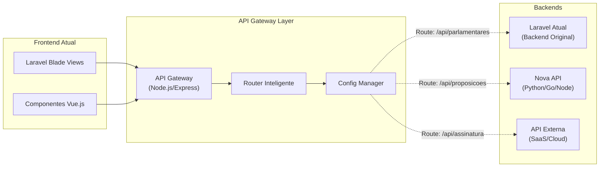
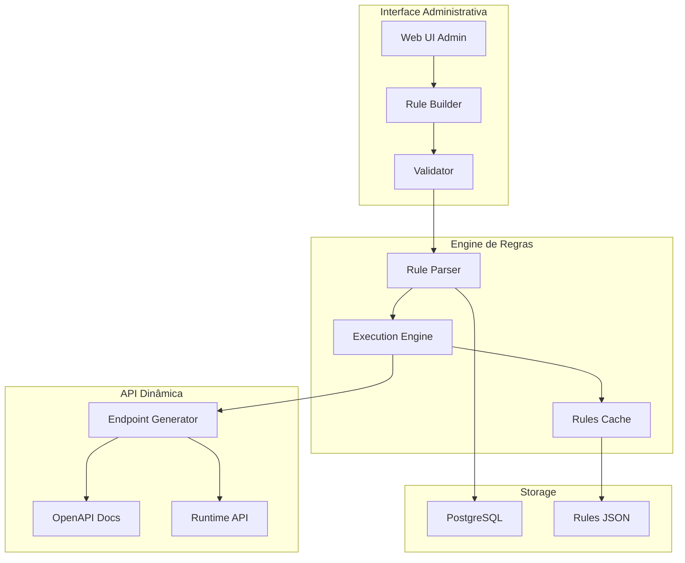

# Solução Simplificada: API Externa e Interface Administrativa

## 🎯 Visão Geral

Este documento apresenta duas soluções práticas e incrementais para permitir a substituição gradual do backend sem grandes refatorações:

1. **API Gateway/Proxy** - Camada intermediária que roteia para backend atual ou novo
2. **Interface Administrativa** - Sistema para configurar regras de negócio dinamicamente

## 📐 Solução 1: API Gateway com Roteamento Inteligente

### Conceito

Criar uma camada de API Gateway que funciona como proxy, permitindo migração gradual endpoint por endpoint.

### Arquitetura



### Implementação Mínima

#### 1. API Gateway Simples (Node.js)

```javascript
// gateway/index.js
const express = require('express');
const httpProxy = require('http-proxy-middleware');
const app = express();

// Configuração de rotas
const routes = {
  '/api/proposicoes': {
    target: 'http://nova-api:3001',
    changeOrigin: true
  },
  '/api/parlamentares': {
    target: 'http://laravel:8000',
    changeOrigin: true
  },
  '/api/assinatura': {
    target: 'https://api-externa.saas.com',
    changeOrigin: true,
    headers: {
      'X-API-Key': process.env.EXTERNAL_API_KEY
    }
  },
  // Fallback para Laravel
  '/': {
    target: 'http://laravel:8000',
    changeOrigin: true
  }
};

// Aplicar proxies
Object.keys(routes).forEach(route => {
  app.use(route, httpProxy.createProxyMiddleware(routes[route]));
});

app.listen(80);
```

#### 2. Configuração Nginx (Alternativa)

```nginx
# /etc/nginx/sites-available/legisinc
upstream laravel_backend {
    server laravel:8000;
}

upstream nova_api {
    server nova-api:3001;
}

server {
    listen 80;
    server_name legisinc.local;

    # Rotas migradas para nova API
    location ~ ^/api/(proposicoes|documentos) {
        proxy_pass http://nova_api;
        proxy_set_header Host $host;
        proxy_set_header X-Real-IP $remote_addr;
    }

    # Rotas ainda no Laravel
    location ~ ^/api/(parlamentares|usuarios) {
        proxy_pass http://laravel_backend;
        proxy_set_header Host $host;
        proxy_set_header X-Real-IP $remote_addr;
    }

    # API Externa para assinatura
    location /api/assinatura {
        proxy_pass https://api-externa.saas.com;
        proxy_set_header X-API-Key "sua-api-key";
    }

    # Fallback para Laravel (views, assets, etc)
    location / {
        proxy_pass http://laravel_backend;
    }
}
```

### Vantagens
- ✅ Migração gradual endpoint por endpoint
- ✅ Rollback instantâneo se necessário
- ✅ Sem mudanças no frontend
- ✅ Pode usar APIs externas/SaaS
- ✅ Deploy independente

## 🎛️ Solução 2: Interface Administrativa para Regras de Negócio

### Conceito

Sistema administrativo que permite configurar regras de negócio e expor automaticamente endpoints.

### Arquitetura



### Implementação com Low-Code

#### Opção A: Strapi (Headless CMS)

```javascript
// Instalação rápida
npx create-strapi-app@latest legisinc-api --quickstart

// Configurar tipos de conteúdo via UI
// - Proposicoes
// - Parlamentares
// - Workflows
// - Templates

// APIs geradas automaticamente:
// GET/POST    /api/proposicoes
// GET/PUT/DEL /api/proposicoes/:id
// Com filtros, ordenação, paginação inclusos
```

#### Opção B: n8n + Baserow (No-Code)

```yaml
# docker-compose.yml
version: '3'
services:
  n8n:
    image: n8nio/n8n
    ports:
      - "5678:5678"
    environment:
      - N8N_BASIC_AUTH_ACTIVE=true
      - N8N_WEBHOOK_BASE_URL=http://localhost:5678/

  baserow:
    image: baserow/baserow
    ports:
      - "80:80"
    environment:
      - BASEROW_PUBLIC_URL=http://localhost
```

**Fluxo:**
1. Baserow: Interface para gerenciar dados e regras
2. n8n: Workflows visuais que expõem webhooks/APIs
3. Resultado: APIs REST automáticas com regras configuráveis

#### Opção C: Sistema Customizado Simples

```php
// app/Http/Controllers/Admin/RuleBuilderController.php
class RuleBuilderController extends Controller
{
    public function createRule(Request $request)
    {
        $rule = BusinessRule::create([
            'name' => $request->name,
            'endpoint' => $request->endpoint,
            'method' => $request->method,
            'conditions' => $request->conditions, // JSON
            'actions' => $request->actions,       // JSON
            'response_format' => $request->response_format
        ]);

        // Gerar endpoint dinamicamente
        $this->generateDynamicRoute($rule);

        // Atualizar documentação OpenAPI
        $this->updateSwaggerDocs($rule);

        return response()->json(['message' => 'Regra criada e endpoint publicado']);
    }

    private function generateDynamicRoute($rule)
    {
        // Registrar rota dinamicamente
        Route::match(
            [$rule->method],
            $rule->endpoint,
            function(Request $request) use ($rule) {
                return app(RuleEngine::class)->execute($rule, $request);
            }
        )->name("dynamic.{$rule->id}");
    }
}
```

```php
// app/Services/RuleEngine.php
class RuleEngine
{
    public function execute($rule, $request)
    {
        $conditions = json_decode($rule->conditions);
        $actions = json_decode($rule->actions);

        // Avaliar condições
        foreach ($conditions as $condition) {
            if (!$this->evaluateCondition($condition, $request)) {
                return response()->json(['error' => 'Condition failed'], 400);
            }
        }

        // Executar ações
        $result = [];
        foreach ($actions as $action) {
            $result[] = $this->executeAction($action, $request);
        }

        return response()->json($result);
    }

    private function evaluateCondition($condition, $request)
    {
        // Exemplo: {"field": "status", "operator": "=", "value": "aprovado"}
        $field = $request->input($condition->field);

        switch($condition->operator) {
            case '=': return $field == $condition->value;
            case '>': return $field > $condition->value;
            case 'contains': return str_contains($field, $condition->value);
            // ... mais operadores
        }
    }

    private function executeAction($action, $request)
    {
        // Exemplo: {"type": "database", "operation": "insert", "table": "proposicoes"}
        switch($action->type) {
            case 'database':
                return $this->databaseAction($action, $request);
            case 'external_api':
                return $this->callExternalApi($action, $request);
            case 'workflow':
                return $this->triggerWorkflow($action, $request);
        }
    }
}
```

### Interface Administrativa - Mockup

```vue
<!-- resources/js/components/RuleBuilder.vue -->
<template>
  <div class="rule-builder">
    <h2>Criar Nova Regra de Negócio</h2>

    <!-- Configuração Básica -->
    <section>
      <input v-model="rule.name" placeholder="Nome da Regra">
      <input v-model="rule.endpoint" placeholder="/api/custom/...">
      <select v-model="rule.method">
        <option>GET</option>
        <option>POST</option>
        <option>PUT</option>
        <option>DELETE</option>
      </select>
    </section>

    <!-- Condições -->
    <section>
      <h3>Condições (IF)</h3>
      <div v-for="condition in rule.conditions">
        <select v-model="condition.field">
          <option>request.body.status</option>
          <option>request.user.role</option>
          <option>database.proposicoes.count</option>
        </select>
        <select v-model="condition.operator">
          <option>=</option>
          <option>!=</option>
          <option>></option>
          <option>contains</option>
        </select>
        <input v-model="condition.value" placeholder="Valor">
      </div>
      <button @click="addCondition">+ Adicionar Condição</button>
    </section>

    <!-- Ações -->
    <section>
      <h3>Ações (THEN)</h3>
      <div v-for="action in rule.actions">
        <select v-model="action.type">
          <option>Salvar no Banco</option>
          <option>Chamar API Externa</option>
          <option>Enviar Email</option>
          <option>Iniciar Workflow</option>
        </select>
        <!-- Configurações específicas por tipo -->
      </div>
      <button @click="addAction">+ Adicionar Ação</button>
    </section>

    <!-- Preview -->
    <section class="preview">
      <h3>Preview do Endpoint</h3>
      <code>
        {{ rule.method }} {{ rule.endpoint }}

        Quando: {{ formatConditions() }}
        Então: {{ formatActions() }}
      </code>
    </section>

    <button @click="saveRule">Publicar Endpoint</button>
  </div>
</template>
```

## 🔄 Estratégia de Transição Incremental

### Fase 1: Setup Inicial (1 semana)
```bash
# 1. Instalar API Gateway
docker run -d -p 8080:80 --name api-gateway nginx

# 2. Configurar proxy inicial (tudo para Laravel)
# 3. Testar que nada quebrou
```

### Fase 2: Primeira Migração (2 semanas)
```javascript
// Migrar endpoint mais simples (ex: /api/parametros)
// 1. Criar novo endpoint na nova API
// 2. Atualizar gateway para rotear
// 3. Testar exaustivamente
// 4. Monitorar por 1 semana
```

### Fase 3: Migração Progressiva (2-3 meses)
```yaml
# Ordem sugerida de migração:
1. Endpoints read-only (GET)
2. Endpoints de criação simples (POST)
3. Endpoints com lógica complexa
4. Endpoints críticos (assinatura, protocolo)
```

## 🛠️ Ferramentas Recomendadas

### Para API Gateway
- **Kong** - Enterprise-ready, plugins prontos
- **Traefik** - Auto-discovery, ótimo com Docker
- **Nginx Plus** - Performance superior
- **AWS API Gateway** - Se usar cloud

### Para Interface Admin Low-Code
- **Strapi** - CMS headless com API automática
- **Directus** - Interface sobre seu banco existente
- **Supabase** - Backend as a Service completo
- **Appsmith** - Low-code para apps internos

### Para Regras de Negócio
- **Drools** - Engine de regras Java
- **json-rules-engine** - JavaScript, simples
- **PyKnow** - Python, fácil integração

## 💡 Recomendação Final

### Abordagem Mais Pragmática:

1. **Curto Prazo (1-2 meses)**
   - Implementar API Gateway simples (Nginx/Node.js)
   - Começar roteando tudo para Laravel atual
   - Migrar 1-2 endpoints para testar

2. **Médio Prazo (3-6 meses)**
   - Usar Strapi/Directus para novos módulos
   - Migrar endpoints gradualmente
   - Manter Laravel para partes críticas

3. **Longo Prazo (6+ meses)**
   - Interface admin para regras de negócio
   - APIs completamente externalizadas
   - Laravel apenas como fallback/legacy

### Exemplo Prático Imediato

```bash
# 1. Clonar e configurar Strapi
git clone https://github.com/legisinc/api-nova.git
cd api-nova
npx create-strapi-app . --quickstart

# 2. Criar Content Types via UI
# - Proposicoes
# - Parlamentares
# - Documentos

# 3. Configurar Nginx para rotear
# /api/v2/* -> Strapi (porta 1337)
# /api/* -> Laravel (porta 8000)
# /* -> Laravel (porta 8000)

# 4. Atualizar frontend gradualmente
# Mudar URLs de /api/proposicoes para /api/v2/proposicoes
```

## ✅ Vantagens da Abordagem

1. **Migração sem Big Bang** - Endpoint por endpoint
2. **Rollback fácil** - Mudar roteamento no gateway
3. **Custos incrementais** - Não precisa refazer tudo
4. **Flexibilidade** - Pode usar múltiplas tecnologias
5. **Time to market** - Mudanças em dias, não meses

## 🚀 Próximo Passo Sugerido

```yaml
Semana 1:
  - Instalar API Gateway (Nginx ou Traefik)
  - Configurar proxy reverso para Laravel
  - Garantir que tudo continua funcionando

Semana 2:
  - Escolher 1 endpoint simples (ex: /api/tipos-proposicao)
  - Criar versão em Strapi ou API nova
  - Rotear apenas esse endpoint para novo backend

Semana 3:
  - Monitorar e ajustar
  - Se sucesso, migrar próximo endpoint
  - Se problemas, rollback imediato via gateway
```

Esta abordagem permite evolução contínua sem riscos de quebrar o sistema em produção.