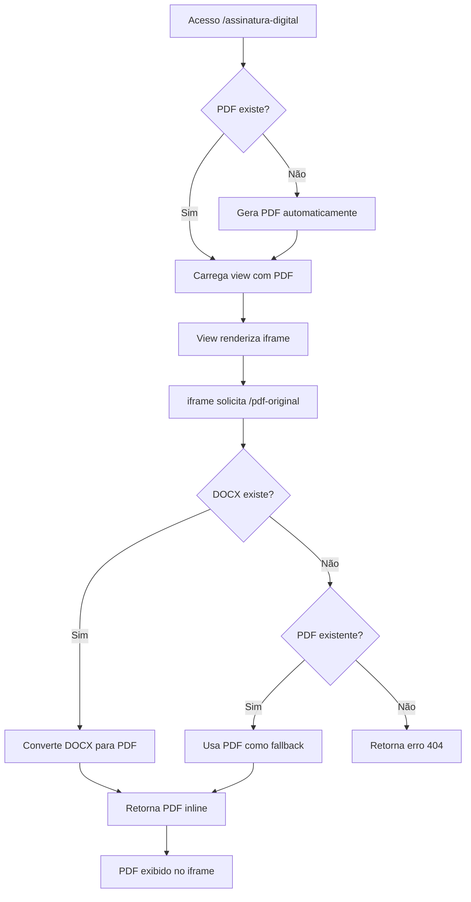

# Fluxo de Exibição do PDF na Tela de Assinatura Digital

## 📋 Visão Geral

Este documento detalha o fluxo completo de exibição do PDF na tela de assinatura digital (`/proposicoes/{id}/assinatura-digital`), desde a requisição inicial até a renderização final no navegador.

## 🔄 Fluxo Completo

### 1. **Acesso à Tela de Assinatura**

**URL:** `/proposicoes/{id}/assinatura-digital`

**Rota:** 
```php
Route::get('/', [AssinaturaDigitalController::class, 'mostrarFormulario'])
    ->name('proposicoes.assinatura-digital.formulario')
```

**Controller:** `AssinaturaDigitalController@mostrarFormulario`

#### Processo:
1. Verifica permissões via middleware `check.assinatura.permission`
2. Valida status da proposição (deve estar em `aprovado` ou `aprovado_assinatura`)
3. Busca caminho do PDF para assinatura via `obterCaminhoPDFParaAssinatura()`
4. Se não existe PDF, gera automaticamente via `gerarPDFParaAssinatura()`
5. Retorna view `assinatura.formulario-simplificado`

### 2. **Busca do PDF para Assinatura**

**Método:** `obterCaminhoPDFParaAssinatura()` (linha 280)

#### Ordem de prioridade:
1. **PDF gerado pelo sistema** (`$proposicao->arquivo_pdf_path`)
2. **PDF no diretório de assinatura** (`storage/app/proposicoes/pdfs/{id}/`)
3. **PDF do OnlyOffice** (`storage/app/private/proposicoes/pdfs/{id}/`)

Retorna o PDF mais recente encontrado ou `null` se nenhum for encontrado.

### 3. **Geração Automática do PDF (se necessário)**

**Método:** `gerarPDFParaAssinatura()` (linha 349)

#### Processo:
1. Verifica se já existe PDF oficial (`pdf_oficial_path`)
2. Se existe arquivo OnlyOffice (RTF/DOCX), usa `DocumentConversionService`
3. Fallback: busca DOCX mais recente via `encontrarArquivoDocxMaisRecente()`
4. Último recurso: gera PDF do conteúdo do banco via `gerarPdfDoConteudo()`
5. Atualiza campos na proposição:
   - `arquivo_pdf_path`
   - `pdf_oficial_path`
   - `pdf_gerado_em`
   - `pdf_conversor_usado`

### 4. **Exibição na View**

**View:** `resources/views/assinatura/formulario-simplificado.blade.php`

#### Elemento iframe (linha 158-162):
```html
<iframe 
    src="{{ route('proposicoes.pdf-original', $proposicao) }}" 
    style="width: 100%; height: 100%; border: none;"
    title="PDF para Assinatura">
</iframe>
```

### 5. **Rota de Servir o PDF**

**URL:** `/proposicoes/{id}/pdf-original`

**Rota:**
```php
Route::get('/{proposicao}/pdf-original', 
    [ProposicaoAssinaturaController::class, 'visualizarPDFOriginal'])
    ->name('pdf-original')
```

**Controller:** `ProposicaoAssinaturaController@visualizarPDFOriginal`

### 6. **Processo de Servir o PDF**

**Método:** `visualizarPDFOriginal()` (linha 2067)

#### Fluxo:
1. **Busca arquivo DOCX mais recente** via `encontrarArquivoMaisRecente()`
2. **Se não encontrar DOCX:**
   - Tenta usar PDF existente como fallback via `encontrarPDFMaisRecente()`
   - Se não encontrar nenhum, retorna erro 404
3. **Se encontrar DOCX:**
   - Gera PDF preservando formatação via `gerarPDFComFormatacaoOnlyOffice()`
   - Prioridade 1: LibreOffice
   - Prioridade 2: OnlyOffice Document Server
4. **Retorna o PDF** com headers apropriados:
   ```php
   return response()->file($pdfPath, [
       'Content-Type' => 'application/pdf',
       'Content-Disposition' => 'inline; filename="proposicao_X_onlyoffice.pdf"'
   ]);
   ```

## 🗂️ Estrutura de Diretórios

```
storage/app/
├── proposicoes/
│   └── pdfs/
│       └── {id}/           # PDFs públicos
├── private/
│   └── proposicoes/
│       └── pdfs/
│           └── {id}/       # PDFs do OnlyOffice
└── proposicoes/
    └── *.rtf/*.docx        # Arquivos editáveis
```

## 🔍 Pontos Importantes

### Headers do PDF
- **Content-Type:** `application/pdf`
- **Content-Disposition:** `inline` (exibe no navegador, não força download)

### Validações
1. **Permissões:** Verificadas pelo middleware antes de acessar
2. **Status:** Proposição deve estar aprovada para assinatura
3. **Existência:** Verifica se arquivo existe antes de servir

### Conversores Utilizados
1. **LibreOffice:** Prioridade alta, melhor preservação de formatação
2. **OnlyOffice Document Server:** Segunda opção se disponível
3. **DocumentConversionService:** Serviço centralizado do sistema

### Cache e Performance
- PDFs gerados são armazenados para reuso
- Busca sempre pelo arquivo mais recente (baseado em `filemtime`)
- Logs detalhados para debug (`error_log`)

## 🚨 Tratamento de Erros

### Erros Comuns:
1. **404:** Arquivo não encontrado
2. **500:** Erro na conversão DOCX → PDF
3. **403:** Sem permissão para acessar

### Fallbacks:
1. Tenta múltiplos diretórios
2. Usa PDF existente se DOCX não disponível
3. Gera PDF do conteúdo do banco como último recurso

## 📊 Fluxograma Visual



## 🔑 Campos Relevantes no Banco

### Tabela `proposicoes`:
- `arquivo_path`: Caminho do arquivo editável (RTF/DOCX)
- `arquivo_pdf_path`: Caminho do PDF gerado
- `pdf_oficial_path`: Caminho do PDF oficial para assinatura
- `pdf_gerado_em`: Timestamp da geração
- `pdf_conversor_usado`: Conversor utilizado (libreoffice, onlyoffice, etc)
- `arquivo_pdf_assinado`: Caminho do PDF após assinatura digital

## 📝 Observações Finais

1. **Priorização:** Sistema sempre busca arquivo mais recente
2. **Preservação:** Formatação do OnlyOffice é mantida na conversão
3. **Segurança:** Múltiplas verificações de permissão e existência
4. **Performance:** Cache de PDFs gerados evita reconversões
5. **Robustez:** Múltiplos fallbacks garantem disponibilidade do PDF

---

**Última atualização:** 08/09/2025
**Versão:** 2.1