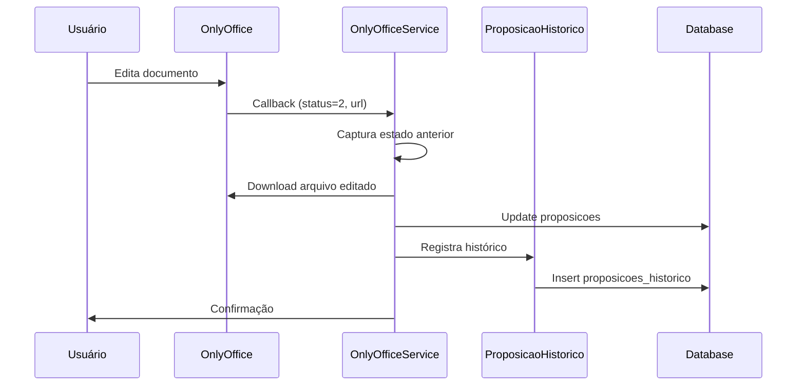

# 📋 Sistema de Histórico e Auditoria de Proposições

## 🎯 Visão Geral

O sistema implementa **auditoria completa** de alterações em proposições, registrando automaticamente cada modificação feita através do OnlyOffice ou interface web, mantendo rastreabilidade total sem impactar a performance ou simplicidade do fluxo atual.

## 🏗️ Arquitetura

### Tabela Principal vs. Histórico

```
┌─────────────────┐    ┌─────────────────────┐
│   proposicoes   │    │ proposicoes_historico│
├─────────────────┤    ├─────────────────────┤
│ id              │◄──┤│ proposicao_id       │
│ tipo            │    │ usuario_id          │
│ ementa          │    │ acao                │
│ conteudo        │    │ arquivo_anterior    │
│ arquivo_path    │    │ arquivo_novo        │
│ status          │    │ diff_conteudo       │
│ autor_id        │    │ metadados           │
│ modificado_por  │    │ data_alteracao      │
│ ultima_modificac│    │ ip_usuario          │
└─────────────────┘    └─────────────────────┘
```

### Fluxo de Funcionamento



## 📊 Estrutura da Tabela `proposicoes_historico`

### Campos Principais

| Campo | Tipo | Descrição |
|-------|------|-----------|
| `proposicao_id` | BIGINT | ID da proposição alterada |
| `usuario_id` | BIGINT | Usuário que fez a alteração |
| `acao` | VARCHAR | Tipo de ação (callback_onlyoffice, status_change, create) |
| `tipo_alteracao` | ENUM | Categoria (arquivo, conteudo, status, metadados) |

### Snapshots (Antes/Depois)

| Campo | Tipo | Descrição |
|-------|------|-----------|
| `status_anterior` | VARCHAR | Status antes da alteração |
| `status_novo` | VARCHAR | Status após a alteração |
| `arquivo_path_anterior` | VARCHAR | Caminho do arquivo anterior |
| `arquivo_path_novo` | VARCHAR | Caminho do arquivo novo |
| `conteudo_anterior` | TEXT | Primeiros 1000 chars do conteúdo anterior |
| `conteudo_novo` | TEXT | Primeiros 1000 chars do conteúdo novo |

### Análise e Performance

| Campo | Tipo | Descrição |
|-------|------|-----------|
| `diff_conteudo` | JSON | Análise da alteração (similaridade, caracteres alterados) |
| `tamanho_anterior` | INT | Tamanho em bytes do conteúdo anterior |
| `tamanho_novo` | INT | Tamanho em bytes do conteúdo novo |

### Auditoria e Metadados

| Campo | Tipo | Descrição |
|-------|------|-----------|
| `metadados` | JSON | Dados técnicos (document_key, download_time, file_type) |
| `origem` | VARCHAR | Origem da alteração (onlyoffice, web, api, system) |
| `data_alteracao` | TIMESTAMP | Quando ocorreu a alteração |
| `ip_usuario` | VARCHAR | IP do usuário |
| `user_agent` | TEXT | Navegador/sistema do usuário |

## 🔧 Implementação Técnica

### 1. Integração no OnlyOffice Callback

**Arquivo**: `app/Services/OnlyOffice/OnlyOfficeService.php`

```php
public function processarCallbackProposicao($proposicao, $documentKey, $data): array
{
    // AUDITORIA: Capturar estado anterior (linha 2901-2906)
    $estadoAnterior = [
        'arquivo_path' => $proposicao->arquivo_path,
        'conteudo' => $proposicao->conteudo,
        'ultima_modificacao' => $proposicao->ultima_modificacao
    ];
    
    // ... processar alteração ...
    
    // AUDITORIA: Registrar histórico (linha 3010-3026)
    ProposicaoHistorico::registrarCallbackOnlyOffice(
        $proposicao,
        $estadoAnterior['arquivo_path'],
        $nomeArquivo,
        $estadoAnterior['conteudo'], 
        $conteudoExtraido,
        $callbackData
    );
}
```

### 2. Model com Métodos Inteligentes

**Arquivo**: `app/Models/ProposicaoHistorico.php`

```php
// Registro automático com diff
public static function registrarCallbackOnlyOffice($proposicao, $arquivoAnterior, $arquivoNovo, $conteudoAnterior, $conteudoNovo, $callbackData = [])

// Cálculo de similaridade
public static function calcularDiff(?string $anterior, ?string $novo): ?array

// Scopes para consultas
public function scopePorProposicao($query, int $proposicaoId)
public function scopePorUsuario($query, int $usuarioId) 
public function scopePorPeriodo($query, Carbon $inicio, Carbon $fim)
```

### 3. Exemplo de Diff Inteligente

```php
// Para edição de conteúdo
$diff = [
    'tipo' => 'edicao',
    'caracteres_anterior' => 1250,
    'caracteres_novo' => 1400,
    'diferenca_caracteres' => +150,
    'similarity_percent' => 87.5,
    'mudanca_significativa' => false  // < 100 chars = pequena alteração
];

// Para criação
$diff = [
    'tipo' => 'criacao', 
    'caracteres_adicionados' => 1400,
    'linhas_adicionadas' => 25
];

// Para remoção
$diff = [
    'tipo' => 'remocao',
    'caracteres_removidos' => 500,
    'linhas_removidas' => 10
];
```

## 🖥️ Interfaces de Usuário

### 1. API JSON

**Rota**: `GET /proposicoes/{id}/historico`

```json
{
    "proposicao": {
        "id": 123,
        "tipo": "Moção",
        "ementa": "Proposição sobre...",
        "status": "aprovado",
        "autor": "Jessica Silva"
    },
    "historico": [
        {
            "id": 456,
            "usuario": "João Santos",
            "acao": "callback_onlyoffice", 
            "resumo": "João Santos editou via OnlyOffice (+150 chars) - 17/08/2025 14:30",
            "data_alteracao": "17/08/2025 14:30:25",
            "origem": "onlyoffice",
            "diff_info": {
                "tipo": "Edição",
                "descricao": "Alteração: +150 caracteres (Similaridade: 87%)",
                "cor": "info"
            }
        }
    ],
    "estatisticas": {
        "total_alteracoes": 8,
        "usuarios_envolvidos": 3,
        "origem_mais_comum": "onlyoffice"
    }
}
```

### 2. Interface Web

**Rota**: `GET /proposicoes/{id}/historico/view`

- **Timeline visual** com ícones por origem
- **Filtros**: Por usuário, origem, ação
- **Busca**: Por nome de usuário
- **Detalhes**: Modal com metadados técnicos completos

### 3. Relatório de Auditoria (Admin)

**Rota**: `GET /admin/tipo-proposicoes/auditoria/relatorio`

- **Filtros avançados**: Período, usuário, origem
- **Exportação**: JSON estruturado
- **Estatísticas**: Distribuição de ações e origens
- **Limite**: Até 1000 registros por consulta

## 📋 Tipos de Ações Registradas

| Ação | Quando Ocorre | Origem |
|------|---------------|--------|
| `callback_onlyoffice` | Salvamento automático do OnlyOffice | onlyoffice |
| `status_change` | Mudança de status (rascunho→enviado) | web |
| `create` | Criação inicial da proposição | web |
| `manual_edit` | Edição manual via interface | web |
| `system_update` | Atualizações automáticas do sistema | system |

## 🔍 Exemplo de Registro Completo

```json
{
    "id": 789,
    "proposicao_id": 123,
    "usuario_id": 456,
    "acao": "callback_onlyoffice",
    "tipo_alteracao": "arquivo",
    "status_anterior": null,
    "status_novo": null,
    "arquivo_path_anterior": "proposicoes/proposicao_123_1692276000.rtf",
    "arquivo_path_novo": "proposicoes/proposicao_123_1692276120.rtf", 
    "conteudo_anterior": "CÂMARA MUNICIPAL DE CARAGUATATUBA\nMOÇÃO Nº [AGUARDANDO PROTOCOLO]\n...",
    "conteudo_novo": "CÂMARA MUNICIPAL DE CARAGUATATUBA\nMOÇÃO Nº [AGUARDANDO PROTOCOLO]\n...",
    "diff_conteudo": {
        "tipo": "edicao",
        "caracteres_anterior": 1250,
        "caracteres_novo": 1400,
        "diferenca_caracteres": 150,
        "similarity_percent": 87.5
    },
    "tamanho_anterior": 1250,
    "tamanho_novo": 1400,
    "metadados": {
        "callback_data": {
            "document_key": "doc_123_456_1692276120",
            "callback_status": 2,
            "file_type": "rtf",
            "download_time_seconds": 1.2,
            "should_extract_content": true,
            "content_extracted": true
        }
    },
    "origem": "onlyoffice",
    "data_alteracao": "2025-08-17 14:30:25",
    "ip_usuario": "192.168.1.100",
    "user_agent": "Mozilla/5.0 (Windows NT 10.0; Win64; x64) AppleWebKit/537.36",
    "created_at": "2025-08-17 14:30:26",
    "updated_at": "2025-08-17 14:30:26"
}
```

## ⚡ Performance e Otimizações

### Índices de Banco

```sql
-- Performance otimizada
CREATE INDEX idx_historico_proposicao_data ON proposicoes_historico (proposicao_id, created_at);
CREATE INDEX idx_historico_usuario_acao ON proposicoes_historico (usuario_id, acao);
CREATE INDEX idx_historico_origem_tipo ON proposicoes_historico (origem, tipo_alteracao);
```

### Otimizações Implementadas

1. **Conteúdo limitado**: Apenas primeiros 1000 chars nos snapshots
2. **Diff calculado**: Em vez de armazenar conteúdo completo  
3. **Update assíncrono**: Não bloqueia salvamento principal
4. **Eager loading**: Relacionamentos carregados eficientemente
5. **Índices específicos**: Para consultas mais rápidas

### Tratamento de Erros

```php
// Não bloqueia o callback principal
try {
    ProposicaoHistorico::registrarCallbackOnlyOffice(...);
} catch (\Exception $historicoException) {
    Log::warning('Erro ao registrar histórico', [
        'proposicao_id' => $proposicao->id,
        'error' => $historicoException->getMessage()
    ]);
    // Continua operação normal
}
```

## 🚀 Como Usar

### 1. Ativação do Sistema

```bash
# Executar migration
docker exec -it legisinc-app php artisan migrate
```

### 2. Verificar Funcionamento

1. **Editar proposição** no OnlyOffice
2. **Verificar logs**: `storage/logs/laravel.log` 
3. **Acessar histórico**: `/proposicoes/{id}/historico/view`

### 3. Consultas Programáticas

```php
// Buscar histórico de uma proposição
$historico = ProposicaoHistorico::porProposicao(123)
    ->with('usuario')
    ->orderBy('data_alteracao', 'desc')
    ->get();

// Buscar por período
$historico = ProposicaoHistorico::porPeriodo(
    Carbon::now()->subDays(7),
    Carbon::now()
)->get();

// Apenas alterações do OnlyOffice
$historico = ProposicaoHistorico::apenasOnlyOffice()
    ->porProposicao(123)
    ->get();
```

## 🎯 Benefícios Implementados

### Para Auditoria
✅ **Rastreabilidade total** - Quem, quando, o que mudou  
✅ **Evidências técnicas** - IP, user agent, timestamps precisos  
✅ **Análise de impacto** - Mudanças grandes vs. pequenos ajustes  
✅ **Conformidade** - Registros imutáveis para compliance  

### Para Gestão
✅ **Relatórios visuais** - Timeline e estatísticas  
✅ **Detecção de problemas** - Mudanças significativas alertadas  
✅ **Análise de uso** - Quais usuários mais ativos  
✅ **Debugging técnico** - Metadados completos do OnlyOffice  

### Para Performance
✅ **Não bloqueante** - Zero impacto no fluxo principal  
✅ **Otimizado** - Índices e consultas eficientes  
✅ **Escalável** - Suporta grandes volumes de alterações  
✅ **Configurável** - Limpeza automática possível  

## 📈 Monitoramento

### Logs de Sucesso
```
[INFO] Histórico de alteração registrado {"proposicao_id": 123, "arquivo_anterior": "...", "arquivo_novo": "..."}
```

### Logs de Erro
```
[WARNING] Erro ao registrar histórico de alteração {"proposicao_id": 123, "error": "..."}
```

### Métricas Recomendadas
- **Registros por dia**: Monitorar volume de alterações
- **Usuários ativos**: Identificar padrões de uso  
- **Erros de histórico**: Alertar falhas no registro
- **Tamanho da tabela**: Planejar limpeza/archiving

---

## 🔧 Manutenção

### Limpeza Automática (Opcional)

```php
// Command para limpeza periódica
// Manter apenas últimos 12 meses
ProposicaoHistorico::where('created_at', '<', Carbon::now()->subMonths(12))
    ->delete();
```

### Backup e Arquivamento

```bash
# Backup específico da tabela de histórico
pg_dump -h localhost -U postgres -t proposicoes_historico legisinc > historico_backup.sql
```

---

**📋 Sistema de Histórico**: Implementação completa para auditoria total de proposições  
**🎯 Status**: Pronto para produção  
**📅 Data**: 17/08/2025  
**👤 Responsável**: Sistema Legisinc