# Fluxo Completo ONLYOFFICE - LegisInc

## Visão Geral do Fluxo entre Perfis

### 🔄 **Fluxo de Trabalho Detalhado**

```mermaid
sequenceDiagram
    participant A as Administrador
    participant O as ONLYOFFICE
    participant S as Sistema
    participant P as Parlamentar
    participant L as Legislativo

    A->>O: Criar modelo com Content Controls
    A->>O: Inserir campos editáveis (ementa, texto)
    A->>S: Salvar modelo no sistema
    
    P->>S: Escolher modelo disponível
    S->>O: Abrir modelo para parlamentar
    P->>O: Preencher ementa e texto
    P->>S: Enviar para legislativo
    
    L->>S: Receber documento do parlamentar
    S->>O: Abrir documento para edição
    L->>O: Revisar e editar texto
    L->>S: Enviar de volta para parlamentar
    
    P->>S: Receber documento revisado
    P->>O: Visualizar alterações
    P->>S: Aprovar ou solicitar ajustes
```



## Implementação por Perfil

### 👨‍💼 **1. ADMINISTRADOR - Criação de Modelos**

#### 1.1 Interface de Criação de Modelo

```php
// app/Http/Controllers/Documento/ModeloController.php
<?php

namespace App\Http\Controllers\Documento;

use App\Http\Controllers\Controller;
use App\Services\OnlyOffice\OnlyOfficeService;
use App\Services\Documento\ModeloService;
use App\Models\Documento\DocumentoModelo;
use Illuminate\Http\Request;

class ModeloController extends Controller
{
    public function __construct(
        private OnlyOfficeService $onlyOfficeService,
        private ModeloService $modeloService
    ) {}

    public function create()
    {
        return view('modules.documentos.modelos.create');
    }

    public function store(Request $request)
    {
        $request->validate([
            'nome' => 'required|string|max:255',
            'descricao' => 'nullable|string',
            'tipo_proposicao_id' => 'required|exists:tipos_proposicao,id'
        ]);

        // Criar modelo vazio
        $modelo = $this->modeloService->criarModeloVazio($request->all());

        // Redirecionar para editor
        return redirect()->route('documentos.modelos.editor', $modelo);
    }

    public function editor(DocumentoModelo $modelo)
    {
        $config = $this->onlyOfficeService->criarConfiguracaoAdmin($modelo);
        
        return view('modules.documentos.modelos.editor', [
            'modelo' => $modelo,
            'config' => $config,
            'campos_disponiveis' => $this->obterCamposDisponiveis()
        ]);
    }

    private function obterCamposDisponiveis(): array
    {
        return [
            'ementa' => [
                'label' => 'Ementa da Proposição',
                'tipo' => 'textarea',
                'placeholder' => 'Digite aqui a ementa da proposição...',
                'obrigatorio' => true
            ],
            'texto_propositivo' => [
                'label' => 'Texto da Proposição',
                'tipo' => 'editor',
                'placeholder' => 'Digite aqui o texto completo da proposição...',
                'obrigatorio' => true
            ],
            'justificativa' => [
                'label' => 'Justificativa',
                'tipo' => 'editor',
                'placeholder' => 'Digite aqui a justificativa...',
                'obrigatorio' => false
            ],
            'autor_observacoes' => [
                'label' => 'Observações do Autor',
                'tipo' => 'textarea',
                'placeholder' => 'Observações adicionais...',
                'obrigatorio' => false
            ]
        ];
    }
}
```

#### 1.2 Service para Configuração de Admin

```php
// app/Services/OnlyOffice/OnlyOfficeService.php
<?php

namespace App\Services\OnlyOffice;

class OnlyOfficeService
{
    public function criarConfiguracaoAdmin(DocumentoModelo $modelo): array
    {
        $config = [
            'document' => [
                'fileType' => 'docx',
                'key' => $modelo->document_key,
                'title' => $modelo->nome,
                'url' => route('api.documentos.download', $modelo),
                'permissions' => [
                    'edit' => true,
                    'comment' => true,
                    'fillForms' => true,
                    'modifyContentControl' => true, // IMPORTANTE: Permite editar Content Controls
                    'review' => true,
                    'chat' => true
                ]
            ],
            'documentType' => 'text',
            'editorConfig' => [
                'mode' => 'edit',
                'lang' => 'pt-BR',
                'callbackUrl' => route('api.onlyoffice.callback', $modelo->document_key),
                'user' => [
                    'id' => (string) auth()->id(),
                    'name' => auth()->user()->name,
                    'group' => 'administrators'
                ],
                'customization' => [
                    'about' => false,
                    'feedback' => false,
                    'forcesave' => true,
                    'autosave' => true,
                    'compactToolbar' => false,
                    'plugins' => true, // Habilitar plugins
                    'macros' => false,
                    'trackChanges' => false, // Desabilitado para criação de modelo
                    'reviewDisplay' => 'original'
                ],
                'plugins' => [
                    'autostart' => [],
                    'pluginsData' => []
                ]
            ],
            'events' => [
                'onDocumentReady' => true,
                'onInfo' => true,
                'onWarning' => true,
                'onError' => true,
                'onRequestSaveAs' => true,
                'onRequestInsertImage' => true,
                'onRequestMailMergeRecipients' => true,
                'onRequestCompareFile' => true,
                'onRequestEditRights' => true,
                'onRequestHistory' => true,
                'onRequestHistoryData' => true,
                'onRequestHistoryClose' => true,
                'onRequestRestore' => true,
                'onRequestRename' => true,
                'onMakeActionLink' => true,
                'onMetaChange' => true,
                'onRequestUsers' => true,
                'onRequestSendNotify' => true,
                'onRequestSaveAs' => true,
                'onDocumentStateChange' => true,
                'onRequestClose' => true
            ]
        ];

        // Adicionar JWT se configurado
        if (config('onlyoffice.jwt_secret')) {
            $config['token'] = $this->gerarToken($config);
        }

        return $config;
    }

    public function inserirContentControl(string $documentKey, array $campo): void
    {
        // Comando para inserir Content Control via API do ONLYOFFICE
        $comando = [
            'c' => 'add',
            'type' => 'contentControl',
            'data' => [
                'id' => $campo['id'],
                'tag' => $campo['tag'],
                'title' => $campo['label'],
                'placeholder' => $campo['placeholder'],
                'lock' => false, // Permite edição do conteúdo
                'type' => $campo['tipo'] === 'editor' ? 'richText' : 'plainText'
            ]
        ];

        // Enviar comando via WebSocket ou API
        $this->enviarComandoEditor($documentKey, $comando);
    }
}
```

#### 1.3 View do Editor para Administrador

```blade
{{-- resources/views/modules/documentos/modelos/editor.blade.php --}}
@extends('layouts.app')

@section('title', 'Editor de Modelo: ' . $modelo->nome)

@section('content')
<div class="container-fluid">
    <div class="row">
        {{-- Sidebar com Campos Disponíveis --}}
        <div class="col-md-3">
            <div class="card h-100">
                <div class="card-header">
                    <h5 class="card-title mb-0">
                        <i class="ki-duotone ki-element-plus fs-2 me-2">
                            <span class="path1"></span>
                            <span class="path2"></span>
                            <span class="path3"></span>
                        </i>
                        Campos Disponíveis
                    </h5>
                </div>
                <div class="card-body">
                    <div class="mb-4">
                        <h6 class="text-muted mb-3">Campos Obrigatórios</h6>
                        @foreach($campos_disponiveis as $key => $campo)
                            @if($campo['obrigatorio'])
                                <div class="campo-disponivel mb-3 p-3 border border-primary rounded cursor-pointer"
                                     data-campo="{{ $key }}"
                                     data-tipo="{{ $campo['tipo'] }}"
                                     data-label="{{ $campo['label'] }}"
                                     data-placeholder="{{ $campo['placeholder'] }}">
                                    <div class="d-flex align-items-center">
                                        <i class="ki-duotone ki-abstract-25 fs-3 text-primary me-2">
                                            <span class="path1"></span>
                                            <span class="path2"></span>
                                        </i>
                                        <div>
                                            <div class="fw-bold">{{ $campo['label'] }}</div>
                                            <div class="text-muted fs-7">{{ $campo['tipo'] }}</div>
                                        </div>
                                    </div>
                                </div>
                            @endif
                        @endforeach
                    </div>

                    <div class="mb-4">
                        <h6 class="text-muted mb-3">Campos Opcionais</h6>
                        @foreach($campos_disponiveis as $key => $campo)
                            @if(!$campo['obrigatorio'])
                                <div class="campo-disponivel mb-3 p-3 border border-secondary rounded cursor-pointer"
                                     data-campo="{{ $key }}"
                                     data-tipo="{{ $campo['tipo'] }}"
                                     data-label="{{ $campo['label'] }}"
                                     data-placeholder="{{ $campo['placeholder'] }}">
                                    <div class="d-flex align-items-center">
                                        <i class="ki-duotone ki-abstract-26 fs-3 text-secondary me-2">
                                            <span class="path1"></span>
                                            <span class="path2"></span>
                                        </i>
                                        <div>
                                            <div class="fw-bold">{{ $campo['label'] }}</div>
                                            <div class="text-muted fs-7">{{ $campo['tipo'] }}</div>
                                        </div>
                                    </div>
                                </div>
                            @endif
                        @endforeach
                    </div>

                    <div class="separator mb-4"></div>

                    <button type="button" class="btn btn-primary w-100" id="salvar-modelo">
                        <i class="ki-duotone ki-check fs-2 me-2">
                            <span class="path1"></span>
                            <span class="path2"></span>
                        </i>
                        Salvar Modelo
                    </button>
                </div>
            </div>
        </div>

        {{-- Editor Principal --}}
        <div class="col-md-9">
            <div class="card h-100">
                <div class="card-header">
                    <h3 class="card-title">{{ $modelo->nome }}</h3>
                    <div class="card-toolbar">
                        <span class="badge badge-light-primary">Modo Administrador</span>
                    </div>
                </div>
                <div class="card-body p-0">
                    <div id="onlyoffice-editor" style="height: 800px;"></div>
                </div>
            </div>
        </div>
    </div>
</div>

{{-- Modal de Instruções --}}
<div class="modal fade" id="modal-instrucoes" tabindex="-1">
    <div class="modal-dialog modal-lg">
        <div class="modal-content">
            <div class="modal-header">
                <h3 class="modal-title">Como criar um modelo</h3>
                <button type="button" class="btn-close" data-bs-dismiss="modal"></button>
            </div>
            <div class="modal-body">
                <div class="mb-6">
                    <h5>1. Digite o texto padrão do documento</h5>
                    <p class="text-muted">Escreva todo o texto que deve aparecer em todas as proposições deste tipo.</p>
                </div>
                <div class="mb-6">
                    <h5>2. Insira campos editáveis</h5>
                    <p class="text-muted">Clique nos campos da sidebar e depois posicione o cursor onde deseja inserir o campo.</p>
                </div>
                <div class="mb-6">
                    <h5>3. Salve o modelo</h5>
                    <p class="text-muted">Clique em "Salvar Modelo" para disponibilizar para os parlamentares.</p>
                </div>
            </div>
        </div>
    </div>
</div>
@endsection

@push('scripts')
<script src="{{ config('onlyoffice.server_url') }}/web-apps/apps/api/documents/api.js"></script>
<script>
document.addEventListener('DOMContentLoaded', function() {
    let editor;
    const config = @json($config);
    
    // Configurar eventos
    config.events = {
        'onDocumentReady': onDocumentReady,
        'onInfo': onInfo,
        'onError': onError
    };
    
    // Inicializar editor
    editor = new DocsAPI.DocEditor('onlyoffice-editor', config);
    
    function onDocumentReady() {
        console.log('Editor carregado - Modo Administrador');
        
        // Mostrar modal de instruções na primeira vez
        if (localStorage.getItem('mostrou-instrucoes-modelo') !== 'true') {
            $('#modal-instrucoes').modal('show');
            localStorage.setItem('mostrou-instrucoes-modelo', 'true');
        }
    }
    
    function onInfo(event) {
        console.log('Info:', event.data);
    }
    
    function onError(event) {
        console.error('Erro no editor:', event.data);
        Swal.fire({
            icon: 'error',
            title: 'Erro no Editor',
            text: event.data
        });
    }
    
    // Inserir campos editáveis
    document.querySelectorAll('.campo-disponivel').forEach(campo => {
        campo.addEventListener('click', function() {
            const dadosCampo = {
                id: this.dataset.campo,
                tag: this.dataset.campo,
                label: this.dataset.label,
                tipo: this.dataset.tipo,
                placeholder: this.dataset.placeholder
            };
            
            inserirCampoEditavel(dadosCampo);
        });
    });
    
    function inserirCampoEditavel(campo) {
        // Comando para inserir Content Control
        const comando = {
            c: 'add',
            type: 'contentControl',
            data: {
                id: campo.id,
                tag: campo.tag,
                title: campo.label,
                placeholder: campo.placeholder,
                lock: false,
                type: campo.tipo === 'editor' ? 'richText' : 'plainText'
            }
        };
        
        // Enviar comando para o editor
        if (editor && editor.sendCommand) {
            editor.sendCommand(comando);
        }
        
        // Feedback visual
        toastr.success(`Campo "${campo.label}" inserido!`);
    }
    
    // Salvar modelo
    document.getElementById('salvar-modelo').addEventListener('click', function() {
        if (editor && editor.downloadAs) {
            editor.downloadAs({
                fileType: 'docx',
                title: '{{ $modelo->nome }}.docx'
            });
        }
        
        // Salvar no sistema
        fetch('{{ route("api.documentos.modelos.salvar", $modelo) }}', {
            method: 'POST',
            headers: {
                'Content-Type': 'application/json',
                'X-CSRF-TOKEN': '{{ csrf_token() }}'
            },
            body: JSON.stringify({
                campos_utilizados: obterCamposUtilizados()
            })
        }).then(response => {
            if (response.ok) {
                Swal.fire({
                    icon: 'success',
                    title: 'Modelo Salvo!',
                    text: 'O modelo foi salvo e está disponível para uso.'
                });
            }
        });
    });
    
    function obterCamposUtilizados() {
        // Lógica para identificar quais campos foram utilizados no documento
        return [];
    }
});
</script>
@endpush
```

### 🏛️ **2. PARLAMENTAR - Preenchimento do Documento**

#### 2.1 Controller para Parlamentar

```php
// app/Http/Controllers/Documento/ProposicaoController.php
<?php

namespace App\Http\Controllers\Documento;

use App\Http\Controllers\Controller;
use App\Services\OnlyOffice\OnlyOfficeService;
use App\Services\Documento\ProposicaoService;
use App\Models\Projeto;
use App\Models\Documento\DocumentoModelo;
use Illuminate\Http\Request;

class ProposicaoController extends Controller
{
    public function __construct(
        private OnlyOfficeService $onlyOfficeService,
        private ProposicaoService $proposicaoService
    ) {}

    public function selecionarModelo(Projeto $projeto)
    {
        $modelos = DocumentoModelo::where('tipo_proposicao_id', $projeto->tipo_proposicao_id)
                                 ->where('ativo', true)
                                 ->get();

        return view('modules.documentos.proposicoes.selecionar-modelo', [
            'projeto' => $projeto,
            'modelos' => $modelos
        ]);
    }

    public function criarDocumento(Request $request, Projeto $projeto)
    {
        $request->validate([
            'modelo_id' => 'required|exists:documento_modelos,id'
        ]);

        // Criar instância do documento
        $instancia = $this->proposicaoService->criarInstanciaDocumento(
            $projeto,
            $request->modelo_id
        );

        return redirect()->route('documentos.proposicoes.editor', [
            'projeto' => $projeto,
            'instancia' => $instancia
        ]);
    }

    public function editor(Projeto $projeto, $instancia)
    {
        // Verificar se é o autor da proposição
        $this->authorize('edit', $projeto);

        $config = $this->onlyOfficeService->criarConfiguracaoParlamentar($instancia);
        
        return view('modules.documentos.proposicoes.editor', [
            'projeto' => $projeto,
            'instancia' => $instancia,
            'config' => $config
        ]);
    }
}
```

#### 2.2 Configuração para Parlamentar

```php
// app/Services/OnlyOffice/OnlyOfficeService.php - Método adicional

public function criarConfiguracaoParlamentar($instancia): array
{
    $config = [
        'document' => [
            'fileType' => 'docx',
            'key' => $instancia->document_key,
            'title' => $instancia->arquivo_nome,
            'url' => route('api.documentos.instancias.download', $instancia),
            'permissions' => [
                'edit' => true,
                'comment' => true,
                'fillForms' => true,
                'modifyContentControl' => false, // Não pode modificar a estrutura
                'review' => false, // Track changes desabilitado
                'chat' => true
            ]
        ],
        'documentType' => 'text',
        'editorConfig' => [
            'mode' => 'edit',
            'lang' => 'pt-BR',
            'callbackUrl' => route('api.onlyoffice.callback', $instancia->document_key),
            'user' => [
                'id' => (string) auth()->id(),
                'name' => auth()->user()->name,
                'group' => 'parliamentarians'
            ],
            'customization' => [
                'about' => false,
                'feedback' => false,
                'forcesave' => true,
                'autosave' => true,
                'compactToolbar' => false,
                'trackChanges' => false, // Parlamentar não usa track changes
                'reviewDisplay' => 'original',
                'commentAuthorOnly' => false,
                'showReviewChanges' => false
            ]
        ]
    ];

    if (config('onlyoffice.jwt_secret')) {
        $config['token'] = $this->gerarToken($config);
    }

    return $config;
}
```

#### 2.3 View para Seleção de Modelo

```blade
{{-- resources/views/modules/documentos/proposicoes/selecionar-modelo.blade.php --}}
@extends('layouts.app')

@section('title', 'Selecionar Modelo - ' . $projeto->titulo)

@section('content')
<div class="container">
    <div class="row">
        <div class="col-12">
            <div class="card">
                <div class="card-header">
                    <h3 class="card-title">Selecionar Modelo de Documento</h3>
                    <div class="card-toolbar">
                        <span class="badge badge-light-info">{{ $projeto->tipo->nome }}</span>
                    </div>
                </div>
                <div class="card-body">
                    <div class="mb-6">
                        <h5>Projeto: {{ $projeto->titulo }}</h5>
                        <p class="text-muted">{{ $projeto->ementa }}</p>
                    </div>

                    <form method="POST" action="{{ route('documentos.proposicoes.criar', $projeto) }}">
                        @csrf
                        <div class="row">
                            @forelse($modelos as $modelo)
                                <div class="col-md-6 col-lg-4 mb-4">
                                    <div class="card border modelo-card cursor-pointer" 
                                         data-modelo-id="{{ $modelo->id }}">
                                        <div class="card-body text-center">
                                            <i class="ki-duotone ki-document fs-3x text-primary mb-4">
                                                <span class="path1"></span>
                                                <span class="path2"></span>
                                            </i>
                                            <h5 class="card-title">{{ $modelo->nome }}</h5>
                                            <p class="card-text text-muted">{{ $modelo->descricao }}</p>
                                            <div class="badge badge-light-success">v{{ $modelo->versao }}</div>
                                        </div>
                                    </div>
                                    <input type="radio" name="modelo_id" value="{{ $modelo->id }}" 
                                           class="d-none modelo-radio" id="modelo-{{ $modelo->id }}">
                                </div>
                            @empty
                                <div class="col-12">
                                    <div class="alert alert-warning">
                                        <h5>Nenhum modelo disponível</h5>
                                        <p>Não há modelos criados para este tipo de proposição. Entre em contato com a administração.</p>
                                    </div>
                                </div>
                            @endforelse
                        </div>

                        @if($modelos->count() > 0)
                            <div class="d-flex justify-content-end mt-6">
                                <button type="submit" class="btn btn-primary" id="btn-continuar" disabled>
                                    <i class="ki-duotone ki-arrow-right fs-2 me-2">
                                        <span class="path1"></span>
                                        <span class="path2"></span>
                                    </i>
                                    Continuar com Modelo Selecionado
                                </button>
                            </div>
                        @endif
                    </form>
                </div>
            </div>
        </div>
    </div>
</div>
@endsection

@push('scripts')
<script>
document.addEventListener('DOMContentLoaded', function() {
    const modeloCards = document.querySelectorAll('.modelo-card');
    const btnContinuar = document.getElementById('btn-continuar');
    
    modeloCards.forEach(card => {
        card.addEventListener('click', function() {
            // Remover seleção anterior
            modeloCards.forEach(c => c.classList.remove('border-primary', 'bg-light-primary'));
            document.querySelectorAll('.modelo-radio').forEach(r => r.checked = false);
            
            // Selecionar atual
            this.classList.add('border-primary', 'bg-light-primary');
            const modeloId = this.dataset.modeloId;
            document.getElementById(`modelo-${modeloId}`).checked = true;
            
            // Habilitar botão
            btnContinuar.disabled = false;
        });
    });
});
</script>
@endpush
```

### ⚖️ **3. LEGISLATIVO - Revisão e Edição**

#### 3.1 Controller para Legislativo

```php
// app/Http/Controllers/Documento/RevisaoController.php
<?php

namespace App\Http\Controllers\Documento;

use App\Http\Controllers\Controller;
use App\Services\OnlyOffice\OnlyOfficeService;
use App\Models\Documento\DocumentoInstancia;
use Illuminate\Http\Request;

class RevisaoController extends Controller
{
    public function __construct(
        private OnlyOfficeService $onlyOfficeService
    ) {}

    public function index()
    {
        $documentos = DocumentoInstancia::with(['projeto', 'modelo'])
                                       ->where('status', 'parlamentar')
                                       ->latest('updated_at')
                                       ->paginate(20);

        return view('modules.documentos.revisao.index', compact('documentos'));
    }

    public function revisar(DocumentoInstancia $instancia)
    {
        // Verificar permissão
        $this->authorize('review', $instancia);

        // Atualizar status para em revisão
        $instancia->update([
            'status' => 'legislativo',
            'updated_by' => auth()->id()
        ]);

        $config = $this->onlyOfficeService->criarConfiguracaoLegislativo($instancia);
        
        return view('modules.documentos.revisao.editor', [
            'instancia' => $instancia,
            'config' => $config
        ]);
    }

    public function finalizar(Request $request, DocumentoInstancia $instancia)
    {
        $request->validate([
            'acao' => 'required|in:aprovar,devolver',
            'comentarios' => 'nullable|string'
        ]);

        if ($request->acao === 'aprovar') {
            $instancia->update([
                'status' => 'finalizado',
                'updated_by' => auth()->id()
            ]);
            
            // Notificar parlamentar da aprovação
            $this->notificarParlamentar($instancia, 'aprovado', $request->comentarios);
            
        } else {
            $instancia->update([
                'status' => 'rascunho',
                'updated_by' => auth()->id()
            ]);
            
            // Notificar parlamentar das alterações
            $this->notificarParlamentar($instancia, 'alteracoes', $request->comentarios);
        }

        return response()->json(['success' => true]);
    }
}
```

#### 3.2 Configuração para Legislativo

```php
// app/Services/OnlyOffice/OnlyOfficeService.php - Método adicional

public function criarConfiguracaoLegislativo($instancia): array
{
    $config = [
        'document' => [
            'fileType' => 'docx',
            'key' => $instancia->document_key,
            'title' => $instancia->arquivo_nome,
            'url' => route('api.documentos.instancias.download', $instancia),
            'permissions' => [
                'edit' => true,
                'comment' => true,
                'fillForms' => true,
                'modifyContentControl' => false,
                'review' => true, // Track changes habilitado
                'chat' => true,
                'reviewGroups' => ['legislative'],
                'commentGroups' => ['legislative']
            ]
        ],
        'documentType' => 'text',
        'editorConfig' => [
            'mode' => 'edit',
            'lang' => 'pt-BR',
            'callbackUrl' => route('api.onlyoffice.callback', $instancia->document_key),
            'user' => [
                'id' => (string) auth()->id(),
                'name' => auth()->user()->name,
                'group' => 'legislative'
            ],
            'customization' => [
                'about' => false,
                'feedback' => false,
                'forcesave' => true,
                'autosave' => true,
                'compactToolbar' => false,
                'trackChanges' => true, // IMPORTANTE: Track changes ativado
                'reviewDisplay' => 'markup',
                'showReviewChanges' => true,
                'commentAuthorOnly' => false
            ]
        ]
    ];

    if (config('onlyoffice.jwt_secret')) {
        $config['token'] = $this->gerarToken($config);
    }

    return $config;
}
```

## Implementação dos Content Controls

### JavaScript para Administrador

```javascript
// resources/js/modules/documento-modelo.js

class DocumentoModeloEditor {
    constructor(editorConfig, camposDisponiveis) {
        this.editor = null;
        this.config = editorConfig;
        this.campos = camposDisponiveis;
        this.init();
    }

    init() {
        this.config.events = {
            'onDocumentReady': () => this.onDocumentReady(),
            'onError': (event) => this.onError(event)
        };

        this.editor = new DocsAPI.DocEditor('onlyoffice-editor', this.config);
        this.setupEventListeners();
    }

    onDocumentReady() {
        console.log('Editor carregado - Modo Modelo');
        this.setupContentControlsAPI();
    }

    setupContentControlsAPI() {
        // Configurar API para inserção de Content Controls
        this.editor.connector = this.editor.CreateConnector();
        
        this.editor.connector.executeMethod('GetDocument', [], (doc) => {
            this.document = doc;
        });
    }

    inserirCampoEditavel(campoData) {
        const contentControl = {
            Id: campoData.id,
            Tag: campoData.tag,
            PlaceholderText: campoData.placeholder,
            Lock: 0, // Não bloquear
            InternalId: Math.random().toString(36).substr(2, 9)
        };

        // Inserir Content Control na posição do cursor
        this.editor.connector.executeMethod('AddContentControl', [
            contentControl.Id,
            {
                Tag: contentControl.Tag,
                Lock: contentControl.Lock,
                PlaceholderText: contentControl.PlaceholderText
            }
        ], (result) => {
            if (result) {
                this.mostrarSucesso(`Campo "${campoData.label}" inserido com sucesso!`);
            } else {
                this.mostrarErro('Erro ao inserir campo');
            }
        });
    }

    mostrarSucesso(mensagem) {
        toastr.success(mensagem);
    }

    mostrarErro(mensagem) {
        toastr.error(mensagem);
    }

    setupEventListeners() {
        document.querySelectorAll('.campo-disponivel').forEach(campo => {
            campo.addEventListener('click', () => {
                const campoData = {
                    id: campo.dataset.campo,
                    tag: campo.dataset.campo,
                    label: campo.dataset.label,
                    placeholder: campo.dataset.placeholder,
                    tipo: campo.dataset.tipo
                };
                
                this.inserirCampoEditavel(campoData);
            });
        });
    }
}

// Inicializar quando DOM estiver pronto
document.addEventListener('DOMContentLoaded', function() {
    if (window.editorConfig && window.camposDisponiveis) {
        new DocumentoModeloEditor(window.editorConfig, window.camposDisponiveis);
    }
});
```

## Commands Artisan para Gestão

```php
// app/Console/Commands/DocumentoCommand.php
<?php

namespace App\Console\Commands;

use Illuminate\Console\Command;
use App\Models\Documento\DocumentoModelo;
use App\Models\Documento\DocumentoInstancia;

class DocumentoCommand extends Command
{
    protected $signature = 'documento:status {--cleanup : Limpar documentos órfãos}';
    protected $description = 'Verificar status dos documentos ONLYOFFICE';

    public function handle()
    {
        $this->info('📊 Status dos Documentos ONLYOFFICE');
        $this->line('');

        // Modelos
        $modelos = DocumentoModelo::count();
        $modelosAtivos = DocumentoModelo::where('ativo', true)->count();
        
        $this->info("📄 Modelos de Documento:");
        $this->line("   Total: {$modelos}");
        $this->line("   Ativos: {$modelosAtivos}");
        $this->line('');

        // Instâncias por status
        $instancias = DocumentoInstancia::selectRaw('status, count(*) as total')
                                       ->groupBy('status')
                                       ->get();
        
        $this->info("📝 Documentos em Tramitação:");
        foreach ($instancias as $instancia) {
            $this->line("   " . ucfirst($instancia->status) . ": {$instancia->total}");
        }
        $this->line('');

        if ($this->option('cleanup')) {
            $this->cleanup();
        }

        // Testar ONLYOFFICE
        $this->testarOnlyOffice();
    }

    private function cleanup()
    {
        $this->info('🧹 Limpando documentos órfãos...');
        
        // Limpar documentos sem arquivo físico
        $documentosSemArquivo = DocumentoInstancia::whereNotNull('arquivo_path')
                                                 ->get()
                                                 ->filter(function ($doc) {
                                                     return !Storage::exists($doc->arquivo_path);
                                                 });

        foreach ($documentosSemArquivo as $doc) {
            $this->warn("Removendo documento órfão: {$doc->arquivo_nome}");
            $doc->delete();
        }

        $this->info("✅ Limpeza concluída");
    }

    private function testarOnlyOffice()
    {
        $this->info('🔗 Testando ONLYOFFICE...');
        
        try {
            $response = Http::timeout(5)->get(config('onlyoffice.server_url') . '/healthcheck');
            
            if ($response->successful()) {
                $this->info('✅ ONLYOFFICE está funcionando');
            } else {
                $this->error('❌ ONLYOFFICE não está respondendo');
            }
        } catch (\Exception $e) {
            $this->error("❌ Erro: {$e->getMessage()}");
        }
    }
}
```

Este fluxo completo permite que:

1. **🔧 Administradores** criem modelos profissionais com campos editáveis específicos
2. **🏛️ Parlamentares** preencham apenas as partes necessárias sem quebrar a formatação  
3. **⚖️ Legislativo** revise com track changes e colaboração em tempo real

**Qual parte você gostaria de implementar primeiro? Recomendo começar com a criação de modelos pelo administrador.**