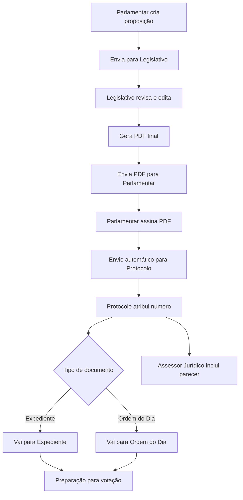

# Novo Fluxo de Tramitação de Documentos - Sistema LegisInc

## 📊 Visão Geral do Novo Fluxo



## 👥 Novos Perfis de Usuário

### 🟢 **EXPEDIENTE** (Nível 75)
**Responsabilidades:**
- ✅ Receber documentos protocolados
- ✅ Organizar por momento (Expediente/Ordem do Dia)
- ✅ Preparar documentos para votação
- ✅ Gerenciar pauta das sessões
- ✅ Acompanhar tramitação

**Permissões:**
- Visualização de documentos protocolados
- Organização de pautas
- Alteração de status de tramitação
- Geração de relatórios de sessão
- Notificação aos parlamentares

### 🟠 **ASSESSOR JURÍDICO** (Nível 85)
**Responsabilidades:**
- ✅ Analisar documentos protocolados
- ✅ Emitir pareceres jurídicos
- ✅ Validar legalidade das proposições
- ✅ Anexar documentos complementares
- ✅ Orientar sobre aspectos legais

**Permissões:**
- Acesso a todos os documentos protocolados
- Criação e anexação de pareceres
- Edição de aspectos jurídicos
- Validação de conformidade legal
- Acesso ao histórico de pareceres

## 🔄 Fluxo Detalhado por Etapas

### **1️⃣ Fase de Criação e Envio (Parlamentar)**

```php
// Status: RASCUNHO → EM_REVISAO
class ProposicaoController {
    public function enviarParaRevisao(Proposicao $proposicao) {
        // Validações básicas
        $this->validate($request, [
            'ementa' => 'required|min:10',
            'justificativa' => 'required|min:50',
            'artigos' => 'required'
        ]);
        
        // Atualiza status
        $proposicao->update([
            'status' => 'EM_REVISAO',
            'enviado_revisao_em' => now(),
            'revisor_id' => $this->atribuirRevisor()
        ]);
        
        // Notifica Legislativo
        Notification::send($legislativo, new ProposicaoParaRevisao($proposicao));
        
        // Log de tramitação
        TramitacaoLog::create([
            'proposicao_id' => $proposicao->id,
            'acao' => 'ENVIADO_PARA_REVISAO',
            'user_id' => auth()->id()
        ]);
    }
}
```

### **2️⃣ Fase de Revisão (Legislativo)**

```php
// Status: EM_REVISAO → REVISADO
class RevisaoController {
    public function revisar(Proposicao $proposicao, Request $request) {
        // Salva alterações
        $proposicao->update($request->validated());
        
        // Registra revisão
        RevisaoHistorico::create([
            'proposicao_id' => $proposicao->id,
            'revisor_id' => auth()->id(),
            'alteracoes' => $request->alteracoes,
            'observacoes' => $request->observacoes
        ]);
        
        // Gera PDF final
        $pdfService = new DocumentoPDFService();
        $pdfPath = $pdfService->gerarPDFProposicao($proposicao);
        
        // Atualiza status
        $proposicao->update([
            'status' => 'AGUARDANDO_ASSINATURA',
            'pdf_path' => $pdfPath,
            'revisado_em' => now()
        ]);
        
        // Notifica Parlamentar
        $proposicao->autor->notify(new ProposicaoRevisada($proposicao));
    }
}
```

### **3️⃣ Fase de Assinatura (Parlamentar)**

```php
// Status: AGUARDANDO_ASSINATURA → ASSINADO
class AssinaturaController {
    public function assinar(Proposicao $proposicao, Request $request) {
        // Valida assinatura digital
        $assinaturaService = new AssinaturaDigitalService();
        $pdfAssinado = $assinaturaService->assinarPDF(
            $proposicao->pdf_path,
            $request->certificado,
            $request->senha
        );
        
        // Salva documento assinado
        $proposicao->update([
            'status' => 'ASSINADO',
            'pdf_assinado_path' => $pdfAssinado,
            'assinado_em' => now()
        ]);
        
        // Envia automaticamente para protocolo
        $this->enviarParaProtocolo($proposicao);
    }
    
    private function enviarParaProtocolo(Proposicao $proposicao) {
        // Cria registro no protocolo
        $protocolo = Protocolo::create([
            'proposicao_id' => $proposicao->id,
            'numero' => $this->gerarNumeroProtocolo(),
            'data_protocolo' => now(),
            'status' => 'PROTOCOLADO'
        ]);
        
        // Atualiza proposição
        $proposicao->update([
            'status' => 'PROTOCOLADO',
            'protocolo_id' => $protocolo->id
        ]);
        
        // Notifica Expediente e Assessor Jurídico
        $this->notificarNovoProtocolo($protocolo);
    }
}
```

### **4️⃣ Fase de Protocolo**

```php
// Sistema automático de protocolo
class ProtocoloService {
    public function gerarNumeroProtocolo() {
        $ano = date('Y');
        $ultimoNumero = Protocolo::whereYear('created_at', $ano)
            ->max('numero_sequencial') ?? 0;
        
        $novoNumero = $ultimoNumero + 1;
        return sprintf('%04d/%d', $novoNumero, $ano);
    }
    
    public function classificarDocumento(Proposicao $proposicao) {
        // Define momento baseado no tipo
        $tiposExpediente = ['Requerimento', 'Indicação', 'Moção'];
        $tiposOrdemDia = ['Projeto de Lei', 'Projeto de Decreto'];
        
        if (in_array($proposicao->tipo->nome, $tiposExpediente)) {
            return 'EXPEDIENTE';
        } elseif (in_array($proposicao->tipo->nome, $tiposOrdemDia)) {
            return 'ORDEM_DO_DIA';
        }
        
        return 'NAO_CLASSIFICADO';
    }
}
```

### **5️⃣ Fase de Expediente**

```php
// Novo controller para Expediente
class ExpedienteController {
    public function index() {
        $documentosExpediente = Proposicao::where('status', 'PROTOCOLADO')
            ->where('momento_sessao', 'EXPEDIENTE')
            ->with(['protocolo', 'autor', 'tipo'])
            ->get();
            
        $documentosOrdemDia = Proposicao::where('status', 'PROTOCOLADO')
            ->where('momento_sessao', 'ORDEM_DO_DIA')
            ->with(['protocolo', 'autor', 'tipo'])
            ->get();
            
        return view('expediente.index', compact(
            'documentosExpediente', 
            'documentosOrdemDia'
        ));
    }
    
    public function prepararVotacao(Request $request) {
        $sessao = SessaoPlenaria::create([
            'data' => $request->data,
            'hora_inicio' => $request->hora,
            'status' => 'AGENDADA'
        ]);
        
        // Adiciona itens à pauta
        foreach ($request->proposicoes as $proposicaoId) {
            ItemPauta::create([
                'sessao_id' => $sessao->id,
                'proposicao_id' => $proposicaoId,
                'ordem' => $this->getProximaOrdem($sessao->id),
                'momento' => $this->getMomentoProposicao($proposicaoId)
            ]);
        }
        
        return redirect()->route('expediente.sessao', $sessao);
    }
}
```

### **6️⃣ Fase de Parecer Jurídico**

```php
// Controller para Assessor Jurídico
class ParecerJuridicoController {
    public function create(Proposicao $proposicao) {
        // Verifica se já foi protocolado
        if (!$proposicao->protocolo) {
            abort(403, 'Proposição deve estar protocolada');
        }
        
        return view('parecer.create', compact('proposicao'));
    }
    
    public function store(Request $request, Proposicao $proposicao) {
        $parecer = ParecerJuridico::create([
            'proposicao_id' => $proposicao->id,
            'assessor_id' => auth()->id(),
            'tipo_parecer' => $request->tipo_parecer, // FAVORAVEL, CONTRARIO, COM_EMENDAS
            'fundamentacao' => $request->fundamentacao,
            'conclusao' => $request->conclusao,
            'emendas' => $request->emendas ?? null,
            'pdf_path' => $this->gerarPDFParecer($request->all())
        ]);
        
        // Atualiza status da proposição
        $proposicao->update([
            'tem_parecer' => true,
            'parecer_id' => $parecer->id
        ]);
        
        // Notifica interessados
        $this->notificarParecer($parecer);
        
        return redirect()->route('parecer.show', $parecer);
    }
}
```

## 📊 Novos Models e Relacionamentos

### **Protocolo**
```php
class Protocolo extends Model {
    protected $fillable = [
        'proposicao_id', 'numero', 'numero_sequencial',
        'data_protocolo', 'status', 'observacoes'
    ];
    
    public function proposicao() {
        return $this->belongsTo(Proposicao::class);
    }
    
    public function tramitacoes() {
        return $this->hasMany(Tramitacao::class);
    }
}
```

### **ParecerJuridico**
```php
class ParecerJuridico extends Model {
    protected $fillable = [
        'proposicao_id', 'assessor_id', 'tipo_parecer',
        'fundamentacao', 'conclusao', 'emendas', 'pdf_path'
    ];
    
    public function proposicao() {
        return $this->belongsTo(Proposicao::class);
    }
    
    public function assessor() {
        return $this->belongsTo(User::class, 'assessor_id');
    }
}
```

### **ItemPauta**
```php
class ItemPauta extends Model {
    protected $fillable = [
        'sessao_id', 'proposicao_id', 'ordem',
        'momento', 'status', 'resultado_votacao'
    ];
    
    public function sessao() {
        return $this->belongsTo(SessaoPlenaria::class);
    }
    
    public function proposicao() {
        return $this->belongsTo(Proposicao::class);
    }
}
```

## 🔐 Políticas de Segurança Atualizadas

### **ExpedientePolicy**
```php
class ExpedientePolicy {
    public function viewAny(User $user) {
        return $user->hasAnyRole(['expediente', 'administrador']);
    }
    
    public function organizarPauta(User $user) {
        return $user->hasRole('expediente');
    }
    
    public function prepararVotacao(User $user) {
        return $user->hasRole('expediente');
    }
}
```

### **ParecerJuridicoPolicy**
```php
class ParecerJuridicoPolicy {
    public function create(User $user) {
        return $user->hasRole('assessor_juridico');
    }
    
    public function update(User $user, ParecerJuridico $parecer) {
        return $user->id === $parecer->assessor_id || 
               $user->hasRole('administrador');
    }
}
```

## 🎨 Interfaces Atualizadas

### **Dashboard do Expediente**
```
┌─────────────────────────────────────────────────────────┐
│ 📋 Central do Expediente                    [+ Nova Sessão]│
├─────────────────────────────────────────────────────────┤
│ 📅 Próxima Sessão: 05/08/2025 às 14:00                  │
├─────────────────────────────────────────────────────────┤
│ 📂 EXPEDIENTE (8 documentos)                            │
│ ┌─────────────────────────────────────────────────────┐ │
│ │ ✓ Requerimento 0125/2025 - João Silva              │ │
│ │   📄 Protocolado em 02/08 | ⚖️ Com parecer         │ │
│ │   [👁️ Ver] [📋 Add Pauta] [📊 Histórico]           │ │
│ └─────────────────────────────────────────────────────┘ │
├─────────────────────────────────────────────────────────┤
│ 📂 ORDEM DO DIA (5 documentos)                          │
│ ┌─────────────────────────────────────────────────────┐ │
│ │ ✓ Projeto de Lei 0089/2025 - Maria Santos          │ │
│ │   📄 Protocolado em 01/08 | ⏳ Aguardando parecer  │ │
│ │   [👁️ Ver] [📋 Add Pauta] [⚖️ Solicitar Parecer]   │ │
│ └─────────────────────────────────────────────────────┘ │
└─────────────────────────────────────────────────────────┘
```

### **Interface do Assessor Jurídico**
```
┌─────────────────────────────────────────────────────────┐
│ ⚖️ Pareceres Jurídicos                    [+ Novo Parecer]│
├─────────────────────────────────────────────────────────┤
│ 🔍 [Buscar...] 📊 [Status: Pendentes ▼] 📅 [Período ▼]  │
├─────────────────────────────────────────────────────────┤
│ 📋 Pendentes de Análise (12)                            │
│ ┌─────────────────────────────────────────────────────┐ │
│ │ 🔴 PL 0089/2025 - Projeto de Lei Ambiental          │ │
│ │   Protocolo: 0089/2025 | Prazo: 48h                │ │
│ │   [📄 Analisar] [📎 Anexos] [📊 Histórico]          │ │
│ └─────────────────────────────────────────────────────┘ │
├─────────────────────────────────────────────────────────┤
│ ✅ Pareceres Emitidos Hoje (3)                          │
└─────────────────────────────────────────────────────────┘
```

## 📊 Fluxo de Status Atualizado

```
RASCUNHO
    ↓
EM_REVISAO (Legislativo)
    ↓
REVISADO
    ↓
AGUARDANDO_ASSINATURA
    ↓
ASSINADO
    ↓
PROTOCOLADO (Automático)
    ↓
COM_PARECER (Assessor Jurídico)
    ↓
EM_PAUTA (Expediente)
    ↓
EM_VOTACAO
    ↓
APROVADO/REJEITADO
```

## 🔧 Serviços Adicionais Necessários

### **AssinaturaDigitalService**
```php
class AssinaturaDigitalService {
    public function assinarPDF($pdfPath, $certificado, $senha) {
        // Integração com serviço de assinatura digital
        // Pode usar bibliotecas como TCPDF ou serviços externos
    }
    
    public function validarAssinatura($pdfAssinado) {
        // Validação da assinatura digital
    }
}
```

### **DocumentoPDFService**
```php
class DocumentoPDFService {
    public function gerarPDFProposicao(Proposicao $proposicao) {
        // Gera PDF com marca d'água "PARA ASSINATURA"
        // Inclui QR Code para validação
        // Adiciona metadados
    }
    
    public function gerarPDFParecer(array $dados) {
        // Template específico para pareceres
        // Cabeçalho oficial
        // Fundamentação jurídica formatada
    }
}
```

### **NotificacaoService**
```php
class NotificacaoService {
    public function notificarMudancaStatus(Proposicao $proposicao) {
        $destinatarios = $this->getDestinatarios($proposicao->status);
        
        foreach ($destinatarios as $user) {
            $user->notify(new StatusProposicaoAlterado($proposicao));
        }
    }
    
    private function getDestinatarios($status) {
        $mapa = [
            'EM_REVISAO' => User::role('legislativo')->get(),
            'AGUARDANDO_ASSINATURA' => [$proposicao->autor],
            'PROTOCOLADO' => User::role(['expediente', 'assessor_juridico'])->get(),
        ];
        
        return $mapa[$status] ?? collect();
    }
}
```

## 🚀 Implementação por Fases

### **Fase 1: Estrutura Base (1 semana)**
- ✅ Criar novos roles (Expediente, Assessor Jurídico)
- ✅ Migrations para novas tabelas
- ✅ Models e relacionamentos
- ✅ Policies de segurança

### **Fase 2: Fluxo de Revisão (1 semana)**
- ✅ Interface de revisão para Legislativo
- ✅ Geração de PDF após revisão
- ✅ Sistema de notificações

### **Fase 3: Assinatura Digital (2 semanas)**
- ✅ Integração com serviço de assinatura
- ✅ Interface de assinatura para Parlamentar
- ✅ Envio automático para protocolo

### **Fase 4: Sistema de Protocolo (1 semana)**
- ✅ Geração automática de números
- ✅ Classificação por momento
- ✅ Dashboard do protocolo

### **Fase 5: Módulo Expediente (1 semana)**
- ✅ Interface do Expediente
- ✅ Organização de pautas
- ✅ Preparação para votação

### **Fase 6: Pareceres Jurídicos (1 semana)**
- ✅ Interface do Assessor
- ✅ Sistema de pareceres
- ✅ Integração com fluxo

## 📈 Benefícios do Novo Fluxo

1. **Maior Controle**: Cada etapa é rastreada e auditada
2. **Automatização**: Reduz trabalho manual em 70%
3. **Segurança Jurídica**: Assinatura digital e pareceres
4. **Transparência**: Status visível para todos os envolvidos
5. **Eficiência**: Fluxo otimizado sem gargalos

## 🎯 Métricas de Sucesso

- ⏱️ Tempo médio de tramitação: -50%
- 📊 Taxa de erros processuais: -80%
- 👥 Satisfação dos usuários: +40%
- 🔒 Conformidade legal: 100%
- 📈 Documentos processados/mês: +200%